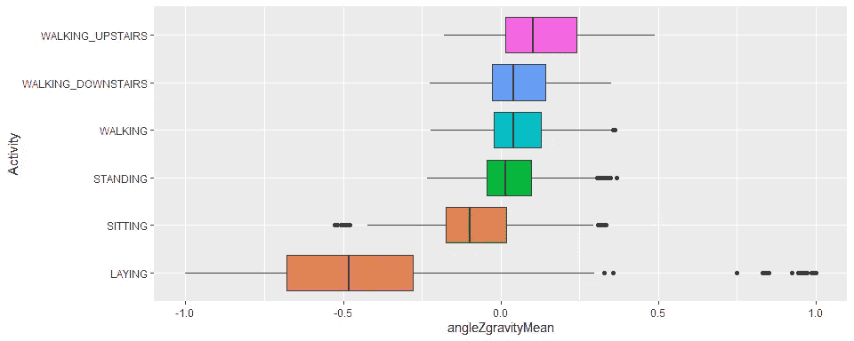

# 用于活动识别的智能手机(第一部分)

> 原文：<https://towardsdatascience.com/smartphone-for-activity-recognition-228b9e75c306?source=collection_archive---------20----------------------->

## R 中的数据科学

## 你的手机知道你在做什么，即使没有麦克风或摄像头


塞尔温·范·哈伦在 [Unsplash](https://unsplash.com?utm_source=medium&utm_medium=referral) 上的照片

```
**Table of Contents**· [Library](#24eb)
· [Dataset](#ef5d)
· [Data Cleaning](#15aa)
· [Exploratory Data Analysis](#097c)
· [Cross-validation](#265a)
· [Metrics](#2b5b)
· [Modeling](#6ca2)
  ∘ [Naive Bayes](#8b68)
  ∘ [Decision Tree](#b02b)
  ∘ [k-Nearest Neighbors](#f14a)
  ∘ [Random Forest](#ebbe)
· [Conclusion](#3122)
```

现代智能手机配备了加速度计和陀螺仪等传感器，以提供高级功能和更好的用户体验。智能手机中的加速度计用于检测手机的方向。陀螺仪通过跟踪旋转或扭曲，为加速度计提供的信息增加了一个额外的维度。

已经进行了利用这些传感器的研究，例如在[估计路面不平度条件](https://ieeexplore.ieee.org/document/7049855)中。然而，我们正在做的将更类似于哈佛大学的这项研究。具体来说，这个项目是建立一个模型，根据智能手机的测量准确预测人类的活动，如行走、上楼、下楼、坐着、站着或躺着。

# 图书馆

我们将使用 R 语言。这是一些要导入的库。

```
library(dplyr)          # data wrangling
library(ggplot2)        # visualization
library(Rtsne)          # EDA
library(caret)          # machine learning functions
library(MLmetrics)      # machine learning metrics
library(e1071)          # naive bayes
library(rpart)          # decision tree
library(rattle)         # tree visualization
library(class)          # k-NN
library(randomForest)   # random forest
```

# 资料组

用于训练该模型的数据集是从 30 名在腰部佩戴智能手机进行不同活动的人那里收集的，并在智能手机传感器的帮助下进行记录。该实验被录像以手动标记数据。要查看更多详情，请参考此[链接](https://archive.ics.uci.edu/ml/datasets/Human+Activity+Recognition+Using+Smartphones)。

我们来读一下数据集。

```
uci_har <- read.csv("UCI HAR.csv")
dim(uci_har)#> [1] 10299   563
```

如上所示，该数据集包含 563 个要素和 10299 个观测值。太多了！目前，我们不需要完全理解测量的含义。简而言之，我们有这些:

1.  `subject`特征表示进行实验的受试者的标识符。有 30 个唯一的 id，每个 id 对应 30 个人中的一个。
2.  `Activity`特征表示受试者正在进行的活动，包括:行走、上楼、下楼、坐、站、躺
3.  具有时域和频域变量的 561 特征向量。

根据问题陈述，`Activity`将是我们的目标特性。

# 数据清理

首先，将`subject`和`Activity`特征转换成因子，其他的转换成数值。

```
uci_har <- uci_har %>% 
  mutate_at(c('subject', 'Activity'), as.factor) %>% 
  mutate_at(vars(-subject, -Activity), as.numeric)lvl <- levels(uci_har$Activity)
lvl#> [1] "LAYING"             "SITTING"            "STANDING"           "WALKING"            "WALKING_DOWNSTAIRS" "WALKING_UPSTAIRS"
```

让我们检查是否有任何重复的观察值或丢失的值。

```
cat("Number of duplicated rows:", sum(duplicated(uci_har)))#> Number of duplicated rows: 0cat("Number of missing values:", sum(is.na(uci_har)))#> Number of missing values: 0
```

太好了！它们都不存在。现在让我们检查数据不平衡。

```
ggplot(uci_har %>% 
         group_by(subject, Activity) %>% 
         count(name = 'activity_count'), 
       aes(x = subject, y = activity_count, fill = Activity)) + 
  geom_bar(stat = 'identity')
```


就每个受试者的活动计数而言，没有显著差异。因此，所有目标类都是平衡的。

# 探索性数据分析

我们可以把`Activity`分为两类:静止活动(如躺、坐或站)和运动活动(如走路、下楼或上楼)。我们来看看物体加速度信号三轴震级均值的分布(phew，真拗口！我真正的意思是`tBodyAccMagmean`。

```
ggplot(uci_har,
       aes(x = tBodyAccMagmean, group = Activity, fill = Activity)) +
  geom_density(alpha = .5) + 
  annotate('text', x = -.8, y = 25, label = "Stationary activities") + 
  annotate('text', x = -.0, y = 5, label = "Moving activities")
```


```
ggplot(uci_har,
       aes(y = Activity, x = tBodyAccMagmean, group = Activity, fill = Activity)) +
  geom_boxplot(show.legend = FALSE)
```


我们可以看到两组之间的明显区别:

1.  与移动活动相比，静止活动具有非常小的身体运动。
2.  如果`tBodyAccMagmean` > -0.5，那么活动大概会是要么走路，要么上楼，要么下楼。
3.  如果`tBodyAccMagmean` < -0.5，那么活动最有可能是躺、站、坐。

现在，在手机定位方面，做爱和其他活动也应该有所区别。与其他活动不同，躺着时，人们倾向于将手机水平放在腰间。那么，让我们通过比较 X、Y、Z 轴之间的角度与每个轴上重力加速度信号的平均值(`angleXgravityMean`、`angleYgravityMean`和`angleZgravityMean`)来看看这个假设是否成立。

```
for (coor in c('angleXgravityMean', 'angleYgravityMean', 'angleZgravityMean')) {
  print(
    ggplot(uci_har,
           aes_string(y = 'Activity', x = coor, group = 'Activity', fill = 'Activity')) + 
      geom_boxplot(show.legend = FALSE)
  )
}
```



很明显:

1.  躺着时的手机方向明显不同于做其他活动时的手机方向。
2.  如果`angleXgravityMean` >为 0，则该活动极有可能是铺设，否则为其他活动。
3.  如果`angleYgravityMean` < -0.25 或者`angleZgravityMean` < -0.25，那么该活动将可能是铺设，其他活动则不然。
4.  我们可以仅通过使用`angleXgravityMean`，或者可能通过 X 轴的其他重力相关特征，以最小的误差预测铺设活动。

最后，我们可以对数据集执行 [t-SNE](https://en.wikipedia.org/wiki/T-distributed_stochastic_neighbor_embedding) 来减少它的维度，以便可视化，希望每个`Activity`将被分组到不同的区域。t-SNE 是一种无监督的非线性技术，主要用于数据探索和可视化高维数据。基本上，t-SNE 所做的是给我们一种感觉或直觉，让我们知道数据是如何在高维空间中排列的。在本文中，我们不会深入研究 SNE 霸王龙。我们将通过在 5、10 和 20 的困惑中做灵敏度来执行 t-SNE，以确保降维后获得的值确实被分组到不同的`Activity`中。

```
for (perp in c(5, 10, 20)) {
  tsne <- Rtsne(uci_har %>% select(-c(subject, Activity)), perplexity = perp)
  tsne_plot <- data.frame(x = tsne$Y[,1], y = tsne$Y[,2], Activity = uci_har$Activity)
  print(
    ggplot(tsne_plot) + 
      geom_point(aes(x = x, y = y, color = Activity))
  )
}
```


可以看出，除了站和坐，所有的活动都可以很容易地分开。这是有道理的，因为站着和坐着在手机方向上没有太大的区别。

# 交叉验证

对于这个问题，我们不能应用正常的 k 倍交叉验证。回想一下，我们的目标是基于手机传感器预测人类活动。这意味着当一个新的看不见的`subject`进来时，我们不知道他们用手机的行为。如果我们通过随机选择观察值来使用 k-fold 交叉验证，那么相同的`subject`有可能同时出现在训练和测试数据集中，这表明存在数据泄漏。为了避免这种情况，在交叉验证期间，我们分割数据集，使得训练和测试数据集中的`subject`不相交。

```
set.seed(2072) # for reproducibility
subject_id <- unique(uci_har$subject)
folds <- sample(1:5, 30, replace = TRUE)
d <- data.frame(col1 = c(subject_id), col2 = c(folds))
uci_har$folds <- d$col2[match(uci_har$subject, d$col1)]
uci_har <- uci_har %>% 
  mutate(folds = as.factor(folds)) %>% 
  select(-subject)
```

请注意，在为每个观察结果创建折叠后，我们丢弃了`subject`特征，因为在分析中不再需要它。最后，我们还可以在下面看到，数据在褶皱之间均匀分布，因此没有出现不平衡数据。

```
ggplot(uci_har %>%
         group_by(folds, Activity) %>%
         count(name = 'activity_count'),
       aes(x = folds, y = activity_count, fill = Activity)) +
  geom_bar(stat = 'identity')
```


# 韵律学

在考虑以下原因后，我们使用精确度来量化模型的性能:

1.  根据问题陈述，我们只对同等准确地预测每个类感兴趣，而不是偏爱其中一个，因此怀疑召回和精度度量的目的。
2.  这个问题是一个多类分类，其准确性比 ROC-AUC 度量更容易解释。

# 建模

首先，作为健全性检查，让我们看看数据集的维度，以及每个要素中的最大值和最小值。

```
dim(uci_har)#> [1] 10299   563max(apply(uci_har %>% select(-c(Activity, folds)), 1, max))#> [1] 1min(apply(uci_har %>% select(-c(Activity, folds)), 1, max))#> [1] 0.795525min(apply(uci_har %>% select(-c(Activity, folds)), 1, min))#> [1] -1max(apply(uci_har %>% select(-c(Activity, folds)), 1, min))#> [1] -0.9960928
```

所有特征的最小值都接近-1，而最大值的范围在 0.8 到 1 之间。我们不会进行任何标准化，因为前面提到的范围被认为很小，更重要的是，我们不想丢失太多关于特征之间相关性的信息。

数据集有 563 个要素，其中两个将在建模时被丢弃。它们是`Activity`(因为这是目标变量)和`folds`(因为这不会向数据集添加任何信息)。

我们将提出四个模型来实现问题陈述的最佳解决方案:朴素贝叶斯、决策树、k-最近邻和随机森林。为了简化，下面是一个交叉验证所有模型的函数。在此函数中，我们迭代之前已构建的交叉验证的每个折叠，并在每次迭代中执行以下操作:

1.  创建`X_train`、`y_train`、`X_test`、`y_test`，分别为训练的预测变量、训练的目标变量、测试的预测变量、测试的目标变量。
2.  建立模型，预测输出为`y_pred`。
3.  通过比较`y_pred`和`y_test`计算模型精度。
4.  然后对所有折叠的精度结果进行平均，产生一个数字来比较所有模型。

注意，对于随机森林模型，我们也使用交叉验证精度而不是 OOB 误差，这样与其他模型的比较就是苹果对苹果。但是，稍后我们会单独处理随机森林模型，以强调超参数调整的重要性。

```
crossvalidate <- function(data, k, model_name,
                          tuning = FALSE, mtry = NULL, nodesize = NULL) {
  # 'data' is the training set with the 'folds' column
  # 'k' is the number of folds we have
  # 'model_name' is a string describing the model being used
  # 'tuning' is a mode in which this function will operate, tuning = TRUE means we are doing hyperparameter tuning
  # 'mtry' and 'nodesize' are used only in Random Forest hyperparameter tuning

  # initialize empty lists for recording performances
  acc_train <- c()
  acc_test <- c()
  y_preds <- c()
  y_tests <- c()
  models <- c()

  # one iteration per fold
  for (fold in 1:k) {

    # create training set for this iteration
    # subset all the datapoints where folds does not match the current fold
    training_set <- data %>% filter(folds != fold)
    X_train <- training_set %>% select(-c(Activity, folds))
    y_train <- training_set$Activity

    # create test set for this iteration
    # subset all the datapoints where folds matches the current fold
    testing_set <- data %>% filter(folds == fold)
    X_test <- testing_set %>% select(-c(Activity, folds))
    y_test <- testing_set$Activity

    # train & predict
    switch(model_name,
      nb = {
        model <- naiveBayes(x = X_train, y = y_train, laplace = 1)
        y_pred <- predict(model, X_test, type = 'class')
        y_pred_train <- predict(model, X_train, type = 'class')
      },
      dt = {
        model <- rpart(formula = Activity ~ ., data = training_set %>% select(-folds), method = 'class')
        y_pred <- predict(model, X_test, type = 'class')
        y_pred_train <- predict(model, X_train, type = 'class')
      },
      knn = {
        k <- round(sqrt(nrow(training_set)))
        y_pred <- knn(train = X_train, test = X_test, cl = y_train, k = k)
        y_pred_train <- knn(train = X_train, test = X_train, cl = y_train, k = k)
      },
      rf = {
        if (tuning == FALSE) {
          model <- randomForest(x = X_train, y = y_train, xtest = X_test, ytest = y_test)
        } else {
          model <- randomForest(x = X_train, y = y_train, xtest = X_test, ytest = y_test,
                                mtry = mtry, nodesize = nodesize)
        }
        y_pred <- model$test$predicted
        y_pred_train <- model$predicted
      },
      {
        print("Model is not recognized. Try to input 'nb', 'dt', 'knn', or 'rf'.")
        return()
      }
    )

    # populate corresponding lists
    acc_train[fold] <- Accuracy(y_pred_train, y_train)
    acc_test[fold] <- Accuracy(y_pred, y_test)
    y_preds <- append(y_preds, y_pred)
    y_tests <- append(y_tests, y_test)
    models <- c(models, list(model))
  }

  # convert back to factor
  y_preds <- factor(y_preds, labels = lvl)
  y_tests <- factor(y_tests, labels = lvl)

  # get the accuracy between the predicted and the observed
  cm <- confusionMatrix(y_preds, y_tests)
  cm_table <- cm$table
  acc <- cm$overall['Accuracy']

  # return the results
  if (model_name == 'knn') {
    return(list('cm' = cm_table, 'acc' = acc, 'acc_train' = acc_train, 'acc_test' = acc_test))
  } else {
    return(list('cm' = cm_table, 'acc' = acc, 'acc_train' = acc_train, 'acc_test' = acc_test, 'models' = models))
  }
}
```

现在我们准备好了。

## 朴素贝叶斯

```
nb <- crossvalidate(uci_har, 5, 'nb')
cat("Naive Bayes Accuracy:", nb$acc)#> Naive Bayes Accuracy: 0.7258957
```

朴素贝叶斯模型给出的结果很差，准确率为 73%。这主要是由于模型的基本假设，即每个预测因子都是相互独立的，而在我们的数据集中并非如此。例如，我们有以下模型没有捕捉到的一些预测值之间的高度相关性。

```
set.seed(3)
col <- c(sample(names(uci_har), 6))
GGally::ggcorr(uci_har[, col], hjust = 1, layout.exp = 3, label = T)
```


让我们看看下面的混淆矩阵。

```
nb$cm#>                     Reference
#> Prediction           LAYING SITTING STANDING WALKING WALKING_DOWNSTAIRS WALKING_UPSTAIRS
#>   LAYING               1623      14        4       0                  0                0
#>   SITTING               286    1550     1188       0                  0                0
#>   STANDING                0     187      677       0                  0                0
#>   WALKING                 2       0        1    1181                 93               40
#>   WALKING_DOWNSTAIRS      4       0        0     234               1065              124
#>   WALKING_UPSTAIRS       29      26       36     307                248             1380
```

朴素贝叶斯模型仍然在几个微不足道的不同活动之间混淆，比如躺下和坐着(大约 300 个错误的预测)。这个模型也很难区分上楼和静止的活动(大约 90 个错误的预测)。

最后，正如下面可以看到的，基于预测训练和测试数据集所得到的准确性，我们可以看到该模型已经相当不错，没有对训练数据集欠拟合或过拟合(除了第四个折叠)。因此，我们不能过多地依靠权衡偏差和方差来提高模型性能。

```
print(nb$acc_train)#> [1] 0.7349193 0.7647131 0.7280039 0.7635290 0.7612536print(nb$acc_test)#> [1] 0.7475728 0.7491702 0.7276636 0.6863137 0.7169533
```

## 决策图表

```
dt <- crossvalidate(uci_har, 5, 'dt')
cat("Decision Tree Accuracy:", dt$acc)#> Decision Tree Accuracy: 0.8599864
```

决策树模型给出了更好的结果，准确率为 86%。通过注意 t-SNE 结果，我们可以看出为什么我们的数据集是高度可分的(除了坐着和站着的活动)。基于树的模型可以利用这一特性。为了让大家了解决策树是如何工作的，请观察下面的 5 个树形图，每个图代表一个交叉验证文件夹。

```
for (model in dt$models) {
  fancyRpartPlot(model, sub = NULL)
}
```


人们可以很容易地看到，`tGravityAccminX`或`tGravityAccmeanX`在根之后的第一次分割中成为一个关键特征。如果该特征小于某个阈值，则模型可以完美地预测相应的活动正在进行，这占所有训练数据集观察的 19%。这与我们的 EDA 结果是一致的，即仅通过观察 X 轴的一个重力相关特征就可以区分铺设活动。

在第二次分割中，基于身体加速度信号，模型可以将坐着和站着与移动活动完全分开(坐着和站着占 36%，而所有移动活动占训练数据集观察的 45%)。这一发现证实了我们先前的分析，即静止和运动活动可以相当容易地分开。

然后，在第三次分解到树叶时，模特们分开了坐着和站着，同样都是移动的活动，有一些误差。这意味着坐着和站着，同样都是移动的活动，对于模特来说很难区分。为了看清楚这一点，这里有一个混淆矩阵。

```
dt$cm#>                     Reference
#> Prediction           LAYING SITTING STANDING WALKING WALKING_DOWNSTAIRS WALKING_UPSTAIRS
#>   LAYING               1942      15        0       0                  0                0
#>   SITTING                 2    1564      334       0                  0                0
#>   STANDING                0     196     1571       8                  0                0
#>   WALKING                 0       0        1    1549                151              296
#>   WALKING_DOWNSTAIRS      0       1        0      39               1149              166
#>   WALKING_UPSTAIRS        0       1        0     126                106             1082
```

此表中的一个小注意事项:与朴素贝叶斯模型不同，决策树模型不会错误地预测上楼时的平稳活动。事实上，与朴素贝叶斯模型中的 91 个预测相比，在这种情况下只有一个预测是错误的。

接下来，我们来看看哪些变量是最重要的。下表再次证实了 X 轴的重力相关特征(`tGravityAccminX`和`angleXgravityMean`)对我们模型的重要性。

```
for (model in dt$models) {
  var_imp <- varImp(model)
  var_imp <- var_imp %>% slice_max(Overall, n = 10)
  print(var_imp)
}#>                             Overall
#> tGravityAccminX            1647.338
#> tGravityAccmeanX           1522.782
#> tGravityAccenergyX         1521.581
#> angleXgravityMean          1521.581
#> tGravityAccmaxX            1505.993
#> fBodyAccJerkbandsEnergy116 1374.982
#> fBodyAccJerkbandsEnergy124 1374.982
#> fBodyAccmadX               1374.982
#> fBodyAccmeanX              1374.982
#> tBodyAccJerkmadX           1374.178
#>                        Overall
#> angleXgravityMean     1494.691
#> tGravityAccenergyX    1494.691
#> tGravityAccmeanX      1494.691
#> tGravityAccminX       1494.691
#> tGravityAccmaxX       1483.883
#> fBodyAccJerkentropyX  1376.017
#> fBodyAccmadX          1376.017
#> fBodyAccmeanX         1376.017
#> tBodyAccJerkmadX      1376.017
#> tBodyAccJerkMagenergy 1376.017
#>                      Overall
#> angleXgravityMean   1504.419
#> tGravityAccenergyX  1504.419
#> tGravityAccmeanX    1504.419
#> tGravityAccminX     1504.419
#> tGravityAccmaxX     1488.823
#> fBodyAccJerkenergyX 1370.566
#> fBodyAccmadX        1370.566
#> fBodyAccmeanX       1370.566
#> tBodyAccJerkenergyX 1370.566
#> tBodyAccJerkstdX    1370.566
#>                      Overall
#> tGravityAccminX     1528.936
#> tGravityAccmeanX    1527.734
#> angleXgravityMean   1526.532
#> tGravityAccenergyX  1526.532
#> tGravityAccmaxX     1508.549
#> tBodyAccJerkenergyX 1387.769
#> tBodyAccJerkmadX    1387.769
#> tBodyAccJerkstdX    1387.769
#> tBodyAccmaxX        1387.769
#> tBodyAccstdX        1387.769
#>                             Overall
#> tGravityAccminX            1531.881
#> tGravityAccmeanX           1530.679
#> angleXgravityMean          1529.478
#> tGravityAccenergyX         1529.478
#> tGravityAccmaxX            1512.692
#> fBodyAccJerkbandsEnergy116 1379.583
#> fBodyAccJerkbandsEnergy124 1379.583
#> fBodyAccmadX               1379.583
#> fBodyAccmeanX              1379.583
#> tBodyAccJerkmadX           1378.776
```

通常情况下，决策树模型倾向于过度适应训练数据集，因为它们可以很容易地适应数据中的噪声。幸运的是，这不是我们的情况，因为正如下面可以看到的，除了第四次折叠，训练和测试数据集的精度都很接近。因此，树木修剪是不必要的。

```
print(dt$acc_train)#> [1] 0.8897925 0.8959707 0.8811845 0.8897192 0.8691917print(dt$acc_test)#> [1] 0.8660194 0.8914177 0.8643096 0.7902098 0.8855037
```

## k-最近邻

由于 k-NN 是一种基于距离的模型，因此数据集必须在建模之前进行归一化，以便模型可以平等地对待每个要素。换句话说，如果某个特征与其他特征相比具有相对较大的值，那么它将在选择数据点的邻居时对模型产生主要影响。但是在我们的例子中，我们没有对数据集进行任何规范化，原因已经在建模部分的开头解释过了。

```
knn <- crossvalidate(uci_har, 5, 'knn')
cat("k-Nearest Neighbors Accuracy:", knn$acc)#> k-Nearest Neighbors Accuracy: 0.8925138
```

k-NN 模型给出了比决策树模型更好的结果，准确率为 89%。同样，这是由于我们的数据集是高度可分离的，因此 k-NN 算法可以很容易地对每个活动进行分组。

```
knn$cm#>                     Reference
#> Prediction           LAYING SITTING STANDING WALKING WALKING_DOWNSTAIRS WALKING_UPSTAIRS
#>   LAYING               1926      13        0       0                  0                0
#>   SITTING                 5    1369      245       0                  0                0
#>   STANDING                5     390     1659       0                  0                0
#>   WALKING                 1       0        1    1658                 98               90
#>   WALKING_DOWNSTAIRS      0       0        0      35               1178               52
#>   WALKING_UPSTAIRS        7       5        1      29                130             1402
```

然而，k-NN 模型在区分坐着和站着活动方面不如决策树模型。此外，一些静止的活动被预测为上楼。另一方面，与决策树模型相比，更多的移动活动被正确预测。

通过在训练和测试数据集上比较准确性，可以看出该模型恰到好处，具有低偏差和方差。

```
print(knn$acc_train)#> [1] 0.9299672 0.9269841 0.9332196 0.9308184 0.9335673print(knn$acc_test)#> [1] 0.9169903 0.9184448 0.8781653 0.8516484 0.8958231
```

## 随机森林

```
rf <- crossvalidate(uci_har, 5, 'rf')
cat("Random Forest Accuracy:", rf$acc)#> Random Forest Accuracy: 0.9336829
```

与其他模型相比，随机森林模型给出了迄今为止最好的结果，准确率高达 93%。特别是，随机森林几乎总是比决策树好，原因如下:

1.  随机森林是许多决策树模型的集合。它基于许多决策树的多数投票，因此倾向于减少单个决策树预测的错误。
2.  随机森林执行 bootstrap 聚合，生成一系列模型，将弱学习者转换为强学习者，从而克服一个决策树的过拟合问题。

然而，这些优点并非没有缺点:随机森林模型比决策树训练更慢，更难解释。

现在让我们看看混淆矩阵。

```
rf$cm#>                     Reference
#> Prediction           LAYING SITTING STANDING WALKING WALKING_DOWNSTAIRS WALKING_UPSTAIRS
#>   LAYING               1942      15        0       0                  0                0
#>   SITTING                 0    1626      189       0                  0                0
#>   STANDING                0     135     1717       0                  0                0
#>   WALKING                 0       0        0    1585                 18               37
#>   WALKING_DOWNSTAIRS      0       0        0      27               1293               54
#>   WALKING_UPSTAIRS        2       1        0     110                 95             1453
```

随机森林模型仍然很难弄清楚哪个是坐着的，哪个是站着的，哪个是从移动活动中来的。然而，除了这些错误之外，这个模型只错分了 18 个其他的观察值，这是所有观察值的一小部分。

根据下面的变量重要性表，我们看到随机森林模型更喜欢重力相关的特征，而不是身体相关的特征。

```
for (model in rf$models) {
  var_imp <- varImp(model)
  var_imp <- var_imp %>% slice_max(Overall, n = 10)
  print(var_imp)
}#>                     Overall
#> tGravityAccmeanX   233.5234
#> tGravityAccminX    212.9809
#> angleXgravityMean  190.1192
#> tGravityAccmaxX    185.7354
#> angleYgravityMean  168.6782
#> tGravityAccenergyX 158.2211
#> tGravityAccminY    152.9756
#> tGravityAccmaxY    149.8530
#> tGravityAccmeanY   128.6168
#> tGravityAccenergyY 115.0822
#>                      Overall
#> tGravityAccmeanX   215.90652
#> tGravityAccminX    199.06699
#> tGravityAccenergyX 187.14571
#> tGravityAccmaxX    174.64894
#> angleXgravityMean  170.14726
#> tGravityAccmaxY    148.36554
#> angleYgravityMean  147.43523
#> tGravityAccmeanY   136.34275
#> tGravityAccminY    132.14115
#> tGravityAccenergyY  83.03708
#>                     Overall
#> angleXgravityMean  211.0124
#> tGravityAccminX    193.4731
#> tGravityAccmaxX    183.6834
#> tGravityAccenergyX 178.2531
#> tGravityAccmaxY    175.3123
#> tGravityAccmeanX   170.4459
#> tGravityAccmeanY   166.4416
#> tGravityAccminY    164.2081
#> angleYgravityMean  159.2264
#> tGravityAccenergyY 113.4814
#>                     Overall
#> tGravityAccmaxX    214.2470
#> tGravityAccminX    201.6110
#> tGravityAccenergyX 198.3143
#> angleXgravityMean  191.6710
#> tGravityAccmeanY   185.8804
#> tGravityAccmeanX   182.7646
#> tGravityAccmaxY    179.4252
#> angleYgravityMean  172.8559
#> tGravityAccminY    171.5347
#> tGravityAccenergyY 102.5362
#>                      Overall
#> tGravityAccmeanX   208.67569
#> angleXgravityMean  202.43801
#> tGravityAccminX    192.91251
#> tGravityAccenergyX 185.74270
#> tGravityAccmaxX    158.31243
#> tGravityAccmaxY    148.26482
#> angleYgravityMean  145.74691
#> tGravityAccmeanY   142.97585
#> tGravityAccminY    126.27075
#> tGravityAccenergyY  95.61133
```

最后，从下面的训练和测试精度来看，很明显，该模型在训练和测试数据集上表现得非常好，尽管在第三次和第四次折叠中，测试精度仍然略低于 91%。我们已经知道，如果我们从决策树模型切换到随机森林(由于装袋和随机特征选择)，过度拟合的趋势应该会减少。然而，泛化误差不会变为零。随着添加更多的树，泛化误差的方差将趋近于零，但偏差不会！

```
print(rf$acc_train)#> [1] 0.9815512 0.9805861 0.9837923 0.9865011 0.9842691print(rf$acc_test)#> [1] 0.9631068 0.9720247 0.9096990 0.8971029 0.9248157
```

我们可以通过超参数调整来进一步改进模型。预计通过修剪树木，我们可以交易一些偏差，降低两个值。这是通过增加随机森林模型中的`nodesize`参数来实现的。参考 R 文档，`nodesize`是终端节点的最小尺寸。将该数值设置得越大，生成的树就越小(因此花费的时间也就越少)。对于分类问题，默认值为 1，这往往会使模型过度适应数据中的噪声。

除了`nodesize`，我们还将调优`mtry`(在每次分割时随机抽样作为候选变量的变量数量，在我们的例子中默认为 sqrt(561) = 23)。我们将通过改变`nodesize`到`c(3,5,7)`和`mtry`到`c(11,16)`来进行网格搜索。

```
# establish a list of possible values for nodesize and mtry
nodesize <- c(3, 5, 7)
mtry <- c(11, 16)# create a data frame containing all combinations 
hyper_grid <- expand.grid(mtry = mtry, nodesize = nodesize)# initialize empty vectors to store the results
rf_acc <- c()
rf_acc_train <- c()
rf_acc_test <- c()# loop over the rows of hyper_grid
for (i in 1:nrow(hyper_grid)) {
  # cross validate
  rf_tuning <- crossvalidate(uci_har, 5, 'rf', 
                             tuning = TRUE, mtry = hyper_grid$mtry[i], nodesize = hyper_grid$nodesize[i])
  # store the results
  rf_acc[i] <- rf_tuning$acc
  rf_acc_train <- c(rf_acc_train, list(rf_tuning$acc_train))
  rf_acc_test <- c(rf_acc_test, list(rf_tuning$acc_test))
}# identify optimal set of hyperparameters based on accuracy
opt_i <- which.max(rf_acc)
print(hyper_grid[opt_i,])#>   mtry nodesize
#> 5   11        7
```

找到的最佳超参数是`nodesize`的 7 和`mtry`的 11。有了这些，准确率稍微提高了一点，接近 94%，如下图所示。此外，所有的测试精度在褶皱之间更加一致，并且具有 91%以上的值。

```
print(rf_acc[opt_i])#> [1] 0.9370813print(rf_acc_train[opt_i])#> [[1]]
#> [1] 0.9815512 0.9788767 0.9820863 0.9849343 0.9831801print(rf_acc_test[opt_i])#> [[1]]
#> [1] 0.9684466 0.9687055 0.9182991 0.9130869 0.9154791
```

# 结论

```
rbind("Naive Bayes" = nb$acc, "Decision Tree" = dt$acc, "k-Nearest Neighbors" = knn$acc, "Random Forest" = max(rf_acc))#>                      Accuracy
#> Naive Bayes         0.7258957
#> Decision Tree       0.8599864
#> k-Nearest Neighbors 0.8925138
#> Random Forest       0.9370813
```

根据上面的准确度表，Random Forest 显然是最佳模型。Random Forest 能够根据人们的手机行为识别人类活动，准确率高达 94%。另一方面，随机森林运行缓慢，因为默认情况下它是 500 个决策树的集合。当然，我们也可以尝试更简单的模型，如 One-vs-Rest 逻辑回归，或目前业界非常标准的 boosting 模型，如 XGBoost 或 LightGBM，然后比较结果。


🔥*你好！如果你喜欢这个故事，想支持我这个作家，可以考虑* [***成为会员***](https://dwiuzila.medium.com/membership) *。每月只需 5 美元，你就可以无限制地阅读媒体上的所有报道。如果你注册使用我的链接，我会赚一小笔佣金。*

🔖*想了解更多关于经典机器学习模型如何工作以及如何优化其参数的信息？或者 MLOps 大型项目的例子？有史以来最优秀的文章呢？继续阅读:*


[艾伯斯·乌兹拉](https://dwiuzila.medium.com/?source=post_page-----228b9e75c306--------------------------------)

## 从零开始的机器学习

[View list](https://dwiuzila.medium.com/list/machine-learning-from-scratch-b35db8650093?source=post_page-----228b9e75c306--------------------------------)8 stories

[艾伯斯·乌兹拉](https://dwiuzila.medium.com/?source=post_page-----228b9e75c306--------------------------------)

## 高级优化方法

[View list](https://dwiuzila.medium.com/list/advanced-optimization-methods-26e264a361e4?source=post_page-----228b9e75c306--------------------------------)7 stories

[艾伯斯·乌兹拉](https://dwiuzila.medium.com/?source=post_page-----228b9e75c306--------------------------------)

## MLOps 大型项目

[View list](https://dwiuzila.medium.com/list/mlops-megaproject-6a3bf86e45e4?source=post_page-----228b9e75c306--------------------------------)6 stories

艾伯斯·乌兹拉

## 我最好的故事

[View list](https://dwiuzila.medium.com/list/my-best-stories-d8243ae80aa0?source=post_page-----228b9e75c306--------------------------------)24 stories

[艾伯斯·乌兹拉](https://dwiuzila.medium.com/?source=post_page-----228b9e75c306--------------------------------)

## R 中的数据科学

[View list](https://dwiuzila.medium.com/list/data-science-in-r-0a8179814b50?source=post_page-----228b9e75c306--------------------------------)7 stories[](https://dwiuzila.medium.com/membership)