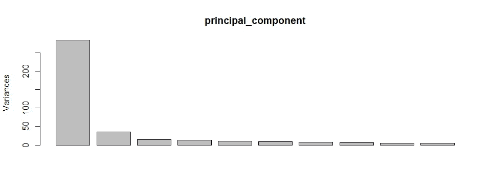
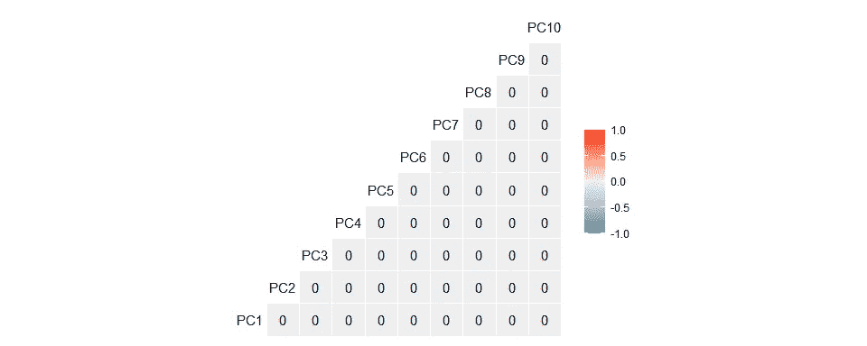
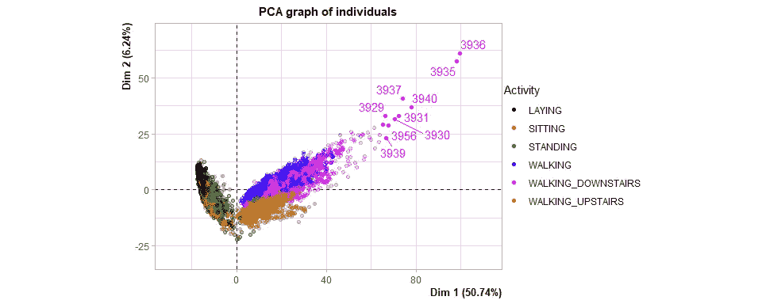
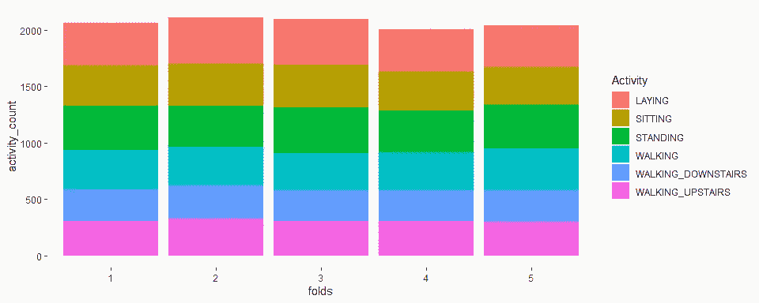
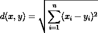
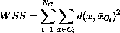
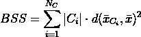
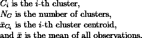
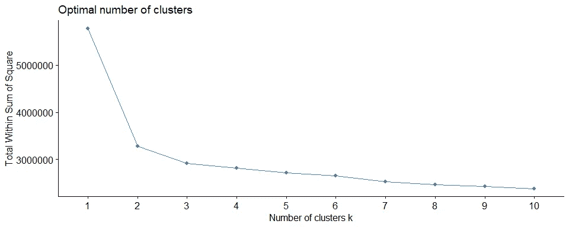
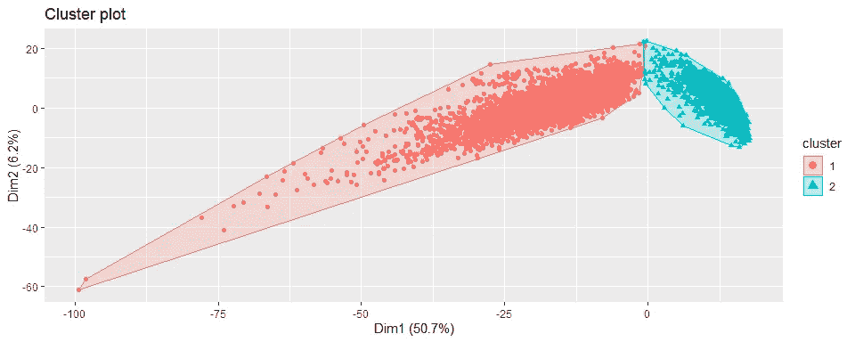

# 用于活动识别的智能手机(第二部分)

> 原文：<https://towardsdatascience.com/smartphone-for-activity-recognition-part-2-67c1d779a46e?source=collection_archive---------41----------------------->

## R 中的数据科学

## 处理维数灾难


格蕾丝·玛德琳在 [Unsplash](https://unsplash.com?utm_source=medium&utm_medium=referral) 上的照片

```
**Table of Contents**· [Problem Statement 1](#bd40)
· [Library](#1f50)
· [Dataset](#cb25)
· [Data Cleaning](#5b6c)
· [Principal Component Analysis](#d06c)
· [Cross-Validation](#f06c)
· [Modeling](#d278)
· [Problem Statement 2](#daf9)
· [Clustering](#8f03)
· [Conclusion](#c624)
```

B 在阅读这篇文章之前，我们鼓励你先阅读[上一篇](/smartphone-for-activity-recognition-228b9e75c306)文章，以便对我们将要做的事情有一点了解。本文研究两个问题:降维和聚类。尽情享受吧！

# 问题陈述 1

在上一篇文章中，我们在[人类活动识别](https://archive.ics.uci.edu/ml/datasets/Human+Activity+Recognition+Using+Smartphones)数据集上执行分类。我们知道这个数据集有如此多的特征(准确地说是 561 个),其中一些特征彼此之间有很强的相关性。使用该数据集，随机森林模型可以以高达 94%的准确度对人类活动进行分类。然而，这样做需要很长时间。第二个候选模型是 k-NN 模型，准确率为 89%，其次是决策树模型，准确率为 86%，朴素贝叶斯模型，准确率为 73%。这让我们思考，

> 我们可以用计算时间换取一些准确性吗？或者，我们真的可以进一步提高某些模型的性能吗？

这个想法是减少数据集的维度，使大部分信息仍然保留。当然，这也可能会降低模型的性能，但好消息是模型可以运行得更快。在之前的文章中，我们实际上已经使用 [t-SNE](https://en.wikipedia.org/wiki/T-distributed_stochastic_neighbor_embedding) 进行了降维，以创建一个可视化，试图看到每个观察在高维空间中的相对位置。然而，t-SNE 是一种非确定性算法，因此我们在三个不同的值中改变了困惑度，以确保结果不是随机的。此外，t-SNE 试图只保留数据的本地结构，而不能保留其差异。

在本文中，我们将介绍一种称为主成分分析(PCA)的新算法，作为 t-SNE 降维的替代算法。PCA 是一种确定性算法，保留了数据的全局结构，通过 PCA，我们可以使用特征值来决定保留多少方差。

# 图书馆

像往常一样，我们将使用 R. Load 加载所需的库。

```
library(tidymodels)     # collection of best packages
library(caret)          # machine learning functions
library(MLmetrics)      # machine learning metrics
library(e1071)          # naive bayes
library(rpart)          # decision tree
library(randomForest)   # random forest
library(class)          # kNN
library(FactoMineR)     # PCA algorithm
library(factoextra)     # PCA and clustering visualization
```

# 资料组

我们来读一下数据集。关于数据集的详细解释可以在[之前的文章](/smartphone-for-activity-recognition-228b9e75c306)中找到。

```
uci_har <- read.csv("UCI HAR.csv")
dim(uci_har)#> [1] 10299   563
```

如上所示，该数据集包含 563 个要素和 10299 个观测值。太多了！

# 数据清理

将每个特征转换为相应的类型。

```
uci_har <- uci_har %>% 
  mutate_at(c('subject', 'Activity'), as.factor) %>% 
  mutate_at(vars(-subject, -Activity), as.numeric)

lvl <- levels(uci_har$Activity)
lvl#> [1] "LAYING"             "SITTING"            "STANDING"           "WALKING"            "WALKING_DOWNSTAIRS" "WALKING_UPSTAIRS"
```

有六个活动作为目标变量:`WALKING`、`WALKING_UPSTAIRS`、`WALKING_DOWNSTAIRS`、`SITTING`、`STANDING`、`LAYING`。我们不会做任何进一步的数据清理，因为在[上一篇文章](/smartphone-for-activity-recognition-228b9e75c306)中已经知道数据集可以被认为是干净的。

# 主成分分析

PCA 算法使用称为主成分(PC)的新维度来总结初始特征的信息/方差。我们的数据集适合于主成分分析，因为它有很多特征，其中有很多是相关的。所以我们现在就开始 PCA 吧。下面的柱状图表明，数据集的方差很大程度上可以用几个主要成分来解释。为了分析的目的，我们将只取 10 个主成分。

```
principal_component <- prcomp(x = uci_har %>% select(-c(subject, Activity)), scale. = TRUE, rank. = 10)
plot(principal_component)
```



图片由[作者](http://dwiuzila.medium.com)

下面是用数字表示的主成分及其摘要。

```
head(as.data.frame(principal_component$x))#>        PC1       PC2        PC3        PC4      PC5        PC6        PC7         PC8          PC9        PC10
#> 1 16.38018 -1.994986 -3.4155244  0.6498264 7.824682 -2.7718293  2.2981737 -5.22746872 -1.335465100  3.75994762
#> 2 15.58142 -1.182536  0.3211912 -2.7479498 4.729307 -1.5887459 -0.3340349 -1.62109884 -0.006348803 -0.07202641
#> 3 15.42324 -2.243058  1.2377235 -4.0026866 4.402521 -1.0350383 -0.1297623 -1.27912309  0.190738822  0.78085331
#> 4 15.64705 -3.762700  1.2752210 -2.8065268 3.238953 -0.7434877  0.3260538 -1.74289880  0.912173701  1.59466696
#> 5 15.84155 -4.438682  1.8081439 -3.1603532 3.331010 -0.9115065 -0.8618895 -0.09012166  0.521603541 -1.01580251
#> 6 15.64401 -4.619950  2.1287441 -2.7722016 2.462343 -0.8805438 -1.1847999  1.40402104  0.692842819 -1.48599448summary(principal_component)#> Importance of first k=10 (out of 561) components:
#>                            PC1     PC2     PC3     PC4     PC5     PC6     PC7     PC8     PC9    PC10
#> Standard deviation     16.8713 5.91623 3.88655 3.70953 3.25529 3.02525 2.81701 2.61208 2.35101 2.30763
#> Proportion of Variance  0.5074 0.06239 0.02693 0.02453 0.01889 0.01631 0.01415 0.01216 0.00985 0.00949
#> Cumulative Proportion   0.5074 0.56977 0.59670 0.62123 0.64012 0.65643 0.67058 0.68274 0.69259 **0.70208**
```

我们可以看到，这 10 个主成分捕获了原始数据集 70%的方差。请注意，每个主成分都是相互垂直的，因此它们彼此不相关，如下所示。

```
GGally::ggcorr(data = principal_component$x, label = TRUE)
```



图片作者[作者](http://dwiuzila.medium.com)

最后，请记住，这些主成分是原始数据集中每个要素的信息的顶点。因此，它们是不可解释的。然而，我们可以使用特征值信息近似返回原始特征，即使结果与原始数据集不完全相同。

我们可以把前两个主要成分画出来，以获得一些见解。让我们再次执行 PCA。

```
uci_har_pca <- PCA(X = uci_har %>% select(-subject),
                   scale.unit = TRUE,
                   quali.sup = 562,
                   graph = FALSE,
                   ncp = 10)

head(uci_har_pca$ind$coord)#>       Dim.1    Dim.2      Dim.3     Dim.4    Dim.5     Dim.6      Dim.7       Dim.8        Dim.9     Dim.10
#> 1 -16.38098 1.995083  3.4156902  0.649858 7.825062 2.7719639  2.2982853  5.22772253  1.335529939 -3.7601302
#> 2 -15.58217 1.182594 -0.3212068 -2.748083 4.729536 1.5888231 -0.3340511  1.62117755  0.006349111  0.0720299
#> 3 -15.42399 2.243166 -1.2377836 -4.002881 4.402735 1.0350886 -0.1297686  1.27918520 -0.190748083 -0.7808912
#> 4 -15.64781 3.762882 -1.2752829 -2.806663 3.239111 0.7435238  0.3260696  1.74298342 -0.912217989 -1.5947444
#> 5 -15.84232 4.438897 -1.8082316 -3.160507 3.331172 0.9115508 -0.8619313  0.09012604 -0.521628866  1.0158518
#> 6 -15.64477 4.620174 -2.1288474 -2.772336 2.462463 0.8805866 -1.1848574 -1.40408921 -0.692876458  1.4860666
```

然后，选择前两个主成分并绘图。

```
plot.PCA(x = uci_har_pca,
         choix = "ind",
         invisible = "quali",
         select = "contrib 10",
         habillage = "Activity")
```



图片作者[作者](http://dwiuzila.medium.com)

这里有几样东西需要打开:

1.  维度 1 解释了原始数据集 51%的方差，而维度 2 解释了其中的 6%。
2.  Dim 1 明确区分静止活动(如`LAYING`、`SITTING`、`STANDING`)和运动活动(如`WALKING`、`WALKING_DOWNSTAIRS`、`WALKING_UPSTAIRS`)。尺寸 1 小于 0 表示静止活动，尺寸 1 大于 0 表示移动活动。
3.  `WALKING_DOWNSTAIRS`类别有几个异常值。或许有些人的确有不同风格的`WALKING_DOWNSTAIRS`？
4.  `SITTING`和`STANDING`活动堆叠在一起，很难分类。

接下来，我们可以看到有许多与身体相关的特征对 Dim 1 有贡献，还有一些与重力相关的特征对 Dim 2 有贡献。

```
dim <- dimdesc(uci_har_pca)
head(as.data.frame(dim$Dim.1$quanti))#>                     correlation p.value
#> fBodyAccsma           0.9889282       0
#> fBodyAccJerksma       0.9882851       0
#> fBodyGyrosma          0.9878669       0
#> tBodyAccJerksma       0.9877968       0
#> tBodyAccJerkMagsma    0.9868902       0
#> tBodyAccJerkMagmean   0.9868902       0head(as.data.frame(dim$Dim.2$quanti))#>                        correlation p.value
#> fBodyAccmeanFreqZ        0.7359410       0
#> tBodyGyroMagarCoeff1     0.7133977       0
#> fBodyAccMagmeanFreq      0.7080972       0
#> tGravityAccarCoeffZ1     0.7075568       0
#> tGravityAccMagarCoeff1   0.7068318       0
#> tBodyAccMagarCoeff1      0.7068318       0
```

# 交叉验证

由于[在](/smartphone-for-activity-recognition-228b9e75c306)之前，我们通过分割数据集进行 5 重交叉验证，使得训练和测试数据集中的`subject`不相交。

```
set.seed(2072) # for reproducibility
subject_id <- unique(uci_har$subject)
folds <- sample(1:5, 30, replace = TRUE)
d <- data.frame(col1 = c(subject_id), col2 = c(folds))
uci_har$folds <- d$col2[match(uci_har$subject, d$col1)]
uci_har <- uci_har %>% 
  mutate(folds = as.factor(folds)) %>% 
  select(-subject)
```

请注意，在为每个观察结果创建折叠后，我们丢弃了`subject`特征，因为在分析中不再需要它。最后，我们还可以在下面看到，数据在褶皱之间均匀分布，因此没有出现不平衡数据。

```
ggplot(uci_har %>%
         group_by(folds, Activity) %>%
         count(name = 'activity_count'),
       aes(x = folds, y = activity_count, fill = Activity)) +
  geom_bar(stat = 'identity')
```



图片作者[作者](http://dwiuzila.medium.com)

# 建模

现在，使用五重交叉验证执行建模步骤。下面的函数是由[上一篇文章](/smartphone-for-activity-recognition-228b9e75c306)中的`crossvalidate`函数编辑而来。唯一不同的是，这一次我们:

1.  使用`step_nzv`功能删除任何方差接近零的特征，
2.  使用`step_center`和`step_scale`功能对数据进行居中和缩放(因为这是 PCA 所必需的),以及
3.  使用`step_pca`功能合并 PCA。

上面提到的四个函数都来自`tidymodels`库。将这些函数拟合到`train`数据集，然后使用拟合过程中发现的参数对`test`数据集进行转换。我们将采用几个主要成分来解释至少 90%的数据集累积方差。

```
crossvalidate <- function(data, k, model_name) {
  # 'data' is the training set with the 'folds' column
  # 'k' is the number of folds we have
  # 'model_name' is a string describing the model being used

  # initialize empty lists for recording performances
  acc_train <- c()
  acc_test <- c()
  y_preds <- c()
  y_tests <- c()
  models <- c()

  # one iteration per fold
  for (fold in 1:k) {

    # create training set for this iteration
    # subset all the datapoints where folds does not match the current fold
    train <- data %>% filter(folds != fold)
    y_train <- train$Activity

    # create test set for this iteration
    # subset all the datapoints where folds matches the current fold
    test <- data %>% filter(folds == fold)
    y_test <- test$Activity

    # create PCA pipeline
    rec <- recipe(Activity~., data = train) %>%
       step_rm(folds) %>% 
       step_nzv(all_predictors()) %>%
       step_center(all_numeric()) %>%
       step_scale(all_numeric()) %>%
       step_pca(all_numeric(), threshold = 0.90) %>%
       prep()

    # perform PCA pipeline
    X_train_dt <- juice(rec)
    X_test_dt <- bake(rec, test)
    X_train <- X_train_dt %>% select(-Activity)
    X_test <- X_test_dt %>% select(-Activity)

    print(glue::glue("Fold {fold} dataset reduced to {ncol(X_train)} dimensions."))

    # train & predict
    switch(model_name,
      nb = {
        model <- naiveBayes(x = X_train, y = y_train, laplace = 1)
        y_pred <- predict(model, X_test, type = 'class')
        y_pred_train <- predict(model, X_train, type = 'class')
        models <- c(models, list(model))
      },
      dt = {
        model <- rpart(formula = Activity ~ ., data = X_train_dt, method = 'class')
        y_pred <- predict(model, X_test_dt, type = 'class')
        y_pred_train <- predict(model, X_train_dt, type = 'class')
        models <- c(models, list(model))
      },
      knn = {
        k <- round(sqrt(nrow(X_train)))
        y_pred <- knn(train = X_train, test = X_test, cl = y_train, k = k)
        y_pred_train <- knn(train = X_train, test = X_train, cl = y_train, k = k)
      },
      rf = {
        model <- randomForest(x = X_train, y = y_train, xtest = X_test, ytest = y_test)
        y_pred <- model$test$predicted
        y_pred_train <- model$predicted
        models <- c(models, list(model))
      },
      {
        print("Model is not recognized. Try to input 'nb', 'dt', 'knn', or 'rf'.")
        return()
      }
    )

    # populate corresponding lists
    acc_train[fold] <- Accuracy(y_pred_train, y_train)
    acc_test[fold] <- Accuracy(y_pred, y_test)
    y_preds <- append(y_preds, y_pred)
    y_tests <- append(y_tests, y_test)
  }

  # convert back to factor
  y_preds <- factor(y_preds, labels = lvl)
  y_tests <- factor(y_tests, labels = lvl)

  # get the accuracy between the predicted and the observed
  cm <- confusionMatrix(y_preds, y_tests)
  cm_table <- cm$table
  acc <- cm$overall['Accuracy']

  # return the results
  if (model_name == 'knn') {
    return(list('cm' = cm_table, 'acc' = acc, 'acc_train' = acc_train, 'acc_test' = acc_test))
  } else {
    return(list('cm' = cm_table, 'acc' = acc, 'acc_train' = acc_train, 'acc_test' = acc_test, 'models' = models))
  }
}
```

在几个型号上运行该功能。

```
nb <- crossvalidate(uci_har, 5, 'nb')#> Fold 1 dataset reduced to 65 dimensions.
#> Fold 2 dataset reduced to 65 dimensions.
#> Fold 3 dataset reduced to 64 dimensions.
#> Fold 4 dataset reduced to 64 dimensions.
#> Fold 5 dataset reduced to 65 dimensions.cat("Naive Bayes Accuracy:", nb$acc)#> Naive Bayes Accuracy: 0.8010486dt <- crossvalidate(uci_har, 5, 'dt')#> Fold 1 dataset reduced to 65 dimensions.
#> Fold 2 dataset reduced to 65 dimensions.
#> Fold 3 dataset reduced to 64 dimensions.
#> Fold 4 dataset reduced to 64 dimensions.
#> Fold 5 dataset reduced to 65 dimensions.cat("Decision Tree Accuracy:", dt$acc)#> Decision Tree Accuracy: 0.7174483knn <- crossvalidate(uci_har, 5, 'knn')#> Fold 1 dataset reduced to 65 dimensions.
#> Fold 2 dataset reduced to 65 dimensions.
#> Fold 3 dataset reduced to 64 dimensions.
#> Fold 4 dataset reduced to 64 dimensions.
#> Fold 5 dataset reduced to 65 dimensions.cat("k-Nearest Neighbors Accuracy:", knn$acc)#> k-Nearest Neighbors Accuracy: 0.8750364rf <- crossvalidate(uci_har, 5, 'rf')#> Fold 1 dataset reduced to 65 dimensions.
#> Fold 2 dataset reduced to 65 dimensions.
#> Fold 3 dataset reduced to 64 dimensions.
#> Fold 4 dataset reduced to 64 dimensions.
#> Fold 5 dataset reduced to 65 dimensions.cat("Random Forest Accuracy:", rf$acc)#> Random Forest Accuracy: 0.8714438
```

我们不打算详细分析这些模型，因为这已经在[上一篇文章](/smartphone-for-activity-recognition-228b9e75c306)中完成了。这里需要注意的一点是，PCA 算法仅用大约 65 个特征就可以捕获 90%的原始数据集方差。这比原来的 561 功能小了 860%!这带来了一些后果，有些是好的，有些是坏的:

1.  朴素贝叶斯的准确率从 73%提高到 80%。这是因为 PCA 得到的特征在向量空间中是垂直的，因此彼此不相关，这完全符合朴素贝叶斯假设。
2.  决策树、随机森林等基于树的模型越来越差。决策树准确率从 86%下降到 72%，随机森林准确率从 94%下降到 87%。这可能是由于主成分的模糊区域造成的，这使得基于树的模型难以在类分布之间设置决策边界。这个模糊区域来自于这样一个事实，即每个主成分都是所有原始特征信息的某种组合。
3.  k-NN 模型受影响没那么大。准确性从 89%到 88%只有微小的下降，这是正常的，因为我们只捕获了原始数据集方差的 90%。

# 问题陈述 2

假设我们不知道目标变量是什么样子，让我们完全放弃`Activity`。

```
uci_har <- uci_har %>% select(-c(Activity, folds))
```

现在，我们的任务是将数据集中的每个观察结果分成几个类别。我们如何做到这一点？我们做了多少个集群？

# 使聚集

聚类分析包括寻找对象组，使得一个组中的对象彼此相似(或相关)，而与其他组中的对象不同(或无关)。我们将使用 k-means 聚类对观察值进行分类。基本上，k-means 是一种基于质心的聚类算法，其工作原理如下。

1.  随机初始化:随机放置 *k 个*质心
2.  分类指定:根据到质心的距离，将每个观测值指定到最近的分类。
3.  质心更新:将质心移动到同一个聚类的平均观测值。
4.  重复步骤 2 和 3，直到达到收敛。

在实现 k-means 聚类时，有 2 个超参数必须由用户确定:质心的数量 *k* ，以及所使用的距离度量(通常是[欧几里德距离](https://en.wikipedia.org/wiki/Euclidean_distance)或[曼哈顿距离](https://en.wikipedia.org/wiki/Taxicab_geometry))。在本文中，我们将使用欧几里德距离公式



其中 *x* = ( *x₁* ， *x₂* ，…， *xₙ* ， *y* = ( *y₁* ， *y₂* ，…， *yₙ* )为维度为 *n* 的观测值。因此，我们只需要确定 *k* 。

由于聚类分析包括查找对象组，使得一个组中的对象彼此相似，因此好的聚类是平方和(WSS)最小的聚类，也就是说，从每个观察值到其所属聚类的质心的二次距离的和最小。此外，由于一个组中的对象需要与其他组中的对象不同，所以好的聚类也具有较大的平方和(BSS)。这里，BSS 只是从每个质心到全局平均值的二次距离之和，由每个聚类中的观察值数量加权。很容易看出，较高的 k 对应于较低的 WSS。然而， *k* 必须从商业的角度来确定，或者更客观地使用所谓的肘方法。数学上，WSS 和盲源分离公式如下



在哪里



```
uci_har_scaled <- scale(uci_har)
fviz_nbclust(x = uci_har_scaled, FUNcluster = kmeans, method = "wss")
```



图片由[作者](http://dwiuzila.medium.com)

肘方法说，我们应该选择 k，在那里增加它不会导致 WSS 更明显的减少。因此从上面的图中，我们选择 k = 2。由于 k-means 聚类是一种不确定的算法(由于质心的随机初始化)，我们将运行 k-means 5 次，然后取 WSS 最低的一个。

```
set.seed(42) # for reproducibility
result <- c()
for (i in 1:5) {
  uci_har_km <- kmeans(x = uci_har_scaled, centers = 2)
  wss <- uci_har_km$tot.withinss
  bss <- uci_har_km$betweenss
  print(glue::glue("Trial {i} WSS: {wss} \t BSS: {bss}"))
  result <- c(result, list(uci_har_km))
}#> Trial 1 WSS: 3272538.83119699   BSS: 2504639.16880301
#> Trial 2 WSS: 3272538.83119699   BSS: 2504639.16880301
#> Trial 3 WSS: 3272538.83119699   BSS: 2504639.16880301
#> Trial 4 WSS: 3272538.83119699   BSS: 2504639.16880301
#> Trial 5 WSS: 3272538.83119699   BSS: 2504639.16880301
```

由于 BSS 和 WSS 对每个试验给出相同的数字，聚类过程很可能对所有试验给出相同的结果。我们可以选择任何一个试验，所以就选第五个吧。我们可以将这种聚类形象化如下。

```
fviz_cluster(object = uci_har_km, data = uci_har_scaled, labelsize = 0)
```



图片作者[作者](http://dwiuzila.medium.com)

我们可以很容易地看到，所获得的两个集群最有可能是集群 2 的静止活动和集群 1 的移动活动，它们在大约 0 处被 Dim 1 分开。

# 结论

PCA 是一种降维技术，对于处理多维数据非常有用，原因有两个:可视化和简化。在本文中，我们看到在将人类活动识别数据集拟合到模型之前对其进行 PCA 给出了不同的结果:一些模型变得更好，一些变得更差，一些没有受到太大影响。我们还看到，在不知道目标变量的情况下对数据集进行聚类，可以很好地区分静止和移动活动。


🔥你好！如果你喜欢这个故事，想支持我这个作家，可以考虑 [***成为会员***](https://dwiuzila.medium.com/membership) *。每月只需 5 美元，你就可以无限制地阅读媒体上的所有报道。如果你注册使用我的链接，我会赚一小笔佣金。*

🔖*想了解更多关于经典机器学习模型如何工作以及如何优化其参数的信息？或者 MLOps 大型项目的例子？有史以来最优秀的文章呢？继续阅读:*


[艾伯斯·乌兹拉](https://dwiuzila.medium.com/?source=post_page-----67c1d779a46e--------------------------------)

## 从零开始的机器学习

[View list](https://dwiuzila.medium.com/list/machine-learning-from-scratch-b35db8650093?source=post_page-----67c1d779a46e--------------------------------)8 stories

[艾伯斯·乌兹拉](https://dwiuzila.medium.com/?source=post_page-----67c1d779a46e--------------------------------)

## 高级优化方法

[View list](https://dwiuzila.medium.com/list/advanced-optimization-methods-26e264a361e4?source=post_page-----67c1d779a46e--------------------------------)7 stories

[艾伯斯·乌兹拉](https://dwiuzila.medium.com/?source=post_page-----67c1d779a46e--------------------------------)

## MLOps 大型项目

[View list](https://dwiuzila.medium.com/list/mlops-megaproject-6a3bf86e45e4?source=post_page-----67c1d779a46e--------------------------------)6 stories

[艾伯斯·乌兹拉](https://dwiuzila.medium.com/?source=post_page-----67c1d779a46e--------------------------------)

## 我最好的故事

[View list](https://dwiuzila.medium.com/list/my-best-stories-d8243ae80aa0?source=post_page-----67c1d779a46e--------------------------------)24 stories

艾伯斯·乌兹拉

## R 中的数据科学

[View list](https://dwiuzila.medium.com/list/data-science-in-r-0a8179814b50?source=post_page-----67c1d779a46e--------------------------------)7 stories[](https://dwiuzila.medium.com/membership)