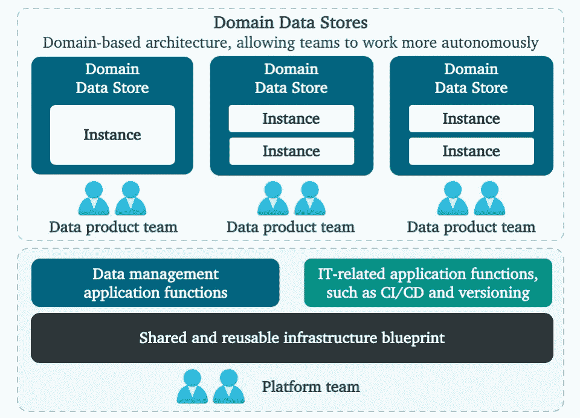
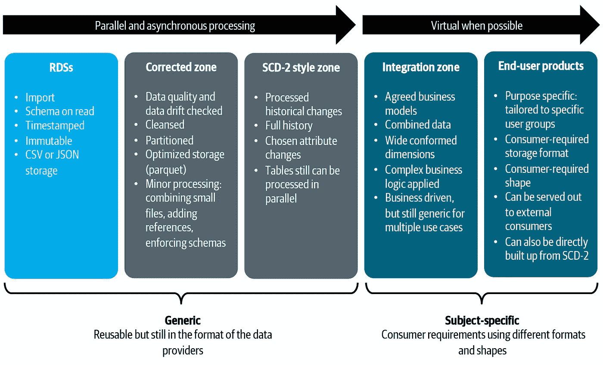
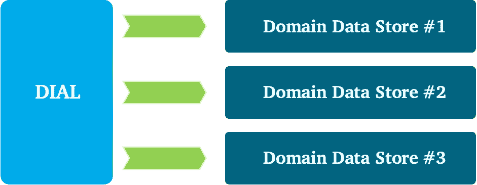
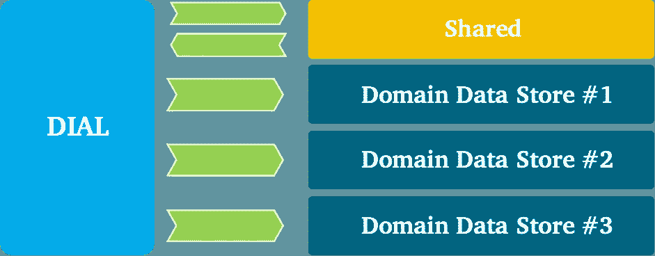
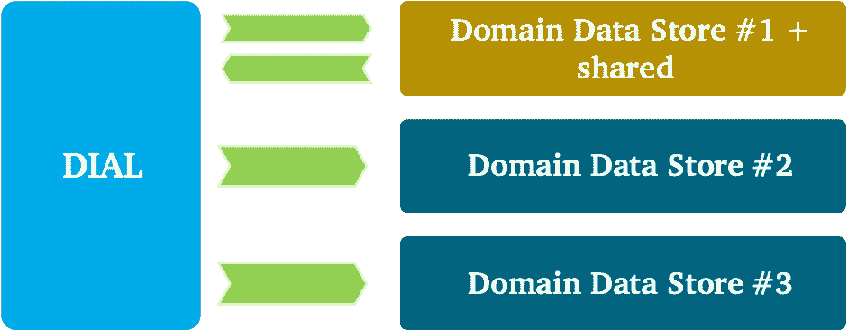
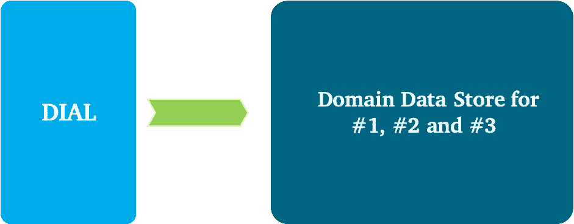

# 用领域数据存储打破孤岛

> 原文：<https://towardsdatascience.com/smashing-silos-with-domain-data-stores-4c37d37fd838?source=collection_archive---------28----------------------->

在我的[其他帖子](https://www.linkedin.com/in/pietheinstrengholt/)中，你了解了 ABN·AMRO 如何在数据网格风格的架构中提供数据。在这篇博文中，你将了解如何打破大数据的垄断。

**数据驱动的决策转变**

自从数据仓库成为商品以来，情况发生了很大变化。分布式系统越来越受欢迎，数据越来越大，越来越多样化，新的数据库设计层出不穷，云的出现将计算和存储分离开来，以提高可扩展性和弹性。将这些趋势与从集中式到面向领域的数据所有权的转变结合起来，您将立即理解改变数据密集型应用程序的设计方式的重要性。

在我们的数据架构中，我们明确区分了直接数据消费和新数据创建。在数据分发架构中，正如您可以在这里阅读[和](https://www.linkedin.com/pulse/abn-amros-data-integration-architecture-piethein-strengholt/)[一样，我们已经定位了读取数据存储(RDS)来捕获并向消费者重复提供大量不可变数据。在这种模式中，读取数据，但不创建新数据。消费应用程序或用户直接使用 rds 作为他们的数据源，并可能基于相似数据元素之间的映射执行一些轻量级集成。这种模型的最大好处是它不需要数据工程团队创建和维护新的数据模型。您不需要将数据提取、转换和加载到新的数据库中。转变是即时发生的，但这些结果并不需要一个永久的新家。这种方法对于数据探索、轻量级报告和不需要复杂数据转换的简单分析模型特别有用。](https://www.linkedin.com/pulse/abn-amros-data-integration-mesh-piethein-strengholt/)

然而，问题是消费者的需求可能超过 rds 所能提供的。在某些情况下，显然需要创建新的数据:例如，复杂的业务逻辑之后是生成新的业务洞察力的分析模型。为了保存这些见解供以后分析，您需要将这些信息保存在某个地方，例如，保存在数据库中。另一种情况是需要处理的数据量超过了 RDS 平台的处理能力。在这种情况下，数据处理量；例如，对历史数据的访问是如此的密集，以至于您有理由逐步将数据转移到一个新的位置，对其进行处理，并对其进行预优化以供以后使用。另一种情况是当多个 rds 需要组合和协调时。这通常需要协调许多任务并将数据整合在一起。让用户一直等到所有这些任务都完成，会对用户体验产生负面影响。这些暗示将我们带到了数据消费的第二种模式:创建**域数据存储(DDSs)** 。

**域数据存储**

我们希望更仔细地管理新创建的数据，同时提高灵活性。这就是 DDS 的定位。这种类型的应用程序的作用是集中处理数据，存储新创建的数据，并为消费者的用例提供便利。为了释放价值，我们设计了一个新的架构，其中包括一个数据工程团队的平台。让我们看看侧面，评价一下特点。

图 1 由 [Piethein Strengholt](https://www.linkedin.com/in/pietheinstrengholt/) 制作:DDS 参考架构

我们设想的是一个生态系统，允许快速交付新的数据驱动的决策用例。它在总体上促进了数据工程和密集处理，同时保持控制并且不会看到技术的扩散。我们预见到从通用(企业)数据集成到业务特定数据创建的转变；从集成专家到社区建设和无缝协作的转变；以及从僵化的数据模型向更灵活的或“轻模式”方法的转变。

从高层次来看，生态系统类似于上面的图 1；一个完全托管的平台，允许快速接收、转换和使用数据。在底部，您可以看到托管基础架构，其主要目标是隐藏所有数据工程团队的复杂性。有一些可重用的功能以自助方式支持数据工程团队。其中包括可重用和托管的数据库技术、中央监控和日志记录、沿袭、身份和访问管理、流程编排、CI/CD、数据和模式版本控制、基于批处理、API 和事件的接收模式、与商业智能和高级分析功能的集成，等等。使用团队拓扑方法管理基础平台:中央平台团队管理底层平台，同时支持所有其他团队。主要目的是简化所有服务，管理和保护平台，从而减少数据工程团队的开销。

在顶部，您可以看到 DDSs，其中的数据由数据工程团队管理。这些领域团队关注数据产品、客户旅程或业务用例。DDSs 的界限也决定了数据责任。这些包括数据质量、所有权、集成和分发、元数据注册、建模和安全性。稍后我将回到粒度和域边界。

对于功能需求，我们确保业务目标和目的是明确的、详细的和完整的。理解它们是您的解决方案的基础，并要求您澄清以下标准:需要解决哪些业务问题、需要哪些数据源、哪些解决方案需要可操作、必须实时或离线执行哪些数据处理、完整性和要求是什么，以及哪些结果可以被其他域重用。

对于非功能性需求，我们选择提供多少和什么类型的数据存储技术。您可以考虑一组通用的可重用数据库技术或数据存储和模式，以确保利用每个数据存储的优势。例如，任务关键型和过渡型应用程序可能只允许使用强一致性模型，或者商业智能和报告可能只允许使用提供快速 SQL 访问的存储。

不同的数据存储在内部管理和组织它们的数据。一种常见的组织方式是(逻辑上或物理上)分离摄入、清洗、管理、协调、服务等关注点。在我们的域数据存储中，我们鼓励使用具有不同存储技术的不同区域，例如文件夹、存储桶、数据库等。区域还允许我们组合用途，因此商店可以同时用于促进运营和分析。对于所有商店和区域，范围必须非常明确。

图 2 由 [Piethein Strengholt](https://www.linkedin.com/in/pietheinstrengholt/) 提供:分层 DDS 方法

对于数据模型，我们鼓励从僵化的数据模型转向更“轻模式”的方法。然而，任何建筑风格都是允许的。如果团队接受读模式或者更喜欢直接构建简单的维度模型，我们鼓励他们这样做。也可以应用 Kimball 或数据仓库建模。这完全取决于用例的需求和规模，这就把我带到了下一个主题。

**域数据存储粒度**

当我们从企业数据仓库过渡到更细粒度的 DDS 设计时，我们需要考虑粒度并对数据进行逻辑分段。确定逻辑 DDS 边界的范围、大小和位置非常困难，在域之间分发数据时会带来挑战。通常，边界是面向主题的，并与业务能力相一致。当定义一个域的逻辑边界时，为了简化数据建模活动和域内的内部数据分布，将它分解成子域是有价值的。

重要的任务是仔细考虑 DDS 的逻辑角色。这也涵盖了*业务粒度*和*技术粒度*:

*   业务粒度从业务关注点的自顶向下分解开始:分析最高级别的功能上下文、范围(即“边界上下文”)和活动。这些必须被划分成更小的“区域”、用例以及业务目标。这项工作需要良好的业务知识和专业知识，如何有效地划分业务流程，领域，职能等。最佳实践是使用业务功能作为参考模型，研究通用术语(无处不在的语言)和重叠的数据需求。
*   技术粒度是针对特定目标执行的，例如:可重用性、灵活性(易于适应频繁的功能更改)、性能、安全性和可伸缩性。平衡的关键在于做出正确的权衡。一个业务领域可能使用相同的数据，但是如果技术需求相互冲突，那么最好将关注点分开。例如，如果一个特定的业务任务需要集中汇总数据，而另一个业务任务只需要快速选择单个记录，那么最好将关注点分开。这同样适用于灵活性。一个用例可能需要每天修改，另一个用例必须保持稳定至少一个季度。同样，您应该考虑分离关注点。因此，我们以这样的方式分解 DDS，即在 DDS 边界内允许实例。

当一个域更大并且由几个子域组成时，在内部组织数据的过程会变得更加复杂。这个视图中的 DDS 更加抽象:实例和区域可以在多个子域之间共享，而区域可以是独占的。让我试着用一个例子来具体说明这一点。对于大型域，您可以围绕一个 DDS 的所有不同区域绘制一个边界。例如，在这个 DDS 中，前两个区域可以在多个子域之间共享。因此，清理、纠正和建立历史数据通常是为所有子域执行的。对于转换来说，故事变得更加复杂，因为数据需要特定于一个子域或用例。因此，可以有共享的管道和专用于一个用例的管道。包括所有管道在内的整个数据链都属于一个整体，因此可以被视为一个巨大的 DDS 实施方案。正如您刚刚了解到的，在这个庞大的 DDS 实现中，您会看到不同的边界:所有子域通用的边界和特定的边界。

当域比较大，或者子域需要通用的——可重复的——集成逻辑时，分解域尤其重要。在这种情况下，拥有一个通用的子域会有所帮助，它以一种允许其他子域标准化并从中受益的方式提供集成逻辑。一个基本规则是保持子域间的共享模型较小，并始终与通用语言保持一致。对于重叠部分，我们使用不同于领域驱动设计的模式。

想象三个数据需求重叠的说明性用例。不同的集成和分布模式可以在不同的团队中应用。让我们探索一下您可以应用哪些不同的方法。

如果复制的相关成本优先于可重用性，那么可以使用**分离方式**模式。当需要高灵活性和敏捷性时，这种模式通常是一种选择。从建模的角度来看，当很少或没有共同点时，这也是一种选择。

图 3 由 [Piethein Strengholt](https://www.linkedin.com/in/pietheinstrengholt/) 制作:DDS 集成模式

当重叠很大时，团队可以使用**伙伴关系**模式来适应所有各方的共享开发需求。所有团队都必须愿意合作，并尊重彼此的需求。每个人都需要做出重大承诺，因为每个人都不能随意改变共同的逻辑。在这种方法中，数据工程团队既是数据消费者也是提供者:他们捕获、提取数据并将其加载到数据存储中，然后重新发布或分发。

图 4 由 [Piethein Strengholt](https://www.linkedin.com/in/pietheinstrengholt/) 表示:DDS 集成模式

如果一个团队很强大，并且愿意掌握下游消费者的数据和需求，那么可以使用**客户-供应商**模式。这种模式的缺点是相互冲突的关注点，迫使下游团队协商可交付成果和安排优先级。

图 5 由 [Piethein Strengholt](https://www.linkedin.com/in/pietheinstrengholt/) 制作:DDS 集成模式

一个**从众**模式可以用来让所有的当事人完全符合所有的要求。当集成工作极其复杂，不允许任何其他方拥有控制权，或者使用供应商包时，这种模式也是一种选择。

图 6 由 [Piethein Strengholt](https://www.linkedin.com/in/pietheinstrengholt/) 表示:DDS 集成模式

**结论**

我们在本章中构建的架构有助于您了解我们如何大规模管理数据密集型应用程序。您已经看到，为了实现更快的价值，使用域边界分解数据是很重要的。通过打破孤岛并将 DDS 之间的依赖性保持在最低限度，我们让团队保持专注。

我们在这篇博文中讨论的架构有助于我们大规模管理数据。如果你想了解更多，我推荐你去看看《规模化数据管理<https://learning.oreilly.com/library/view/data-management-at/9781492054771/>*》一书。*