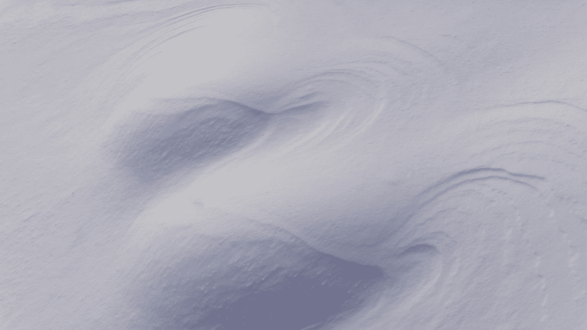
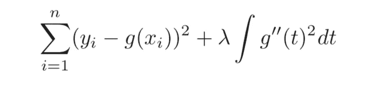
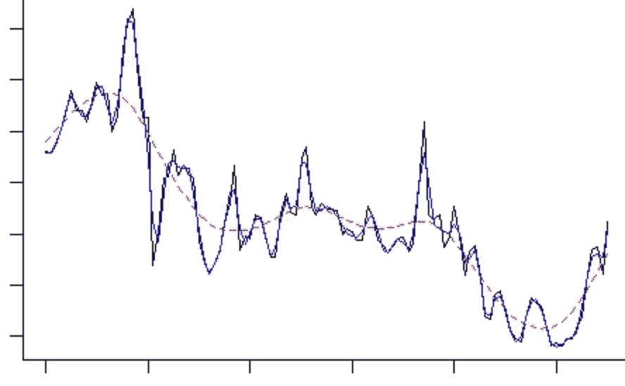

# R 中的平滑样条

> 原文：<https://towardsdatascience.com/smoothing-splines-in-r-and-python-f6b50d4a7f59?source=collection_archive---------17----------------------->

## 线性模型的扩展

## 这篇文章讨论了关于平滑样条的基础知识和 r。



安娜斯塔西娅·马莱在 [Unsplash](https://unsplash.com?utm_source=medium&utm_medium=referral) 上拍摄的照片

O 关于[有很多方法可以解决这个问题，但是有一个捷径可以避免在建模中考虑这些问题。这是**平滑样条**。](/regression-splines-in-r-and-python-cfba3e628bcd)

## 平滑样条的概念

平滑样条曲线将 ***X*** 的每个唯一值作为一个结，而不是请求一系列预先选择的结。等等！是不是意味着它最多给原模型增加了 *N* ( *N* =观察次数)额外的自由度？是不是太合身了？

不要惊慌。为了解决过度拟合问题，平滑样条在其 ***损失函数*** 中引入了 ***惩罚项*** 。惩罚项鼓励更平滑的线并惩罚变化。

具体地，平滑样条的损失函数等于残差平方和( ***RSS*** )和平滑项的和，



光滑样条的损失函数。(图片来自 James，Gareth 等人《统计学习导论》。第 112 卷。纽约:施普林格，2013 年。)

其中 g 是模型函数，λ是非负调谐参数，g′′是二阶导数的平方。

我们可以看到上面损失函数中的第一项简单来说就是 ***RSS*** 。第二项，即 ***惩罚项*** ，鼓励更平滑的拟合。为什么二阶导数的和与拟合的平滑度相关联？

众所周知，点 *A* 的一阶导数测量了函数在 *A* 的斜率。并且在 *A* 处的二阶导数测量在 *A* 处的斜率变化。然后，我们再次查看损失函数方程，我们可以很容易地理解，一个更摆动的曲线将导致一个更大的平滑项。因为我们的目标是最小化整个损失函数，所以我们更喜欢较小的平滑项，这对应于更平滑的线。很简单，不是吗？

这个平滑样条的想法让你想起什么了吗？是的，我肯定你还记得 [***岭*** 或 ***套索*** 回归](/a-practical-suggestion-in-linear-regression-cb639fd5ccdb)在损失函数中使用惩罚项来缩小线性模型的系数。类似于 ***脊*** 或 ***套索*** 回归，光滑样条的损失函数既有“**偏差**项，也有“**方差**项。RSS 测量模型的偏差，平滑项测量模型的方差。

看到了吗？在统计建模中，偏差-方差权衡无处不在。我们想要的只是在它们之间找到一个平衡点，最好地“描述”真实的数据。

## 平滑样条曲线中的参数调整

您可能已经注意到，通过平滑样条曲线中的这些设置，平滑参数 **λ** 在平衡偏差和方差方面起着非常重要的作用。

如果 **λ** 超级巨大，那么它对拟合函数的粗糙程度惩罚很大，那么这个模型就是一条直线，因为一条直线的二阶导数为零。

如果 **λ** 为 0，则完全不惩罚粗糙度，那么模型是完美的过拟合，并且跟随每个训练点。

一种更直接的方式来可视化大λ**对小λ** 的**，**



图示了更大和更小的λ(图片来自[https://stats . stack exchange . com/questions/41369/optimal-choice-of-smooth-spline-parameter](https://stats.stackexchange.com/questions/41369/optimal-choice-of-smooth-spline-parameter))

红色虚线表示较大的λ，蓝色/黑色曲线表示较小的λ。您可以看到曲线粗糙度的差异。

即使我们避免选择节点的数量和位置，我们仍然需要**调整平滑样条中的平滑参数** λ。

谢天谢地，通过[交叉验证](/end-to-end-project-of-game-prediction-based-on-lebrons-stats-using-three-machine-learning-models-38c20f49af5f)可以简单解决。对应于最小测试集误差的λ是要使用的最终平滑参数。

对于大多数模型来说，留一交叉验证( *LOOCV* )听起来比 k 重交叉验证更耗费时间和资源，因为它需要(N - k)次额外的参数调整迭代。

然而，LOOCV 是平滑样条曲线中平滑参数调整的最简单方法。原因是 LOOCV RSS 的总和可以仅使用一个原始数据拟合所有数据来计算。这一招并不适用于所有型号。如果你对为什么会这样的理论部分感兴趣，可以参考经典著作，[***ESL II***by](https://web.stanford.edu/~hastie/ElemStatLearn/printings/ESLII_print12_toc.pdf)[特雷弗·哈斯蒂](http://www-stat.stanford.edu/~hastie/)，[罗伯特·蒂布拉尼](http://www-stat.stanford.edu/~tibs/)，以及[杰罗姆·弗里德曼](http://www-stat.stanford.edu/~jhf)。

## 光滑样条的实现

好了，了解了平滑样条的基本概念后，让我展示一下在 **R** 中的实现。

幸运的是，已经有了用于平滑样条的内置函数，所以 r 中的标准实现非常简单。我将只展示基本实现，但是您可能需要在真实情况下专门修改代码。

在 ***R*** 中，我们将使用示例数据集 ***工资*** 中的 [**ISLR**](https://www.statlearning.com/) 。执行平滑样条的 R 包是 [***样条***](https://www.rdocumentation.org/packages/splines/versions/3.6.2) 。我们将使用 ***函数 smooth.spline()*** ，

```
library(splines)
library(ISLR)
attach(Wage)
spl_mod <- smooth.spline(age, wage, cv= TRUE) 
```

其中*年龄*和*工资*分别表示自变量和因变量为 ***年龄*** 和 ***工资*** (变量名称)。这里 cv 表示该函数执行交叉验证以自动选择最佳平滑参数。

就是这样。

我希望这篇短文能帮助你更好地理解非线性数据建模中的样条。如果你对我关于数据和建模的文章感兴趣，请[订阅](https://jianan-lin.medium.com/subscribe)我的 Medium 账号。谢谢大家！


威尔·斯图尔特在 [Unsplash](https://unsplash.com?utm_source=medium&utm_medium=referral) 上拍摄的照片

## 参考资料:

[](https://stats.stackexchange.com/questions/41369/optimal-choice-of-smooth-spline-parameter) [## 光滑样条参数的最佳选择？

### 感谢您为交叉验证提供答案！请务必回答问题。提供详细信息并分享…

stats.stackexchange.com](https://stats.stackexchange.com/questions/41369/optimal-choice-of-smooth-spline-parameter) 

詹姆斯、加雷斯等人*统计学习导论*。第 112 卷。纽约:施普林格，2013 年。