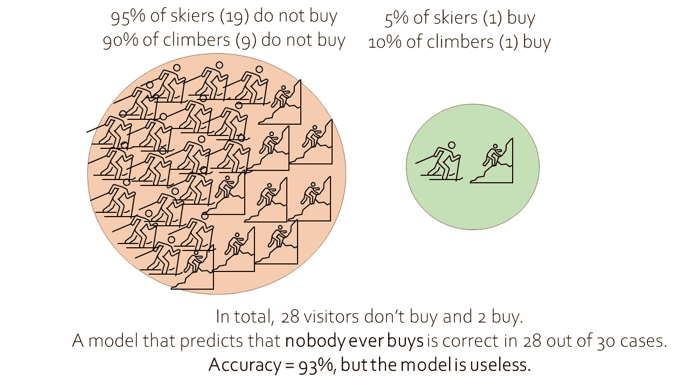
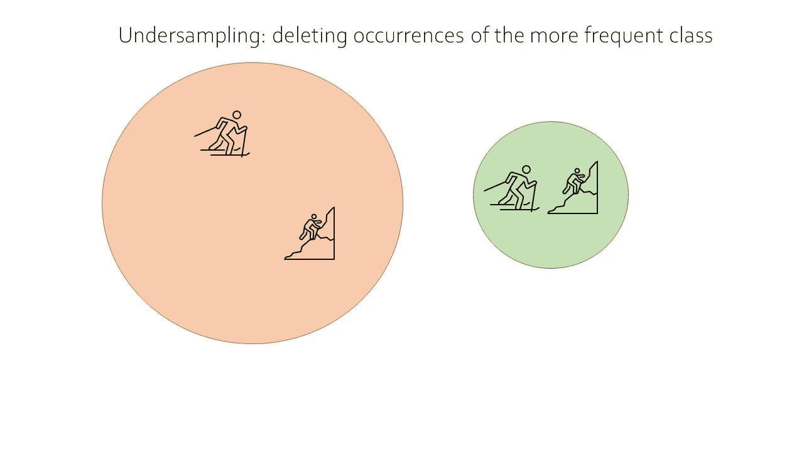
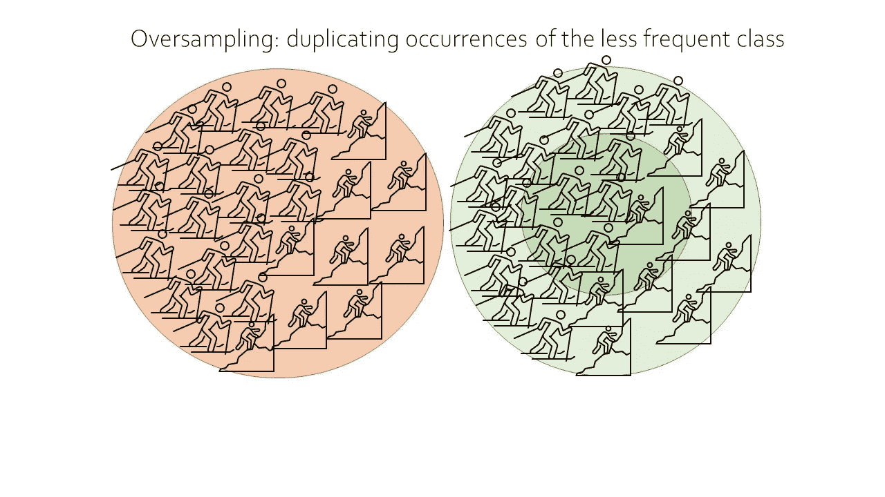
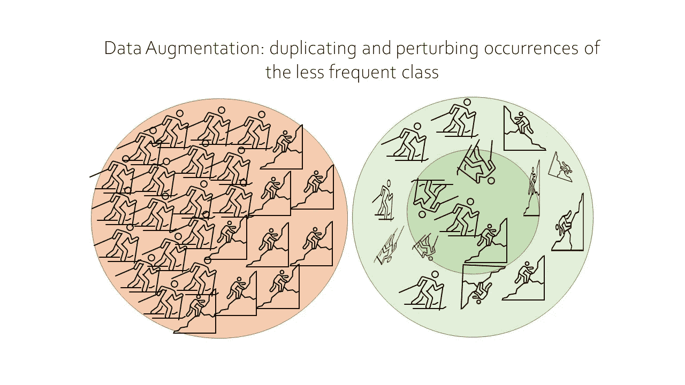
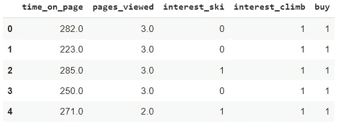
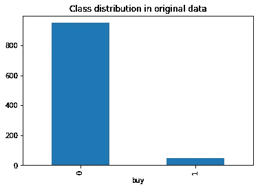
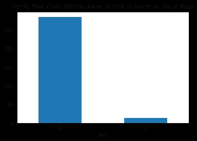
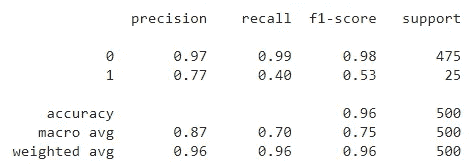
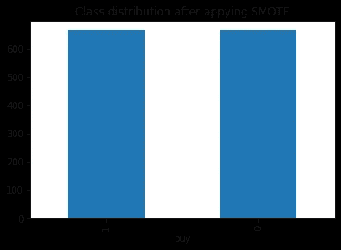
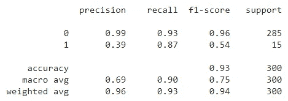

# 重击

> 原文：<https://towardsdatascience.com/smote-fdce2f605729?source=collection_archive---------0----------------------->

## [实践教程](https://towardsdatascience.com/tagged/hands-on-tutorials)

## 你需要知道的关于 SMOTE 的一切。提供 Python 中 SMOTE 的完整示例演练。

SMOTE:不平衡数据的强大解决方案。由[埃琳娜·莫日维洛](https://unsplash.com/@miracleday?utm_source=unsplash&utm_medium=referral&utm_content=creditCopyText)在 [Unsplash](https://unsplash.com/?utm_source=unsplash&utm_medium=referral&utm_content=creditCopyText) 上拍摄的照片。

在这篇文章中，你将学到你需要知道的关于 **SMOTE** 的一切。SMOTE 是一种机器学习技术，可以解决使用**不平衡数据集**时出现的问题。不平衡数据集在实践中经常出现，掌握处理这类数据所需的工具至关重要。

# SMOTE:不平衡数据的强大解决方案

SMOTE 代表**合成少数过采样技术**。该方法是在《人工智能研究杂志》2002 年的一篇论文中提出的。SMOTE 是分类问题中处理不平衡数据的一种改进方法。

# 何时使用 SMOTE？

首先，让我们回顾一下**什么是不平衡数据**以及何时出现不平衡数据。

**不平衡数据**是在分类变量的不同可能值上观察到的频率非常不同的数据。基本上，某种类型的观测很多，另一种类型的观测很少。

> 当您有不平衡的数据时，SMOTE 是一个解决方案。

作为一个例子，想象一个关于山地运动新产品*销售的数据集*。为了简单起见，我们假设网站销售给两种类型的客户:滑雪者和登山者。

对于每个游客，我们还记录**游客是否购买了新的山地产品**。假设我们想要制作一个分类模型，允许我们使用客户数据来预测访问者是否会购买新产品。

大多数电子商务购物者并不购买:通常，许多人是来看产品的，只有一小部分访问者真正购买了东西。我们的数据集将是不平衡的，因为我们有一个*庞大的*非买家数量和一个非常*小的*买家数量。

以下模式代表了我们的示例情况:

击打。购买我们新山地产品的阶层不平衡。图片作者。

# 为什么不平衡的数据是一个问题？

在数据示例中，您可以看到我们有 30 次网站访问。其中 20 人是滑雪者，10 人是登山者。目标是建立一个机器学习模型，可以预测访问者是否会购买。

这个例子只有一个独立变量:游客是滑雪者还是登山者。作为一个思维实验，让我们考虑两个非常简单的模型:

*   使用变量“滑雪者对登山者”的模型
*   不使用变量“滑雪者对登山者”的模型

我想避免在这里深入探讨不同的机器学习算法，但让我们从逻辑分析的角度来看，使用自变量预测买家是否有用。

10%的登山者购买，而只有 5%的滑雪者购买。基于这一数据，我们可以说*登山者比*滑雪者更有可能购买。然而，这并没有**而不是**帮助模型决定预测访问者“购买”或“不购买”。

> 在处理不平衡数据时，精确度是一个糟糕的机器学习指标。

为了将 30 个人分成买家/非买家，模特在这里唯一能做的事情就是**预测每个人“不买”**。滑雪者更有可能不买而不是买。登山者也更有可能不买。预测所有人“不买”是这里唯一的选择。

这里棘手的是，预测每个人“不买”的模型在 30 个案例中有 28 个是正确的。这转换成 30 分中的 28 分的准确率，也就是 93%！使用不平衡的数据，我们刚刚制作了一个看起来非常准确的模型，但实际上它是无用的！

# 欠采样

在深入 SMOTE 的细节之前，我们先来看看几个 ***简单的*和*直观的*抵消职业不平衡的方法**！

抵消类别不平衡最直接的方法是欠采样。欠采样意味着**你丢弃了太频繁出现的类的一些数据点**。

> 欠采样的缺点是你会丢失很多有价值的数据

对于 mountain 网站的例子，我们有两个选项:“购买”和“不购买”。我们有 28 个非买家和 2 个买家。如果我们进行欠采样，我们会从数据集中随机删除大量非买家。

欠采样的优点在于，它是一种非常直接的技术来减少类不平衡。但是，我们需要删除大量的数据，这是一个巨大的缺点。

击打。欠采样:删除出现频率较高的类。图片作者。

在给出的例子中，欠采样绝对不是一个好主意，因为我们最终几乎没有数据。当有大量数据时，欠采样可能是有效的，并且类别不平衡不是很大。在一个有 40%买家和 60%非买家的例子中，欠采样不会删除这么多数据，因此它可能是有效的。

# 过采样

解决不平衡数据的另一个简单方法是过采样。过采样与欠采样相反。过采样意味着复制数据集中最少出现的数据。然后将这些副本添加到数据集中。

让我们把这个应用到山地运动网站的例子中。我们的产品有 2 个买家，28 个非买家。如果我们进行过采样，我们可以将购买者复制 16 次，获得一个包含 28 个购买者和 28 个非购买者的数据集。

> 过采样的缺点是会产生许多重复的数据点。

这样做的好处是你不必删除数据点，所以你没有删除有价值的信息。另一方面，您正在创建不真实的数据，因此您可能会在模型中引入错误的信息。

显然，在我们的山地运动例子中，我们甚至没有足够的数据点来考虑过采样。我们最终会得到许多相同的数据点，这对于任何机器学习算法来说肯定是有问题的。

击打。过采样:重复出现频率较低的类。图片作者。

然而，在不太极端的情况下，应用随机过采样实际上可能是有效的。进行此操作时，在非过采样数据集上评估您的机器学习模型的预测性能非常重要。毕竟，您的样本外预测将基于非过采样数据进行，因此这就是您应该如何衡量模型性能的方法。

# 数据扩充

数据扩充是一种非常类似于过采样的方法。然而，数据扩充增加了一个扭曲:你将向复制的数据点添加小的扰动，而不是在不太存在的类中精确复制观察值**。**

这种小干扰取决于你所拥有的数据类型。该方法常用于**图像处理模型**，如[物体检测](/yolo-v5-object-detection-tutorial-2e607b9013ef)或[图像分割](/what-is-the-difference-between-object-detection-and-image-segmentation-ee746a935cc1)，在其中您可以简单地扭曲、旋转和拉伸输入图像，以获得相似但不同的图像。

在表格数据中，您可以考虑向值中添加小的随机噪声，使它们与原始值略有不同。您也可以根据原始数据创建合成数据。

击打。数据扩充:复制和干扰不太频繁的类的出现。图片作者。

# SMOTE 算法

SMOTE 是一种算法，通过基于原始数据点创建**合成数据点**来执行数据扩充。SMOTE 可以被视为过采样的高级版本，或者是数据扩充的特定算法。SMOTE 的优势在于，你是**而不是生成副本**，而是创建与原始数据点略有不同**的合成数据点。**

> SMOTE 是过采样的改进替代方案

**SMOTE 算法**的工作原理如下:

*   你从少数民族中随机抽取一个样本。
*   对于本示例中的观察值，您将确定 k 个最近邻。
*   然后，您将选择其中一个相邻点，并确定当前数据点和所选相邻点之间的矢量。
*   将向量乘以 0 到 1 之间的一个随机数。
*   要获得合成数据点，将它添加到当前数据点。

这个操作实际上非常类似于**在它的邻居**的方向上稍微移动数据点。这样，你可以确保你的合成数据点**不是一个现有数据点的精确拷贝**，同时确保它**也不会与你的少数类中的已知观察值**相差太多。

关于算法的更多细节，你可以在这里查看介绍 SMOTE 的论文[。](https://www.cs.cmu.edu/afs/cs/project/jair/pub/volume16/chawla02a-html/chawla2002.html)

## SMOTE 影响精确度和召回率

在之前展示的山地运动示例中，我们已经查看了模型的整体准确性。准确性衡量的是预测正确的百分比。在分类问题中，我们通常希望比这更进一步，并考虑每一类的预测性能。

在二进制分类中，**混淆矩阵**是一种机器学习度量，它显示了:

*   *真阳性(模型正确预测为真)*
*   *假阳性(模型错误地预测为真)*
*   *真否定* *(模型正确预测假)*
*   *假阴性(模型错误地预测为假)*

在这个背景下，我们也来谈谈**精度 vs .召回**。精确度是指模型在识别**阳性病例**方面的成功程度。回忆意味着模型在识别数据中的所有阳性病例**方面有多成功。**

真正的积极和真正的消极都是正确的预测:拥有许多这样的预测是最理想的情况。假阳性和假阴性都是错误的预测:它们都很少也是理想的情况。然而在许多情况下，我们可能更喜欢假阳性而不是假阴性。

当机器学习用于自动化业务流程时，假阴性(被预测为阴性的阳性)将不会出现在任何地方，并且可能永远不会被检测到，而假阳性(被错误预测为阳性的阴性)通常会在许多企业已经实施的后续人工检查中被很容易地过滤掉。

> 在许多商业案例中，假阳性比假阴性问题更少。

一个明显的例子是 T2 对冠状病毒 T3 的检测。想象一下，病人做了一个测试，他们得到了一个假阴性:他们会出去传染给其他人。另一方面，如果他们是假阳性，他们将不得不呆在家里:不理想，但至少他们不会形成公共健康危害。

当我们有一个强烈的类不平衡时，我们在一个类中有很少的案例，导致模型几乎从不预测该类。**使用 SMOTE，我们可以调整模型以减少假阴性，代价是增加假阳性。**使用 SMOTE 的结果一般是**提高召回**，代价是**降低精度**。这意味着我们将添加**更多少数类**的预测:其中一些是正确的(提高召回率)，但一些是错误的(降低精确度)。

> SMOTE 以较低的精度为代价提高了召回率

例如，一个始终预测购买者的模型在回忆方面将是好的，因为它确实识别了所有积极的情况。然而，就精确度而言，这将是糟糕的。整体模型精度也可能下降，但这不是问题:**精度不应用作不平衡数据**的度量。

现在让我们转到用 Python 实现 SMOTE 的代码。

# 用蟒蛇皮击打

我们将在本例中使用的数据集是一个模拟数据集，有点类似于之前使用的示例。以下代码将直接从 GitHub 存储库中将数据导入 Python:

击打。导入数据。

*如果你不熟悉 Github，可以在这里查看一下这个* [*的 GitHub 短教程*](/the-easiest-github-tutorial-ever-4a3aa0396039) *。*

一旦您导入了这些数据，它将是一个如下所示的数据框。数据包含四个自变量和一个因变量(“购买”)。我们希望建立一个分类模型，根据其他四列中的信息预测访问者是否会购买。

击打。数据集的前五行。图片作者。

由于本文的目标是介绍 SMOTE 作为一种解决类不平衡的解决方案，我们应该做的第一件事是检查数据中的这种不平衡。下面的代码创建了一个条形图，显示购买者和非购买者的阶级分布。

击打。创建一个条形图来显示类别分布。

使用此代码，您将获得下图:

击打。原始数据中的类分布。图片作者。

我们清楚地看到，相对于少数买家，有许多非买家。

## 分层抽样

在本文中，我们将创建一个训练/测试分割，以在模型训练中未包括的数据集上对我们的机器学习模型的性能进行基准测试。如果你不熟悉训练/测试方法，我建议你看看这篇关于机器学习项目的[整体流程的文章。](/beginner-guide-to-build-compare-and-evaluate-machine-learning-models-in-under-10-minutes-19a6781830de)

> 处理不平衡数据时，对训练/测试分割使用分层抽样。

在平衡数据的情况下，我们可以简单地通过将 30%的数据随机分配给一个测试集来生成一个训练/测试集。但是，在不平衡数据中，应该避免这种情况。测试集中几乎没有少数类案例，这是一个很大的风险。

**分层抽样**就是解决这个问题的办法。分层采样将在训练和测试数据集上强制使用与原始数据相同的类平衡。您可以使用 scikitlearn 的 train_test_split 进行分层采样，如下所示:

击打。创建分层列车测试分割。

现在让我们用一个图来验证训练中的类分布是否与原始数据中的相同。这是在建模之前必须完成的一项重要检查。

击打。检验训练数据中的类别分布。

您将获得下图。由于我们在 scikitlearn 的 train_test_split 函数中使用了分层抽样，它确认了类分布是平等的。

击打。训练数据中类别分布的条形图。图片作者。

为了绝对安全，让我们也检查一下测试数据中的分层是否顺利。您可以使用以下代码来实现这一点:

击打。为测试数据创建相同的图表。

除了使用测试数据作为输入之外，这段代码将创建与前面相同的条形图。您将获得下图:

击打。验证测试数据中的类别分布。图片作者。

一切看起来都很好:训练数据和测试数据都具有与原始数据相同的类分布。我们现在可以继续制作一个机器学习模型来预测哪个网站的访问者最终会购买一些东西。

我们将使用的机器学习模型是逻辑回归。逻辑回归是我们可以用于分类的最简单的模型之一。这通常是您在处理分类问题时应该尝试的第一个模型。

让我们首先在原始数据上构建一个逻辑回归模型，这样我们就有了使用 SMOTE 时的性能基准。您可以使用下列程式码将逻辑回归拟合到定型资料，并在测试资料上建立预测。

击打。对训练数据进行逻辑回归拟合，并对测试集进行预测。

为了评估这个模型的预测性能，让我们从查看**混淆矩阵**开始。混淆矩阵一边显示预测结果，另一边显示实际结果。

如果你有两个以上的结果，混淆矩阵会给你每一个预测类和实际类组合的准确细节。当你只有两个结果类别时，这转化为真阳性、真阴性、假阳性和假阴性。

您可以使用以下代码获得混淆矩阵:

击打。检查混淆矩阵。

输出可能略有不同，因为随机的训练/测试分割将导致精确测试集中的差异。但是，在我的例子中，获得的输出如下:

*   真阴性:281
*   误报:4
*   假阴性:12
*   真阳性:3

我们将使用的第二个分类指标是 **scikitlearn 的分类报告**。它是一个非常有用的工具，可以提取关于我们模型的许多度量。您可以通过以下方式获得它:

击打。获取分类报告。

获得的报告如下所示。值得关注的是每个类别的精确度(0 =非买家，1 =买家)和每个类别的召回率。

击打。这是我们对原始数据的分类报告。图片作者。

## 用 SMOTE 重新进行逻辑回归

下一步，我们将使用混淆矩阵和分类报告作为基准。我们现在将应用 SMOTE 来减少类别不平衡，并比较应用 SMOTE 前后的相同指标。

> imblearn 包非常适合 Python 中的 SMOTE

第一步是使用 **imblearn 包**中的 SMOTE 函数来创建 X 和 y 的重采样数据集。可按如下方式完成:

击打。使用 imblearn 包中的 SMOTE 对 X 和 Y 数据集进行拟合和重采样。

让我们验证一下这对我们的阶级不平衡有什么影响。下面的代码将产生与我们之前创建的相同的条形图:

击打。应用 SMOTE 后检查班级平衡。

您将获得下图:

击打。显示应用 SMOTE 后的类分布。图片作者。

这张图表清楚地表明，我们现在有了前所未有的大量买家。这些都是由 SMOTE 创建的**合成数据点**。

现在，让我们重做模型，研究 SMOTE 对我们的分类指标的影响。您可以使用以下代码重做模型:

击打。在用 SMOTE 重新采样的数据上改装模型。

我们现在重做我们在之前的模型中所做的指标。这将允许我们比较两者，并估计 SMOTE 的影响。您可以获得如下混淆矩阵:

击打。检查使用 SMOTE 重新采样的数据的混淆矩阵。

您将获得以下结果(由于随机创建训练/测试集，这些结果可能略有不同):

*   真实负数:265(本来是 281，所以 T2 用 SMOTE 减少了 T3)
*   误报:20(是 4，所以这个*随着重击*增加)
*   假阴性:2(是 12，所以这个用 SMOTE 减少了
*   *真阳性:13(是 3，所以这有*增加*与 SMOTE)*

*这表明 SMOTE 导致了整体准确性的降低(整体正确率降低)。然而，**由于 SMOTE 的帮助，我们确实成功地大幅增加了真阳性(正确识别的买家)的数量。***

*这证实了，如前所述，当您想要将错误转移到假阳性而不是假阴性时，SMOTE 非常有用。在很多商业案例中，误报比漏报问题小。*

*让我们也生成分类报告。这可以通过以下方式完成:*

*击打。显示了使用 SMOTE 重新采样的数据的分类报告。*

*获得的分类报告如下所示:*

**

*击打。这是使用 SMOTE 重新采样的数据的分类报告。图片作者。*

*将此分类报告与之前的分类报告进行比较时，我们可以观察到一些变化:*

*   *非购买者的回忆从 0.99 下降到 0.93: **还有更多我们没有成功找到的非购买者***
*   *买家召回率从 0.4 上升到 0.87: **我们成功确定了更多买家***
*   *买家的精确度从 0.77 下降到 0.39: **正确地识别更多买家的成本是，我们现在也*错误地*识别更多买家**(识别访客为买家，而他们实际上不是买家)**！***

*这证实了一个结论，即我们现在能够更好地找到买家，代价是也错误地将更多非买家归类为买家。*

# *结论*

*在这篇文章中，你已经发现了作为分类问题中不平衡数据的解决方案的 SMOTE 算法。SMOTE 是过采样的智能替代方案:它不是创建少数类的副本，而是创建与原始数据点相对相似的**合成数据点**。*

*使用 SMOTE，您的模型将开始检测更多的少数类案例，这将导致**召回率增加，但精度下降**。决定这是否是想要的行为总是取决于你的商业案例。*

*您还看到了如何用 Python 实现 **SMOTE。使用 **imblearn 包**中的 SMOTE 函数并对网站销售数据进行逻辑回归，您已经确认 SMOTE 以较低的精度为代价实现了少数民族类别的较高召回率。***

*我希望这篇文章对你有用。感谢阅读！*