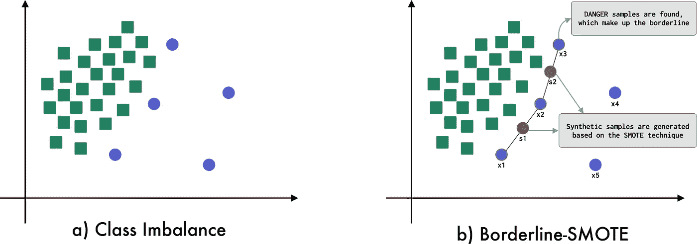

# SMOTE:表格数据的合成数据扩充

> 原文：<https://towardsdatascience.com/smote-synthetic-data-augmentation-for-tabular-data-1ce28090debc?source=collection_archive---------10----------------------->

## SMOTE 及其一些变体如 Borderline-SMOTE 和 ADASYN 的探讨

图一。SMOTE、Borderline-SMOTE 和 ADASYN 表示法|作者图片|图标取自 [freepick](https://www.freepik.com/)

当阶级之间没有平衡的分配时，就会出现**阶级不平衡**的问题。解决这种问题的直觉是向少数类添加更多的数据，以在类之间产生平衡。然而，在真实的机器学习系统中，由于问题的性质，很难获得更多的数据。因此，已经提出了各种备选方案来解决表格数据中的类别不平衡问题，例如过采样、欠采样和合成数据的生成。在这篇博客中，我们将重点关注从 **SMOTE** [ [2](https://arxiv.org/pdf/1106.1813.pdf) ]算法及其变体生成的*合成表格*数据，为此，这篇博客将分为以下几部分:

*   **什么是 SMOTE？**
*   **临界撞击**
*   **阿达辛**
*   **练习中的击打**

# 什么是 SMOTE？

*合成少数过采样技术* ( **SMOTE** 由 Nitesh V. Chawla 等人引入。到。2002 年 [2](https://arxiv.org/pdf/1106.1813.pdf) 。 **SMOTE** 是一种*过采样*技术，主要用于生成合成表格数据。 **SMOTE** 的总体思路是生成少数类的每个样本与其“ *k* ”最近邻之间的合成数据。也就是说，对于少数类样本中的每一个，定位其“ *k* ”个最近邻居(默认情况下 *k = 5* )，然后在该样本和其每个邻居生成的点对之间，生成新的合成数据。在图 2 中，您可以看到对 **SMOTE** 实现的可视化描述。

图二。SMOTE 视觉描述|作者图片

如图 2 (b)所示，考虑到最近的 3 个邻居( *x2* 、 *x3* 和 *x4* )，应用 **SMOTE** 从 *x1* 生成合成数据，生成合成数据 *s1* 、 *s2* 和 *s3* 。

虽然 **SMOTE** [ [2](https://arxiv.org/pdf/1106.1813.pdf) 是一种允许生成合成表格数据的技术，但是这种算法本身具有一些局限性。 **SMOTE** 仅适用于*连续数据*(也就是说，它不是为生成分类合成数据而设计的)，另一方面，生成的合成数据*是线性依赖的*，这会导致生成的数据存在偏差，从而产生过度拟合的模型。为此，基于 **SMOTE** 的替代方案已经被提出，旨在改进原始 **SMOTE** 技术的局限性。

让我们来看看一些最相关的变化！

# 临界 SMOTE

**Borderline-SMOTE** 是韩晖等人推出的 **SMOTE** 的变体。在。2005 年 [3](https://link.springer.com/chapter/10.1007/11538059_91) 。与最初的 SMOTE 技术不同， **Borderline-SMOTE** 专注于通过仅考虑构成划分一个类与另一个类的边界的样本来生成合成数据。也就是说，**边界平滑**检测哪些样本在类空间的边界上，并将**平滑**技术应用于这些样本。在图 3 中，您可以看到对**边界平滑**的可视化描述。

图 3。边缘平滑视觉描述|作者图片

如前图所示，被视为生成合成样本的少数类样本是边界线的一部分。**边界线-SMOTE** 的替代方案是 **SVM-SMOTE** ，它使用支持向量机来确定边界线。

# 阿达辛

*自适应合成* ( **ADASYN** )是由何海波等人提出的。艾尔。2008 年 [4](https://ieeexplore.ieee.org/document/4633969) 。 **ADASYN** 是一种基于 **SMOTE** 算法生成合成数据的技术。 **ADASYN** 和 **SMOTE** 之间的区别在于 **ADASYN** 实现了一种方法，该方法检测在由多数类支配的空间中发现的少数类样本，这是为了在少数类的较低密度区域中生成样本。也就是说， **ADASYN** 关注那些因为处于低密度区域而难以分类的少数类样本。在图 4 中，您可以看到对 **ADASYN** 的可视化描述。

图 4。ADASYN 视觉描述|作者图片

从上图中可以看出，被视为生成合成样本的样本是那些位于低密度区域的样本。一个替代 **ADASYN** 的方法是 **K-Means-SMOTE** ，它基于在少数类中发现的每个聚类的密度生成合成样本。

# 在实践中受到打击

在本节中，我们将看到使用 python 库*不平衡学习*[【1】](https://imbalanced-learn.org/stable/over_sampling.html#smote-variants)的**SMOTE**[2](https://arxiv.org/pdf/1106.1813.pdf)】实现及其变体(**Borderline-SMOTE**[[3](https://link.springer.com/chapter/10.1007/11538059_91)】和**ADASYN**[4](https://ieeexplore.ieee.org/document/4633969))。为了对这些技术进行比较，将使用 **scikit-learn** 框架的模块 *make_classification* 生成一个*不平衡数据集*。稍后，将显示与每个算法相对应的可视化效果，以及在**准确度**、**精度**、**召回**和**f1-得分**指标下对每个模型的评估。因此，让我们从数据集的生成开始。

代码片段 1。数据生成

代码片段 1 生成了一个 2000 年的样本数据集，其中只有 2 个要素和 2 个类，多数类占数据集的 95%，少数类仅占 5%。生成的数据集的可视化如图 5 所示。

图 5。阶级失衡|作者图片

得益于**不平衡学习**库， **SMOTE** 、 **Borderline-SMOTE** 和 **ADASYN** 的实现相对简单。我们只需要扩展每个所需的*过采样*算法，并为每个算法定义一些参数。每个算法的实现如代码片段 2 所示。

代码片段 2。SMOTE、Borderline-SMOTE 和 ADASYN

值得一提的是，对于该示例，定义了一些固定参数，例如要考虑的“k”个最近邻居的情况，以及确定样本何时处于*危险*的邻居数量(对于**边界-SMOTE** 的情况)。这些*超参数*将取决于数据集的大小、类别不平衡比率、少数类别中的样本数量等。

图 6、7 和 8 分别显示了 **SMOTE** 、 **Borderline-SMOTE** 和 **ADASYN** 算法的实现的可视化。

图 6。SMOTE |作者图片

图 7。作者的边界-SMOTE |图像

图 8。ADASYN |作者图片

培训和评估方法基于使用**分层 K-fold 交叉验证**技术的*逻辑回归*的实施，以保持每个 fold 中班级的平衡。“ *dummy* ”模型是指带有不平衡数据的分类器的实现。获得的结果如表 1 所示，其中每个评价指标是在交叉验证过程中获得的平均值。

表 1。结果比较

给定为该示例生成的数据集的特征，发现具有最佳结果的模型是基于 **Borderline-SMOTE** 的模型。

# 结论

在这篇博客中，我们看到 **SMOTE** 是一种基于过采样的技术，用于生成合成表格数据。同样地， **Borderline-SMOTE** 和 **ADASYN** 算法是对原始 **SMOTE** 算法的改进。

考虑到用于解决类别不平衡问题的各种技术，建议尝试各种替代方案并选择最适合您具体问题的方案，始终考虑*超参数*的调整。

# 参考

[1] [不平衡学习](https://imbalanced-learn.org/stable/over_sampling.html#smote-variants)

[2] [SMOTE:合成少数过采样技术](https://arxiv.org/pdf/1106.1813.pdf)

[3] [Borderline-SMOTE:不平衡数据集学习中一种新的过采样方法](https://link.springer.com/chapter/10.1007/11538059_91)

[4] [ADASYN:用于不平衡学习的自适应合成采样方法](https://ieeexplore.ieee.org/document/4633969)