# 具有策略梯度的 Snake 深度强化学习

> 原文：<https://towardsdatascience.com/snake-with-policy-gradients-deep-reinforcement-learning-5e6e921db054?source=collection_archive---------18----------------------->

## 策略梯度深度强化学习在蛇游戏中的应用

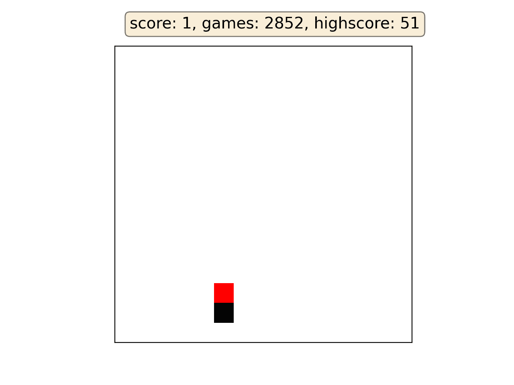

作者 GIF

# 介绍

策略梯度方法用于实现深度强化学习研究领域的最新成果。在这篇文章中，我将介绍最简单的策略梯度方法，即“强化”算法，并向您展示它在学习玩贪吃蛇游戏的任务中表现如何。我将介绍以下主题:

*   对我的设置和术语的简单介绍
*   增强算法如何工作的解释
*   玩蛇的算法结果
*   贪吃蛇游戏的 Python 代码及加固算法

# 概念

## 状态

状态𝑠(𝑡)是座席在某一时间点𝑡.的状态在我们的例子中，蛇的状态包含以下信息:

*   在一键编码中，苹果相对于蛇的方向
*   蛇当前移动的方向，采用一键编码
*   如果在蛇头(0 或 1)的正上方有一个障碍物(墙或蛇的身体)(直接意味着距离为 1)
*   如果蛇头正下方有障碍物(0 或 1)
*   如果蛇头的左边有障碍物(0 或 1)
*   如果蛇头右侧有障碍物(0 或 1)

在一键编码中，我们将整数表示为二进制向量。我们有四个方向:上(0)，下(1)，左(2)和右(3)。一键编码中的相同方向:

*   **【1，0，0，0】**为上升
*   **【0，1，0，0】**为羽绒
*   **【0，0，1，0】**为左
*   **【0，0，0，1】**为右

我们使用一次性编码，因为我们使用神经网络来估计策略函数，并且当输入在 0 和 1 之间变化时，它有利于训练。

整个状态被组织在一个列向量中。例如:苹果在蛇的上方，蛇在向下移动。蛇尾就在蛇的左边。状态向量 s(t)看起来像这样:

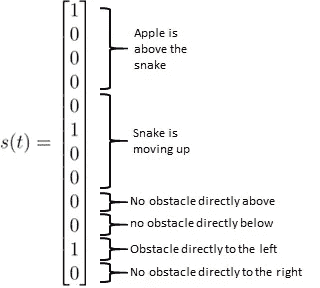

作者图片

注意，有了这个状态向量，蛇只能感知到左侧、右侧、上方和下方的障碍物。它不能感知与其位置成对角线的障碍物。

## 行动

蛇有四种可能的动作:

*   提升
*   下移
*   向左移动
*   向右移动

这意味着蛇也可以移动到自己的尾巴里:

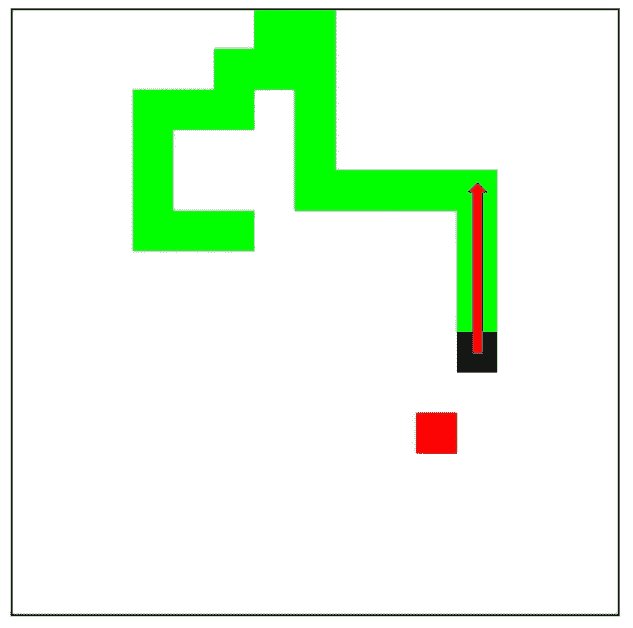

如果蛇在这种情况下向上移动，它就会死去。(图片由作者提供)

## 报酬

奖励以下列方式给予:

*   吃苹果: **+100**
*   垂死挣扎: **-10**
*   向苹果靠近: **+1**
*   远离苹果: **-1**

## 政策

该政策由𝜋.表示它输出给定状态𝑠(𝑡和参数 **𝜃** 的情况下，我们的 snake 代理采取行动的概率。在我们的例子中，参数是普通深度神经网络的权重。为了选择一个行动，我们用𝜋.给出的概率从一个离散的概率分布中取样意味着我们从来没有一个确定性的政策，以一定的概率选择次优的行动。这也确保了对代理的充分探索。学习过程应该减少不良行为的概率，增加想要的行为的概率。

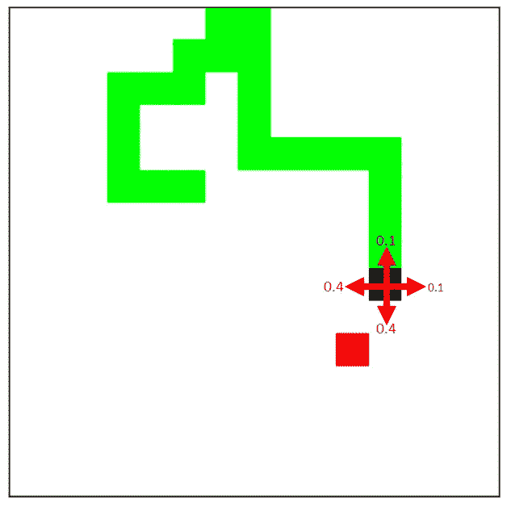

经过 100 次培训后，该政策会是什么样子

## **归来**

代理的目标是在一集里获得最大的总回报。一集就是一场比赛。在每一个时间步𝑡，我们希望最大化未来的预期总回报。起初这可能有点令人困惑。为什么不调整我们的政策，使我们的蛇在过去获得的回报最大化呢？让我们这样来看:如果我们在一个特定的时间点，我们应该执行行动，这将我们置于在未来获得最多回报的位置。

该策略在一集结束时更新。这是蛇死亡的时候。对于每一个时间步，我们知道蛇在下一个时间步得到的奖励是什么。所以我们可以定义**返回** 𝐺.它是未来奖励的贴现或未贴现的总和。在我们的例子中，我们选择引入贴现因子𝛾，因为遥远未来的回报具有不确定性。在普通政策梯度中，𝛾通常为 0.99。𝛾值为 1 意味着它是不贴现的，伽马值越低意味着我们的代理人越关注眼前的回报。

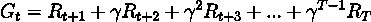

返回功能(图片由作者提供)

时间步长𝑇是这一集的最后一个时间步长。在我们的例子中，这意味着蛇死亡的时间。

## **损失**

我们使用梯度下降来训练我们的神经网络/策略函数。损失可以通过以下方式计算:

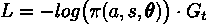

我们神经网络的损失函数(图片由作者提供)

损失是相当直观的。我们希望最大限度地提高采取高回报𝐺.行动的可能性损失前面有一个负号，这意味着我们做梯度上升。当我们针对这个损失对策略进行梯度下降时，这意味着我们在一个时间步长上增加了概率输出，如果在这个时间步长上有高回报的话。此处的对数来自于这样一个事实，即对和求偏导数比对乘法求偏导数更容易，对数将乘积转换为和。但是对数不会改变方程的平均值。

## 梯度上升

权重以下列方式更新。这与用于更新神经网络权重的算法相同，但它是梯度上升而不是下降。下面的公式是通过获取损失函数相对于我们的神经网络的权重的偏导数而获得的。在实践中，我们使用自动签名的框架，如 tensorflow 或 pytorch，因此只需要知道损失函数。

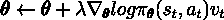

作者图片

这里，𝜆是网络的学习率。

## 伪代码

完整的算法如下面的伪代码所示。我们可以看到神经网络的权重在每一集之后都会更新

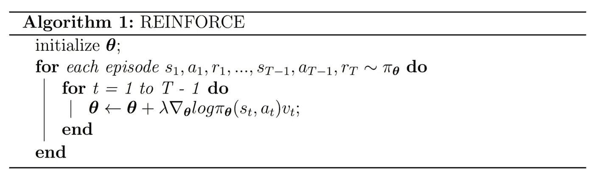

最终加固算法(图片由作者提供)

# 结果

## 10 集

代理人还没有意识到如何玩这个游戏。

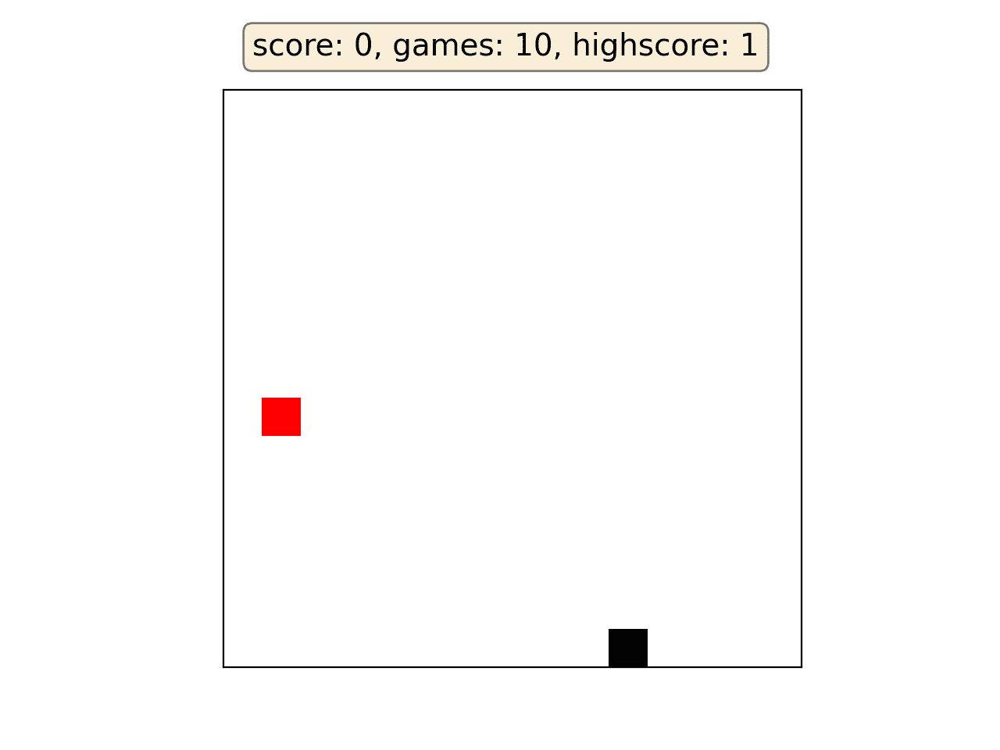

作者 GIF

## 100 集

代理人已经学会了玩这个游戏，但是仍然有一些概率代理人采取了一个次优的行动，并最终杀死了自己。

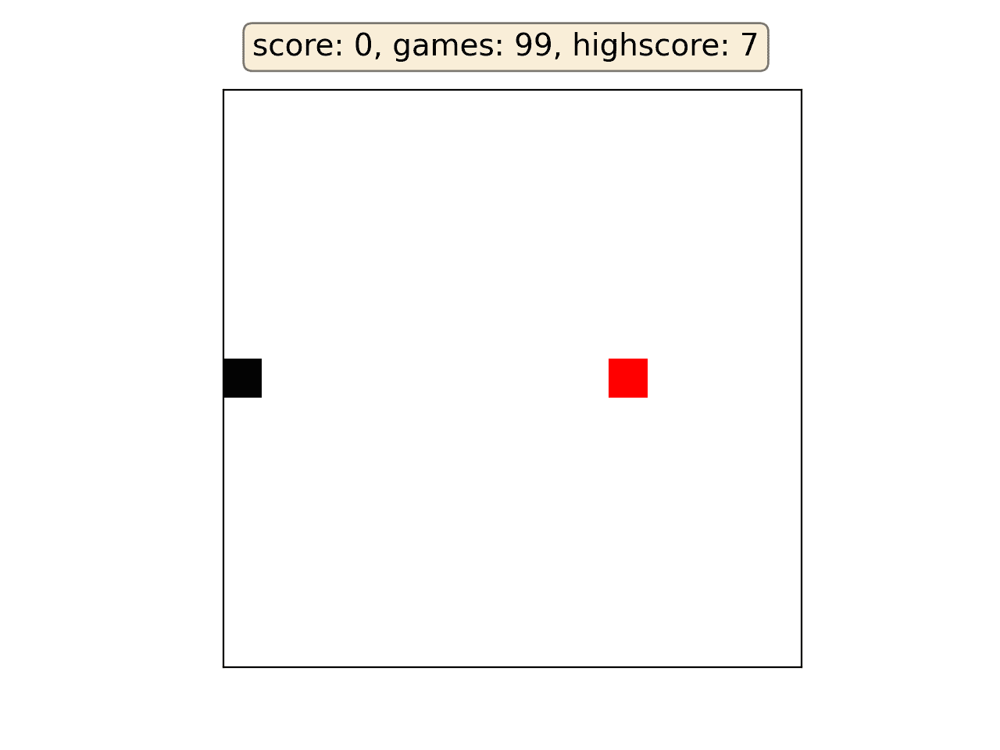

作者 GIF

## 552 集

代理玩游戏玩得很好，并取得了很高的分数。

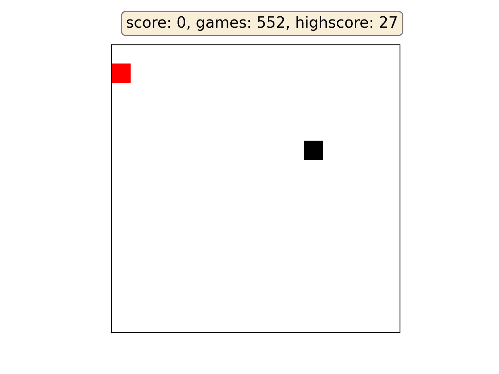

作者 GIF

## 1000 集

这个代理人设法打破了以前的高分记录。但是分数的差异非常大。

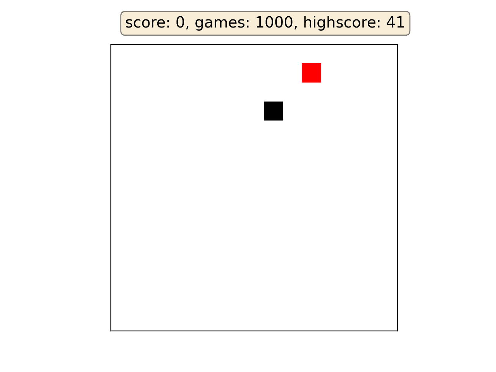

作者 GIF

在这张 GIF 图中，这条蛇以一种它几乎无法避免的方式将自己包裹在尾巴里，杀死了自己，因为它没有意识到自己的尾巴与头部位置成对角线。

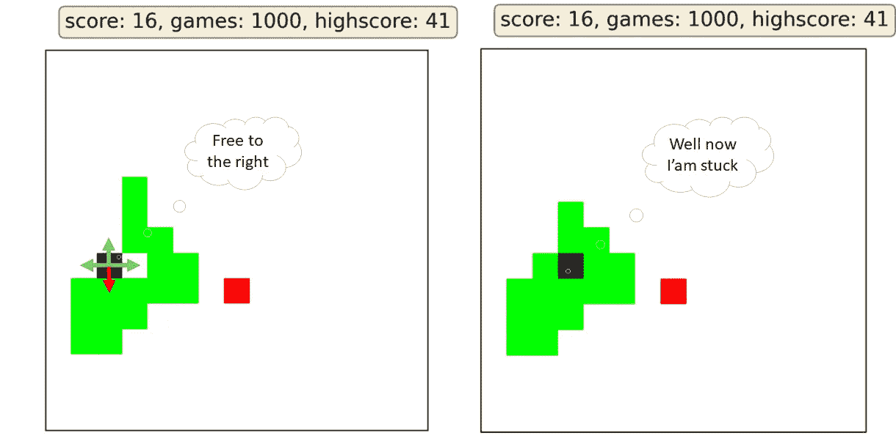

在实际场景中蛇看不到的陷阱(图片由作者提供)

如果我们在状态向量中加入对角变量的输入特性，这个问题就可以解决。

## 2852 集

2852 集之后，特工达到了整个 9000 集训练的最高分。下面的 GIF 向我们展示了贪吃蛇游戏中最难解决的问题。当蛇长得很长时，它可以用它的大身体围成一个大圈，这样它就无法逃脱了。

作者 GIF

## 总体学习曲线

下面的情节显示了蛇的分数(以吃掉的苹果为单位)与过去的剧集/游戏数的对比。请注意，蛇的表现差异如此之大，以至于我不得不用移动平均值 4 来平滑曲线，以便正确地看到趋势。

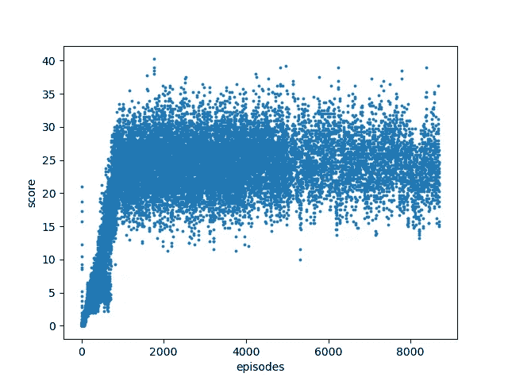

蛇分数(吃的苹果)与情节(图片由作者提供)

我们可以看到，蛇的性能在训练开始时增长非常快，但随后开始收敛到平均 25 左右。这个限制是由于蛇接收的信息不完整。

# 结论和展望

通过简单的强化算法，我们的代理可以获得大约 25 的很高的平均分数和 51 的高分，这并不坏，特别是与 Q 学习所获得的结果相比。但以下问题仍有待解决:

1.  蛇没有意识到斜对着它头部的障碍物，因此把自己困在尾巴里。

2.这条蛇没有意识到它尾巴的其余部分，因此把自己困在自己尾巴的大圈里。

这两个问题都可以通过给蛇更多的空间信息来解决。第一个问题可以简单地通过让蛇接近其头部对角线 1 个像素的障碍物来解决。第二个问题可以通过给蛇整个操场作为输入，并用卷积神经网络( **CNN** )代替香草深度神经网络来解决。

然而，给蛇提供更多的信息需要注意。我们需要更多的训练时间让蛇达到同样的平均分。我们甚至冒着蛇根本不能学习的风险，因为当使用神经网络作为我们策略函数的近似时，不能保证收敛到好的分数。

# 参考

[萨顿和巴尔托，《强化学习》](https://d1wqtxts1xzle7.cloudfront.net/54674740/Reinforcement_Learning-with-cover-page-v2.pdf?Expires=1627469113&Signature=gSkXISL5SNMjVPTrRBjKVUmxQYKDIqzRLda~e0lihxfFbPeZ1nTkucVxFPb~rfc0-VKRzFBbFmPh1J-F4AdaHNHfkx1Nft1en7A6IgpjYcC3zuCBeqqX9xJBGoQYGCmBEBBPrqYJfTGE~rOS0KJdmLVaBlVfPquJVPmuzwPvJ69muaMEh~XvO8edtFySHMfB1FDhBhvFFfNjn-7-b06fZ1IpA5hKad8DPQ5D3opRqv4HALIoB4ZJQxeTjb~b55BMPuuSqN0Nww3kh~-~bv3lESMiFM1IS7i8AqzHRS9kjJOOnfMV~muSH-RCMT781LoMLiymmGXKCMlO~Gm4gx64zQ__&Key-Pair-Id=APKAJLOHF5GGSLRBV4ZA)

[Youtube:大卫·西尔弗，“第七讲:政策梯度方法”](https://www.youtube.com/watch?v=KHZVXao4qXs&list=PLqYmG7hTraZDM-OYHWgPebj2MfCFzFObQ&index=7)

[Icalems 博客，“萨顿&巴尔托总结第 13 章——政策梯度方法”](https://lcalem.github.io/blog/2019/03/21/sutton-chap13)

# 密码

## 蛇

## 算法

# 相关文章

 [## 神经网络中的反向传播

### 从零开始的神经网络，包括数学和 python 代码

towardsdatascience.com](/backpropagation-in-neural-networks-6561e1268da8)  [## 爱因斯坦指数符号

### 爱因斯坦求和、指数符号和数值

medium.com](https://medium.com/@Vincent.Mueller/einstein-index-notation-d62d48795378) 

## 想联系支持我？

领英
[https://www.linkedin.com/in/vincent-m%C3%BCller-6b3542214/](https://www.linkedin.com/in/vincent-m%C3%BCller-6b3542214/)
脸书
[https://www.facebook.com/profile.php?id=100072095823739](https://www.facebook.com/profile.php?id=100072095823739)
推特
[https://twitter.com/Vincent02770108](https://twitter.com/Vincent02770108)
中等
[https://medium.com/@Vincent.Mueller](https://medium.com/@Vincent.Mueller)
成为中等会员并支持我(你的部分会员费直接归我)
[https://medium.com/@Vincent.Mueller/membership](https://medium.com/@Vincent.Mueller/membership)