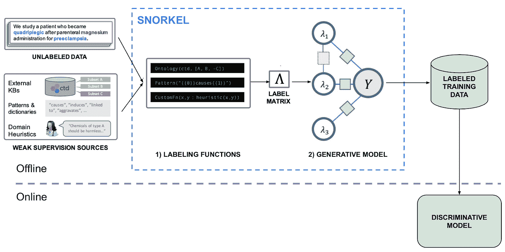
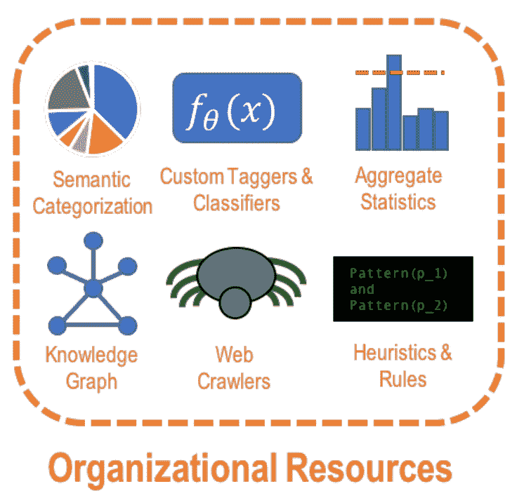
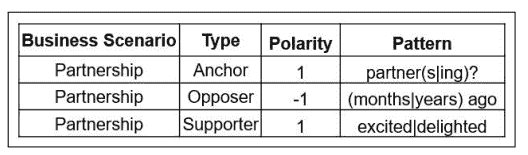
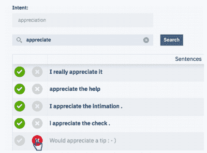
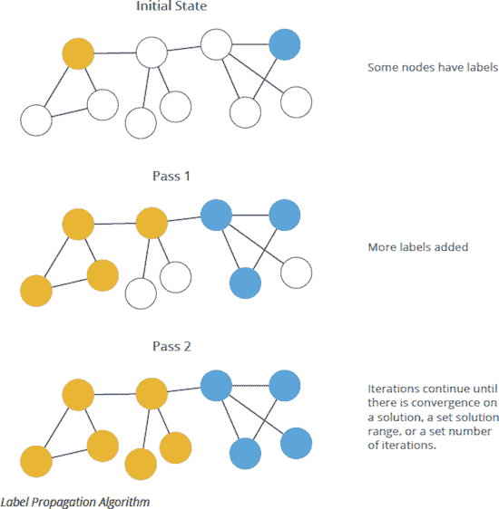
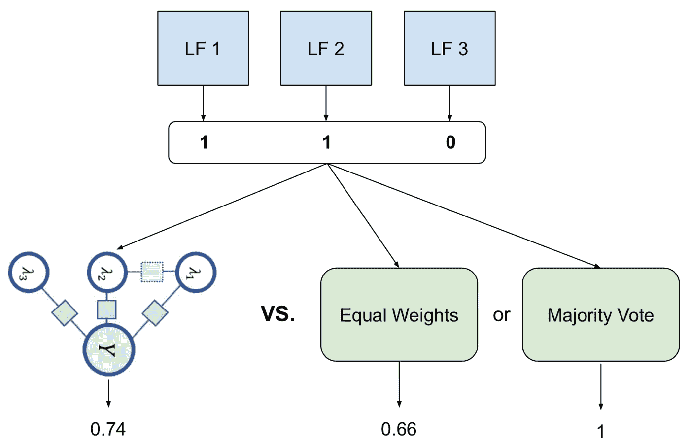
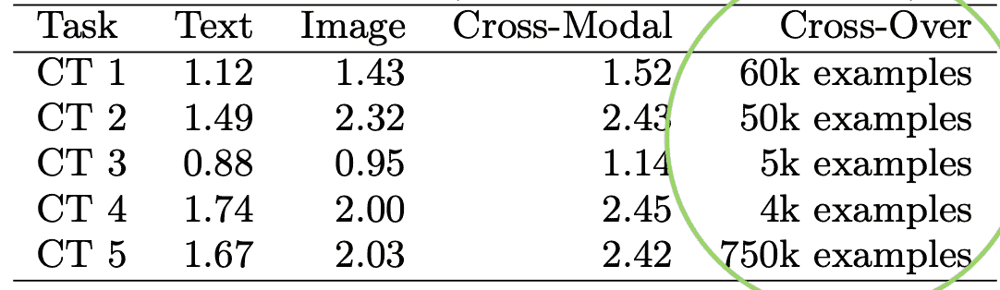

# 在野外潜泳——谷歌、英特尔、苹果和 IBM 的监管不力

> 原文：<https://towardsdatascience.com/snorkel-in-the-wild-weak-supervision-at-google-intel-apple-and-ibm-2e0d77637ee0?source=collection_archive---------10----------------------->

## [行业笔记](https://towardsdatascience.com/tagged/notes-from-industry)

## 工业中程序数据标记的综合。

由[雷蒙·克拉文斯](https://unsplash.com/@raimondklavins?utm_source=medium&utm_medium=referral)在 [Unsplash](https://unsplash.com?utm_source=medium&utm_medium=referral) 上拍摄的照片

对未标记的数据感到沮丧和冷漠？尝试浮潜来治愈你的症状！浮潜是一种承诺给你应得的标签的技术。斯坦福大学在这一领域的研究导致了他们的浮潜人工智能初创公司，该公司在 2021 年 4 月筹集了 3500 万美元的 B 轮融资。

对于许多 ML 问题，有大量的数据，但很少被标注。例如，你从哪里获得一条推文是否提到两家公司的合并或者一个产品列表是否包含非法产品的标签？解决这一问题的传统方法是人工标记，这既昂贵又缓慢。一个更快、更可扩展、有时更高效的解决方案是使用通气管。TLDR 是浮潜让你用代码生成标签，代码比人快。

浮潜虽然刺激，但不是魔术。通过研究，我对这个行业如何使用浮潜、何时合适以及它的局限性有了一个平衡的看法。这篇文章综合了来自谷歌、苹果、英特尔和 IBM 的关于浮潜的论文，提供了这项技术的细致入微的观点。

我们会掩护

1.  浮潜概述
2.  在实践中生成标记函数
3.  生成模式的语用考量
4.  什么时候浮潜，什么时候给人贴标签

# 在高空浮潜

如果你已经知道通气管是如何工作的，可以跳过这一部分。

想象一下，你经常问你的三个朋友，汉娜，魏和贾森，预测一部电影是否会火，他们的猜测比机会更好。你问过他们复仇者联盟电影，寄生虫之类的。随着时间的推移，你会知道谁会投类似的票，每个人拒绝投票的频率，甚至每个人的准确度。你利用这一知识将你朋友的投票与加权平均相结合，得到一个比任何一个人都更好的估计。简而言之就是潜水。

图 1:通气管管道。作者改编自[1]。通气管的主要部分是标签功能和生成模型。

图 1 显示了带有两个关键概念(标记功能和生成模型)的通气管管道，并进行编号。浮潜发生在离线过程中，以标记训练数据，这些数据可用于为您的 ML 任务训练判别模型。

## 标签功能(LFs)

图 1 中显示的标记函数与上例中的 Hannah、Wei 和 Jason 相似。LFs 是**段代码**，当给定一个数据点时，它们可以输出一个估计的标签或者放弃。对于二进制分类，可能的输出是{-1，0，1}，其中 0 表示放弃。

最简单的 LFs 匹配未标记输入数据中用户定义的模式，但更高级的 LFs 利用外部信号。例如，假设任务是识别称赞员工的客户电子邮件。LF 可以:

1.  使用 Python 库来检测电子邮件正文是否包含人名。
2.  如果姓名存在，请将该姓名与内部员工目录中的姓名进行匹配。
3.  在名字的三个单词内寻找像“感谢”这样的短语。

如果三个条件都满足，输出 *1* ，否则输出 *0* 弃权。LF 不会尽善尽美，但它为手头的任务提供了一些信号。因为 LFs 很吵，所以被称为“弱监管”的一种形式。

标注函数可能相关、冲突，并且覆盖数据集的不同部分。在将 LF 应用于每个未标记的数据点之后，输出是包含每个点的 LF 标记的标记矩阵。下一个组件，生成模型。负责将这些嘈杂的投票组合成一个标签。

## 生成模型

回想一下我们的电影例子，生成模型就是你，因为你综合了你朋友的数据。在没有基本事实标签的情况下，生成模型可以学习 LFs 的准确性和相关性，并且将它们组合以近似基本事实。输出是*概率*标签(在 0 和 1 之间),你可以用它来训练一个判别模型。如果下游模型支持“噪声感知”损失函数，您可以直接使用概率标签，或者您可以将标签阈值设置为 0 或 1。在[1]和[2]中有一大堆数学描述了生成模型如何以及为什么工作。

注意:通气管目前只适用于分类问题(二元和多类)。

## 等等，我不再需要标签了？

不，你仍然有。浮潜减少但并没有消除对高质量标记数据集的需求。通常，你需要一个*开发*集来生产 LFs，一个*测试*集来测试最终模型的性能。浮潜的主要优势是你的大型训练集不需要手动标记(假设你正在进行监督 ML)。

# 在实践中生成标记函数

写 LFs 并不总是容易的。这一节描述了不同的公司如何提出 LFs 来标记他们的数据集，这可以为你的问题提供思路。

## 使用组织资源的劳动力市场

图 2:图片来自[3]。谷歌 LFs 涉及的组织资源。

Google 的 LFs 大量使用组织资源，这些资源是来自 Google 其他服务或知识库的信号来源[3，4]。

谷歌如何使用组织资源的一些例子是:

*   **内部命名实体识别模型**。对于分类内容是否提及名人的任务，LF 使用该模型来检测文本中是否存在“人”实体。如果没有“人”，输出写着“没有名人”的标签。
*   **汇总统计**。对于内容审核任务，统计数据是用户因违反策略的行为而被报告的次数。
*   **可以操作文本和图像的主题模型**。尽管过于粗粒度以至于无法检测到积极的类别，但是这些模型有助于标记消极的类别。

作者描述了两类组织资源:

*   Servable:作为特性对离线 LFs 和在线模型都可用。
*   不可维护:仅适用于离线通气管管道。这些资源查询起来很慢或者很贵，就像内部知识图一样。

虽然不可观测信号仅用于标记，但它们提高了仅在*可观测*特征上训练的鉴别模型的性能。作者认为这是迁移学习的一种形式。在这些情况下，您可以使用昂贵的、不可服务的信号来改进您的模型，而不会使您的在线服务系统复杂化或变慢！

## 无代码 LFs

有时候，生成 LFs 需要一定程度的领域知识，但是那些有领域知识的人不知道如何编码。为了解决这个问题，一些公司开发了无代码接口来为 LFs 获取领域知识。

**英特尔**为产品分析师制作了一个基于电子表格的界面来表达规则[5]。任务是对一条推文是否提到与客户相关的业务场景进行分类。例如，客户是否与另一家公司建立了合作关系。

图 3:来自[5]的表格。领域专家表达 LF 规则的基于电子表格的界面。

在如图 3 所示的界面中，领域专家输入关键字或正则表达式以及“极性”,表明它是支持还是反对业务场景。在上面的例子中,“伙伴关系”和“高兴”都是伙伴关系场景的标志，但是看到“几个月前”表示负面的标签。该接口捕获领域知识，开发人员可以选择如何在 LFs 中表达这些知识。

为了给聊天机器人训练标注数据， **IBM** 构建了一个搜索界面，让用户找到符合某种意图的聊天日志[7]。构建聊天机器人涉及到检测用户的意图，比如他们是否在询问账单、试图安排约会等等。

图 4:图片来自[7]。搜索界面，查找属于某个用户意图的聊天记录。

IBM 的系统提示用户查询与“schedule”这样的意图相匹配的日志。用户输入类似“安排会议时间”的查询。系统将前 N 个结果(设置为 100)定义为邻域，但仅向用户显示 k 个结果(设置为 10)。这 10 个结果是从邻域的顶部、中部和底部采样的。然后，要求用户标记 10 个结果，每个结果是否属于意图。如果超过 60%的样本具有相同的标签，则邻域中的所有样本(所有 100 个样本)都被赋予该标签。每个邻域被认为是一个 LF。这种方法以更多噪声为代价增加了弱标签的数量。

**苹果**开发了 ui 来帮助工程师识别需要更多或更好弱标签的数据片段[6]。他们所有的任务都是基于文本的。不幸的是，这篇论文并没有详细介绍 ui 或者特定的 ML 任务。

请注意，这三个无代码 LF 生成示例是对文本数据进行操作的。与图像或视频等其他非结构化数据相比，设计操作文本的高级界面更容易。这类接口仍然是一个活跃的研究领域。

## 阶级不平衡

类别不平衡是考虑使用通气管的一个很好的动机，因为手动标记随机样本是昂贵的。如果你的正类占数据的 1%，标注 100 个随机样本只会给你一个正的标签！

一些论文讨论了类不平衡问题，其中正类的范围从数据集的 0.05%到约 10%。在某些情况下，通气管适用于处理不平衡。

对于特定的问题，编写以高精度识别正类的 LFs 比负类更容易。举个例子，识别明显形式的仇恨言论并不困难(包含亵渎、提及某些话题等)。).但是，没有脏话就意味着内容不是仇恨言论吗？你如何发现边缘病例？

如果没有标记负类和边界示例的 LFs，您将只能用明显的正示例标记数据集的一小部分。您的最终模型可能具有高精度，但是将具有低召回率，并且可能过度适合某些类型的正类。

**标签传播**

Google 通过使用一种叫做标签传播的图形算法来解决这个问题。他们有大量人类标记的数据和未标记的数据，并使用该技术将信息从标记的数据转移到未标记的数据[4]——如图 5 所示。

图 5:图片来自[8]。标签传播的可视化表示。

在论文[4]中，每个未标记的数据点得到一个分数，该分数是其邻居的标记的加权组合。权重是未标记点和标记点之间的相似性，其中相似性是 Jaccard 相似性或距离度量。如果分数超过预定阈值，LFs 则输出某个标签。这项技术有助于创建高召回率的 LFs 来补充高精度的 LFs。

对于某些任务，标签传播输出上的 LFs 显著改进了生成模型的标签。标签传播是不可服务资源的一个例子，它可以提高终端模型的性能。

**合成数据集**

英特尔为每个类别生成了平衡的合成数据集，以处理其多类别问题的类别不平衡，正类别的比率为 0.05%。对于 C 类，他们认为属于“非 C”的例子是反面例子，以及不属于任何类的例子。

## 自动低频生成

编写 LFs 可能需要领域知识，但是如果您的工程师没有这方面的专业知识怎么办？来自工程师的一个可能的答案是“让我们用代码创建 LFs”，这就是他们在 Google 的第二篇论文中所做的[4]。

他们的大多数特征是分类的，并且他们使用频繁模式挖掘来识别在一个类中比另一个类中出现更频繁的特征组合。模式是特征值(X 和 Y)的合取，类似于领域专家倾向于生成的东西。只有当一个模式在开发集上满足一定的精度和召回阈值时，它才被用于 LF。模式挖掘发生在单个特征而不是多个特征上，以减少 LFs 之间的相关性。

这种技术减少了部署通气管的时间，因为它不需要领域专家手写 LFs。此外，没有专业领域知识的工程师也可以部署管道。

## 低频考虑因素

一般来说，您的 LFs 集应该具有高精度、高召回率和高覆盖率(覆盖大部分数据)。我还没有找到最低精度、召回率和覆盖率的具体阈值，这可能取决于您的数据集。不管怎样，如果质量很重要。生成模型估计 LFs 的准确性，Google 使用这些估计来修复或删除低质量的 LFs。

假设使用高质量的 LFs，越来越多种类繁多的 LFs 通常会带来更好的性能。

在创建 LFs 时，请考虑以下问题:

1.  你可以在你的劳动力市场中使用什么样的组织/外部资源？考虑一下那些来自 [HuggingFace](https://huggingface.co/models) 或亚马逊 Sagemaker 的预训练模特。
2.  你能开发一个让非编码者指定 LFs 的接口吗？
3.  您的 LFs 是否遗漏了数据集的重要部分，如某些类型的正类、负类和边界情况？

# 生成模式的语用考量

## 生成式模型什么时候值得？

LFs 是强大的，因为它们可以给我们的数据加上弱标签。但是，什么时候我们需要生成模型来组合它们呢？新的建模管道产生了维护开销，我们必须评估成本和收益。

您应该将生成模型的结果与弱标签的简单平均值或弱标签的多数投票进行比较(图 6)。

图 6:根据简单基线评估通气管标签。作者图解。

来自浮潜 Drybell 论文[3]的表格比较了来自创成式模型的标签与来自弱标签的未加权平均值的标签(图 7)。他们在每组标签上训练了一个判别模型，并将其性能与在人类创建的标签上训练的模型进行了比较。单元格中的 100%表示与根据手动标记的数据训练的模型性能相当。

图 7:来自[3]的表格。比较生成模型标签上的区别模型性能与弱标签的平均值。分数是相对于在手工标记的数据集上训练的模型而言的。

生成模型是主题分类任务的明显胜利。但是，对于产品分类任务，该模型仅提供了对“同等权重”的轻微提升。

原始的浮潜论文[1]讨论了随着标签密度的增加，生成模型相对于多数投票的性能。**标签密度**是分配给每个数据点的弱标签的平均数(记住，LFs 可以弃权)。生成模型似乎为*中等*标签密度的体系提供了优势，并且类似于针对低和高标签密度的多数投票。原因是，当大多数示例只有一个弱标签(低标签密度)时，生成模型无法对标签重新加权。当存在高标签密度，并且你的 LFs 比机会更好时，随着标签密度的增加，多数投票快速收敛到最优解。

一个简单的平均值可能就足够解决你的问题了，你可能不需要生成模型。

## 生成模型的可伸缩性如何？

原始版本的通气管使用了一种不太可扩展的采样方法。当前的开源版本使用了一种矩阵补全方法，这种方法被认为更具可扩展性，因为它随着逻辑函数的数量而不是数据集的大小而扩展[9]。

Google 在 Tensorflow 中实现了一个比原始版本更高效的版本，并且可以以分布式方式运行。如果你有非常大的标签矩阵，看看开源版本是否能满足你的需求。如果没有，请参见[3]了解更多关于 Tensorflow 实现的详细信息。

## 我们可以使用生成模型来服务吗？

生成模型输出概率。什么时候我们应该使用它作为生产模型，而不是根据概率标签训练的判别模型？

以下是一些注意事项:

*   生成模型和判别模型在测试集上表现更好吗？
*   有没有你所有的 LFs 都弃权的例子？在这些情况下，生成模型也将弃权，这可能是不可接受的。判别模型可以学习输入数据和概率标签之间的相关性-提供比生成模型更多的覆盖范围。
*   生成模型对 LFs 的输出进行操作。你所有的 LFs 在生产中都是可服务的吗？它们满足您的服务 SLA 吗？
*   如果您有调用其他服务、执行复杂操作等的复杂 LFs。，将其置于在线生产环境中的部署成本是多少？也许更简单的方法是将 LFs 放在离线管道中，并部署一个可以在易于计算的特性上运行的模型。

# 什么时候浮潜，什么时候给人贴标签？

通常情况下，浮潜生成的标签与人工生成的标签相比较，浮潜被认为更好，因为它:

*   **伸缩性更好。**代码比人快，有时候人类的标注管道慢到不符合解决方案要求。
*   **产生更好的模型**(有时)。
*   **更敏捷。**可以响应标签定义的变化。例如，业务决定将电动滑板车纳入“运动器材”类别，产品分类模型需要更新标签。有了通气管，开发人员可以修改现有的 LFs 并触发通气管管道来获得更新的标签。有了人的标签，适应会更慢。

这些都是选择通气管的好理由，但重要的是要知道通常有一个“交叉点”——人类标签的例子数量，在这个数量上，用人类标签训练的模型优于用通气管标签训练的模型。

图 7:来自[4]的表格，作者添加的绿色圆圈。五种不同分类任务的交叉点。

从图 7 可以看出，不同分类任务的交叉点从 4K 到 750K 人工生成的标签不等[4]。没有收集到足够的人类标签，你不会知道交叉点，但尝试找出答案是有用的。可能门槛低，人标是比浮潜更好的解决方案。或者，也许你选择使用通气管，直到你有足够的标签到达交叉点。

在英特尔的论文[5]中，在三分之二的分类任务中，基于规则加上人工标记的管道比 plus 做得更好。作者说，人在回路管道是不可行的，因为它强加了 10 天的评分潜伏期，而且维护费用昂贵。因此，他们将通气管模型与全监督模型进行比较。无论如何，速度较慢但性能更好的人工标记管道可能更好地满足您的业务需求。

最后，对于标签较差的设置，有比通气管和人工注释器更多的选择。主动学习和半监督学习是可以探索的其他方法。

# 最后

高质量的训练数据是至关重要的资产，因为对 ML 的另外两个要求，计算资源和建模工具，正在商品化。尤金·卫的这篇出色的[文章认为，抖音的成功是因为其高质量的标签，而不是它的模型。](https://www.eugenewei.com/blog/2020/9/18/seeing-like-an-algorithm)

潜泳可以帮助你有计划地提高你的关键资产，但也有警告。首先，您仍然需要有代表性的、不带偏见的带有“黄金”标签的开发和测试数据集。为了帮助评估浮潜是否适合你:

*   确定 LF 方法对您的问题是否有意义。参见上面的 LF 注意事项。
*   将创成式模型标签与更简单的基线进行比较。
*   决定你是否需要一个有区别的终端模型。
*   最后，将通气管管道与带有人工贴标机的简单管道进行比较。

# 参考

[1] Ratner，Alexander，等，“浮潜:在弱监督下的快速训练数据创建”VLDB 基金会会议录，第 11 卷，第 3 期，2017 年，第 269-82 页。Crossref，doi:10.14778/3157794.3157797。

[2]克里斯托弗·雷；丹尼尔·塞尔萨姆；吴，森；德·萨·克里斯托弗；亚历山大·拉特纳(2016 年 5 月 25 日)。“数据编程:快速创建大型训练集”。[arXiv](https://en.wikipedia.org/wiki/ArXiv_(identifier)):[1605.07723 v3](https://arxiv.org/abs/1605.07723v3)

[3]巴赫、斯蒂芬·h .等人，《通气管干铃》*2019 数据管理国际会议论文集*，2019。交叉引用，doi:10.1145/32994036。

[4] Suri，Sahaana 等人，“利用组织资源使模型适应新的数据形式。”*VLDB 基金会会议录*，第 13 卷，第 12 期，2020 年，第 3396–410 页。Crossref ，doi:10.14778/341588 . 34153535346

[5] Bringer，Eran 等，“鱼鹰:没有代码的不平衡提取问题的弱监督”*第三届端到端机器学习数据管理国际研讨会论文集— DEEM'19* ，2019。Crossref ，doi:10.1145/33232533246

[6] Christopher Ré，Feng Niu，Pallavi Gudipati，Charles Srisuwananukorn:《Overton:一个用于监控和改进机器学习产品的数据系统》，2019 年；http://arxiv.org/abs/1909.05372

[7] Mallinar，Neil，等人，“在弱监督下引导对话代理”*人工智能 AAAI 会议论文集*，2019 年第 33 卷，第 9528–33 页。*交叉引用*，doi:10.1609/aaai . v33i 01.33019528。

[8]李约瑟，马克。" Neo4j 中的图形算法:标签传播."*Dzone.Com*，2019 年 3 月 8 日，dzone . com/articles/graph-algorithms-in-neo4j-label-propagation。

[9]潜水队。"介绍新的通气管。"*通气管*，2019 年 8 月 14 日，[www . snoop . org/blog/hello-world-v-0-9 #升级-贴标-管道。](http://www.snorkel.org/blog/hello-world-v-0-9#upgraded-labeling-pipeline.)