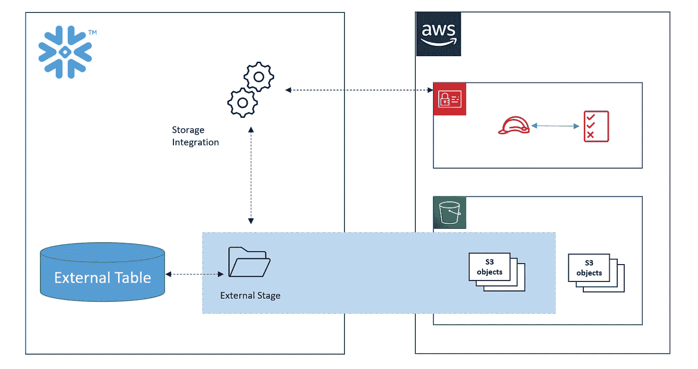
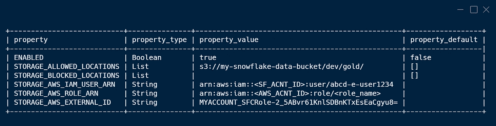

# 雪花 S3 集成

> 原文：<https://towardsdatascience.com/snowflake-s3-integration-911bd4b03739?source=collection_archive---------16----------------------->


凯利·西克玛在 [Unsplash](https://unsplash.com/s/photos/snowflake?utm_source=unsplash&utm_medium=referral&utm_content=creditCopyText) 上的照片

## 访问存储在 S3 的文件，作为雪花中的常规表

雪花集成对象使我们能够从雪花与外部系统连接。在我的[上一篇博客](/aws-lambda-integration-with-snowflake-426debc9ec3a)中，我们讲述了如何创建 API 集成来调用 AWS Lambda。在这个博客中，我们将看到如何集成 AWS S3，以便我们可以访问存储的数据，并在雪花中查询它。



作者图片

# 实施细节

## AWS IAM 角色

为了让雪花能够与我们的 AWS 帐户对话，我们需要添加交叉帐户角色。该角色将由雪花帐户中的 IAM 身份承担，并在我们的 AWS 帐户中执行操作。

*   在您的 AWS 帐户中创建一个**跨帐户 IAM 角色**。放一个虚拟账户，我们稍后会更新信任政策。
*   将一个**内联策略**附加到上面创建的角色。

```
Version: '2012-10-17'
Statement:
- Effect: Allow
  Action:
  - s3:GetObject
  - s3:GetObjectVersion
  Resource: arn:aws:s3:::my-snowflake-data-bucket/dev/gold/*
- Effect: Allow
  Action: s3:ListBucket
  Resource: arn:aws:s3:::my-snowflake-data-bucket
```

上述策略允许角色在前缀下访问 S3 存储桶。出于安全考虑，只添加雪花所需的最低访问权限。

## 雪花集成对象

*   创建一个**存储集成对象**

```
create or replace storage integration my_s3_int_01
  type = external_stage
  storage_provider = s3
  enabled = true
  storage_aws_role_arn = '<IAM_ROLE_ARN>'
  storage_allowed_locations = ('s3://my-snowflake-data-bucket/dev/gold/');
```

上述命令在雪花中运行时会创建一个 S3 集成对象。此对象在雪花帐户中创建 IAM 标识。AWS 帐户中的所有 API 操作将由该用户通过承担我们在 **storage_aws_role_arn** 中提到的角色来执行。

如上所述，集成对象创建用户和外部身份。我们需要这些来增加 AWS 和雪花帐户之间的信任关系。为此，我们描述刚刚创建的集成对象，并记下**存储 _ AWS _ IAM _ 用户 _ARN** & **存储 _ AWS _ 外部 _ID** 的值

```
describe integration my_s3_int_01;
```

输出:



作者图片

一旦我们有了用户和外部身份，我们就更新在第一步中创建的角色的**信任关系**。在条件下，在主体&存储 _ AWS _ 外部 _ID 中添加存储 _ AWS _ IAM _ 用户 _ARN 的值

```
Version: '2012-10-17'
Statement:
- Effect: Allow
  Principal:
    AWS: "<STORAGE_AWS_IAM_USER_ARN>"
  Action: sts:AssumeRole
  Condition:
    ForAnyValue:StringLike:
      sts:ExternalId:
      - "<STORAGE_AWS_EXTERNAL_ID>"
```

我们需要将存储在 S3 存储桶中的文件中的任何特殊格式告诉雪花。这是唯一需要我们雪花提供的文件格式是不够的。

*   (可选)创建文件格式

```
CREATE OR REPLACE FILE FORMAT my_csv_format_01
  TYPE = CSV
  FIELD_OPTIONALLY_ENCLOSED_BY='"'
```

## 雪花外部阶段

一旦我们完成了访问和格式设置，我们就创建了 stage。Stage 存储外部文件的元数据，在我们的例子中是 s3。这用于查找需要加载到雪花表格中的数据。我们已经创建了一个简单的阶段，您也可以看看其他选项，如加密。

*   创建**外部阶段**

```
create  or replace stage my_s3_stage_01
  storage_integration = my_s3_int_01
  url = 's3://my-snowflake-data-bucket/dev/gold/'
  file_format = my_csv_format_01;
```

上面的命令创建了雪花和 S3 文件前缀之间的映射。它还告诉雪花使用一种文件格式，适合存储在 S3 的数据。

*   创建**外部表**

```
create or replace external table ext_ccfinput_test_01
  with location = @my_s3_stage_01/
  auto_refresh = true
  file_format = (type = CSV)
  pattern='.*ganalytics.*[.]csv';describe stage my_s3_stage_01;
```

类似于 stage 存储在哪里可以找到数据的信息，外部表**存储文件级元数据，**比如文件名、版本标识符和相关属性。这增加了一个抽象，允许我们像在雪花中一样查询数据。

## 检查结果

现在我们准备在雪花中查询来自 S3 的数据。我们在创建的表上发出 select 语句。

```
select t.$1, t.$2, t.$3, t.$4, t.$5, t.$6 from @my_s3_stage_01 as t;
```

瞧，我们得到了与 s3 数据文件内容一致的结果。

在这篇博客中，我们看到了如何从 snowflake 访问和查询存储在 S3 的数据。

雪花快乐！！