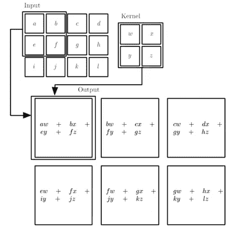

# 那么……人工智能到底是如何被用来探测新冠肺炎的呢？

> 原文：<https://towardsdatascience.com/so-how-exactly-is-ai-being-used-to-detect-covid-19-d0dff155881f?source=collection_archive---------26----------------------->

## D 揭秘深度学习背后的数学&卷积神经网络(CNN)

人工智能已经成为近年来热烈讨论的话题，它有可能彻底改变我们生活的方方面面，从医疗保健、教育，甚至加强边境安全。当谈到人工智能时，我们许多人都会想到机器学习，这是人工智能的一个子集，它允许计算机系统随着经验和数据的增加而改进[【1】](#_ftn1)。出现了许多关于使用机器学习来帮助对抗新冠肺炎的报告，包括从业者如何通过分析胸部 x 光片使用深度学习来检测和诊断新冠肺炎。

深度学习如何用于使用胸部 X 射线诊断新冠肺炎的概述(图片由作者提供)

我相信我们很多人都对这种算法背后的数学很好奇——数学是如何影响这些算法的，以及如何操纵数学系统产生如此惊人的结果，堪比探测新冠肺炎？

虽然围绕深度学习的数学术语，如“梯度下降”、“反向传播”、“矩阵乘法”等乍一看可能听起来很吓人，但不要担心！我们将通过首先解释每个深度学习任务的目标并引入包括权重初始化、激活函数、通过梯度下降和反向传播最小化损失以允许神经网络学习的概念来分解这些术语。

然后，我们将涵盖卷积神经网络(CNN)的细节——深入研究各个层(卷积层、池层和全连接层)，并将它们结合在一起，最终导致成功的新冠肺炎诊断。

如果数学符号让你害怕，不要担心。你不需要理解每一行是什么意思；只要跟着文本走，希望在这篇文章结束时，你会更好地了解这些看似不同的数学概念是如何结合在一起驱动深度学习并实现新冠肺炎的检测的！

AI，ML & DL 的比较。图片取自[https://commons.wikimedia.org/wiki/File:AI-ML-DL.svg](https://commons.wikimedia.org/wiki/File:AI-ML-DL.svg)

# 深度学习的数学概述

深度学习的目标是近似某个函数 *f** 其中*y = f *(***X****)*将一个输入 ***X*** 映射到一个类别 *y* 。我们通常将输入定义为向量***x***∈ℝ*ⁿ*，其中向量的每个条目 *xᵢ* 代表一个特定的特征。例如，图像的特征通常是图像中像素的值。训练时，神经网络定义了一个映射*y = f(****X****；****W****)*并且学习参数 ***W*** 的值，该值导致 *f** 的最佳近似。输出 *y* 将为 0 或 1，代表患者是新冠肺炎阴性(0)还是阳性(1)， *y* ∈ {0，1}。*

为了学习这种映射，我们首先通过神经元传播信息，神经元是神经网络的基本构件。这些输入 *x₁* ， *x₂* ，… *xₙ* 中的每一个都将用相应的权重 *w₁* ， *w₂* ，… *wₙ* 其中***w***∈ℝ*ⁿ*。 ***X*** 和 ***W*** 的点积然后通过非线性激活函数 *g* ，产生预测输出 *ŷ* 。除了 ***X*** 之外，还有一个偏置项 *w₀* ，它允许我们将激活功能向左或向右移动，而与输入无关。

把这些放在一起，

作者图片

一个等价的概括表示是

作者图片

因此，深度学习的目标是找到权重的最优集合*，这将产生映射*y = f(****X；W*** *)* 最接近 *f** 。*

**

*投入和权重产生产出 *ŷ.图片取自*[https://cs.gmu.edu/~kosecka/cs747/03_linear.pdf](https://cs.gmu.edu/~kosecka/cs747/03_linear.pdf)*

## *激活功能*

*我们应用非线性激活函数，因为***x***ᵀ***w***不在 0 和 1 之间。因此，我们使用 sigmoid 函数将实数转换为 0 到 1 之间的标量输出。缩放后， *y* 将被定义为:*

**

*作者图片*

**

*乙状结肠激活功能。图片取自[https://commons . wikimedia . org/wiki/File:Sigmoid-function-2 . SVG](https://commons.wikimedia.org/wiki/File:Sigmoid-function-2.svg)*

*激活函数的另一个目的是将非线性引入网络。这一点很重要，因为在现实生活中，我们遇到的大多数数据都是非线性的，也就是说，它们不能用一条直线分开。因此，激活函数允许 ***X*** 和 *y* 之间的非线性映射，其更好地逼近 *f** 。*

**

*激活函数将非线性引入网络。亚历山大·阿米尼和艾娃·索莱马尼。S191: [深度学习介绍](http://IntroToDeepLearning.com)*

*一些常用的激活函数包括 sigmoid、tanh、ReLU，它们都用于将非线性引入网络。*

**

*常用的激活函数。图片取自 Sze，Vivienne 等人的《深度神经网络的有效处理:教程和调查》IEEE 会议录 105.12(2017):2295–2329。*

## *最小化损失*

*在为特定输入 *x* ⁽ᶦ⁾和**t30】wt32】计算出 *y* 之后，如何找到最优映射 *f* ？这就是“学习”部分的由来。首先，当网络出错时，我们必须告诉它。这是通过量化误差(称为损失)来完成的，通过采用预测 *y* 并将其与真实答案*f *(***X****)*进行比较。经验损失，*J(****W****)*，测量由 n 个样本组成的整个数据集的平均损失。****

**

*作者图片*

*因此,“学习”的目标是找到最佳权重 ***W*** *，这将产生最小的损失，从而得到最接近的 *f** 。*

**

*作者图片*

## *梯度下降*

*在训练开始时，我们首先随机初始化权重。为了向最小损失移动，我们计算相对于每个重量的损失梯度，以理解最大上升的方向。有了这些信息，我们就可以向梯度的相反方向迈出一步，向损耗较低的点移动。然后我们重复这个过程，直到我们收敛到局部最小值。*

**

*梯度下降算法。亚历山大·阿米尼和艾娃·索莱马尼
麻省理工学院。S191: [深度学习介绍](http://IntroToDeepLearning.com)*

**

*图解梯度下降。图片取自[https://commons . wikimedia . org/wiki/File:Gradient _ descent . gif](https://commons.wikimedia.org/wiki/File:Gradient_descent.gif)*

*实际上，神经网络将包括一个以上的神经元。正是多个神经元的组合使得神经网络如此强大。*

*那么我们如何通过多个神经元计算梯度呢？通过使用链式法则的反向传播！*

## *反向传播*

*以两个神经元依次排列的神经网络为例， *x* 和 *z₁* 分别对应权重 *w₁* 和 *w₂* 。*

**

*两层神经网络。亚历山大·阿米尼和艾娃·索莱马尼
麻省理工学院 6。S191: [深度学习介绍](http://IntroToDeepLearning.com)*

*如果我们稍微改变 *w₂* ，就会改变 *ŷ* 的输出。为了计算梯度，我们应用链式法则:*

**

*作者图片*

*如果我们改为改变 w₁，那么我们将执行以下操作:*

**

*作者图片*

*对于更深层次的神经网络，我们随后从输出到输入连续应用链式法则来计算梯度，并量化权重的变化如何影响损失。*

*计算完梯度后，我们如何决定在梯度的反方向上走多大的一步？那是由学习率 *n* 决定的。设置学习率在训练神经网络中是极其重要的，因为小的学习率会收敛得非常慢，并且可能陷入错误的局部极小值，而大的学习率可能过冲并且永远不会收敛。因此，我们不使用固定的学习速率，而是使用自适应学习速率，该自适应学习速率根据包括学习进行得多快、特定权重的大小等因素来“适应”损失情况。*

**

*学习率对训练的影响。图片摘自 Krittanawong，Chayakrit 等人的《心血管医学的深度学习:实用入门》。*欧洲心脏杂志*40.25(2019):2058–2073。*

# ***卷积神经网络***

*我们现在已经完成了对神经网络中如何进行训练的概述。接下来，让我们将注意力转移到我们如何准确地使用深度学习从 X 射线胸部扫描中诊断新冠肺炎。*

*当处理像 X 射线扫描这样的图像数据时，将输入的 ***X*** 视为大小为 *b* x *h* 的矩阵会更好，因为这就是一幅图像如何呈现给计算机的——作为一个二维数字矩阵。如果我们将 ***X*** 作为像素值的向量(一维)传递，我们将丢失原始图片中所有可用的空间信息。因此，我们将神经网络的原始架构调整为卷积神经网络(CNN ),其保留空间结构作为输入。这是通过将输入图像的小块连接到每个神经元，使得每个神经元仅连接到输入的一个区域来实现的。输入图像经历几个卷积层，这些卷积层首先包括卷积运算，接着是激活函数，最后是汇集运算，所有这些将在下面详细描述。*

**

*卷积神经网络概述(图片由作者提供)*

## *卷积层*

*首先，将一个内核滑过尺寸为 *b* x *h* 的输入图像。内核是大小为 *bₖ* x *hₖ* (其中*bₖ*t22】b 和*hₖ*<t26】h 的矩阵，其中包含权重*w，从而大小为 *bₖ* x *hₖ* 的内核将具有*bₖ*x 我们将这个相同的内核应用到输入中的每个 *bₖ* x *hₖ* 面片，从左上角开始，通过滑动窗口移动到下一个面片。**

****

**2x2 内核(粉红色)滑过 4x4 输入图像(浅绿色)，产生 3x3 输出图像(深绿色)。图片取自[https://commons . wikimedia . org/wiki/File:Valid-padding-convolution . gif](https://commons.wikimedia.org/wiki/File:Valid-padding-convolution.gif)**

**内核从图像中提取特征，这些特征可以通知网络关于患者的诊断。这些特征是通过卷积运算提取的，卷积运算包括将滤波器中的每个像素与输入图像的 *bₖ* x *hₖ* 片进行逐元素相乘。然后，我们对每个滑动动作的所有值求和，以获得该层的输出。经过卷积的图像被称为特征图。**

****

**与大小为 4×3 的输入图像和大小为 2×2 的内核进行卷积运算，以产生大小为 3×2 的特征图。图片来自印第安纳州古德费勒、纽约州本吉奥和亚利桑那州库维尔(2016)。*深度学习*。麻省理工出版社。**

****

**与大小为 6x6 的输入图像和大小为 3x3 的内核进行卷积运算，以产生大小为 6x6 的特征图。图片取自[https://commons . wikimedia . org/wiki/File:2D _ 卷积 _ 动画. gif](https://commons.wikimedia.org/wiki/File:2D_Convolution_Animation.gif)**

**不同的核包含不同的权重集，因此使用多个核，可以从图像中提取不同的特征。如果将 *k* 个核应用于图像，那么得到的特征图的大小将是 *b* x *h* x *k* 。这些特征可以包括锐边、曲线、纹理等等。神经网络之所以如此强大，是因为这些特征不是人类硬编码的。相反，通过反向传播的训练过程来减少损失，神经网络找到每个核的最佳权重，并因此提取对诊断患者最重要的特征。**

## **汇集层**

**在卷积操作之后，特征图然后通过激活函数。利用非线性输出，特征图然后经历汇集，这减小了图像的大小。这背后的动机是使神经网络能够学习对输入的小平移不变的特征。这一点很重要，因为不是所有的 X 射线扫描都可以在相同的方向上进行。拍摄 X 射线时患者位置的微小差异，甚至不同扫描仪之间存在的微小差异都可能导致扫描结果略有不同。因此，池允许神经网络对这些微小的差异保持不变，从而允许它更适用于更大范围的扫描。这是通过只保留图像特定部分中的最大值来实现的，称为 maxpooling。以尺寸为 4×4 的输入图像为例。在图像的每个 2x2 小块中，最大值(粗体)将构成新的特征图，如下所示:**

****

**作者图片**

**这允许不变性，因为如果图像被稍微平移，最大值将保持近似恒定。**

**例如，在下图中，尽管所有像素都向右移动了一个单位，使得新图像与初始图像相差四个值，但 maxpooling 后生成的图层仅相差一个值(斜体)。**

****

**作者图片**

## **全连接层**

**在执行 maxpooling 之后，最后一个阶段是将特征图连接到由多个神经元组成的全连接层。卷积层(卷积、激活、汇集)提供从图像中提取的有意义且不变的特征，最终的全连接层学习非线性函数，该函数将提取的特征映射到 *y* ，即患者的诊断。经过多个卷积层后的最终特征图，比如大小为 *b1* x *h1* x *k* ，将被展平为一维特征向量**I**∈ℝ*ᵇ*ˡ*ˣ*ʰ*ˡ*ˣ*ᵏ*，类似于 ***X* ***I*** 会有自己的一组对应的权重，我们计算 ***I*** 和 ***W*** 的点积，后面跟着一个非线性激活函数，产生最终的预测 *y* 。******

****

**卷积神经网络的架构(图片由作者提供)**

**通过这种改进的架构，模型然后利用梯度下降进行学习，并且通过该过程，我们将有希望获得以高精度对 X 射线扫描进行分类的模型。**

# **结论**

**所以你有它！我已经为你提供了这些新冠肺炎分类系统背后的数学的高层次概述。希望你已经学了一点，并会继续深入探索这些概念！**

**在此期间，让我们都保持安全和健康~**

## **参考**

**[【1】](#_ftnref1)古德费勒，I .，本吉奥，y .&库维尔，A. (2016)。*深度学习*。麻省理工出版社。**

**<#_ftnref2>*【陈海燕】【金东光】&【林】【2020】。深度学习结核病分类器对新冠肺炎胸片的可推广性:旧算法的新招？。*胸部影像杂志*， *35* (4)，W102-W104。***