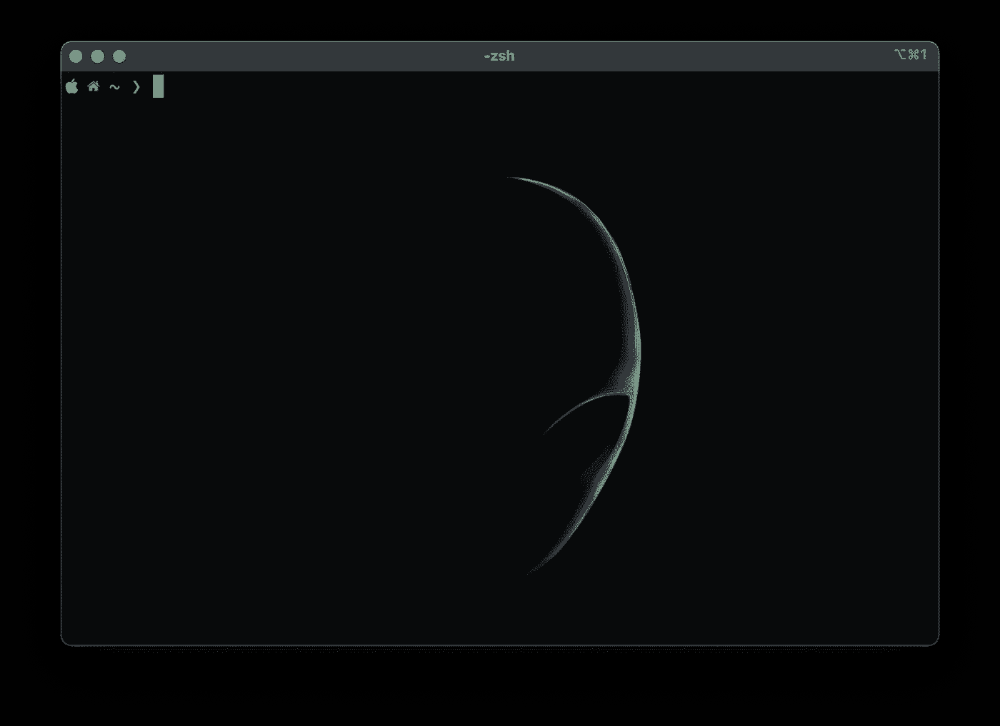
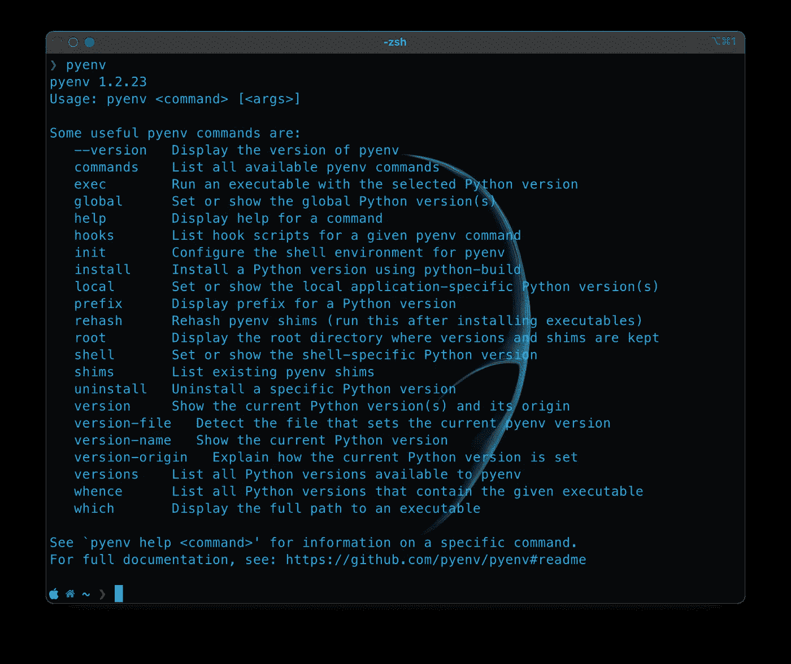
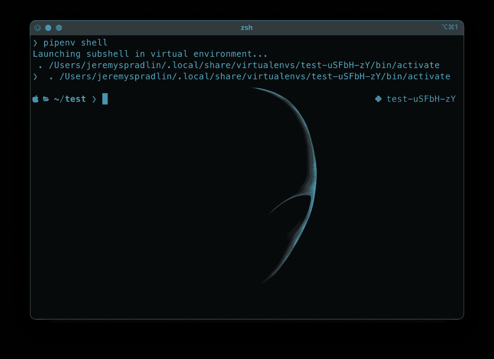
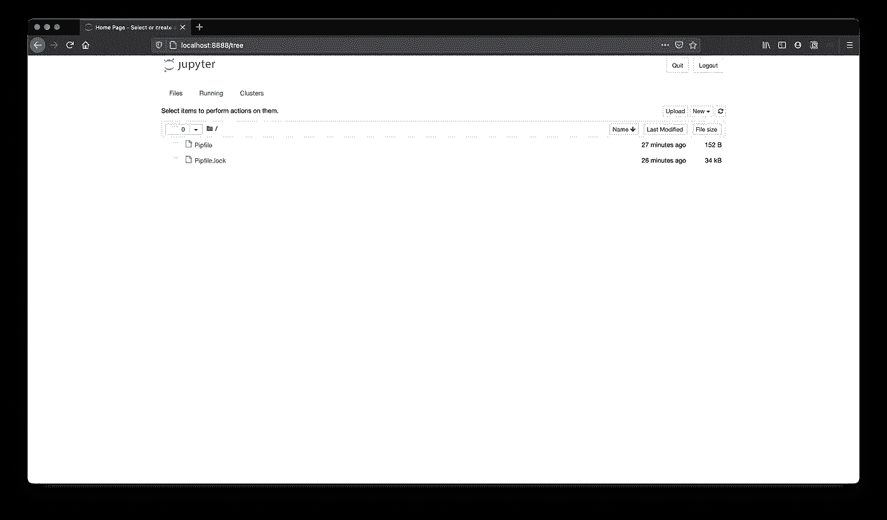
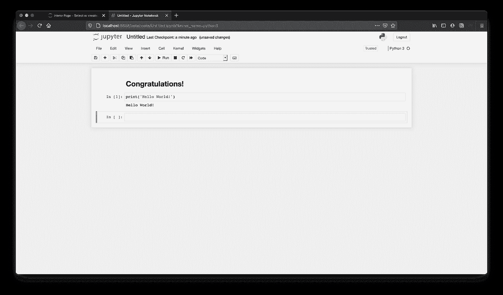

# 你想学数据科学？

> 原文：<https://towardsdatascience.com/so-you-wanna-data-science-eb9bd4b048b8?source=collection_archive---------21----------------------->

## 新手指南，有兴趣了解当今最热门的技术话题之一


大卫·普帕扎在 [Unsplash](https://unsplash.com?utm_source=medium&utm_medium=referral) 上的照片

你在那里！是的，你！我听说你想看看镇上所有酷孩子都在谈论的一些新东西——一些数据科学。你可能听说过一些，这些数据奇才用黑盒来解开宇宙的秘密。你可能想知道的唯一问题是你从哪里开始？

就在这里。当我们完成这篇短文时，我们将设置和配置一个本地 Python 虚拟环境，准备好进行您可以处理的所有数据科学工作(至少对于入门来说)。任何新尝试的第一步都是了解你将要工作的环境，或者视情况而定，虚拟环境，但我们稍后会回到这一点。首先让我们来看看最可怕的努力是从计算机的终端开始的。

## 终点站

终端、命令行、外壳；这些小窗口允许我们以任何有意义的方式向计算机编写和发送指令，对于那些不太熟悉它们的人来说，这些小窗口可能看起来很可怕，然而，只要有一点耐心和练习，不需要很长时间就可以完成基本操作。所有主要的操作系统都会有一个终端程序。(的确，有些操作系统只是一个终端)对于那些完全不熟悉终端的人来说，你可以在这里阅读一个速成班[。](https://code.tutsplus.com/tutorials/command-line-basics-and-useful-tricks-with-the-terminal--cms-29356)

我将在我的 MacBook Pro 上使用一个名为 [iTerm2](https://iterm2.com/) 的终端程序。我还使用了 [Powerlevel10k](https://github.com/romkatv/powerlevel10k) ，这是一个 ZSH 主题，以其灵活性和定制选项而闻名。对于新手来说，定制你的终端可能是一个令人生畏的过程，所以如果你是新手，就不要担心那些花里胡哨的东西。您可以使用操作系统附带的基本终端程序。



作者照片

## 包管理器

对于刚接触终端环境的人来说，这听起来可能是一个令人畏惧的话题，但我保证这里不会太糟糕。可以把包管理器想象成一个可以让你访问其他程序的程序。在 MacOS 上，这将是自制的。你可以从他们的[主页](https://brew.sh/)找到如何安装它的说明。

安装完成后，需要安装 PyEnv，这是一个安装不同版本 python 的软件工具。最好将 PyEnv 想象成一个 Python 版本管理器，允许您在系统上同时安装不同的版本。这很重要，因为在开发和编写代码时，不同的项目将需要不同版本的 Python。

```
brew install pyenv
```

这会让很多事情发生。如果你注意的话，你会看到当家酿啤酒打开酒桶，倒酒，以及其他各种恶作剧时，你的终端上会闪过很多饮酒的引用，直到聚会最终结束，你会再次看着你的光标。通过以下测试确保 pyenv 安装正确:

```
pyenv
```

假设到目前为止一切顺利，您应该会看到下面的输出，其中提供了有关使用 pyenv 的信息。



作者图片

如果这是你第一次使用终端，恭喜你！现在，您已经在命令行中安装了第一个软件工具！PyEnv 很棒，因为它允许用户(也就是你)在同一个系统上安装和管理不同版本的 python。通常从这里开始，您将继续安装 python 版本，但我们现在可以跳过这一部分，因为如果您的系统上还没有安装最新版本，我们的下一个工具将安装最新版本。

现在让我们继续安装另一个包 pipenv，这是一个帮助我们创建 python 环境的工具！

```
brew install pipenv 
```

我们现在准备创建我们的第一个 python 环境，并做一些我们一直听说的数据科学。

## Python 环境

当我第一次学习如何用 Python 编程时，最大的挑战之一是学习如何处理这些被称为虚拟环境的东西。教程经常会掩盖这个话题，如果他们提到的话，我发现这很容易引起更多的混乱。虚拟环境实际上是一个非常简单的概念。它们只是一个软件创建的虚拟环境，允许您为您正在处理的每个 python 项目安装不同的 python 包。简单吧？不要担心，对于那些对 Python 完全陌生的人来说，有更简单的方法来考虑这个问题，他们可能不能 100%确定我们在谈论什么。

可以把 Python 虚拟环境想象成一个盒子，你可以把你的项目放在里面，这样无论你在盒子里面安装什么软件包，它们都不会干扰盒子外面的任何东西。这使得我们可以在不同的机器上同时处理不同的项目，这些项目具有不同的软件版本需求，只需要在我们的终端上输入几行代码就可以从一个环境切换到另一个环境。让我们开始做第一个吧。

## 使用 pipenv 创建虚拟环境

使用 pipenv 创建虚拟环境是一个非常简单的过程。按照以下命令导航到要在其中创建项目的目录，并创建一个虚拟环境:

```
cd Your-Project-Folder
pipenv install
```

同样，您会在您的终端窗口上看到几行文本弹出，片刻之后，您会看到消息，告诉您可以使用`pipenv shell`激活虚拟环境，这将激活您的终端环境，并将改变您的终端的外观，如下所示:



作者图片

这里我想指出的重要的一点是我的终端行中屏幕右侧的额外文本。这让我知道，当我键入命令时，我是在我的虚拟环境中键入它们，而不是在我的通用系统中。现在，如果您还记得，我已经将我的终端设计得非常漂亮，您的终端在这一点上看起来可能会有所不同，虚拟环境名称位于左侧的括号中。

您可能还会注意到位于项目目录中的几个新文件。具体来说就是`Pipfile`和`Pipefile.lock`。现在不要太担心这些，因为这些文件用于跟踪在虚拟环境中安装了哪些包(及其版本)。

## Jupyter 笔记本:数据科学家最喜欢的工具

好吧，这可能不是每个数据科学家最喜欢的工具，但绝对是最重要的工具之一。为了安装它，我们像将任何和所有软件包安装到我们的虚拟环境中一样安装它:

```
pipenv install jupyter
```

现在，这将需要几秒钟的时间来完成，但一旦完成，您可以启动服务器并使用以下命令打开 Jupyter 笔记本页面:

```
jupyter notebook
```



作者图片

有我们提到的那两个文件。要开始一个新的笔记本，只需点击右上角的“新建”下拉菜单项，并选择“Python 3”作为您的内核。你将会看到一个新的标签打开了一个名为`untitled.ipynb`的新笔记本，你现在可以在里面做各种各样的数据科学！



作者图片

## 结论

Jupyter 笔记本功能极其强大，能够处理太多的事情，在这里无法一一介绍，但是我们可以很快了解它是什么，以及如何开始使用它们。

你的新笔记本将从一个单元格开始，这是一个可以用来编写代码或 [markdown](https://www.markdownguide.org/) 的模块，这是一种为更容易地为互联网编写格式化文本而设计的标记语言。在上图中，我用第一个单元格写了一个简短的祝贺信息，用第二个单元格写了每个程序员都知道和喜欢的通用的第一行代码。您可以看到，该代码的输出显示在它被写入的单元格下方的空间中，一个新的空白单元格准备好写入新代码或进行标记。

如果你想看看 Jupyter 笔记本被用于各种科学工作的例子，他们的 [Github repo](https://github.com/jupyter/jupyter/wiki/A-gallery-of-interesting-Jupyter-Notebooks) 上的这个集合有许多很棒的笔记本，展示了这个简单工具是多么强大。如果你想了解更多关于 Jupyter 笔记本电脑的信息，[走向数据科学](https://towardsdatascience.com/)在[这里](/the-complete-guide-to-jupyter-notebooks-for-data-science-8ff3591f69a4)有一篇关于它们的精彩文章。

希望这篇介绍对您有所帮助。数据科学的世界非常大，在您了解它之前，事情可能会变得复杂，本教程只是触及了所涉及的技术和应用的皮毛。随着时间、耐心，最重要的是实践和实验，事情最终会变得更有意义。从这个最初的起点，数据科学家可以走向许多方向，但本文中介绍的工具将有助于您进一步了解我们的数据世界。