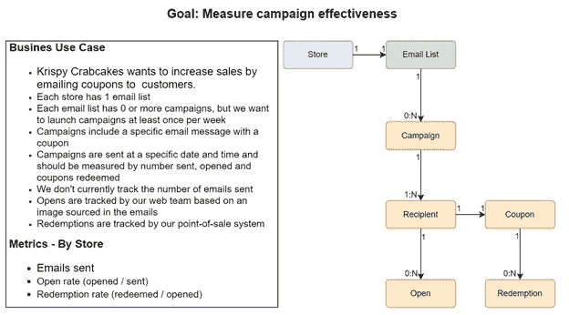
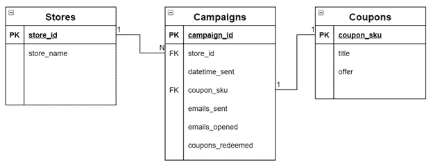

# 所以你想成为一名数据工程师

> 原文：<https://towardsdatascience.com/so-you-want-to-be-a-data-engineer-c1c92dcf3234?source=collection_archive---------21----------------------->

## [办公时间](https://towardsdatascience.com/tagged/office-hours)

## 你更好地理解架构和业务分析

许多人错误地认为优秀的数据技能造就了优秀的数据工程师。表面上看有道理。毕竟，数据工程师将来自多个来源的原始数据转换成可消费的包。因此，数据技能。虽然数据工程师需要各种技术技能，但它们更像是先决条件，而不是竞争优势。数据工程师需要掌握整个业务用例，并设计完整的数据解决方案。

为了更好地理解这一点，让我给你讲一个关于苏的故事。苏的故事始于一家名为 Krispy Crabcakes 的连锁餐厅，该餐厅在全国拥有数百家门店。他们想增加销售额，所以他们开始电子邮件营销。顾客在店内信息亭注册免费优惠券，优惠券大约每周通过电子邮件发送。作为老派，他们不信任云或 SaaS。不，他们什么都在家里做。

它管理电子邮件列表和邮件服务器。

网站开发人员创建追踪电子邮件中的图片，看看有多少人打开了它们。

优惠券在使用时在销售点系统中扫描。

在今天的环境下效率不是很高，但几个月来一直运行良好。销售额上升，大量优惠券被兑换。管理层询问电子邮件营销进展如何，IT 人员说:“太好了！”当然，这对管理层来说还不够好，他们问发了多少封邮件，打开了多少封，兑换了多少优惠券？合理的问题，如果你问我，但有一个问题。从来没有人想过衡量这些活动。他们只是被告知发一堆优惠券。现在，他们陷入了困境。数据工程师苏出场了。

Sue 知道她需要报告电子邮件活动的指标。她甚至没有和任何管理这项技术的人说过话，因为她现在不关心这个。她的目标是了解电子邮件营销是如何影响业务的。所以，在与三四个人交谈后，她终于在脑海中有了一幅画面。她也理解管理层希望看到的指标。

在考虑如何进行项目的*之前，她很早就发现了项目的*为什么*和*什么*。事实上，她甚至用一些注释画了一个简单的图表。该图并不真正遵循任何行业标准，但它完成了工作，并为她提供了进一步讨论的参考点。她用简单易懂的图片和一些要点记录了业务流程。*

由作者提供

如果你问我，我会说这是一个很好的开始。Sue 现在了解了业务流程，因此她可以开始设计系统。她也知道出现问题时该找谁，但她做了什么？在左侧，有简短的要点，解释了 Krispy Crabcakes 使用的业务流程和管理层需要的三个指标。

右边是流程中涉及的实体之间的简单关系图。箭头显示了实体之间的关系，用符号表示可能找到的相关实体的数量。例如，优惠券可以兑换 0 次或 1 次。一个活动将至少有一个收件人，但没有最大金额。通过命名这些实体，每个人都可以使用相同的语言来讨论这个过程。

现在 Sue 完全理解了业务流程，是时候与 it 部门交流，看看使用了什么样的技术。她找到 IT 经理，要了一份架构图，以便更好地了解电子邮件营销活动是如何实施的。正如所料，没有这样的图表存在，更糟糕的是，没有一个人了解整个过程。苏已经这样做了很长时间，所以她并不感到惊讶。她也不担心。

经过一番挖掘，喝了许多咖啡，喝了一点酒，苏找到了拼图的所有碎片。她将自己的业务知识与从 IT 和 web 开发中学到的一切结合起来，构建当前技术的架构图。同样，她没有遵循任何特定的图表标准。事实上，她经常只是为正在使用的技术贴上标识。她在各种组件之间画出带有动作的箭头，以显示活动的流程。因为一切从顾客开始，她把他们放在中间。

你能跟上图表吗？花几分钟弄清楚流程。

由作者提供

根据 Sue 了解到的信息，她找到了四个数据源。虽然以前没有人知道如何跟踪发送的电子邮件，但她了解了邮件服务器的日志记录。所有电子邮件都记录了重要的元数据，以符合内部审计要求。幸运的是，这些日志包含的信息刚好足以识别每个商店为特定活动发送的电子邮件。

由作者提供

现在苏在一个很棒的地方。她了解企业如何利用电子邮件营销来提高销售额。她还拼凑了支持一切的技术环境的所有细节。她可以开始考虑解决问题了。她是登录数据库还是打开文本编辑器？不，当然不是。她现在需要设计解决方案的架构。

虽然她更愿意使用云服务或至少 Kubernetes 来管理事情，但 Crispy Crabcakes 更喜欢内部技术，并提供 Linux 服务器来运行脚本和调度 CRON 作业。没关系。Sue 是一名数据工程师，而不是技术传播者。她使用最合适的工具设计了一个优雅的解决方案。

请注意，她的新图表只包含了前一个图表中的数据源。她的解决方案不与 IT 基础设施中的许多组件交互，所以她只添加这个特定项目所需的内容。

由作者提供

Sue 还创建了一个数据库图来显示数据仓库的样子。她有一个二维的事实表。随着时间的推移，Sue 预计企业会要求更多的指标和报告。她从一个易于扩展的星型模式开始，但不会增加当前解决方案的复杂性。

由作者提供

最后，做完这一切后，Sue 开始实施她的解决方案。达到这一步似乎需要做很多工作，但事实并非如此。她花了一天左右的时间编写脚本，并开始安排收集数据的工作。几天之内，她已经可以从浏览器中查看生产报告管理。一切正常。因为她了解业务流程，所以她已经在推荐更好的度量标准和方法，以使反馈循环进入系统。她能做到这一点，是因为她懂架构，懂商业分析。事实上，脆皮蟹饼已经希望她监督更好地跟踪活动和个人电子邮件。

数据工程师需要掌握整个业务用例，并设计完整的数据解决方案。在完全理解我们支持的业务流程之前，我们经常跳到 SQL 或 Python。另一方面，Sue 在设计解决方案之前会花时间了解业务和当前技术。这使她能够为管理层和 IT 部门提供有价值的见解。这让她能够设计出既适合今天又足够灵活的解决方案。如果你想成为一名数据工程师，就像苏一样。