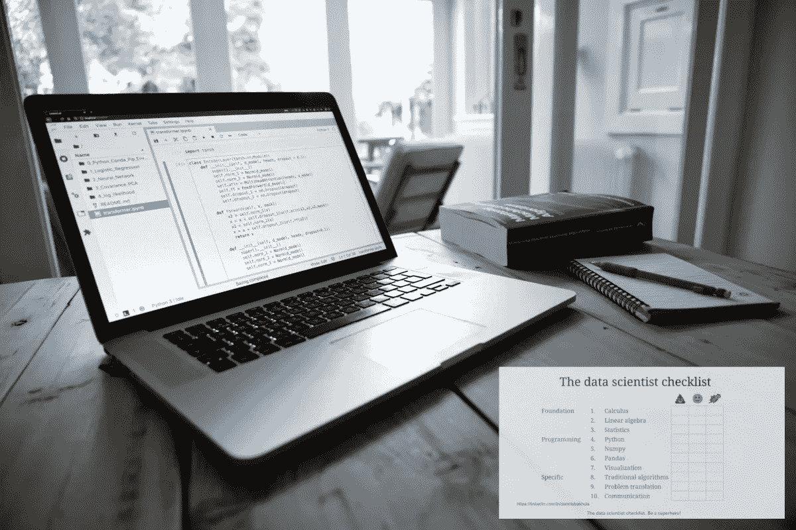
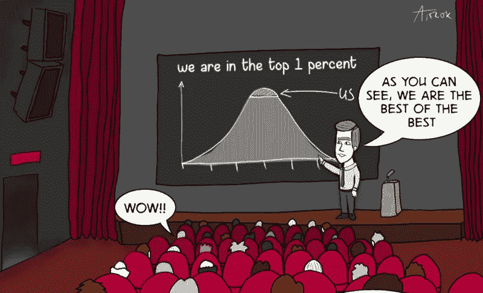
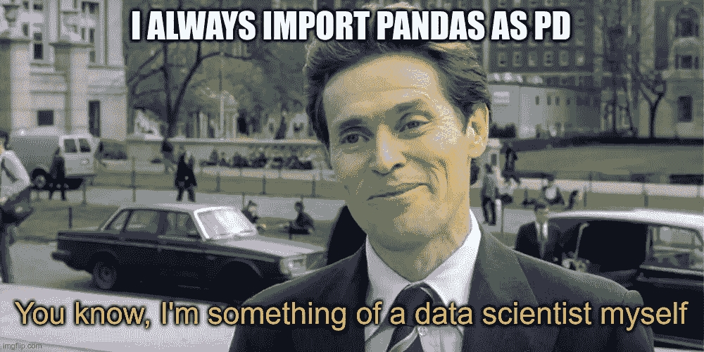
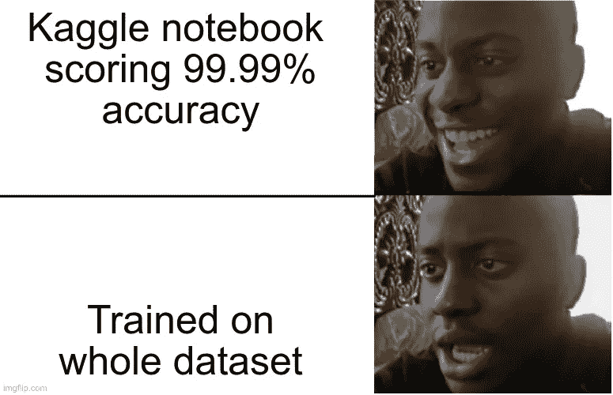

# 所以你想成为一名数据科学家？

> 原文：<https://towardsdatascience.com/so-you-want-to-become-a-data-scientist-c47e196b5ab5?source=collection_archive---------27----------------------->

## 这份清单会让你成为数据超级英雄！

在 LinkedIn 上，我经常会被问到应该如何进入数据科学领域。这当然是一个非常有效的问题，但不太容易回答，因为这取决于你现在在哪里。为了以最概括的方式回答这个问题，我决定在这方面多花一点时间，写这篇指南。

网上有很多课程声称你完成后会成为一名数据科学家。在比较这些课程时，他们主要关注机器学习部分。这当然是看起来最酷的部分，创建机器学习模型。在课程中讨论的这些*学校示例*例如，MNIST 分类器给出了可能性的想法，然而，当一家公司想要一名数据科学家时，它们并没有反映出实际需要什么。

在家工作(用我的佳能 RP 拍摄)。

## 基础——数学和统计

作为一名数据科学家，出类拔萃的重要因素是什么？根据我的经验，一个数据科学家应该有扎实的数学和统计学背景。这并不意味着数据科学家应该是一个完全成熟的数学家，而是应该能够熟练地阅读方程，并且知道大学微积分 101 课程中的典型关系。比如知道像 *log(x* ʸ *) = y log(x)* 这样的对数规则。你需要了解多少数学知识？越多越好，但至少我会说微积分 101 和线性代数 101。如果没有数学背景，你可能会活下来，但是你会很难理解*比如交叉熵损失函数。需要的另一个基础是统计学，这甚至更重要。数据科学家的核心业务是数据争论，你会不断地问自己一些问题，比如“这个特性重要吗”、“我有足够的数据吗”或者“这个发现有意义吗”。几乎任何你想回答的问题都要用到你的统计学知识。这可能并不总是可见的，但统计数据有助于您在调查数据时将重要的要素与不太重要的要素组织起来。和数学一样，你知道的统计学越多越好，但至少知道描述统计学和推断统计学的基础。顾名思义，描述统计学是一种对信息集合进行描述或量化的方法。你可能还记得一些，比如均值和中值。当我们想从一个样本中推断出一个总体的特性时，我们使用推断统计学。有许多很好的在线资源可以帮助你快速掌握基础知识。这里有几个我喜欢的:*

*   本书→ [赤裸裸的统计:从数据中剥离恐惧](https://www.amazon.com/Naked-Statistics-Stripping-Dread-Data/dp/039334777X/)
*   课程→ [机器学习的数学](http://Mathematics for Machine Learning Specialization)
*   教程→ [用 Python 统计](https://www.coursera.org/specializations/statistics-with-python)

你需要有一些基本的统计学知识来理解这个笑话。(来源: [Reddit 科学迷因](https://www.reddit.com/r/sciencememes/comments/kdvn1y/a_basic_understanding_of_statistics_is_required/))

## 核心技能:编程

到目前为止，我们只触及了基础。有了这些知识，学习数据科学会顺利很多。下一个技能是每个数据科学家的面包和黄油:编程。虽然我从来不敢把自己比作软件工程师，但我确实花了大部分时间在交互式开发环境(IDE)中编写代码来与数据交互。虽然您可以用任何编程语言来完成这项工作，但有两种语言是最常用的: *Python* 和 *R* 。关于哪一个更好，存在着无休止的争论，我想说这没多大关系。如果你是一个完全的新手，我总是推荐 Python，因为我认为它是一种更干净(可读性更好)的语言，并且相对容易学习。Python 是非常通用的，也可以用于许多其他事情，包括构建应用程序或网站。R 并没有错，如果你觉得 R 更吸引你，那就随意投资于这项技能。一个数据科学家应该至少精通一门编程语言。

> 一个数据科学家应该至少精通一门编程语言。

非常熟练的意思是，如果给你一个算法问题，例如快速排序或 fizz-buzz，你可以从头开始写解决方案(意思是没有堆栈交换)。你可以在算法上得到一些帮助，但是编程逻辑应该很容易写出来。编程是一项非常依赖你的经验的技能。你可以做一门课程帮助你入门，但是真正的理解来自于用 Python(或者 R)解决问题。关于 Python，我也建议在使用额外的包之前先掌握基本语言。熟悉语法、编程逻辑和标准库的一些组件。不要在第一周立即投入 Tensorflow 或 PyTorch。要开始使用 Python，这里有一些优秀的资源(包括我创建的一个):

*   课程:👉 [Python 每天 10 分钟](https://python-10-minutes-a-day.rocks/)
*   资源:[RealPython.com](https://realpython.com)
*   课程: [Python 给大家看](https://www.coursera.org/specializations/python)

## 所需工具:Numpy、Pandas 和一个可视化库

好了，现在我们有了*坚实的基础*，我们可以开始分析数据了。这意味着我们需要自己开发使用 Python(或 R)加载和操作数据的方法。我们将创建许多工具来解决特定的问题，但是创建工具来解决广泛的问题并不是一件容易的事情。幸运的是，一个巨大的开源社区为我们提供了很多方法，甚至是完整的算法。这些包由一大群志愿者维护，经过优化、验证和功能完善。从头开始编写这些方法是没有意义的(除非是为了学习)。作为一名数据科学家，你应该掌握的第一个包是 [Numpy](https://numpy.org/) 。Numpy 扩展了 Python，为科学计算提供了许多方法和数据结构，最著名的可能是 n 维数组数据结构。在本质上，Numpy 绑定到方法的编译实现，因此执行起来几乎与其他语言一样(Python 本身有一些开销，但是 Numpy 本身是编译的)。Numpy 是巨大的，你可以假设如果你需要一个数学运算，它可能已经实现了。如果你有扎实的数学基础，你会从 Numpy 中受益匪浅。网上有很多很棒的教程，但是我强烈推荐巴勃罗·卡塞雷斯的教程。如果你喜欢视频，懒惰的程序员的课程也很不错。熟悉 Numpy 文档很重要。不仅您可能会经常使用它，而且许多其他软件包也有类似的格式。通常，文档本身提供了一个很好的指南。

*   教程:[https://pabloinsente.github.io/intro-numpy-fundamentals](https://pabloinsente.github.io/intro-numpy-fundamentals)
*   课程:[懒惰的程序员——Numpy](https://lazyprogrammer.me/numpy/)
*   课程:[懒惰的程序员——Udemy](https://www.udemy.com/course/deep-learning-prerequisites-the-numpy-stack-in-python/)
*   资源: [Numpy 文档](https://numpy.org/doc/stable/)

成为熊猫忍者！(使用[imgflip.com](https://imgflip.com/i/4v7yzm)生成的迷因)

还有一个包是每个数据科学家都应该掌握的:[熊猫](https://pandas.pydata.org/)(R 中的 [dplyr](https://dplyr.tidyverse.org/index.html) )。熊猫是用*和你的数据说话的*方式，这应该感觉很自然。Pandas 得名于计量经济学术语“面板数据”,而
引入了数据结构来处理表格数据。它可以比作一个*电子表格*，其中的数据是由行和列构成的。Pandas 是在 Numpy 的基础上构建的，因此操作起来很快，而且经过了彻底的测试。这个包使得将数据加载到 Python 中变得非常容易。在支持(有时需要额外的软件包)许多格式，如:CVS，SQL，HDF5，XLS/XLSX，JSON，拼花，剪贴板，等等。

一旦数据被导入，Pandas 就会成为数据争论的瑞士军刀。这是一个数据科学家的核心活动。寻找丢失的值并输入它们，分析值的范围并检查这些值是否有意义。例如，如果有一个代表客户年龄的列，那么它的上限可能会超过 100(最长寿的人大约是 120 岁)。数据经过验证后，数据科学家通常会汇总数据。如果原始数据集是一个购买清单，我们可能希望汇总到每月的销售额。一旦你学会了熊猫的数据语言，这种操作对熊猫来说是极其容易的。作为一名数据科学家，你应该花时间问一些关于数据集的问题(实际上是回答这些问题)。熊猫给你找到答案的工具。你对熊猫了解得越多，找到这些答案的效率就越高。这是我会对任何申请数据科学职位的人进行的评估。这里有一些精彩的演讲和资源。成为熊猫忍者！

*   教程 1: [布兰登·罗德斯——从头开始的熊猫——PyCon 2015](https://www.youtube.com/watch?v=5JnMutdy6Fw&t=4s)
*   教程 2: [陈琦程—数据处理导论— SciPy 2019](https://www.youtube.com/watch?v=5rNu16O3YNE)
*   教程 3: [陈琦程—清理整理数据— PyDataDC2018](https://www.youtube.com/watch?v=iYie42M1ZyU)
*   教程 4: [凯文·马卡姆——更好地利用熊猫——pycon 2018](https://www.youtube.com/watch?v=0hsKLYfyQZc)
*   [教程 5:凯文·马卡姆——熊猫最佳实践——pycon 2019](https://www.youtube.com/watch?v=ZjrUmNq41Eo)
*   **必读** : [汤姆·奥格斯珀格——写现代地道的熊猫](https://tomaugspurger.github.io/modern-1-intro.html)

发现洞见是探索性数据分析(EDA)的第一步。第二步是用图来形象化你的发现。在 Python 中有许多用于绘图的包，使用哪一个取决于你。最常见的是 [Matplotlib](https://matplotlib.org/) ，这是一个成熟的绘图库，用于创建出版物质量等级可视化。它很容易使用，我肯定会建议有一个基本的了解 Matplotlib。开源的好处是有很多选择。我最喜欢的一个是 [Seaborn](https://seaborn.pydata.org/) ，它是在 Matplotlib 的基础上构建的，并且很好地集成了 Pandas。另一个可以尝试的绘图库是 [Altair](https://altair-viz.github.io/) ，它可以超级容易地创建交互式绘图。你学习哪一个系统并不重要，重要的是你能够可视化你的结果。

*   书:[科尔·努斯鲍默·克纳弗利克——用数据讲故事](http://www.storytellingwithdata.com/books)
*   教程: [Matplotlib 教程](https://matplotlib.org/3.3.3/tutorials/index.html)
*   教程: [Seaborn 教程](https://seaborn.pydata.org/tutorial.html)
*   教程:[牛郎星可视化](https://www.datacamp.com/community/tutorials/altair-in-python)

## 获得经验:竞赛和项目

大多数之前提到的熊猫教程已经展示了一些分析数据和回答各种问题的方法。但是这些问题(或者一般的方法)适用于你的问题吗？当然，这取决于你正在解决的问题，但一般来说，学会问正确的问题只能通过经验来实现。你可以通过分析别人做的项目获得经验，或者更好的是，自己做项目。有许多著名的数据集可以帮助您入门。每个数据科学家可能都知道的一个是 [*泰坦尼克号数据集*](https://www.kaggle.com/c/titanic/data) 。这个数据集是为 [Kaggle](https://www.kaggle.com/) 教程竞赛创建的，目标是预测哪些乘客在悲剧事件中幸存。数据集很小，但在建模开始之前有许多问题需要解决。它有需要估算的缺失值，但是应该使用哪些值呢？中位数？刻薄？我们应该在全球范围内估算数值，还是应该在亚组中解决这个问题，即首先将数据分为一类、二类和三类？了解这些问题的答案的最好方法是通过经验和看别人的作品。

> 互联网让你觉得机器学习算法是关于做数据科学家的核心，我觉得不是。

泰坦尼克号比赛的目标是创建一个模型，即使用机器学习来预测乘客幸存的可能性。直到现在，我们还没有谈到任何模型。互联网让你觉得机器学习算法是关于做数据科学家的核心，我觉得不是。当然，你应该知道各种各样的算法，但是要成为所有算法的专家几乎是不可能的。不要学习机器学习算法，而是学习处理数据科学问题。每个问题都会以一个机器学习算法结束，这是你学习这个算法的时刻。你在工作中学习算法。在做了几个项目或比赛后，你会发现到目前为止，你大部分的时间都花在了数据争论和特性工程上(80%以上的时间)。我的建议是参加几个(教程)竞赛，尝试最常用的算法:逻辑回归、线性回归和随机森林。把梯度提升、深度学习模型等更高级的算法留到以后再说。这些算法有点像黑盒，因此更难掌握，但是当你习惯于更传统的算法时，也可以随意尝试这些算法。

千万不要在测试台上训练。(使用[imgflip.com](https://imgflip.com/i/4v8juk)生成的迷因)

获得经验的最好方法是做项目或参加比赛。比赛是最容易开始的方式。数据科学竞赛最好的平台之一是 [Kaggle](https://kaggle.com) 。Kaggle 是一个惊人的资源，因为他们不仅有比赛，还有一个讨论平台，甚至还有微型课程。当你是 Kaggle 的新手时，它会把你送到他们的教程比赛，名为:“[泰坦尼克号——从灾难中学习的机器](https://www.kaggle.com/c/titanic)”。辅导比赛不同于常规比赛，因为没有截止日期。如果你在云中工作得很好，你不需要安装任何东西，你可以在在线 IDE 中完成所有的分析。下载数据集和离线工作是相当容易的，但是你需要[自己管理 Python 环境(教程)](/environments-conda-pip-aaaaah-d2503877884c)。泰坦尼克号竞赛是一个成熟的教程，带你完成整个过程，直到你有一个最终的模型。这是一个很好的起点，从这里你可以很容易地尝试你的新改进。许多人在平台上分享他们的笔记本，这是向他人学习的最佳方式。同样，我认为改进模型的最大收获是在特征工程方面。数据争论是数据科学家的超能力。浏览其他 Kagglers 的笔记本，并查看他们创建的功能。如此小的数据集中隐藏了如此多的特征，真是令人惊讶。

> 数据争论是数据科学家的超能力。

下面是两个强烈推荐的辅导比赛的链接，但也可以随时查看正在进行的常规比赛。如果你准备测试一个新算法，第一站(在 Google 之后)是 sci-kit-learn 包。它已经实现了许多算法。算法和统计概念的另一个很好的来源是 Joshua Starmer 的视频。他的视频很有趣，对于掌握复杂算法非常有用。

*   Kaggle 竞赛:泰坦尼克号——灾难中的机器学习
*   Kaggle 竞争:[房价](https://www.kaggle.com/c/house-prices-advanced-regression-techniques)
*   资源: [Scikit-learn 文档](https://scikit-learn.org/stable/supervised_learning.html)
*   统计调查:[逻辑回归](https://www.youtube.com/watch?v=yIYKR4sgzI8)
*   统计任务:[决策树](https://www.youtube.com/watch?v=7VeUPuFGJHk)

## 高级主题

有很多高级的话题，我们只是简单的提了一下或者根本没提。深度学习、计算机视觉、生成性对抗网络或变形模型等主题是该领域的主要进展。如果您对数据科学感兴趣，您可能听说过这项技术，甚至可能在媒体上读到过。虽然这些主题的知识有助于获得一份数据科学的工作，但你选择正确的机会非常渺茫。有太多的东西需要成为所有领域的专家。我的建议是选择一个你最喜欢的，并研究这些。所有的主题都很受欢迎，教程的数量也多得让人应接不暇。这是你为了好玩而做的一部分，因为在你的第一份数据科学工作中，你很有可能会做些别的事情。老实说，我看到的最多的是线性回归和逻辑回归，偶尔还有基于树的模型。我的第一份工作也是如此，最先进的模型是逻辑回归。逻辑回归没有错，美妙之处在于这些模型非常容易解释，这一点正变得非常重要(理应如此)。你应该关注这些高级话题吗？肯定不是！如果你刚刚开始，把重点放在数据角力部分和几个传统模型上。成为这方面的专家。在你的旅途中，你的好奇心会驱使你去阅读一些先进的东西。一年后，你会对外面有什么有一个很好的想法。在这一年里，你可能已经参加了一些聚会，人们在那里展示他们的项目，或者组织一次关于 NLP 或 T2 和 YOLO 的辅导。几乎在任何一个大城市，志愿者们都会组织聚会，这是结识外地朋友的好方法。最后，保持消息灵通的一个好方法是(数字化地)参加会议，如 [PyData](https://pydata.org/) 或 [PyCon](https://pycon.org/) 。这些活动有一些高质量的演讲(通常在几个月后才公开)，你可以与该领域的专家互动。有可能的话去参加这些活动。提问！你可能会因为问了一个愚蠢的问题而感到害怕，但是没有这样的事情。不问一个你心里想的问题更糟糕。

> 问问题的人是一时的傻瓜，不问问题的人是一辈子的傻瓜。—孔子。

和前一节一样，我将列出一些建议，告诉你如何掌握这一节。然而，这一次，这主要是为了娱乐，并不是一个详尽的清单。

*   课程:[深度学习专精](https://www.coursera.org/specializations/deep-learning)
*   播放列表:[克里斯·麦考密克—伯特系列](https://youtube.com/playlist?list=PLam9sigHPGwOBuH4_4fr-XvDbe5uneaf6)
*   教程:[阿德里安·罗斯布鲁克——使用 openCV 的 YOLO 物体检测](https://www.pyimagesearch.com/2018/11/12/yolo-object-detection-with-opencv/)
*   播放列表:[回顾 PyData Global 2020 的视频](https://www.youtube.com/user/PyDataTV/videos)
*   播放列表: [PyCon 2020](https://www.youtube.com/c/PyCon2020/videos)
*   [加入碰头会！](https://www.meetup.com/)

## 最后的想法和清单

有许多方法可以进入数据科学，这个概述只是我坚持的路线图。请记住，这个过程并不容易，但如果你喜欢与数据打交道，即解决数据之谜，这肯定是可行的。正如您在本指南中所看到的，没有明确的终点(总是有更多东西要学)。有一个较低的门槛，需要在工作中表现良好。有两个重要的技能我还没有提到:将业务问题转化为数据问题和沟通技能。独立学习翻译商业问题有点困难，但你可能会在第一份工作中从同事那里学到这一点。请注意，这是数据科学家的一项重要技能。最后一个还没有提到的技巧是沟通技巧。在你得到你的发现后，你必须把它传达给客户或你的同事。这可以是需要令人信服的报告、图表或演示。这是一种需要训练的技能，会随着练习而提高。一个很好的改进方法就是开始写博客或者在聚会上展示你的项目！

我将所有必需的技能浓缩到一份数据科学家清单中。这些技能可以分为三组:基础、编程和特定工作。这就像一个自我评估，你可以在不足(💩)，好(🙂)，以及超级英雄(🦸).擅长前 8 项技能绝对足以在数据科学领域取得成功。如果你是熊猫里的超级英雄，你可以认为自己已经是专家了。最后两项技能你可以在你的第一份工作中学到，但要意识到这两项技能很重要。

数据科学家清单。做一个超级英雄！

在我们结束之前，最后一个建议。不要等到你有了一份完整的超级英雄清单再去申请工作。几样商品就可以了，然后开始申请。当然，会有拒绝，但是在申请过程中获得经验也很重要。展示你的动机，不要过度推销，你可能会比你想象的更早被邀请。

到此，我们就结束了这个指南。这些都是基于我的经验和我对数据科学家角色的看法。欢迎在 [LinkedIn](https://linkedin.com/in/dennisbakhuis) 上发表评论或联系我。