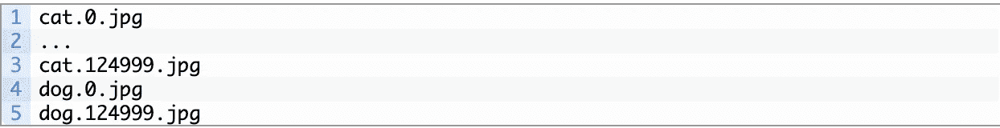
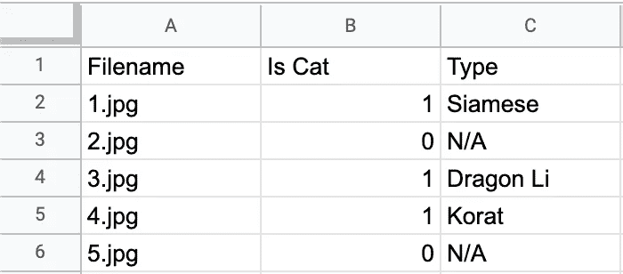
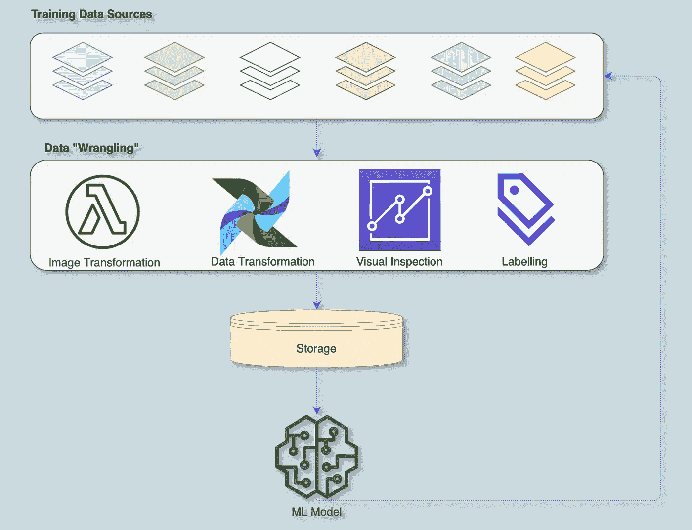

# 所以，你想建立 ML 模型…

> 原文：<https://towardsdatascience.com/so-you-want-to-build-ml-models-how-strong-are-your-data-jujitsu-skills-13fb3777c0ef?source=collection_archive---------44----------------------->

## 你的数据柔术有多强？

照片由 [Josefina Di Battista](https://unsplash.com/@josedibattista?utm_source=unsplash&utm_medium=referral&utm_content=creditCopyText) 在 [Unsplash](https://unsplash.com/s/photos/spider-web?utm_source=unsplash&utm_medium=referral&utm_content=creditCopyText) 上拍摄

几周前，我主持了一系列圆桌会议，与来自 [Atomico 的](https://www.atomico.com/)投资组合公司的一群工程领导者进行讨论。这些讨论的主题是数据，特别是人工智能公司中的数据挑战。无可否认，这是一个广泛而开放的话题，但也是一个重要的话题。

构建人工智能的一个重要部分，或者更具体地说，机器学习(ML)模型，是以数据为中心的。ML 模型主要涉及获取数据、清理数据、转换数据、可视化数据，并最终使用数据来构建模型。Anaconda 最近的一项调查显示，花费在数据操作(或争论)上的时间约占 ML/data 科学家总时间的 65%。这些数字在其他[调查](http://businessoverbroadway.com/wp-content/uploads/2019/02/propotion_time_spent_DS_activities.png)中也是一致的。处理数据是 ML/data 科学家花费时间的重要部分。

在接下来的几篇博文中，我将回顾一系列相关的主题。这一系列帖子将关注人工智能公司面临的整体数据挑战，并提供一个简单的框架来帮助引导对话。这一系列的文章将涵盖指导我们讨论的总体框架，以及对构建 ML 模型的 3 个主要数据活动的深入研究。

我们在讨论中使用的(简单)框架以 3 个数据活动为中心，如下图所示。这些足够广泛，涵盖了 ML 产品或团队将从事的主要数据活动。值得注意的是，本讨论的范围仅限于模型构建或培训，而不是模型部署到生产的整个生命周期。后者将在以后的文章中讨论。这些帖子的第一个系列将涵盖数据收集步骤，这是下面“框架”中概述的第一步。

ML 模型是数据优化算法。模型试图在一系列数据(训练数据集)上拟合一条曲线，试图最小化或最大化一个函数，在 ML 术语中通常称为成本函数。线性回归算法就是一个很好的例子。它执行优化过程以找到一组权重，该组权重最小化训练数据集上的平方和误差。更多关于这个话题和 ML 模型如何“学习”的信息，可以在我之前的一篇文章中找到。

因此，构建人工智能产品，更具体地说是 ML 模型，需要大量的数据就不足为奇了。你不仅需要一个大型数据集来建立初始模型，而且你将不断需要更多的数据来微调你的模型，以确保它们能够对新的输入进行归纳——以解决人工智能的[长尾问题](https://karimfanous.substack.com/p/adventures-in-hill-climbing-with)

因此，数据收集问题可以分为两个不同的阶段。第一阶段是获取构建初始模型所需的数据。我称之为*自举*问题。有许多方法可以获得引导模型所需的初始数据集。第二阶段是获取数据，不断训练和改进你的模型。模特就像花园，需要不断的修饰。

有许多数据源可用于引导阶段。你可以在网上找到免费的或购买的数据。例如， [Kaggle](https://www.kaggle.com/datasets) 和 [AWS](https://registry.opendata.aws/) 一样托管各种数据集。一旦有了运行的模型，另一个数据源就开始发挥作用了。从模型中排出的数据成为训练数据的来源。一个特别有用的数据是生产模型的输入数据。这些数据可用于训练新版本的模型。

数据收集阶段的两个阶段都面临两个主要挑战:地面实况调查，或标记和数据绘图。一个例子可能有助于说明这两个问题。

假设我们正在构建一个模型来识别猫的图片。我们出去获取一个包含数千张猫和其他动物(比如狗)图像的数据集。如果我们幸运的话，我们获得的数据集将已经被预先标记。这意味着有猫的图片会被清楚地标记出来，同样，没有猫的图片也会被清楚地标记出来。在我们的数据集的例子中，图像文件名标识图像是猫还是狗，如下所示。

不幸的是，明确标记的数据集是例外，而不是规范。此外，标签可能会变得非常复杂，这取决于模型的性质。考虑这样的情况，我们想要扩展我们的猫识别模型，以不仅识别猫(即分类)，而且还突出猫在图像中的位置(即定位)。

突然之间，我们的训练数据集不足以识别图像是否是猫的图像。我们的训练数据缺少指示图像中猫的位置的边界框。我们必须丰富我们的训练数据，以包括猫图像周围的边界框，以帮助我们的模型对猫的图像进行分类和定位。这通常是一个手动过程，需要人工标记这些数据。这就是标签工具发挥作用的地方，比如 [V7](https://www.v7labs.com/) 、 [Hive](https://thehive.ai/) 、 [Labelbox](https://labelbox.com/) 、 [AWS SageMaker GroundTruth](https://aws.amazon.com/sagemaker/groundtruth/) 、[centaulabs](https://centaurlabs.com/)等等

让我们给这个故事再加一个转折。我们的模型现在能够对猫进行分类和定位。但是，业务现在要求我们通过添加新功能来增强它。我们的模型应该区分小猫和成年猫。它还应该把猫分为暹罗猫、波斯猫、孟加拉猫、美国短毛猫、土耳其安哥拉猫或其他种类。我们的训练数据集现在需要再次增强。我们不能再依赖文件名中的“cat”字符串来帮助我们对图像进行分类，我们知道必须向我们的训练数据集添加更多的元数据。

我们的猫识别模型正在风靡全球。因此，业务需要我们扩展到亚洲，并要求我们扩大模型，以对亚洲国家常见的猫进行分类。我们最初的训练数据集严重偏向于西方国家常见的猫。我们能够获得额外的数据来帮助我们的模型对亚洲猫进行归纳，但这些数据与我们现有的训练数据集不同。我们获得的数据由成千上万的 JPG 图像和一个 CSV 文件组成。该文件包含每个图像的元数据，如下所示。

观察这个训练数据集的结构如何与我们最初的大不相同。我们的初始数据集在图像文件名中对图像中猫的存在进行编码，而我们的亚洲数据集依赖于 CSV 文件对图像进行分类。我们现在必须采用我们的训练管道来“理解”这两种数据模型，或者将它们合并成一个公共模型。我们现在突然考虑 ETL、Airflow，并将我们的各种训练数据集转换成一个通用的分类法。

此外，我们从亚洲数据集获得的图像与我们之前获得的图像大小不同。我们现在必须将这两个集合协调成一些标准的图像大小，我们的 ML 模型将在其上进行训练。我们还注意到，这个数据集中的一些图像不适用于我们的领域——猫。有数千份包含单细胞原生动物图像的文件。这些很可能被错误地包含在我们获得的亚洲数据集中。提示:始终目视检查您的数据！

不知不觉中，需要有限磁盘和计算能力的简单任务变成了复杂的数据转换、映射、标记和可视化检查网络。我们最终构建的堆栈可能类似于下图，这不是没有道理的。请注意，存储和培训层将在本系列的下一篇文章中讨论。这些也会给我们的堆栈增加不同的需求和工具。

由于问题的本质，我在本文中强调的挑战显得过于简单:识别猫的图像。然而，当构建“真实”模型时，这些挑战会变得相当复杂。在数据难以获取、缺乏标准导致数据集之间痛苦的逻辑示意图和语义映射的领域，这种方法格外困难。在医疗保健等数据分布具有长尾特征的领域，这一挑战会进一步加剧；一个我非常熟悉的领域。

*最初发表于*[*【https://karimfanous.substack.com】*](https://karimfanous.substack.com/p/so-you-want-to-build-ml-models)*。*