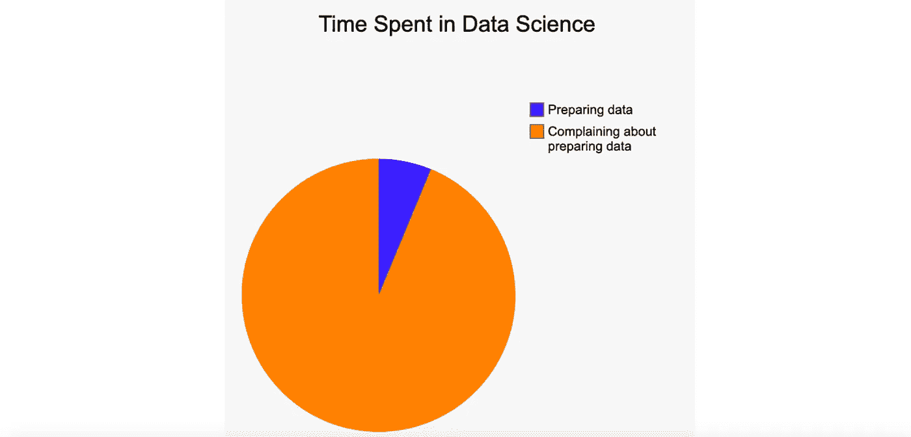
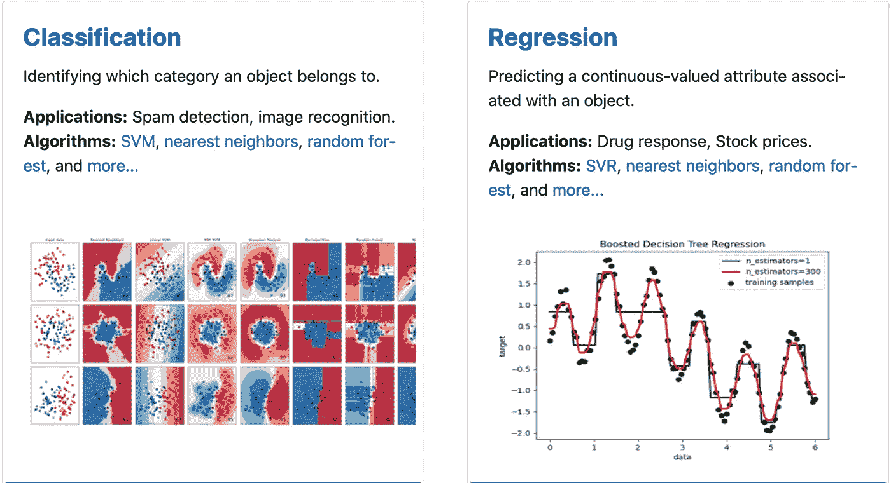

# 所以你想做机器学习但是不知道从哪里开始

> 原文：<https://towardsdatascience.com/so-you-want-to-do-machine-learning-but-dont-know-where-to-start-3fba1529bbcd?source=collection_archive---------19----------------------->

## 提示:不要从数学开始

图片由 [**安德里亚·皮亚卡迪奥**](https://www.pexels.com/@olly?utm_content=attributionCopyText&utm_medium=referral&utm_source=pexels) 来自 [**像素**](https://www.pexels.com/photo/man-wearing-brown-jacket-and-using-grey-laptop-874242/?utm_content=attributionCopyText&utm_medium=referral&utm_source=pexels)

我经常收到电子邮件，询问申请 ML 的建议。

我最喜欢的电子邮件来自那些已经有一个他们正在努力解决的具体问题的人。然而，他们通常没有 ML 或编码方面的经验。

非软件工程师开始应用机器学习最快的方法是什么？

这是我的建议。

# **学习 Python 的基础知识**

你不需要成为代码忍者。但是你确实需要写代码。

从概念上理解 ML 比编码更重要。所以现在先学习基础知识。

如果你以前从来没有写过 Python，那么去 [Codecademy](https://www.codecademy.com/learn/learn-python-3) 看看下面的内容。

*   环
*   如果和否则
*   列表和词典
*   字符串、整数和浮点
*   功能
*   导入库
*   安装软件包

就是这样。这还不够，但是当你需要更多的知识时，你可以重温。

太多的人因为没有准备好而错过了建造东西的机会。永远不要优先考虑“通过”在线编码课程，而不是应用你已经学到的东西。我们忘记了我们不适用的东西。

就拿那些因为这个原因而多次(在最终成为软件开发人员之前)失败的人来说吧。

# **为 ML 设置您的机器**

建立一个本地环境太糟糕了。

对于开发人员来说，在开始一项新工作时，花 1-2 天的时间来设置他们的机器并不罕见。

幸运的是，这不会很难。

1.  安装 [Python](https://www.python.org/downloads/) 。
2.  设置一个[虚拟环境](/data-science-outside-a-virtual-environment-is-a-great-way-to-mess-up-your-machine-770d72f77e66)。
3.  安装并启动 [Jupyter notebooks](https://jupyter.org/install) (带 pip)，一个伟大的[ML 和数据科学 IDE](https://en.wikipedia.org/wiki/Integrated_development_environment) 。

不要跳过设置虚拟环境。当您不可避免地安装不兼容的软件包版本时，这将为您省去麻烦。您需要做的只是关闭虚拟环境并创建一个新环境。

**亲提示。**不要用[蟒蛇](https://www.anaconda.com/products/individual)。如果你不知道你在做什么，在你的机器上设置难以逆转的默认值是很容易的。

# **安装这些库**

你需要一个软件包管理器来安装软件包。使用 [pip](https://pypi.org/project/pip/) 。

然后在您的虚拟环境中安装以下软件。

*   Numpy(包含有用的数据类型，如数组)
*   Pandas(允许以表格格式导入和查看数据)
*   Sklearn(包括您的 ML 型号)

从这些开始。然后根据需要安装其他的。

有很多很棒的库，但是如果你是初学者，保持简单。

# **知道(有监督的)机器学习的含义**

机器学习是做什么的？

ML 模型学习特征(输入)和标签(输出)之间的模糊关系。

## **示例:**

你想根据房子的特点来预测它的价格。

**特征:**房间数量，平方英尺，位置，邻里收入…
**标签:**价格

虽然这是一个简单的例子，但是要理解大多数 ML 模型在孤立的情况下做一些非常简单的事情。

现实世界中有用的“AI”通常是 ML、软件工程和深层领域知识的结合。

# **准备您的数据**

这是机器学习最具挑战性和最耗时的方面之一。

每个案例都不一样，所以很难提供通用的建议。

但这里有几个你可能想思考的话题。

1.  **编码输入。**机器学习模型只接受数值输入。在将图像和文本提供给模型之前，必须将它们转换成数字列表。
2.  **缩放数据。当不同的特征具有不同的尺度时，一些算法会变得混乱。**
3.  **将复杂的特征拆分成更简单的特征。对于一个模型来说，学习 5 个独立的布尔特征通常比学习一个复杂的特征更容易。**
4.  **删除丢失特征或标签的数据。否则，这可能会让你的管道崩溃。**
5.  **剔除异常值。根据算法的不同，异常值可能会误导您的模型。**
6.  **将数据拆分成训练集和测试集。避免在你的测试和训练集中包含相同的例子。否则，您不会知道模型是否可以概括，或者只是在评估期间学习了训练集中的示例。**

太多了。老实说，这可能是 6 篇不同文章的主题。但我想让你们注意到这些，因为这是可以花费大量时间和进行改进的地方。

信用: [imgflip](https://imgflip.com/chart-maker)

现在做最低限度的工作，在你建立了一些基线结果后再回来改进它。

# **理解回归 VS 分类问题**

在监督学习领域，有两种类型的问题，分类和回归。

鸣谢: [Sklearn](https://scikit-learn.org/stable/) 。

## 分类:

在分类问题中，您试图预测离散数量的标签中的一个。

在预测一个实例属于哪个组时使用此选项。

**例子:**

1.  是猫、狗还是公鸡的形象？
2.  这个学生会被麻省理工学院录取吗？
3.  这部小说是科幻小说，还是非科幻小说？

## 回归:

在回归问题中，你试图预测一个连续的量。

当可能的输出落在一个范围内时，使用此选项。根据经验，预测某物的货币价值总是一个回归问题。

1.  明天下雨的可能性。
2.  一幅画的美元价值。
3.  候选人 X 赢得选举的信心水平。

在选择模型之前，了解您的问题属于哪一类非常重要。

然后选择一个适合你的问题类型的模型。

# **让事情尽快运转起来**

没有人第一次就能得到正确的 ML 管道。

特别是作为一个初学者，在你尝试之前，你对什么有效什么无效几乎没有什么直觉。天下没有免费的午餐。

所以尽快让你的管道工作起来，让你的模型做出预测。

写马虎的代码是可以的，选择最简单的模型，忘记去掉标点和停用词。这可以在第二次或第三次重写时完成，此时您将跟踪这些更改对性能的改善程度。

这有助于你确定一个模型是否比随机猜测更有效。

# **评估结果并建立基线**

既然您的管道输出了一个结果，那么您必须用度量来评估它。

如果你的问题是一个**分类**，使用 Sklearn 的[分类报告](https://scikit-learn.org/stable/modules/generated/sklearn.metrics.classification_report.html#sklearn.metrics.classification_report)输出精度，召回，f1，以及对每个类的支持。

如果你的问题是一个**回归**，深入研究像 [MSE](https://en.wikipedia.org/wiki/Mean_squared_error) 、RMSE 和 MAE 这样的误差度量。

没有两个问题可以用同样的方式来评价。永远要考虑上下文。

现在，请注意您的绩效指标以及您的管道的当前状态。如果您的模型在这一点上表现不佳，也不要气馁。

这是你的底线。从现在开始，你做的每一件事都有超越它的目标。

是时候迭代一下，看看我们是否能跑赢基线。

# **找到导师并获得反馈**

现在是时候去找一个导师，询问如何改进的反馈了。

你已经付出了努力，并且有工作可以证明。

如果你伸出援手，人们会更愿意帮助你。如果你在这一点之前伸出手，你可能会被忽略。

虽然你可以(也应该)尝试迭代自己。你是初学者，ML 领域广阔。很可能，你不知道你不知道的。一个简单的建议就能让你的成绩直线上升。

我个人曾在 LinkedIn 上向数百人寻求项目帮助。大多数人会忽视你。有些不会。当你得到建议时，立即应用并报告结果。

永远不要低估导师。

# **不要从数学开始**

很多人会说“从数学开始”。别理他们。

ML 的基础是数学。这对于发展对特定模型如何工作的直觉是非常有价值的。但是在建造任何东西之前学习线性代数会让你落后几个月。

等有了一些实践经验再来数学。

# 结论

我希望这对你寻求应用机器学习有所帮助。

我强调快速移动和建造东西，因为这是一个布满兔子洞的领域，你可能要花上几年时间才能下去。许多人工智能工程师确实把整个职业生涯都花在了一个领域，比如搜索、自然语言处理或图像分类。

所以特别是在开始的时候，你必须小心不要偏离主题。

拓展足够的广度来完成工作。然后在需要的地方增加深度。

你有很多工作要做。走吧。