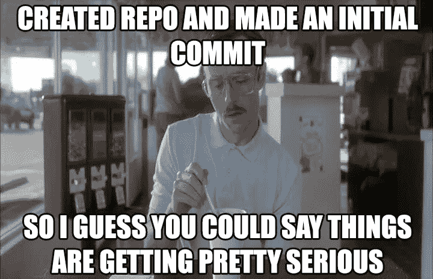

# 所以你要获得分析学硕士学位

> 原文：<https://towardsdatascience.com/so-youre-getting-a-masters-in-analytics-d81fb9b4595e?source=collection_archive---------6----------------------->

## 我对有志于加入这些项目的数据科学家和分析师的建议是

阿德里安·卡萨诺瓦在 [Unsplash](https://unsplash.com/?utm_source=unsplash&utm_medium=referral&utm_content=creditCopyText) 上的照片

新学年即将到来，我收到了一些进入数据科学或分析项目的新生的请求，请他们谈谈我在研究生院的经历。我于 2016 年 6 月从芝加哥大学毕业，获得了分析学硕士学位。这是一次神奇的经历，帮助我进入了一个新的职业生涯，但肯定有一些事情我希望我知道或者会做得不同。

我试图记录人们问的不同问题，并将它们汇总成一个列表。一些警告:

*   我的程序、作业和项目主要是在 r。
*   这是假设你参加这个项目是为了寻找一份新的工作或职业。

以下是我对加入这些项目的有抱负的数据科学家/分析师的建议，以及我将如何让已经很棒的经历变得更好。

# 1.学习 Git，把所有东西都放在 Github(或等效物)上

任何课程都不需要 Git 和 Github(至少当我在这个项目中的时候),我真的很后悔没有和我的同学一起使用它。

*   Github 是向潜在雇主展示你技能的好方法。
*   这是一个比我们所做的更好的协作工具(通过电子邮件互相发送代码变更)。
*   这也是一段很好的历史，所以你记得你做过的事情(我已经忘记了)。
*   在 Github 的项目中有家庭作业也比在你的桌面上有无数的文件夹要整洁得多(我就是这么做的)。
*   Git[hub]也是一项很好的技能，因为许多数据分析/科学团队经常使用它！
*   也没有什么比一张填满的贡献图更好的了。

来源:“事情变得相当严重”迷因。【knowyourmeme.com/memes/things-are-getting-pretty-serious】T4，字面媒体，2012 年

# 2.给每堂课留下一个你可以展示给潜在雇主的例子

这些节目进行得很快。我是一名兼职学生，度过了我的甜蜜时光，尽管如此，我仍觉得自己在向终点冲刺。由于优先权的竞争，很容易匆忙完成家庭作业和项目。不要把注意力放在完成上，记住这样做的目的是进入一个新的职业/角色/人生道路，你所做的一切都是你可以展示的新技能的例子。所以:记录你的工作。要清楚背后的意图以及你是如何思考的。弄得像样点。与上面的建议相关，将潜在雇主链接到你的 Github。

当然，我知道不是所有的家庭作业都适用于此——但是很多作业都适用，尤其是你的期末项目。你会在简历上写下你可以制作带有数据可视化的仪表盘吗？你必须有一个例子来支持这一点，并且能够展示这个项目如何说明你可以给你未来的公司带来的价值。

来源:[img lip。https://i.imgflip.com/155vlt.gif](https://i.imgflip.com/155vlt.gif)

# 3.多样化你的编程语言

我的课程主要是 R 语言，只有一门课程需要 Python。在很短的时间内，我学会并会使用 Python——课程结束后，我在差不多相同的时间内失去了我的技能！由于没有训练和保持我在 R 以外的语言中的编程技能，它们很快就被搁置起来，最终被遗忘了。

来源:“你知道我不会说西班牙语”迷因。作者创建的图像。makeameme.org。

当我完成学业申请工作时，我不得不向潜在的雇主承认我的 R 技能更强。这最终成功了，但它确实让我没有机会去任何 Python 商店。为了复制我在 Python 中所做的工作，我不得不刷新自己的语言基础——考虑到我在课堂上付出的努力，这是一个遗憾。

# 4.仔细选择你的顶点项目和顾问

当到了顶点时间，选项被列在一个网站上，我们被告知要组成一个小组，选择一个项目，并挑选一名顾问。这似乎是唯一的变量，但实际上还有*许多*其他因素影响着项目的难度和复杂性。他们直接影响到一个人是否能在他们想要的时候毕业，所以这是一个需要非常认真对待的决定。

*   **研究问题**:研究问题是否由顶点发起人定义(明确)？否则，大量时间将用于研究问题的开发、编辑、重写和最终批准。
*   **数据**:将一个项目添加到顶点列表中并不意味着当您想要开始您的项目时，这些数据将随时可供您使用。几个学生选择了一个项目，他们认为顶点赞助商会立即发送数据，而不是必须等待一刻钟。)之前，他们实际上收到任何东西，可以开始分析。提问:数据是否可用，如果不可用，将如何收集？你需要签署保密协议吗？谁负责这项工作？数据将如何以何种格式传输给您？获取数据需要多长时间？在顶石课程中，您是否需要更新或刷新它？一旦有了数据，你会细化你的研究问题吗？
*   **赞助商可用性/互动**:一些赞助商希望参与流程的每一步。有些赞助商一个季度见一次。每种方法都有优点和缺点，但一般来说，你需要一个提供明确指导和期望的赞助商，而不是微观管理。试着找出你的赞助商，这样你就知道如何最好地与他们合作。你们将长期在一起！
*   **顾问可用性/互动**:与赞助商类似，顶点顾问对合作方式的期望也各不相同。请注意，一些顾问正在处理繁重的工作——另一份工作，课程，同时还有几个顶点项目——因此你必须考虑如何获得他们的时间和注意力。如果你需要帮助或者正在努力赶上最后期限，这可能会令人沮丧。尽早决定您的期望——我的团队与我们的顾问建立了每周一次的电话会议和每两周一次的面对面会议。
*   顾问专长:在你试图做的特定分析中，有些顾问更有经验或洞察力。我的顶点项目与调查对象打交道——幸运的是，我的顾问是一名市场研究员！然而，有时指导老师的专业与你的分析方法不同，你的小组将不得不自己做更多的研究来满足资助者的需求。
*   **组可用性/交互**:在事件的突然转变中，顶点集团的一个成员退出并在另一个州开始新的工作。这让他们的团队陷入混乱，因为他们试图找出如何管理项目的其余部分。虽然我为找到工作的人感到高兴(不管怎么说，这是最重要的)，但他们本可以通过公开和诚实来帮助他们的团队。问问你潜在的队友:如果给你一份新工作会怎么样？你的毕业时间表是固定的还是灵活的？你还学了多少其他课程，你能为这个项目贡献多少时间？除了这些问题之外，还要弄清楚每个人打算如何互动，并从一开始就设定明确的期望，这样整个团队就能一起走向成功。

# 5.跟踪并给出如何改进计划的建议

我是我的分析项目的第二批学生，尽管已经过去了几年，但大多数数据科学课程都相对较新。在哪些应该是必修课，哪些应该是选修课，以什么顺序上课等方面，仍有一些问题需要解决。例如，我们被推进了 R 的世界，因为我们的作业必须在 R 中完成，尽管我们中的许多人以前甚至从未安装过一个软件包！我们向管理部门提出建议，他们应该创建一个涵盖基础知识的短期课程，现在它提供给任何可能从中受益的学生。

来源:Giphy 上的“帮助我帮助你”meme。https://giphy.com/explore/help-me-help-you

当你完成你的计划时，一切似乎都进行得很快。除非你有意识地思考如何改善你的经历以及你的后来者的经历，否则细节会被遗忘。

# 6.了解你喜欢这个过程的什么

随着您在分析或数据科学项目中的进步，您将了解数据工作的细微差别和复杂性。这是一个迷人的旅程，需要项目管理、客户互动和理解、技术专长、反馈循环和反复试验。这些都很棒，也很有必要，但是会有你更喜欢的部分。我一直喜欢创作美观的作品，并且知道我会喜欢开发数据可视化。我*不知道*喜欢伴随数据争论而来的创造力和智力难题。有些人的感觉正好相反，这是他们最不喜欢的数据科学程序。但是他们可能比我更喜欢收集业务需求。

你应该知道如何成功地完成数据科学方法论，但研究生院也是一个机会，了解哪一部分让你兴奋。由于数据分析的巨大世界，这将有助于你尽可能地专注于能给你的工作带来快乐的角色。

资料来源:tenor.com。[https://tenor . com/view/star-trek-the-next-generation-data-play-cat-gif-3992194](https://tenor.com/view/star-trek-the-next-generation-data-play-cat-gif-3992194)

# 结论

这些数据科学/分析学位的目的是作为达到目的的一种手段，但我完成硕士学位已经两年了，我仍在反思这段经历。一路上，发生了很多变化和改进。我的分析项目影响了我的思维方式、职业轨迹和工作之外的行为。对此我心存感激，因为我也意识到学习没有止境。

本文原载于 2018 年 8 月 4 日 [% > %梦想](https://ivelasq.rbind.io/blog/creating-a-new-theme/)。在[推特](https://twitter.com/ivelasq3)上和我保持联系！