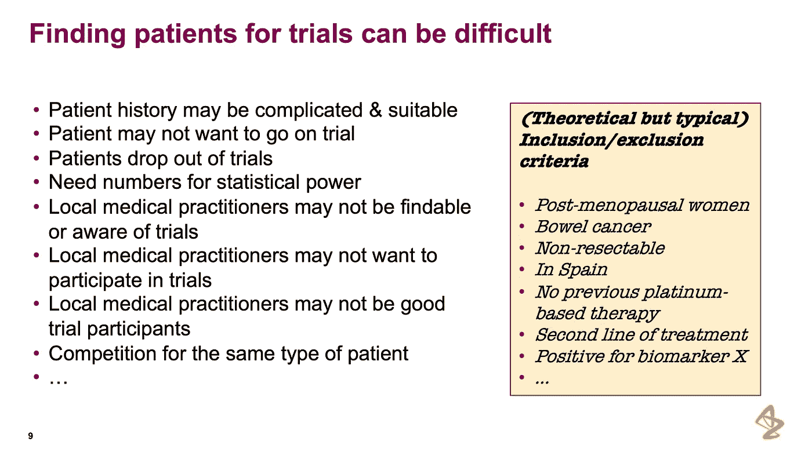
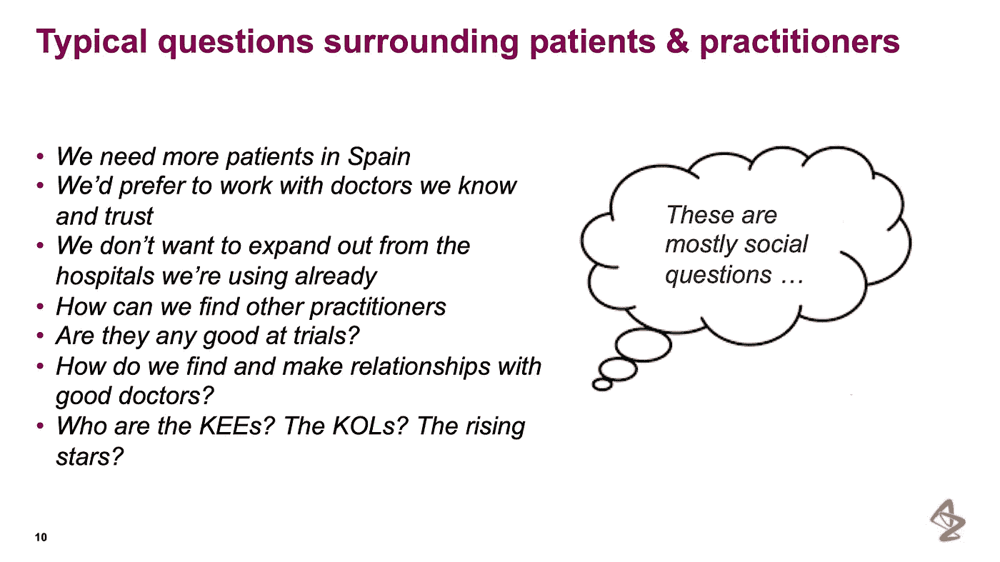

# 药物开发的社会图表

> 原文：<https://towardsdatascience.com/social-graphs-for-drug-development-e45faa68dc0e?source=collection_archive---------63----------------------->

通过 unsplash 的图像权利

早在二月份，当我们还能安全地聚在一起的时候，Grakn 实验室的第一次全球用户会议, [Grakn Cosmos](https://grakncosmos.com) 在伦敦举行；和[【阿斯利康】](https://www.astrazeneca.co.uk/)的健康信息学主管保罗·阿加泼，讲述了他的团队在建立社交图谱以减少临床试验招募时的时间和财政资源方面的工作。

> 这是第一步，让我们发展专业知识去探索，看看我们能去哪里——我们是有问题要解决的人。

# 死亡之谷

## 别担心，会有一个幸福的结局

药物开发是一个极其困难、漫长和昂贵的过程。这不是新消息，通常这个过程被类比为走进一个赌场，把 100k 放在桌子上，然后把它全押在黑色 27 上。

这是因为当一家制药公司着手生产一种已经通过所有临床试验阶段的新药时，它是 10 年和大约 20 亿美元的成果。

许多制药公司在内部存储了药物蛋白质相互作用集，即成千上万的候选分子，它们能够与人体的某个部分相互作用。这是许多药物开发项目的起点。然后，根据哪些产品可以交付，哪些产品可以合理生产，对这些产品进行筛选。甚至在把药物放入人体之前，你可能会有大约 250 个。

从这 250 个进入临床试验的第一阶段——在那里检查安全性和有效性——你可能会在监管审查前减少到 5 个。最后，你拿出一种新药。

> *从 10000 个可能的候选人，减少到 1 个。在这期间，我们有 20 亿美元和大约 10 年的时间。这就是我们所说的“死亡之谷”。*

当你为一种药物付费时，你并没有为这种药物的开发付费，而是为所有这些失败付费。像阿斯利康这样的公司正在考虑他们为临床试验招募人员的方式，作为一个可能的优化领域。

# 但是首先，简要概述一下临床试验过程

**第 1 阶段:**观察少量患者服用药物的安全性。在第一阶段的试验中，通常会有数十人参与。

**第二阶段:**重新评估安全性——对人类是否安全——并查看预期补救措施的功效。在第二阶段，该药物在 100 名患者身上进行了测试。

**第三阶段:**最后的安全性和有效性检查——这种药物会意外杀死你吗？它有什么好处吗——同时询问它是否比目前生产的任何药物都更有效？

临床试验受益于大量的受试者。一般来说，科目越多，统计能力越强。然而，由于每个受试者的成本在 1-1 万美元之间，60%的临床试验达不到招募目标，这是该过程中较为困难的方面之一。

## 招聘是怎么运作的？

传统上，招聘是通过社会关系完成的:个人关系、宣传册、招聘网站、医院周围的广告等。如今，随着招募目标的增加和药物的投入，这种做法已经行不通了。

使用联合电子健康记录(EHR ),如 Trinetx，您可以获得来自不同地区的大量患者数据。不利的一面是，这仍然只是全部潜在受试者的一个子集，通常缺乏鉴定所需的细节。在下面的幻灯片中，Paul 提供了一些取消潜在受试者资格的方法。

临床试验招募中的困难——允许使用的幻灯片

你会注意到，许多这种失格可以通过问一些社交问题来减轻。制药公司最不擅长问的软问题，这可能有助于减少获得完整试验受试者组所需的时间和资源。

与临床试验招募相关的问题—经许可使用的幻灯片

# 真实世界的证据

当组织和团队面对这一现实时，存在未被充分利用的、廉价的、在数量和范围上不断增长的数据。这种数据通常无法通过任何其他方式获得，它代表了个人和/或群体的更真实的情况。在生命科学领域的某些圈子里，包括 Paul 在内，这些数据被称为“真实世界证据”或“真实世界数据”。

我们谈论的是来自健康追踪器和可穿戴设备的数据、电子医疗记录和调查数据、医院和药房数据、社交媒体和消费者数据。杂乱的数据，不是来自临床对照试验的数据，也就是说，任何不适合放入表格的数据。

这种数据越来越多地被认为是以前不可用或不可识别的信号的驱动因素。除了这种“新”数据便宜之外，它还使制药公司能够覆盖以前无法覆盖的人群。此外，这些数据涵盖了出于道德考虑公司不允许问的问题。

这些“世界的信号”为临床试验提供了一个扩展的范围，其中主要涉及的人口部分是不典型的。保罗注意到，参加试验的人群通常是年轻、受过大学教育的白人男性。

因此需要“真实世界的证据”——但是它将如何帮助减少成本和时间呢？

# 解决方案

让我们从我们所拥有的开始:

*   新近可访问的“真实世界的证据”，来自不同来源的社会数据——杂乱的数据
*   识别和发现新患者群的机会
*   更快、更准确地获得资格的机会，避免在不合格的科目上花费时间和金钱

保罗和他在阿斯利康的团队想出的解决方案是一个试验从业者的社会图表。保罗称之为“肿瘤医生的脸书”。这张图表将通过他们的合作、出版物和工作场所把他们联系起来。他们可以用这些不同来源的“真实世界证据”来注释图表，并询问关于这些从业者的问题。

该项目被称为 OPSIN——肿瘤从业者社会互动网络，作为“简化和激励临床试验”的更大努力的一部分。

非常有趣的是，在 2008 年，一个团队提出了一个类似的概念，使用“手动”图形数据库，从互联网上搜集任何数据，让他们能够找到关键的意见领袖。

今天，有了如此丰富的信息和技术平台来解决这个问题。

> *在图表领域，人们对制药越来越感兴趣。特别是在迄今为止的生物化学和生物实体的知识图表中。*

此外，他们可以将现在可用的外部信息与他们所有的内部数据相结合，也许更重要的是与多年的考验和磨难相结合。

# 构建社交图谱

从他们的前辈那里学习，有一些问题贯穿那些早期的努力。关键是它们不是为可持续发展而构建的——这些早期图表不仅仅是为一次性项目而构建的。Paul 指出，这些通常是由使用 R 的人构建的，或者是一起编写 python 脚本；手工构建自己的图形数据库。

这些都不适合操作，它们需要插入到其他系统中，以便整个组织的团队能够利用它。这就是 Grakn 介入的地方。

Grakn 是一个复杂数据的数据库，来自 Grakn 实验室的团队。知道阿斯利康的团队将会对边、起源边以及关于边的陈述感兴趣，他们开始意识到他们真正谈论的是超图。Grakn 作为一个超图数据库，使这变得容易得多。

## 模型的基础

对于热爱形式模式的生物信息学家来说，他们经常迫不及待地想把他们内部庞大的本体转储进去，而不考虑这是否是适合这种情况的正确模型。Grakn 实验室的一些团队鼓励 Paul 不要从他们现有的本体开始，而是从他们想要问的一系列问题开始。从上面的思路出发，我们将在下面讨论生物信息学家可以提出的几个问题。

然而，由于他们确实需要一个模式，以下是他们做出的一些决定:

*   从简单开始，不要从一开始就对整个世界建模
*   使用你想问的问题作为引出你的模型的潜在概念的一种方式——通常当我们大声或在纸上清晰地表达问题时，我们能够更清楚地看到事情
*   从人和机构开始，通过合作和出版等关系将他们联系起来
*   给每个关系一个时间元素作为属性
*   将范围保持在 5 年内——人和关系会发生变化，5 年对我们的目标来说已经足够了

# 我们可以问的问题

> 我们已经在 y 站点使用 X 了，还能考虑谁呢？他们认识谁？

朋友的朋友的问题对于超图来说是微不足道的。通过协作追踪到另一个，你可以回答这些问题，并根据连接数、最近时间或其他时间过滤器对连接进行排名。

> 附近有从业者吗？在同一个城市有没有我们可以参考试验地点的患者？

虽然很难表达“附近”的概念，但在应用层有其他方法可以解决这个问题——在撰写本文时，他们还不需要这样做。Grakn 的推理引擎允许在查询时推断传递关系。

> 有哪些从业者社区？这些社区的关键人物是谁？

集群上的集群，识别图中的中心概念和它们之间的联系也是很平常的事情。

# 结论

听保罗的故事，我学到了什么？嗯，即使制药界变得越来越数据驱动，仍然有许多软问题要问，这给临床试验过程带来了巨大的价值。有大量的数据可以用来解决这些问题。

> *这是一个人的企业，我们会有一些人的问题……*

保罗还花时间感谢了这支球队，我不能忘记他们:Domingo Salazar，Maja Malkowska，Li 和 Gabi Feldberg。

特别感谢保罗和他在阿斯利康的团队分享他们的故事和智慧之言。这显然是一个优化的领域，这些项目有助于推动整个行业向前发展

你可以在 Grakn Labs YouTube 频道[点击](https://www.youtube.com/watch?v=9yU8aLfJ9bM&list=PLtEF8_xCPklbGuaOANOJHZ8cvbo65LN2I&index=18&ab_channel=GraknLabs)找到完整的演示文稿。