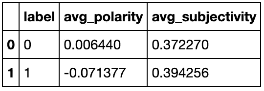
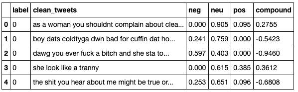
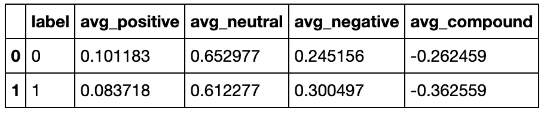
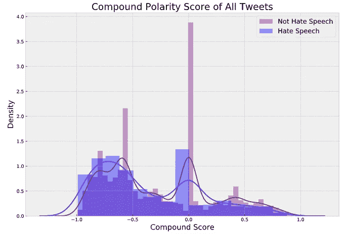

# VADER 的社交媒体情感分析

> 原文：<https://towardsdatascience.com/social-media-sentiment-analysis-with-vader-c29d0c96fa90?source=collection_archive---------8----------------------->

## 测量细微文本数据的情感。


[普拉蒂克卡蒂亚尔](https://unsplash.com/@prateekkatyal)上 [Unsplash](https://unsplash.com/photos/xv7-GlvBLFw)

对于数据科学，我们需要不同的工具来处理各种各样的数据集。在我们深入研究**情感分析**的不同方法之前，重要的是要注意它是**自然语言处理**中的一种技术。通常被称为 **NLP** ，是研究计算机如何理解**人类**语言**的研究。虽然这是一个在数据科学家中很受欢迎的专业，但它并不是行业的专属。**

使用**文本数据**会带来一组**独特的问题**和其他类型的数据集所没有的解决方案。通常，文本数据比其他数据类型需要更多的**清理**和**预处理**。然而，也有独特的**探索性数据分析**技术，我们可以应用于文本数据，如单词云、可视化最常见的单词等等。在这篇博客中，我们将关注**情感分析。**

# **情绪分析**

情感分析是对文本文档有多少积极、消极和固执己见的分析。例如，这种技术通常用于评论数据，以了解顾客对公司产品的感受。

文本数据的问题在于它反映了人类的语言。它是**多样的**并且不断**进化**，因此，机器学习必须不断约束基于新**词汇**的模型。例如，**社交媒体文本**极其微妙，众所周知，机器学习算法很难“理解”。

有许多不同的库可以帮助我们进行情感分析，但我们将关注一个对肮脏的社交媒体数据特别有效的库， **VADER** 。

VADER 代表用于情感推理的 Valance Aware 字典，它是一种情感分析工具，对人类文本中情感的极性和强度都很敏感。这个词典是一个**基于规则的系统**，专门针对社交媒体数据进行训练。你可以在这里查看工具[的 GitHub 库。](https://github.com/cjhutto/vaderSentiment)

# **TextBlob**

为了理解这个工具的有效性，我们可以先看看 TextBlob 在 Twitter 数据上的表现。出于这个博客的目的，我将展示我最近的项目 [**Twitter 仇恨言论检测**](https://github.com/sidneykung/twitter_hate_speech_detection) 中的例子，其中的**文本数据已经被清理**。

> 请注意，由于该项目的性质，本博客中的以下可视化内容包含未经审查的、露骨的和冒犯性的语言。

对于大多数具有“**普通**”文本的自然语言处理项目，如书籍、新闻文章、电影评论等。我们通常可以使用 TextBlob 。 **TextBlob** 是一个库，它提供了一个简单的 API 来处理文本数据，包括词性数据、名词短语提取、标记化、分类等任务。

对于情感分析，TextBlob 是唯一的，因为除了**极性** **得分**，它还生成**主观性得分**。如果我们从单独一行中的每条 tweet 的数据帧开始，我们可以创建一个简单的 lambda 函数来将这些方法应用到 tweet。

```
pol = **lambda** x: TextBlob(x).sentiment.polaritysub = **lambda** x: TextBlob(x).sentiment.subjectivity
```

之后，我们可以使用一个`groupby`函数来查看每个标签、`Hate Speech`或`Not Hate Speech`的平均极性和主观性得分。



TextBlob 情感得分

TextBlob 的极性得分在从- **1** (最负)到 **1** (最正)的范围内测量。非仇恨言论文本(标签 0)似乎相对**中性**，平均得分为 0.006，而仇恨言论文本(标签 1)也可以被视为**中性**，得分为-0.071。从他们的主观性来看，这两个标签似乎都有**相似的意见水平**。为了更深入的了解，请随意查看 GitHub 上的这个分析的 [Jupyter 笔记本](https://github.com/sidneykung/twitter_hate_speech_detection/blob/master/preprocessing/TextBlob_sentiment.ipynb)。

最终，这些分数**看起来**是**而不是代表这个数据集中的**推文，其中的文本范围从仇恨言论到攻击性语言。因此，我们可以看到 TextBlob 很难分析 Twitter 数据。让我们看看 VADER 能对这种肮脏、无意义的社交媒体数据做些什么。

# **应用 VADER**

现在，我们终于可以去 VADER 了。VADER 的独特之处在于它分解了每个文档的极性分数，给出了一个**正**、**中性**、**负**和**复合**的分数。与 TextBlob 类似，我们可以使用简单的 lambda 函数将该方法应用于整个数据帧，以生成这些极性得分。

```
pol = **lambda** x: analyser.polarity_scores(x)
```

该函数将**分数作为字典**返回，因此在其他几行代码之后，我们可以创建一个 dataframe，其中包含**单独列**中的每个分数。同样，你可以在 [Jupyter 笔记本](https://github.com/sidneykung/twitter_hate_speech_detection/blob/master/preprocessing/VADER_sentiment.ipynb)上查看完整的代码。这是我们最后得到的结果。



VADER 情绪得分

对于一些`groupby`函数，这里是整个数据集的平均分数，由标签分隔。



# **解读 VADER 的极性得分**

正、负和中性分数代表属于这些类别的文本的**比例。因此，仇恨言论推文平均有 8%是正面的，61%是中性的，30%是负面的。另一方面，没有仇恨言论的推文平均有 10%是正面的，65%是中性的，25%是负面的。这种分类对于理解数据集中情绪的 T21 范围更有帮助。这表明两个语料库是相似的，但仇恨言论标签的负面推文**略多，平均**。有趣的是，这两个类别中的大多数推文都被认为是非常中立的，但至少我们有一个清晰的分类。**

# **复合极性得分**

最值得注意的是，该库提供了一个**复合极性得分**，这是一个计算所有词典评级总和的度量，并且**将它们在-1 和 1 之间归一化**。其中-1 表示非常负，1 表示非常正。这个评分似乎更可靠，因为它包含了这个语料库的**整体情绪。这两个类别都包含负面的、攻击性的语言。但是我们可以从上面的分数中看到，已经被归类为**仇恨言论的推文尤其负面**。**

下一步将是可视化所有这些分数的分布！你可以查看笔记本，了解正面、中性和负面分数的分布情况。但这里是复合极性分数的**分布。**



VADER 化合物极性得分分布，按标签

从这张图表中，我们可以看到被归类为仇恨言论的推文特别负面，正如我们已经怀疑的那样。它进一步强调了这些标签之间的边际差异。

在所有这些之后，很明显 **VADER** 是**在社交媒体数据**上执行情感分析的高级库。总的来说，自然语言处理是机器学习中一个高度**实验性的**领域，它完全是关于**找到能够适应你的数据集**的正确包。在这种情况下，对于 Twitter 仇恨言论数据，我们需要一个针对肮脏、细微差别的文本数据进行训练的词典。下次当你处理社交媒体数据时，请随意尝试 VADER！