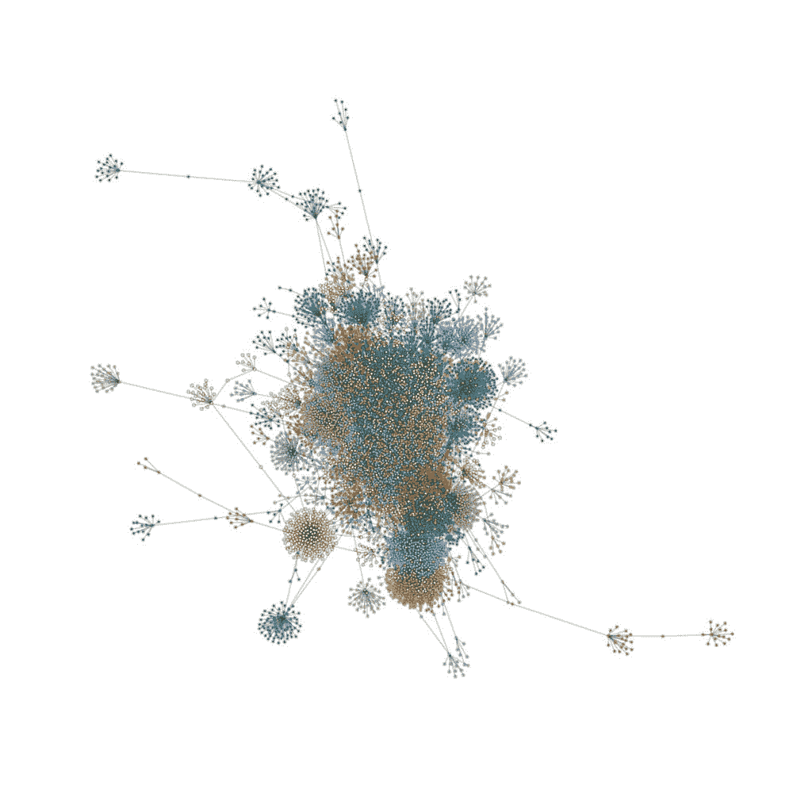
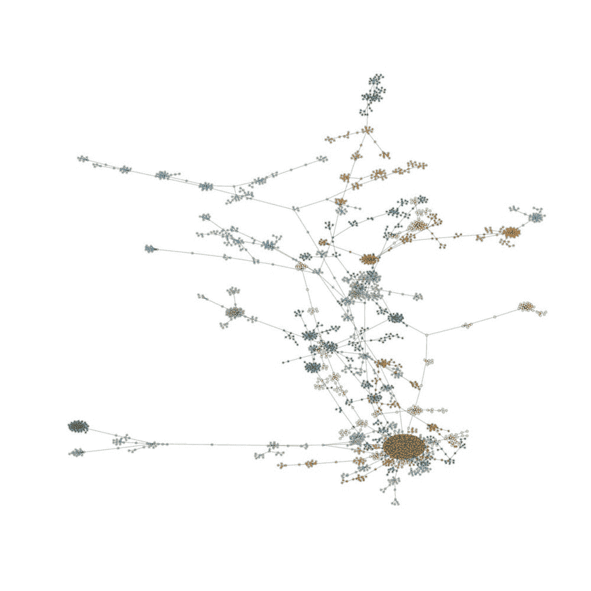
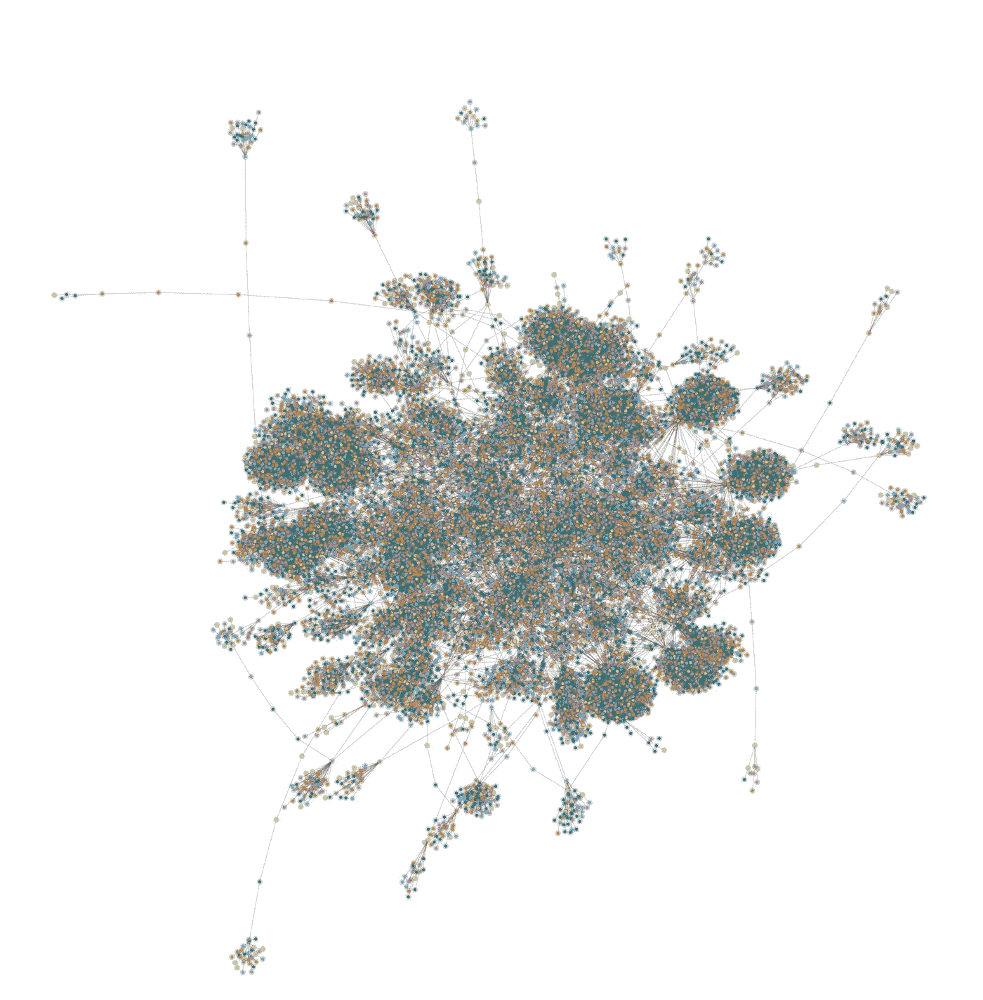
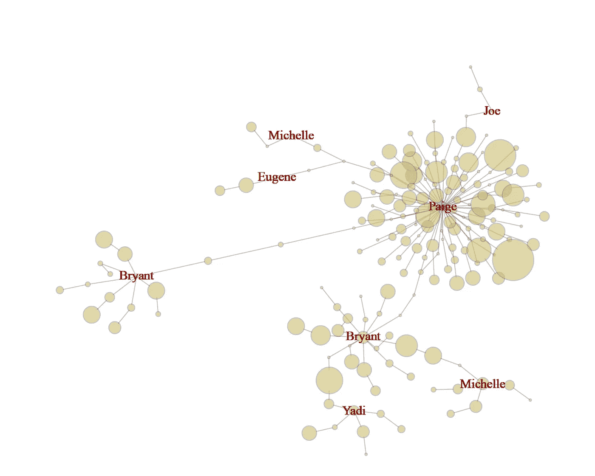
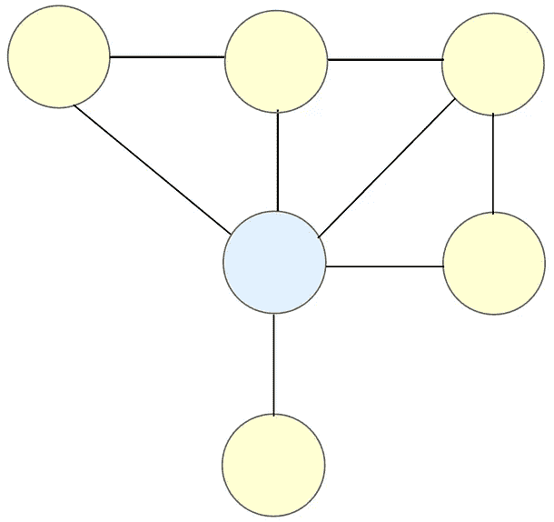
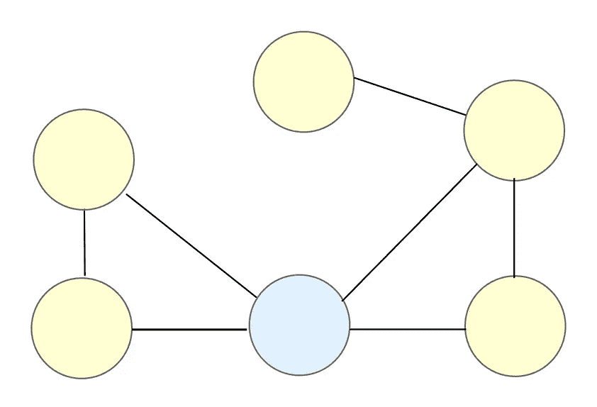
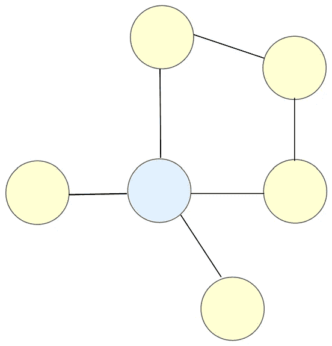

# 社会网络分析:社区检测

> 原文：<https://towardsdatascience.com/social-network-analysis-community-detection-2b19e836c76c?source=collection_archive---------16----------------------->

## 使用 R 从 [Yelp API](https://www.yelp.com/dataset) 中提取用户数据并创建网络图

在线社交平台使世界各地的人们能够相互交流，并与他们有共同兴趣的人建立关系。这可以在现实生活中观察到——自然地，我们倾向于与和我们相似的人发展和维持关系。具有相似兴趣的人倾向于相互吸引，并在**社区**中联系在一起——彼此拥有相似特征的人群或团体。由于人们倾向于与类似的人聚集在一起，我们可以使用**社区检测**来识别具有高学历(联系)的用户，并查看他们在网络中能走多远。

**用户数据提取—** 由于我们只对用户数据感兴趣，我们将只提取以下变量:

*   User_id — Yelp 用户 ID；这是制作节点和边所需要的
*   姓名—用户的名字
*   审核计数—用户撰写的审核数量
*   Yelp 自—用户加入 Yelp 的日期
*   朋友—按用户 id 包含用户所有朋友的列表
*   粉丝—用户拥有的粉丝数量
*   精英—用户拥有精英身份的年数
*   平均星级—用户对所有已写评论的平均评分

Yelp 数据非常大，所以从 json 文件中提取数据需要很长时间。

```
library(jsonlite)
library(dplyr)
library(stringr)
library(tidyr)
library(tidyjson)
library(tidyverse)
library(igraph)user_out <- lapply(readLines("yelp_academic_dataset_user.json"), fromJSON)#parse through each user's data and only obtain columns we are interested inyelp_parse <- function(x) {

  parse_list <- list(user_id = x$user_id, 
                     name = x$name, 
                     review_count = x$review_count, 
                     yelping_since = x$yelping_since, 
                     elite = x$elite, 
                     friends = x$friends, 
                     fans = x$fans, 
                     average_stars = x$average_stars)

  parse_list <- lapply(parse_list, FUN = function(x) ifelse(is.null(x), "", x))

  df <- data_frame(user_id=parse_list$user_id,
                   name=parse_list$name, 
                   review_count = parse_list$review_count, 
                   yelping_since=parse_list$yelping_since, 
                   elite = parse_list$elite, 
                   friends = parse_list$friends, 
                   fans = parse_list$fans, 
                   average_stars = parse_list$average_stars)
  df
}user_list <- lapply(user_out, FUN = yelp_parse)#should now have a dictionary with only keys and values we want#now, make this into a table
user_df <- data.frame(matrix(unlist(user_list), nrow=length(user_list), byrow=TRUE),stringsAsFactors=FALSE)
```

**网络图—** 让我们用 r 中的 igraph 包制作两张对比 2005 年和 2015 年加入的用户的图，10 年后会有什么不同？

制作网络图需要非常长的时间，所以我们将我们的子集限制在 100k 个节点，并创建最大度数的用户的子图。

```
#remove users with no friends
sample <- subset(user_df, friends != "None")#make a subset; we only need to retain data of users with some social activity
sub <- subset(sample, year == 2005 & review_count >= 2 & no_of_friends >= 2)#make links (nodes and edges)
sample_friends <- sub %>% select(user_id, friends)
sample_users <- strsplit(sample_friends$friends, split = ",")
sample_dat <- data.frame(user_id = rep(sample_friends$user_id, sapply(sample_users, length)), friends = unlist(sample_users))#network is still too big, take a random sample of 100k nodes
samp_net <- sample_n(sample_dat, 100000)#make network 
network <- graph.data.frame(samp_net)
network_s <- simplify(network)net_deg <- degree(network_s)
all_degree <- degree(network, mode = 'all')#graph user with max degrees
sub_all <- subcomponent(network_s, which(all_degree == max(all_degree)), 'all')
g_sub <- induced_subgraph(network_s, sub_all)#communities
graph.com <- fastgreedy.community(as.undirected(g_sub))
V(g_sub)$color <- graph.com$membership + 1#create pdf graph for high resolution (try zooming in!)
pdf("communities2005.pdf", 10,10)
plot(g_sub, 
     vertex.color = V(g_sub)$color,
     vertex.size = 1,
     vertex.label = NA,
     vertex.frame.color = adjustcolor("#41424c", alpha.f = 0.25),
     edge.arrow.size = 0.1,
     edge.color = adjustcolor("#41424c", alpha.f = 0.20),
     edge.width = 1.5,
     edge.arrow.mode=0,
     layout=layout_with_lgl,
     asp = 0.9,
     dpi=300
) 
dev.off()
```



于 2005 年(左)和 2015 年(右)加入的用户社区。

左边的图表更加密集，这可能是因为在平台上存在时间更长的 Yelpers 有更多的时间在 Yelp 上建立自己的声誉，并在社区中建立自己的地位。另一方面，2015 年加入的 Yelpers，社区密度小，边少→连接少。来自 2015 年社区的一个有趣的见解是，橙色圆点的密集区域集中在网络底部附近，这意味着有一个拥有类似特征的大型用户社区。

从我们的社区子图中，我们可以发现**小团体**:

```
#cliques/communities
cliques <- max_cliques(g_sub)
cliqueBP <- matrix(c(rep(paste0("cl", seq_along(cliques)), sapply(cliques, length)), names(unlist(cliques))), ncol=2, )#shows which clique users belong to
bp <- graph_from_edgelist(cliqueBP, directed = F)#to graph cliques, use the same code as above, but replace g_sub with bp
```



这个看起来很酷，但是还没有太大用处。我们肯定能看到集群！

我们可以利用这一点来深入了解一个流行的 Yelper 的网络，以可视化他们的势力范围。

```
#show largest clique from subgraph of user with the max number of degrees to identify bridgepdf("cliques2015.pdf", 10,10)
plot(bp, 
     vertex.size = all_degree,
     vertex.color = adjustcolor("lightgoldenrod3", alpha.f = 0.6),
     edge.color = adjustcolor("#41424c", alpha.f = 0.3),
     vertex.frame.color = adjustcolor("#41424c", alpha.f = 0.3),
     vertex.label = ifelse(V(bp)$name %in% top_d1$user_id, top_d1$name, NA),
     vertex.label.color = "darkred",
     layout=layout_with_lgl,
     asp = 0.8,
     dpi = 300)
dev.off()
```



显示了集团相对于其他集团的位置，这就是为什么我们看到他们的一些名字出现不止一次。名字是子集中朋友数量最多的用户的名字。

每个节点(用户)的大小表示他们的连接(好友数量)。每条边(链接)显示节点(用户的朋友)之间的连接。米歇尔和布莱恩特出现两次，因为这表明他们的影响力出现在不止一个群体中。

在上面的小团体中，我们发现 Paige 具有最高的**中间中心性—** 一个节点(用户)充当两个节点之间的桥梁的次数的度量。



蓝色节点连接两个黄色节点的网络示例。第一个网络(左)具有最高的介数中心性。

**桥梁很重要，因为它们连接了社会网络中的两个不同群体；他们有助于弥合不同社区之间的差距！**桥梁的一个例子是能够与技术和非技术团队成员交流和解释数据的人。另一个例子是当你的朋友向你介绍他们的新朋友时，你的朋友充当了桥梁。

*   我们可以使用中间中心性来找到*谁*有很大的影响力，并看看他们的影响力可以在不同的社区之间传播多远。
*   我们还可以将此应用于其他社交媒体数据，以识别潜在的影响者。理想情况下，我们应该挑选能够影响不同群体的影响者，这就是中间中心性派上用场的地方！

**参考文献:**

《社会网络中的社区检测》电线在 JSM 2017。

王，亚历克斯，迈克尔张，和 Il-Horn 汉恩。《社会推动:在线产品评级中朋友社会影响力的准实验研究》。"

[图形算法](https://maelfabien.github.io/machinelearning/graph_3/#)

[igraph R 包装手册](https://igraph.org/r/doc/)

> 如果你有任何问题或想要我写的 R 代码，请随时联系我在 m.delacruz@uci.edu