# 社会网络分析:从图论到 Python 应用

> 原文：<https://towardsdatascience.com/social-network-analysis-from-theory-to-applications-with-python-d12e9a34c2c7?source=collection_archive---------0----------------------->

社会网络分析是通过使用网络和图论来调查社会结构的过程。本文向数据科学家介绍了社交网络理论，并简要介绍了图论和信息传播。它深入到 Python 代码中，使用 NetworkX 从真实数据集构建和暗示社交网络。

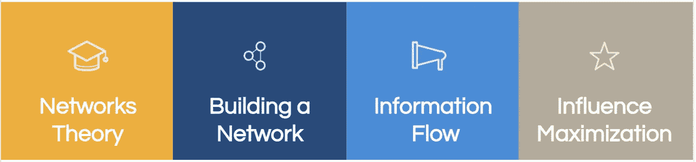

文章大纲

(本文是来自 Pycon 2019 的一次演讲的文字版。你可以[观看下面的视频](https://www.youtube.com/watch?v=px7ff2_Jeqw)和[查看 github 代码库](https://github.com/dimgold/pycon_social_networkx)

[PyCon 2019 talk —社交网络分析](https://www.youtube.com/watch?v=px7ff2_Jeqw)

 [## GitHub—dim gold/PyCon _ Social _ networkx:PyCon 2019 talk 的社交网络分析代码示例

### https://www.youtube.com/watch?v=px7ff2_Jeqw 这个库包含了 PyCon 的社会网络分析代码示例…

github.com](https://github.com/dimgold/pycon_social_networkx) 

# 网络理论

我们将首先简要介绍网络的基本组成部分:节点和边。

示例网络

**节点**(例子中的 A、B、C、D、E)通常代表网络中的实体，可以持有自身属性(如重量、大小、位置等任何属性)和基于网络的属性(如*度* -邻居数或*簇* -节点所属的连通分量等)。).

**边**代表节点之间的连接，也可能包含属性(如代表连接强度的权重、不对称关系情况下的方向或时间，如果适用)。

这两个基本元素可以描述多种现象，如*社会联系、虚拟路由网络、物理电网络、道路网络、生物关系网络*以及许多其他关系。

## 真实世界的网络

现实世界的网络，尤其是社交网络，具有独特的结构，这种结构通常不同于随机的数学网络:

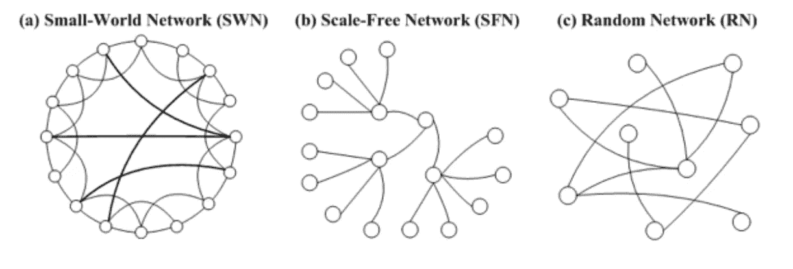

来源:[黄，钟源等，“小世界网络模型中局部信息对社会模拟的影响”j .阿提夫。社会主义者社会主义者 Simul。2005 年第 8 期](https://www.semanticscholar.org/paper/Influence-of-Local-Information-on-Social-in-Network-Huang-Sun/f3b6e274634bb6d1ed92ca3276e073244ad57dd1)

*   [**小世界**](https://en.wikipedia.org/wiki/Small-world_network) 现象声称，真实的网络在任何相连的网络成员之间往往有非常短的路径(就跳数而言)。这适用于真实和虚拟的社交网络(六次握手理论)，也适用于物理网络，如机场或网络交通路线的电力。
*   [**具有幂律度分布的**](https://en.wikipedia.org/wiki/Scale-free_network) 无标度网络具有一个偏斜的群体，该群体具有少数高度连接的节点(例如社会影响)和大量松散连接的节点。
*   [**同向性**](https://en.wikipedia.org/wiki/Homophily) 是个体与相似的他人产生联想和联结的倾向，从而导致邻里之间具有相似的属性。

## 中心性度量

高度集中的节点在网络中起着关键作用，充当不同网络动态的枢纽。然而[中心性](https://en.wikipedia.org/wiki/Centrality)的定义和重要性可能因情况而异，并且可能指不同的中心性测量:

*   **度** —节点的邻居数量
*   **特征向量/ PageRank** —邻居迭代圆
*   **接近度** —对所有节点的接近程度
*   **介数** —通过节点的最短路径的数量

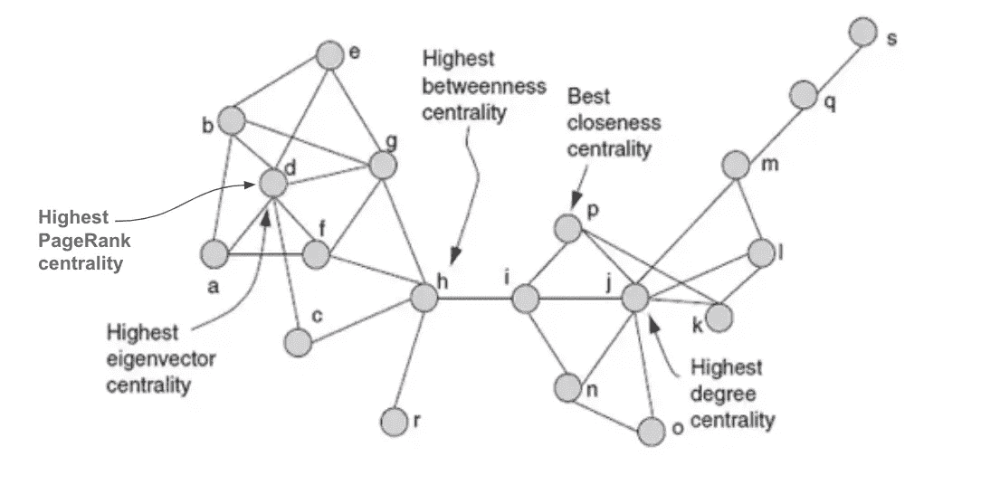

各种中心性测量的说明。资料来源——阿罗约.."发现社交网络中的关键人物."*计算社会网络分析* (2010 )

不同的度量在不同的场景中是有用的，例如网页排名(页面排名)、临界点检测(中间性)、交通枢纽(接近度)和其他应用。

# 构建网络

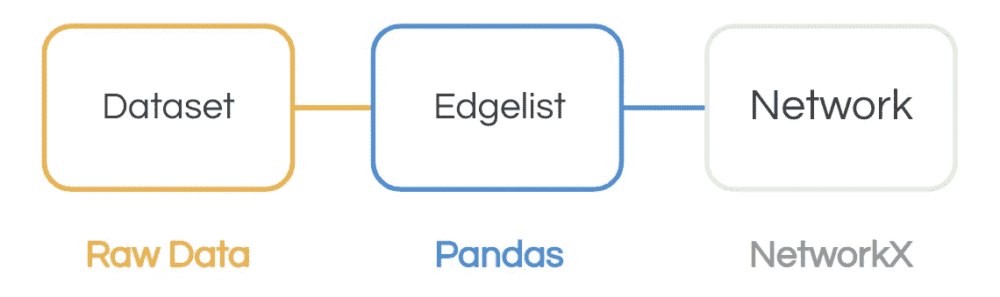

只要我们能够描述节点之间的关系，就可以从各种数据集构建网络。在下面的例子中，我们将使用[**Python*networkx***](https://networkx.org/)包构建并可视化 [Eurovision 2018 投票网络(基于官方数据)](https://eurovision.tv/story/the-results-eurovision-2018-dive-into-numbers)。

我们将**从 excel 文件中读取数据**到一个 ***熊猫*** 数据帧中，以获得投票的表格表示。由于每行代表每个国家的所有选票，我们将**融化**数据集，以确保每行代表两个国家(*节点*)之间的一张选票(*边*)。

然后，我们将**使用 *networkx* 从我们作为熊猫数据帧的边列表中构建一个有向图**。最后，我们将尝试使用泛型方法来使**可视化**，如下面的代码所示:

从 excel 文件加载欧洲电视网

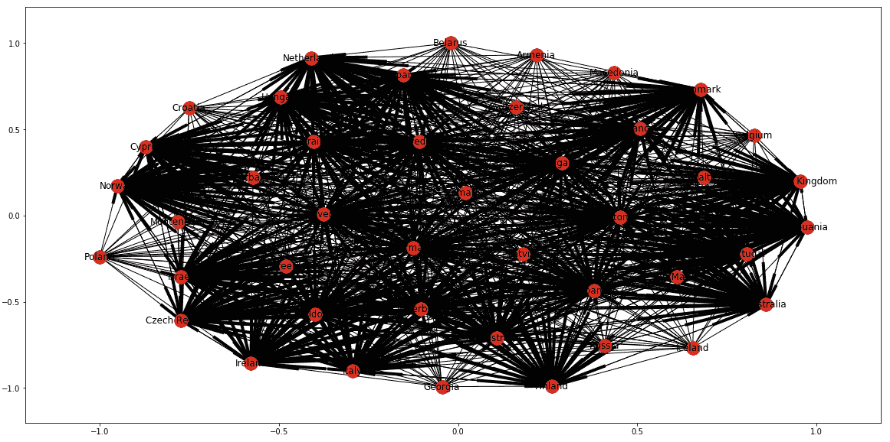

nx.draw_networkx(G)欧洲电视网 2018 投票网络结果

## 形象化

不幸的是内置的 ***绘制*** 的方法产生了一个非常难以理解的图形。这种方法试图绘制一个高度连通的图形，但是由于没有有用的“提示”,它无法从数据中获得很多意义。我们将通过**划分和征服**剧情的不同视觉方面，利用我们对实体的先验知识来增强图形:

*   **位置—** 每个国家根据其地理位置进行分配
*   每个国家都被它的国旗和国旗颜色所识别
*   **大小** —节点和边的大小代表点数

最后，我们将**分部分绘制网络组件**:

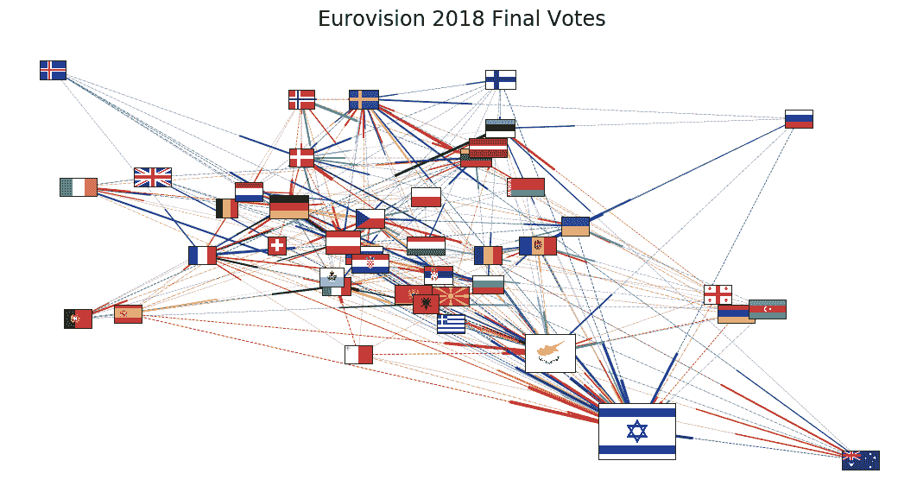

新的数据可读性更强，让我们对投票有了一个简要的了解。作为一般的旁注，绘制网络图通常很困难，需要在呈现的数据量和传达的信息之间进行深思熟虑的权衡。(可以尝试探索其他网络可视化工具如 [Gephi](http://gephi.github.io/) 、 [Pyvis](/making-network-graphs-interactive-with-python-and-pyvis-b754c22c270) 或 [GraphChi](https://github.com/GraphChi/graphchi-cpp) )。

# 信息流

信息扩散过程可能类似于疾病的病毒传播，遵循从一个个体跳到他的社会邻居的传染动力学。两个流行的基本模型经常被用来描述这个过程:

**线性阈值**定义了一个基于阈值的行为，其中影响从节点的多个邻居累积，只有当累积的影响超过某个阈值时才被激活。这种行为对于电影推荐来说是典型的，你的一个朋友的建议可能最终会说服你去看一部电影。

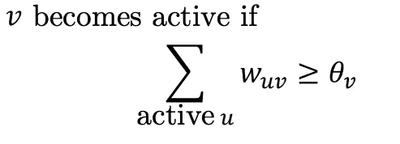

线性阈值激活函数。来源:[独立级联和线性阈值模型。](https://link.springer.com/chapter/10.1007/978-3-319-23105-1_4) P. Shakarian，A . Bhatnagar，A . Aleali，E . Shaabani，R . Guo——社会网络中的扩散，2015 年

在**独立级联模型中，**节点的每个活动邻居都有概率和独立的机会激活该节点。这类似于病毒的传播，例如在新冠肺炎，每个社会互动都可能引发感染。

## 信息流示例

为了说明信息传播过程，我们将使用基于《权力的游戏》中角色的[剑网](https://networkofthrones.wordpress.com/)。该网络是基于“冰与火之歌”中的共同出现而构建的。

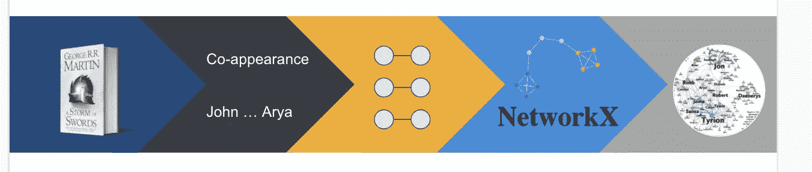

《权力的游戏》网络创作流程示意图。

依靠独立的级联模型，我们将试图追踪谣言传播的动态，这在这个节目中很常见。

来源:[https://www.pinterest.com/pin/753508581387517221/](https://www.pinterest.com/pin/753508581387517221/)

**剧透预警！假设*琼恩·雪诺*在过程开始时一无所知，而他的两个忠实朋友*布兰·史塔克*和*山姆威尔·塔利*知道一个关于他生活的非常重要的秘密。让我们看看在*独立级联*模式下谣言是如何传播的:**

独立级联过程模拟代码

谣言在 *t=1* 到达乔恩，在接下来的时间里传播到他的邻居，并迅速传遍整个网络，最终成为众所周知的事情:

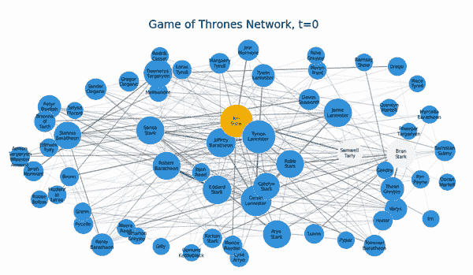

《权力的游戏》网络上的独立级联扩散

这种动力学高度依赖于模型参数，模型参数可以将扩散过程驱动到不同的模式。

# 影响力最大化

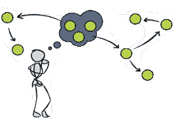

来源:[https://quizlet.com/398701664/flashcards](https://quizlet.com/398701664/flashcards)

**影响最大化问题**描述了一种营销(但不仅仅是)设置，其中营销者的目标是选择网络中有限的一组节点(**播种组**)，以便将影响自然地传播到尽可能多的节点。例如，考虑邀请有限数量的有影响力的人参加一个著名的产品发布会，以便将消息传播给他们网络中的其他人。

这种影响者可以用许多技术来识别，比如使用我们上面提到的中心性度量。以下是*权力的游戏*网络中最核心的节点，根据不同的衡量标准:

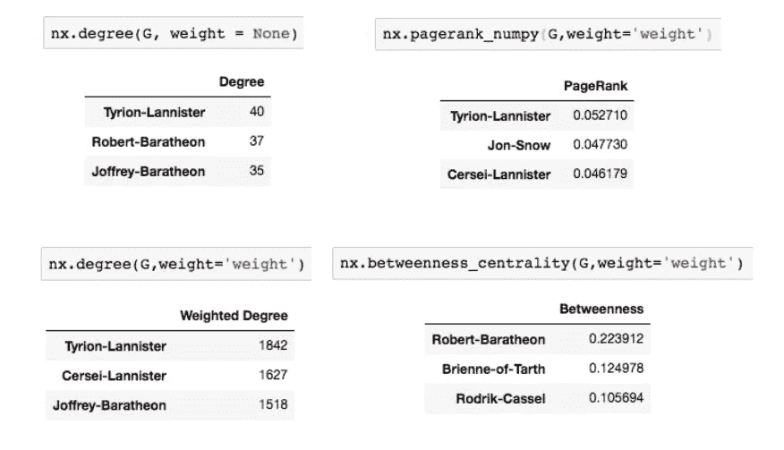

《权力的游戏》网络中的中心性度量

正如我们所看到的，一些角色在不同的措施中重新出现，并且也因其在节目中的社会影响力而闻名。

通过模拟大多数中心节点的选择，我们观察到选择网络的单个节点可以实现大约 50%的网络覆盖——这就是社交影响者可能有多重要。

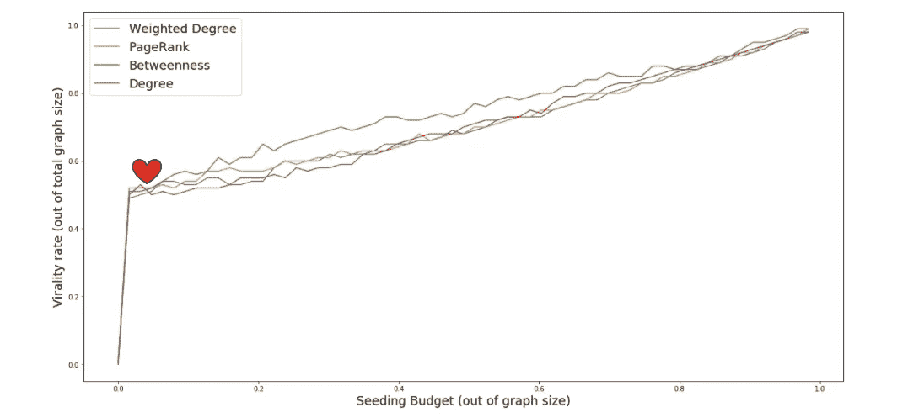

网络通过不同的方法和预算影响覆盖范围

另一方面，**影响力最大化很难**。事实上，这被认为是一个 **NP 难问题**。开发了许多试探法来在有效的计算中寻找最佳播种集。尝试一种强力方法来寻找我们网络中的最佳播种夫妇，结果花费了 41 分钟，实现了 56%的覆盖率(通过选择*劳勃·拜拉席恩*和*卓戈·卡奥*)——这是一个用中心启发式很难实现的结果。

# 总结

网络分析是各种领域的复杂而有用的工具，特别是在快速增长的社交网络中。这种分析的应用包括*营销* i *影响力最大化、欺诈检测*或*推荐系统*。有多种工具和技术可应用于网络数据集，但需要明智地选择它们，并考虑问题和网络的独特属性。

如果您希望在您的学术研究中引用该资源，请使用以下格式:

戈登伯格，德米特里。"社会网络分析:从图论到 python 的应用."PyCon 2019 —第三届以色列国家 Python 大会，以色列，2019 年。arXiv 预印本 arXiv:2102.10014 (2021)。

# 有用的资源

## **代码和数据:**

*   [权力的游戏数据集](https://github.com/jeffreylancaster/game-of-thrones) @jeffreylancaster
*   [网络教程](https://github.com/MridulS/pydata-networkx) @MridulS
*   [旗帜图片](https://github.com/linssen/country-flag-icons) @linssen
*   [欧洲电视网数据](https://eurovision.tv/story/the-results-eurovision-2018-dive-into-numbers)

## **论文:**

*   [时机问题:通过预定的播种在社交网络中实现影响力最大化——d . golden Berg 等人](http://bigdatalab.tau.ac.il/wp-content/uploads/2018/07/timing-matters.pdf)
*   [主动病毒式营销:将持续的主动播种努力纳入扩散模式——a . Sela 等人](https://www.sciencedirect.com/science/article/abs/pii/S095741741830246X)
*   [通过社交网络最大化影响力传播——e . Tardos 等人](https://www.cs.cornell.edu/home/kleinber/kdd03-inf.pdf)
*   [社会网络中的有效影响力最大化——陈等](https://www.microsoft.com/en-us/research/wp-content/uploads/2016/02/weic-kdd09_influence.pdf)
*   [独立级联和线性阈值模型- P. Shakarian 等人](https://link.springer.com/chapter/10.1007/978-3-319-23105-1_4)

# 让我们保持联系！

通过[邮件](mailto:dima.goldenberg@booking.com)或 [Linkedin](https://www.linkedin.com/in/dimgold/) 向我提出问题和想法。

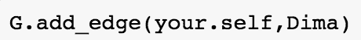

对我在 Booking.com 的工作感兴趣吗？[查看](https://booking.ai/)我们的[Booking.com 数据科学](https://medium.com/u/1aecbb50db31?source=post_page-----d12e9a34c2c7--------------------------------)博客。

 [## Booking.com 数据科学

### Booking.com 的数据科学和机器学习博客

booking.ai](https://booking.ai)