# 具有 Genshin 影响的社会网络分析

> 原文：<https://towardsdatascience.com/social-network-analysis-with-genshin-impact-df49da8c10c3?source=collection_archive---------16----------------------->

## python 中的社会网络分析，应用于 Genshin Impact。

由 [Omar Flores](https://unsplash.com/@__itsflores?utm_source=unsplash&utm_medium=referral&utm_content=creditCopyText) 在 [Unsplash](https://unsplash.com/s/photos/network?utm_source=unsplash&utm_medium=referral&utm_content=creditCopyText) 拍摄的照片

# 0.什么和为什么——背景和目的

Genshin 是一款开放世界的动作角色扮演游戏。除了被评为 2020 年 Google Play 最佳游戏之一之外，它也是 2021 年上半年最卖座的手机游戏之一。与游戏打包在一起的是传说，玩家和其他角色在故事线中穿插。

游戏中不同角色相互提及的方式激发了对 Genshin Impact 角色的社交网络的分析，以回答以下问题:

*   谁是 [Teyvet(根申设定的世界)](https://genshin-impact.fandom.com/wiki/Teyvat)中最受欢迎的角色？
*   谁是《泰瓦特》中最重要的人物？

# 1.分析前:数据来源和范围

*   从[gen shin Impact fandom wiki](https://genshin-impact.fandom.com/wiki/Genshin_Impact_Wiki)手动整理数据
*   只有[可玩角色](https://genshin-impact.fandom.com/wiki/Characters#Playable_Characters)被考虑用于分析，因为他们往往是大多数玩家熟悉的角色
*   如果 A 在 A 的故事任务或台词中“提到”了 B，那么 A 就被认为与 B 有联系
*   *注:本次探险的数据收集于 2021 年 7 月 28 日，目前的旗帜(最新人物)是上里绚香。目前没有发布的闪电角色不包括在内(*这是在知道闪电的任务线之前写的)
*   用于分析的数据和完整代码可在[这里](https://github.com/kaili-chen/writing-supplements/tree/master/genshin%20social%20network)找到。为了简洁起见，在本文中可能会修改或省略代码。
*   用于分析的库是 [NetworkX](https://networkx.org) (导入为`nx`)

# 2.Genshin 社交网络——指导

定向社交网络意味着角色之间的联系是定向的，可能不是相互的。

## 构建有向社会网络

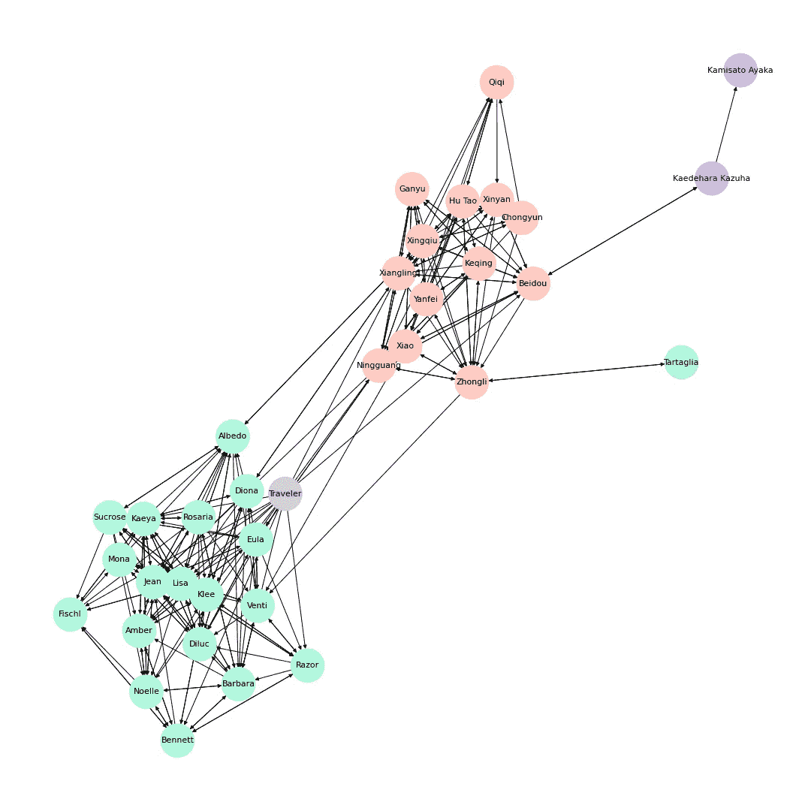

图一。Genshin 定向社交网络

*   角色根据他们所属的国家被涂上颜色:绿色代表蒙德斯塔特，橙色代表李越，蓝色代表斯涅日纳亚，紫色代表闪电，灰色代表不属于任何一个国家的旅行者(玩家)

## 网络观测

*   有许多关系不是对等的(单向的):

一个例子:Kadehara Kazuha → Kamisato 绚香，但不存在相反的关系，这表明 Kazuha 提到并因此暗示知道绚香，但绚香不知道 Kazuha。同理对于中力→ Venti。

*   有些联系是通往其他国家的重要桥梁:

李越和斯涅日那亚之间的唯一纽带是中坜和塔尔塔利亚之间的纽带。北斗与 Kazuha 的联系是李越和闪电之间唯一的联系。

这可能会预测玩家将如何被介绍到更新的地区——通过让玩家首先与这些桥接角色(例如，Kazuha，塔尔塔利亚)互动。

*   蒙德都特的角色似乎比李越的角色更紧密(联系更多)，这可能意味着蒙德都特的角色比李越的角色更熟悉对方。

## 网络中的角色重要性

为了理解一个角色在这个网络中有多重要，或者说有多中心，使用了中心性度量。中心性度量决定了一个角色在我们的网络中有多重要。每个中心性度量之间的差异是如何解释“重要性”。

有向图有 3 个可以应用的中心性度量:入度和出度中心性以及页面等级中心性。

**度内中心性**

指的是有多少人在给某个特定的节点“送领带”。在我们的网络中，它指的是有多少人提到了某个特定人物，是衡量某个特定人物受欢迎程度的一种方式。更高的 in-degree 意味着一个角色被其他人提及很多，推断更受欢迎。

图二。具有最高程度中心性的前 10 个字符的排名

*   平均程度中心性是 7——每个字符有大约 7 个其他字符提到它们。
*   最受欢迎的角色大多来自蒙德都特，吉恩、丽莎、凯娅和克利的数量几乎是平均水平的两倍。
*   了解了故事情节，这个结果就说得通了。前五名最受欢迎的角色都是蒙德斯泰特管理机构的成员，经常一起出现。

**外度中心性**

与 in-degree centralityt 相反，指的是一个特定的字符直接向多少个字符发送联系。在我们的网络中，这是一种衡量一个特定角色认识多少字符的方法。

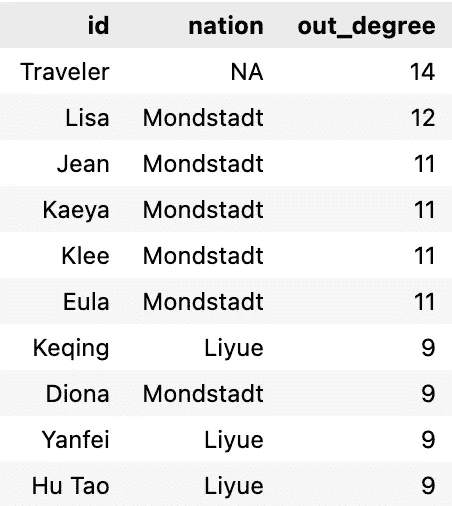

图三。具有最高出度中心性的前 10 个字符的排名

*   平均出度中心性是 7——每个字符提到大约 7 个其他字符
*   最具社会性的价值观在这里并没有像在学位上那样表现出巨大的差异
*   有趣的是，网络的平均(包括小数)入度和出度几乎完全相同，但入度和出度计数的分布不同。

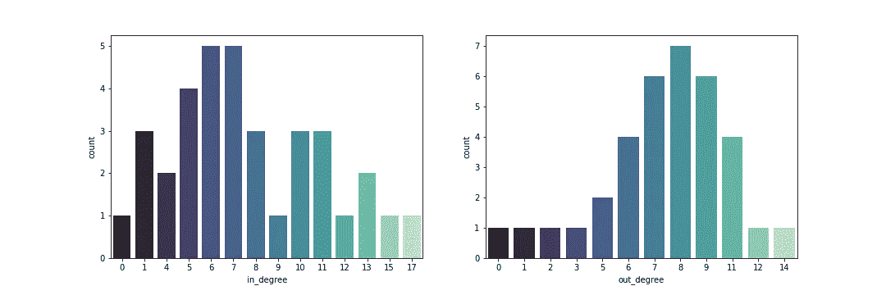

图 4。人物内外向中心性的分布

*   出度表示更接近正态分布的分布

**页面排名中心性**

[为影响力](https://cambridge-intelligence.com/eigencentrality-pagerank/)增加了一个额外的考虑因素——比提到一个角色的角色数量(入度)更重要的是有多少*有影响力的*纽带即将到来。较高的页面等级中心性值表明一个字符与更有影响力的字符相连接，并且具有超出其直接联系的更广范围。

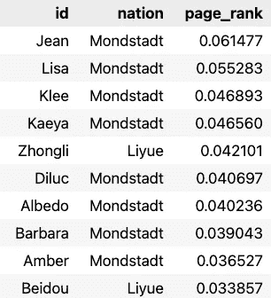

图五。具有最高页面等级中心性的前 10 个字符的等级

*   这个列表中的大多数角色之前都被列为具有最高程度中心性值的角色，所以他们不仅受欢迎，还知道其他知名角色

# 3.Genshin 社交网络——无向

为了进一步分析网络，有必要将有向图转换成无向图。此过程中的一个主要考虑因素是单向(不对称)关系的处理。无向平局意味着平局是相互的(双向的)，这在我们的上下文中意味着两个角色互相认识(足以提及对方)。因此，在我们的无向网络中去掉所有的单向联系，只考虑角色之间的相互联系，会更有意义。

## 设置无向网络

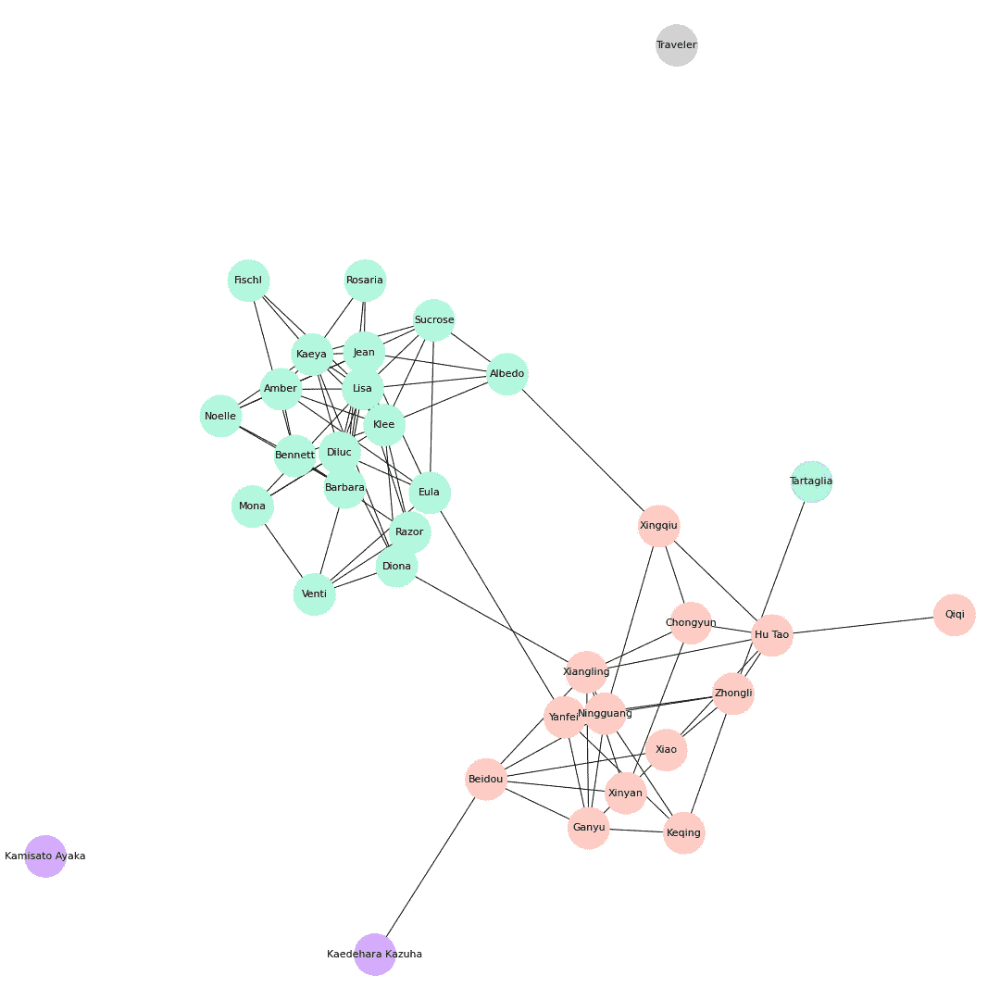

图六。Genshin 无向社会网络

## 网络观测

*   要求连接是双向的会导致图中出现与其他字符无关的孤立字符(可怜的旅行者)
*   与有向网络相比，这个网络看起来更稀疏

隔离物不太可能是这个网络的中心(主要是因为它们不是这个网络的一部分)，它们将被移除。

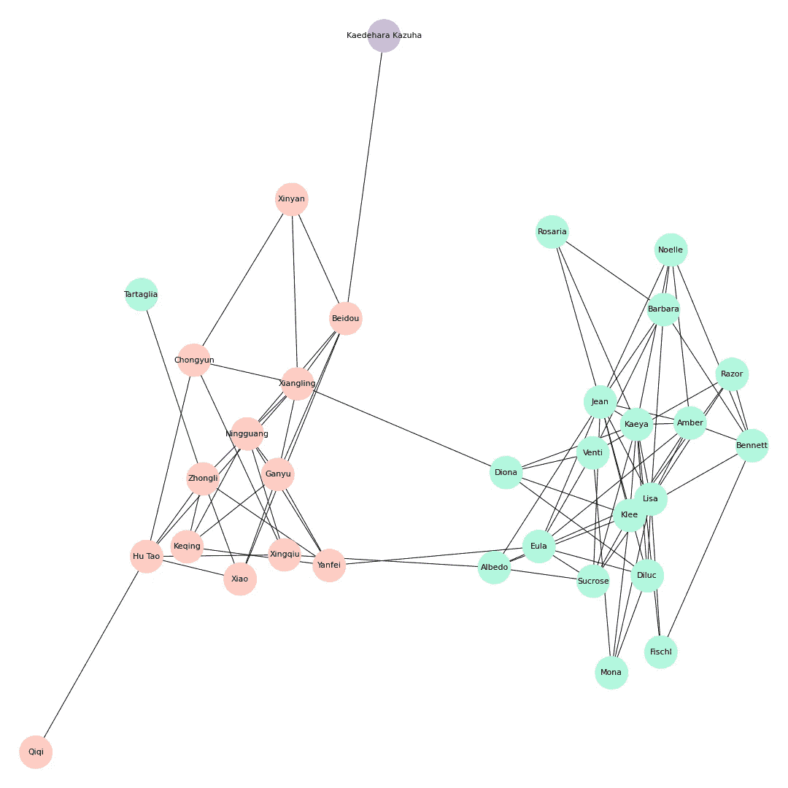

图 7。无隔离的无向社会网络

## 网络中的角色重要性

如果网络是无向的，就可以使用度中心性之外的中心性度量:接近度、中间性、特征向量中心性。

**程度中心性** 将重要性放在一个字符直接连接到多少个字符上。衡量一个角色在网络中的重要性的简单方法——如果他们认识很多其他角色，那么这个角色是重要的，但是仍然是与稍后解释的其他重要性度量进行比较的良好基础。

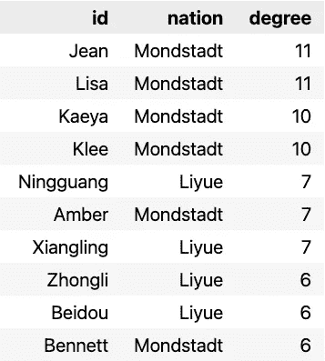

图 8。具有最高程度中心性的前 10 个字符的排序

*   迪吕克之前排在第一位，有很高的程度中心性，一旦相互关系加强，他就不再在名单上了，这表明尽管他被许多角色提到，但他似乎并不认识他们(奇怪的是，很符合角色的特点……)

**接近中心性** 通过测量一个字符在其他字符之间的最短路径中的次数，将重要性放在该字符间接连接到多少个字符上。这里更重要的角色是可以通过最短路径到达更多角色的角色——能够以最快的速度将信息传播给网络中的大多数角色。

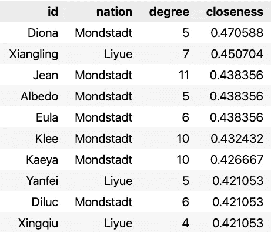

图九。具有最高接近中心性的前 10 个角色的排名

*   这个列表中的大多数字符不具有最高程度的中心性(知道许多其他字符)，但是能够最快地到达最多数量的其他字符
*   回头看一下无向网络(图 7)，具有较高接近中心性值的角色是蒙德斯塔特和李越之间的纽带——迪奥娜、香玲、阿尔比多、邢丘、尤拉、殷飞，这解释了它们的高度重要性，因为这些角色具有将信息传播给他们自己国家以外的更广泛受众的联系

**中间中心性**
强调网络中的信息经纪人，即“介于”想要联系对方的角色对之间的角色。具有较高“中间性”的角色允许这些角色对信息流有更多的控制，这也是它们之所以重要的原因。

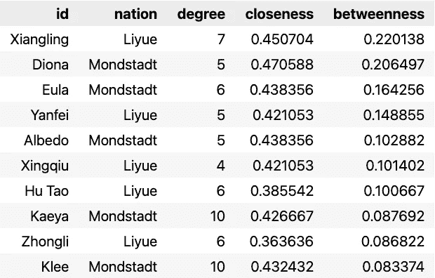

图九。具有最高介数中心性的前 10 位字符排序

*   请注意，与亲密度中心性相比，中间度中心性会产生不同的字符排序列表
*   同样，具有较高中间中心性值的字符是那些连接蒙德都特和李越的字符——Diona、香菱、Albedo、Xingqiu、Eula、殷飞，表明它们是两个国家之间重要的信息经纪人
*   当考虑无向图(图 7)时，胡涛是奇奇与网络其余部分的唯一纽带，这意味着奇奇依赖胡涛来获得信息或向网络其余部分传播信息
*   上述观点也适用于塔尔塔利亚和中利——塔尔塔利亚依赖中利在更广泛的网络中访问和分发信息

**特征向量中心性** 将重要性定义为与网络中其他有影响力的人物有联系——与关系良好的人物有联系。更重要的是与更好连接的字符的联系，而不是简单地将每个联系视为相等(程度中心性就是这样)。

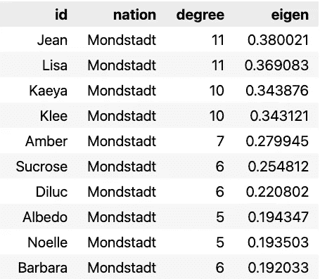

图 10。具有最高特征向量中心性的前 10 个字符的排序

*   这个排名看起来与上面的度中心性非常相似，除了这个列表只包含来自 Mondstadt 的字符，这意味着这些字符不仅仅有很多联系，这些联系也往往具有更高的质量(对于在网络中具有更高影响力的字符)
*   类似地，等级中心性排名高但特征向量中心性排名低的角色(例如宁光)有很多联系，但这些联系是与[离权力中心](https://www.strategic-planet.com/2019/07/understanding-the-concepts-of-eigenvector-centrality-and-pagerank/)有一定距离的角色

# 结论:谁是谁？

**谁是特伊维特最受欢迎的人？**

***琴***

*   最高程度的中心性(有向网络)
*   最高中心度(无向网络)
*   难以否认的是，很多人物都认识琼，足以谈论她
*   在故事情节中，她也是玩家在遇到她之前最先听说的角色之一

**谁是 Teyvat 中最重要的人物？**

***卡耶***

*   这不太容易回答，什么被认为是重要的可能是主观的，需要更全面地看待每个节点在社交网络中的作用

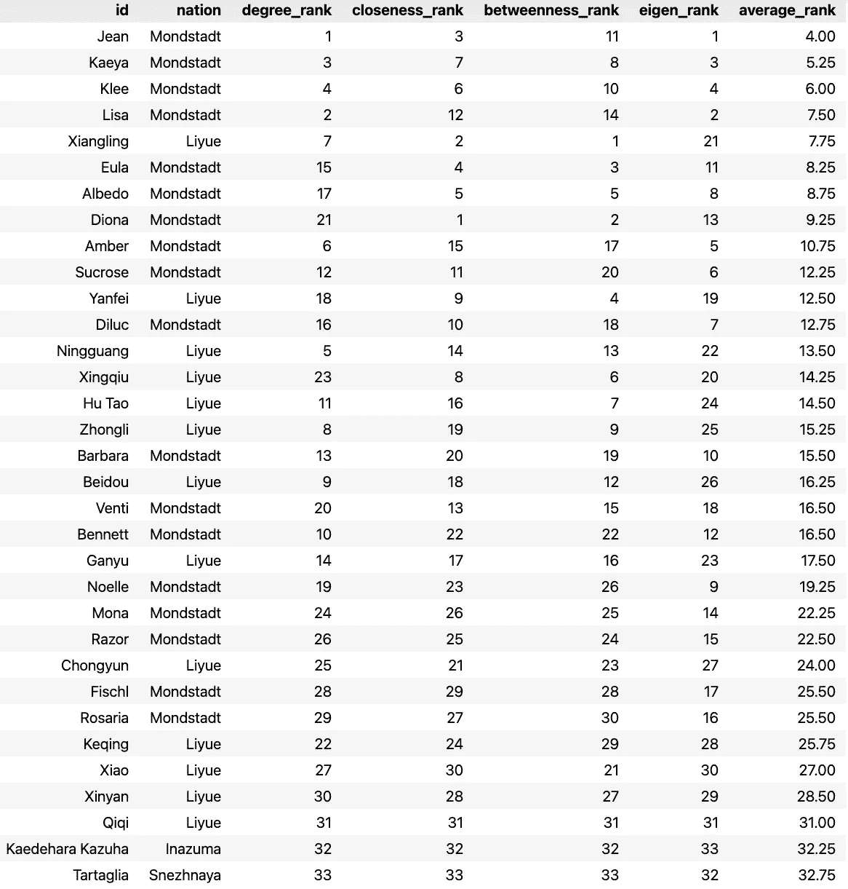

图 11。前 10 个字符的平均排名

*   一个简单的方法是平均每个角色在各种无向网络中心性中的排名，这表明 Jean 是最重要的
*   然而，Kaeya 在社交网络中有更有利的位置，因为他在所有应用的角色重要性测量中排名前 10，并且不仅受欢迎，而且是可以控制社交网络中信息流的重要角色

## 泰勒:博士

在 Teyvat，你应该认识 Jean，但是如果你需要信息，去找 Kaeya。