# 作为一名独立创始人，试推出一款人工智能/人工智能产品

> 原文：<https://towardsdatascience.com/soft-launching-an-ai-ml-product-as-a-solo-founder-87ee81bbe6f6?source=collection_archive---------16----------------------->

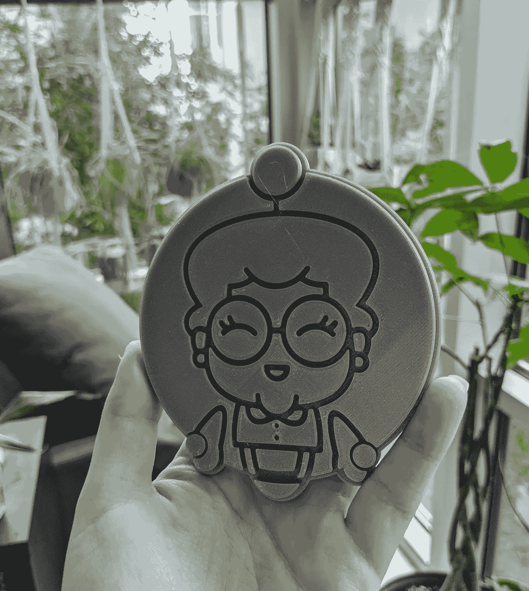

**Pro 提示:** 3D 打印创业公司可以自己制作 swag。图片作者。

## 深入了解我如何构建 Print Nanny，它使用计算机视觉来自动检测 3D 打印故障。

**技术深度探讨**我如何构建[打印保姆](https://www.print-nanny.com/)、**，它使用计算机视觉自动检测 3D 打印故障。**我将介绍每个开发阶段:从**最小可行原型**到**扩大规模**以满足客户需求。

作为单枪匹马的创始人，推出一款人工智能/人工智能驱动的产品是一场高风险的赌博。下面是我如何通过定义一个成功的 ML 战略并在每个阶段利用正确的**谷歌云平台**服务来充分利用我有限的时间。

去年春天我过生日的时候，我给自己买了每个女孩都需要的东西:**一个熔融细丝制造系统**(又名 3D 打印机)。我组装了打印机，小心地运行校准程序，并拿出我的卡尺来检查测试打印。

我的大多数照片都完美无瑕！虽然偶尔会出现印刷失败的情况。我设置了 [OctoPrint](https://octoprint.org/) ，这是一个 3D 打印机的开源 web 接口。我经常偷看直播镜头，想知道这是否是新父母对高科技婴儿监视器的一点感受。

肯定有更好的方法来自动监控打印机的健康状况吧？

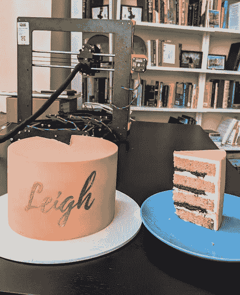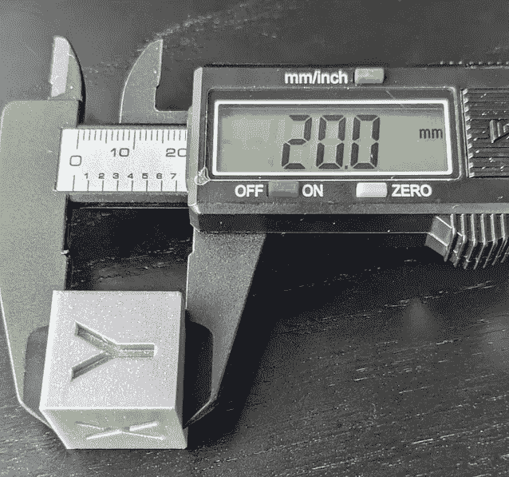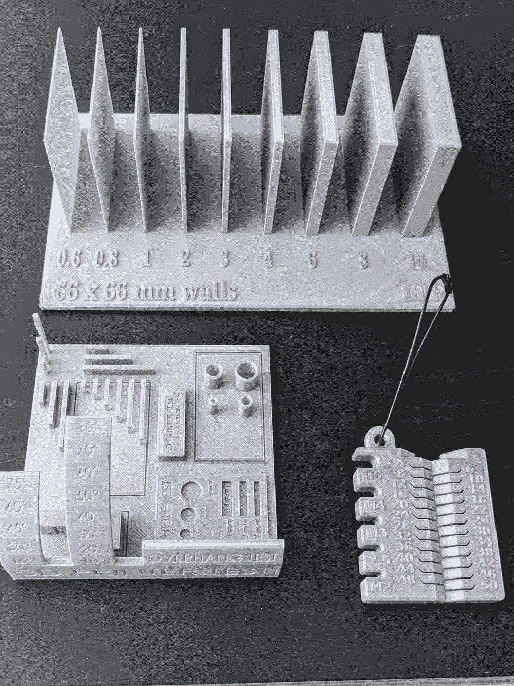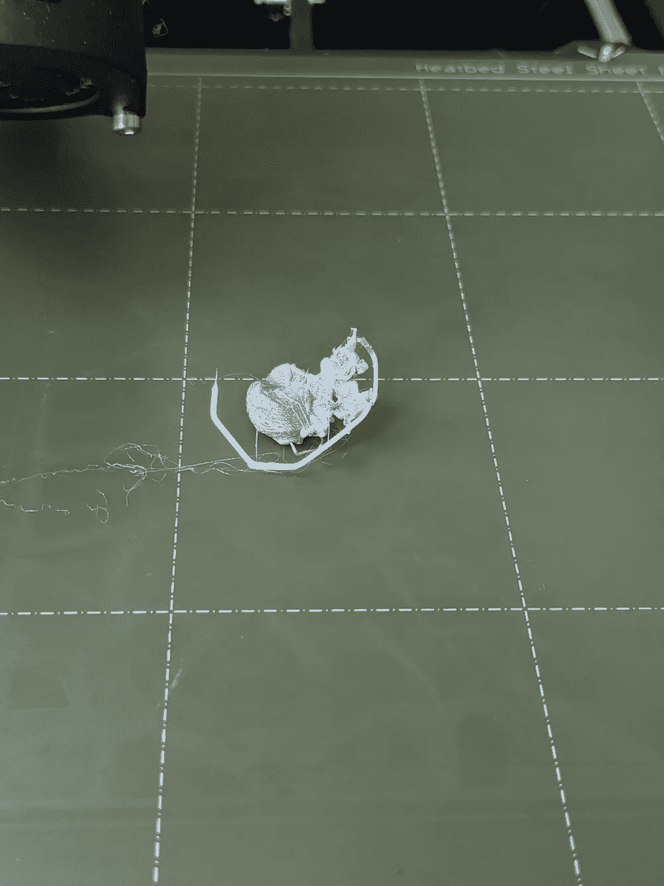

每个女孩都需要好的卡尺和熔丝沉积系统。除了几个明显的例外，我的第一批照片大多完美无瑕。作者图片。

# 机器学习策略

开发 AI/ML 支持的产品是一个**昂贵的**命题——在实现任何投资回报之前，有很高的失败风险。

根据 Rackspace 在 2021 年 1 月进行的一项全球研究， 87%的数据科学项目**从未投入生产。**

为了克服困难，接受调查的公司在机器学习项目上平均花费了 106 万美元。作为一个单独的创始人，我不准备为我的想法花费超过一百万美元！

幸运的是，我是谷歌开发专家项目的一员——这个项目里全是喜欢与世界分享知识的人(T2)。进入这个项目时，我有了一个好主意，如何通过将“无差别的繁重工作”外包给合适的云服务，快速而廉价地构建一个原型。

## 是什么让机器学习成为一个高风险的赌注？

在 1，870 名 Rackspace 研究参与者中，以下是 AI/ML 项目中报告的当前使用、未来计划和失败原因的总结。

挑战和障碍中有几个共同的主题是显而易见的:

*   **所有数据:**数据质量差，数据不可访问，缺乏数据管理，无法以有意义的方式构建/集成数据。
*   专业知识和熟练人才供不应求。好消息是:你可以在前进的过程中发展技能和直觉。我在这篇文章中涉及的所有内容都可以在没有高级学位的情况下实现！
*   **缺乏支持人工智能/人工智能的基础设施。**我将向您展示如何从零开始逐步构建数据和 ML 基础设施。
*   **衡量 AI/ML 商业价值的挑战。**

我将向您展示我如何通过在 ML 驱动的产品的每个成熟阶段利用**正确的技术和产品选择**来实现快速迭代计划，从而战胜困难(不到 1:10 的成功机会)。

我还将展示我是如何做到这一点的**而没有牺牲大多数公司花费数百万**试图实现的**科学严谨性和真实世界的结果质量——所有这些都只是成本的一小部分！**

让我们开始吧。🤓

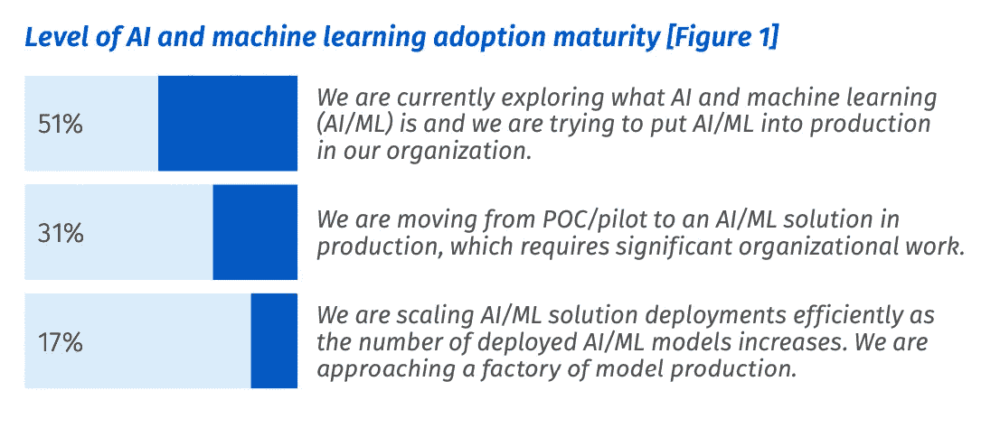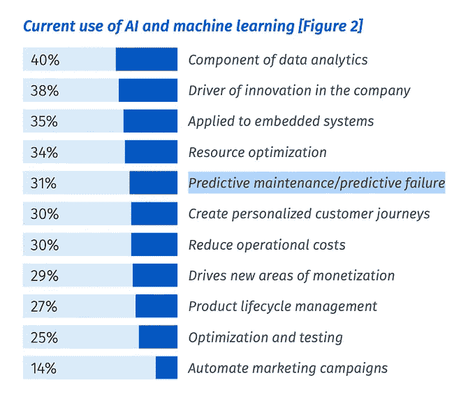

*51%的公司在探索 AI /试图将 AI/ML 投入生产。来源:* [*组织在 AI 和机器学习方面成功了吗？*](https://www.rackspace.com/sites/default/files/pdf-uploads/Rackspace-White-Paper-AI-Machine-Learning.pdf)

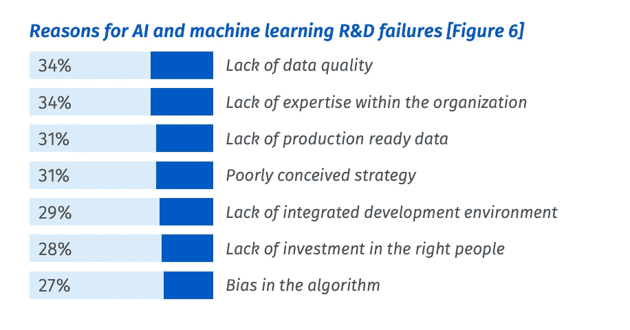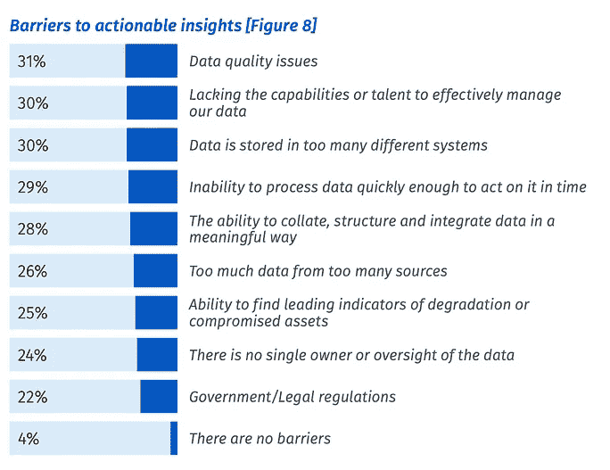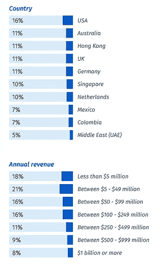

*数据是挑战和障碍的统一主题。来源:* [*组织在 AI 和机器学习方面是否成功？*](https://www.rackspace.com/sites/default/files/pdf-uploads/Rackspace-White-Paper-AI-Machine-Learning.pdf)

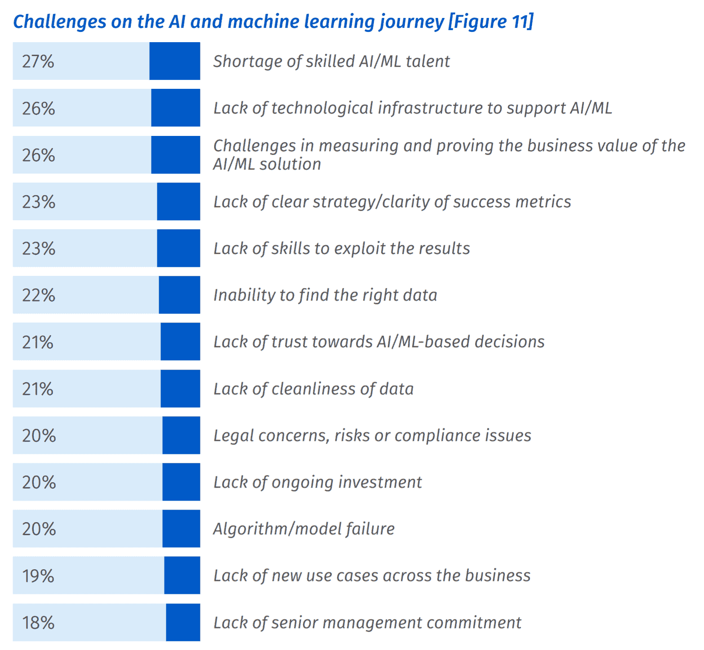

*机器学习之旅的顶级挑战。来源:* [*组织在 AI 和机器学习方面是否成功？*](https://www.rackspace.com/sites/default/files/pdf-uploads/Rackspace-White-Paper-AI-Machine-Learning.pdf)

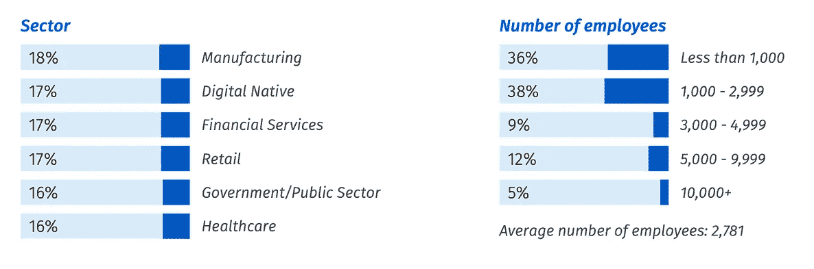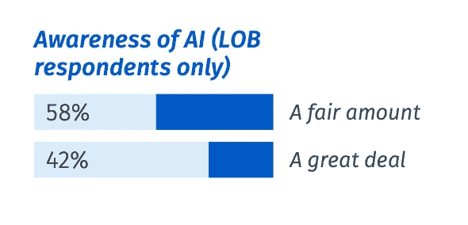

*58%的受访者表示对人工智能的了解“相当多”，42%的受访者表示“很多”来源:* [*组织在 AI 和机器学习方面是否成功？*](https://www.rackspace.com/sites/default/files/pdf-uploads/Rackspace-White-Paper-AI-Machine-Learning.pdf)

# 定义问题和机会

有什么问题？3D 打印机太不可靠了。

**那是因为 3D 打印机技术还没有成熟！几年前，这项技术还是业余爱好者的领域。在致力于更可靠的制造过程之前，工业应用仅限于快速原型制作。**

如今，3D 打印在小规模制造业中得到更多应用。当现有的制造业供应线因为新冠肺炎疫情而消失时，这种趋势加速了。

一个**不可靠的工具**对于一个业余爱好者来说是一个麻烦，但是对于一个小规模的制造企业来说却是一个**潜在的责任**！

在下一节中，我将概述这个领域中的问题，并强调用 AI/ML 产品解决这些问题的机会。

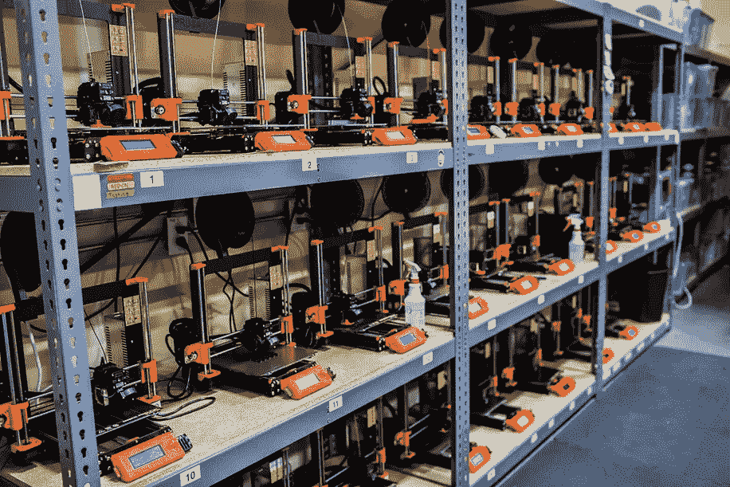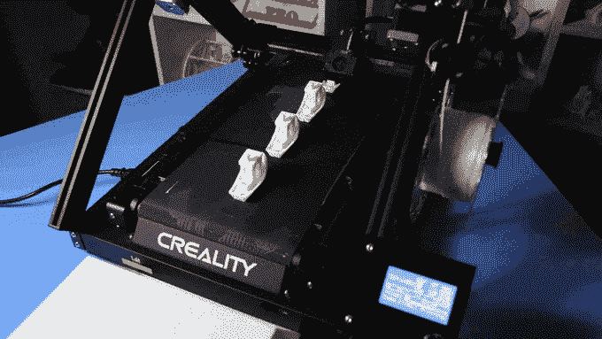

*图片来源:*[*Prusa 3D Print Farm for Nerf Mods*](https://outofdarts.com/blogs/news/prusa-3d-print-farm-for-nerf-mods)*(左)* [*Creality 推出传送带 3D 打印机*](https://www.3dnatives.com/en/creality-3dprintmill-conveyer-belt-231120204/#!) *(右)*

是什么让 3D 打印机变得如此不可靠？

1.  打印工作需要**小时**(有时**天**才能完成，随时可能失败。需要几乎不间断的人工监控。
2.  缺乏可靠的工业制造过程的闭环控制
3.  3D 打印最常见的形式是将**材料** **加热到 190℃—220℃熔化**。如果不注意，会有火灾危险！
4.  **人为失误**是一大因素！3D 打印机读取的指令是使用一种称为“切片器”的应用程序，根据手动配置的设置创建的培养对正确环境的直觉需要时间和耐心。

即使在我决定设计一个故障检测器的原型之后，战略思路也没有就此结束。我确定了**额外的价值主张**，通过快速模拟、描述性文案和调查进行测试。

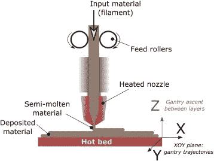

来源:[基于挤压的微流体设备 3D 打印](https://www.grandviewresearch.com/industry-analysis/3d-printing-industry-analysis/)。

## 问题:网络不靠谱！😱

大多数小规模制造商的经营方式是:

1.  家(地下室、车库、储藏室)
2.  仓库或工业空间

在世界上的许多地方，来自多个摄像头的持续上传流会使互联网连接饱和——维持这种状态可能是不可能的，也是不经济的。

为了确保 Print Nanny 离线时仍能工作，我在原型中优先考虑了**设备上的推断**。这让我可以用零模型服务基础设施来测试这个想法，并利用我在小型设备的计算机视觉方面的研究。

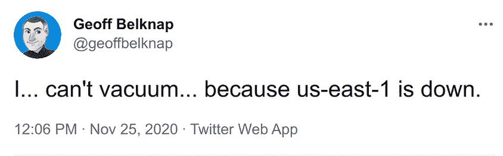

我不想让印刷保姆加入这个俱乐部。

## 问题:即使是失败也不可靠🤪

没有两个 3D 打印失败看起来是一样的！这有许多原因，包括:

1.  打印机硬件是手工组装的。相同的打印机型号可以产生截然不同的结果！打印统一批次需要专家校准。
2.  大部分 3D 打印材料都是**吸湿**(吸水)，导致批次变化和缺陷像天气一样易变！🌧️
3.  许多**设置**，用于将 **3D 模型**分割成 X-Y-Z 运动指令。选择正确的设置需要反复试验才能达到最佳效果。

我的机器学习策略需要考虑到**快速迭代**和**持续改进**来建立客户信任——如果第一个原型不太好也没关系，只要**随后的原型显示出改进。**

无论如何，为了**保持敏捷，**我需要避免让我背上特定类别的机器学习技术债务的策略:

## 改变任何事情都会改变一切(CACE)

CACE 是在[机器学习系统中隐藏的技术债务](https://papers.nips.cc/paper/2015/file/86df7dcfd896fcaf2674f757a2463eba-Paper.pdf)中提出的一个原理，指的是机器学习结果在一个系统中的**纠缠。**

> 例如，考虑一个在模型中使用特征 x1，…xn 的系统。如果我们改变 x1 值的输入分布，其余 n-1 特性的重要性、权重或用途都可能改变。无论是以批量方式对模型进行完全再训练，还是允许以在线方式进行调整，都是如此。添加新特征 xn+1 会导致类似的变化，移除任何特征 xj 也会导致类似的变化。没有任何输入是真正独立的。
> 
> 郑最近对状态 ML 抽象和数据库技术的状态做了一个引人注目的比较[17]，指出在机器学习文献中没有任何东西可以接近关系数据库作为基本抽象的成功。

[机器学习系统中隐藏的技术债务](https://papers.nips.cc/paper/2015/file/86df7dcfd896fcaf2674f757a2463eba-Paper.pdf)

我将在下一节解释我如何避开 CACE 和其他一些常见的陷阱，比如**不稳定的数据依赖**。我还会反思那些节省我时间的抽象概念和那些浪费时间的抽象概念。

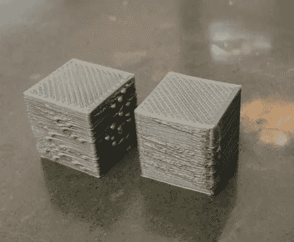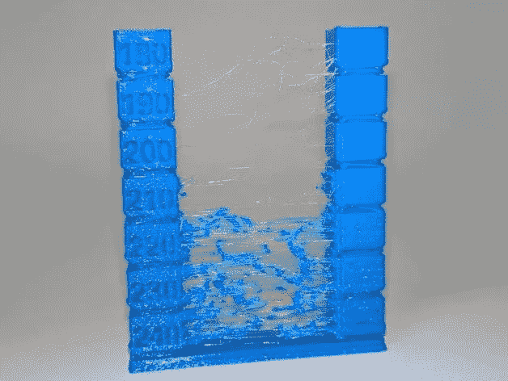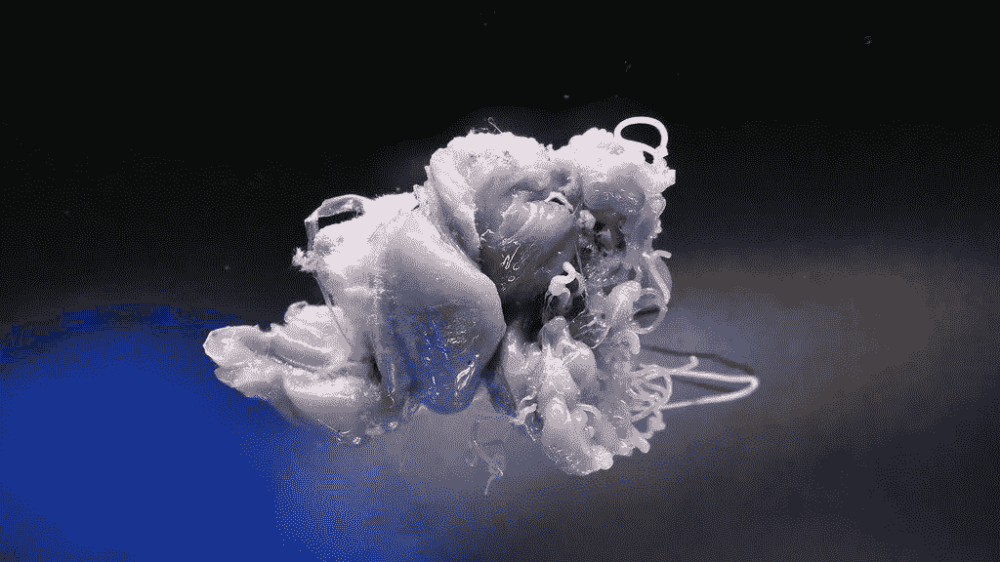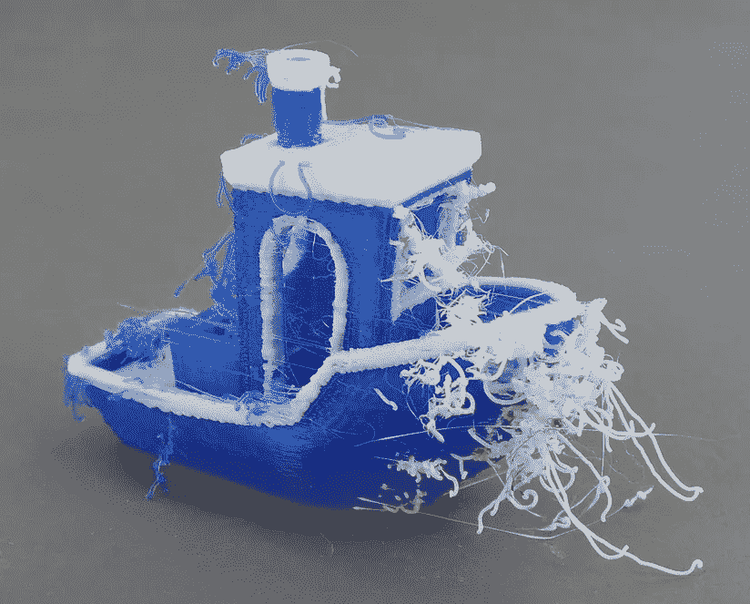

*图片来源:* [*3D 打印的错误正在激发一种新的小故障艺术*](https://www.vice.com/en/article/78xe9x/3d-printed-mistakes-are-inspiring-a-new-kind-of-glitch-art)

# 塑造道路的原型

作为开发可靠产品和机器学习策略的一部分，我“将原型缩小到滑板。”我用这句话来描述从 A 点(问题)到 B 点(客户想去的地方)最简单的运输方式。

我见过机器学习项目因买入/构建完全成型的解决方案而失败，就像下图中的汽车。不仅在早期迭代中收到的反馈是无用的，而且在全面生产运行之前取消也是一个风险。

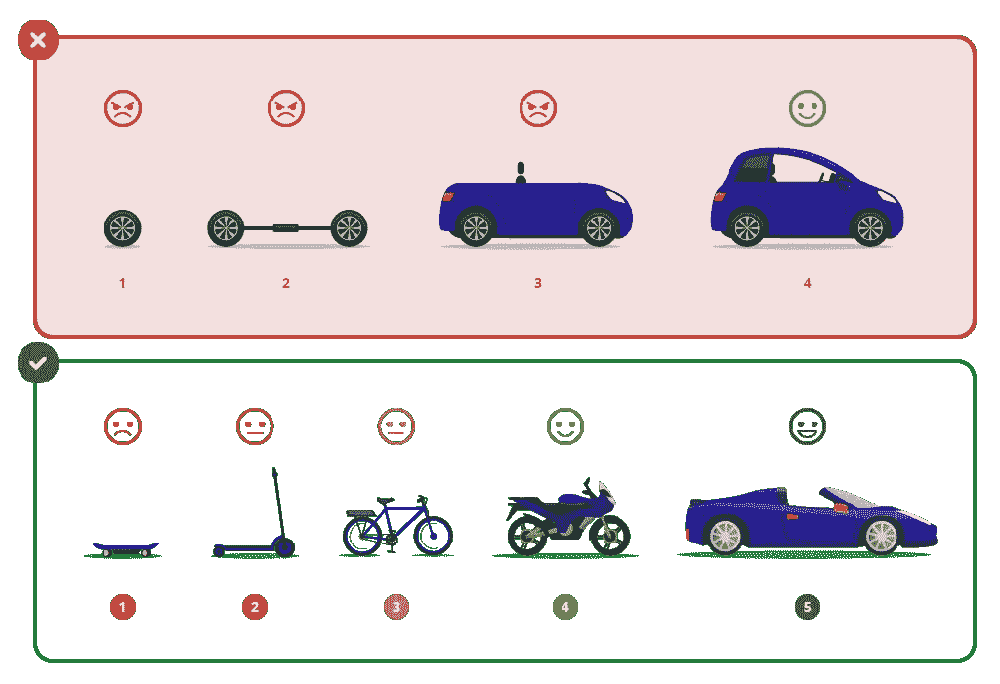

图片来源:[mlsdev.com](https://mlsdev.com/blog/minimum-viable-product-examples)

## 最低超赞产品

我没有构建一个全功能的 web 应用程序，而是将原型开发为一个用于 [OctoPrint](https://octoprint.org/) 的**插件**。OctoPrint 为 3D 打印机、网络摄像头控制和蓬勃发展的社区提供了一个网络界面。

我将**最小的令人敬畏的产品**浓缩为以下内容:

1.  **训练**模型检测以下物体标签:
    {打印、筏、意大利面、粘附、喷嘴}
2.  **通过 OctoPrint 插件将**预测器代码部署到 Raspberry Pi
3.  **计算**健康得分趋势
4.  **自动停止**不健康的打印作业。
5.  **提供关于打印保姆决策的反馈**👍👎

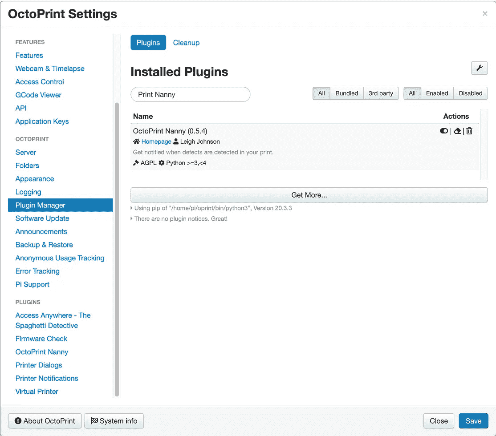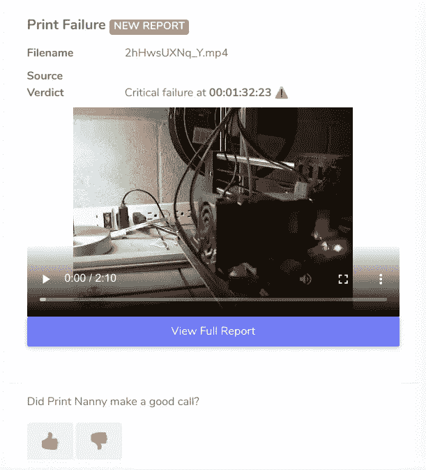

*安装打印保姆作为 OctoPrint 插件(左)。打印失败警告(右)。作者图片。*

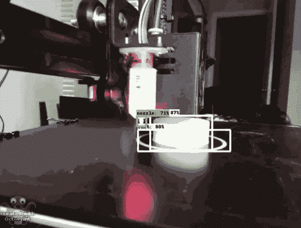

检测标签:打印，筏，喷嘴，意大利面条，粘附。图片作者。

## 原始数据集

获取高质量的标签数据是任何机器学习项目最难的启动成本！以我为例，发烧友们经常上传延时视频到 YouTube。

*   [Youtube-dl](https://github.com/ytdl-org/youtube-dl) 下载 3D 打印延时视频(注意许可证！)
*   [视觉对象标记工具](https://github.com/microsoft/VoTT)用边界框注释图像。

**解锁的额外效率:**我想出了如何**使用 **TensorFlow.js** 模型(从 AutoML Vision 导出)在虚拟对象标记工具中自动建议边界框**。

我在[自动图像注释中解释了如何用很少的预算做到这一点。](https://www.bitsy.ai/automate-bounding-box-annotation-with-tensorflow-and-automl/) 🧠

与手工绘制每个方框相比，调整指导模型的建议将每小时标记的图像数量**增加了 10 倍**。

## 为云 AutoML 准备数据

我经常在原型阶段使用 Google AutoML 产品。

这些产品面向对机器学习知识有限的人，所以有经验的数据科学家可能不熟悉这条产品线。

如果他们完全有能力自己训练一个机器学习模型，为什么有人会为 AutoML 付费？

这就是为什么我倾向于对每个原型都使用 AutoML:

*   **前期固定成本**，这比“雇佣自己”要便宜得多

这是我花了多少钱训练打印保姆的基线模型。

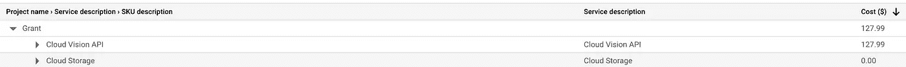

我花了两年多的时间。人工智能域名租赁(149 美元)给你一个成本锚。

*   **投资回报**很容易实现！根据我的经验，算法/模型性能**只是数据产品成功的众多促成因素**之一。**在投入专家 ML 资源之前发现其他因素**是挑选获胜项目的关键部分。
*   **快速结果** —我在 24 小时内就有了一个生产就绪的模型，并针对边缘设备或移动设备的性能进行了优化和量化。

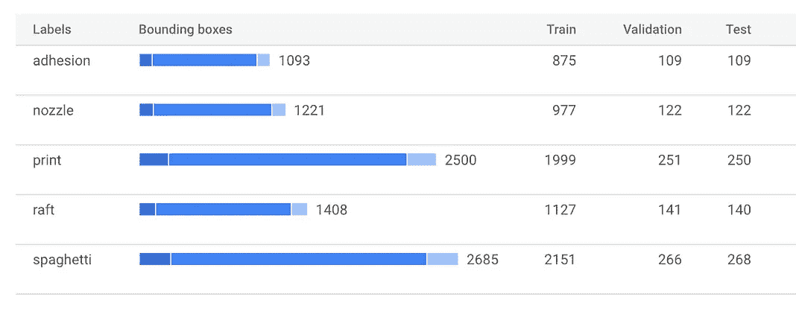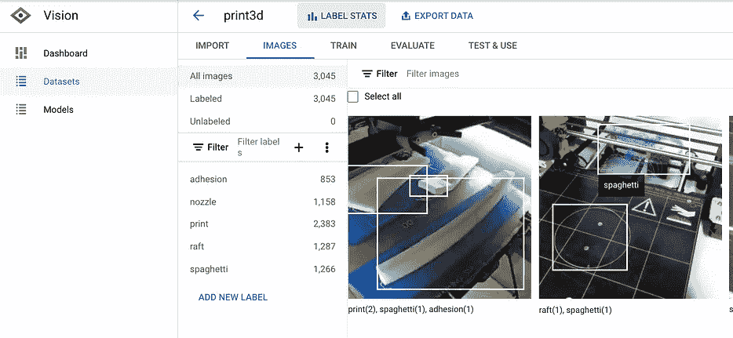

我的初始数据集中的标签分布(左)。Google AutoML 提供了一个 GUI 来探索带标签的数据(右图)。作者图片。

除了云 AutoML 愿景，Google 还为以下领域提供 AutoML 服务:

[**表格**](https://cloud.google.com/automl-tables/docs) **—** 一组具有自动化特征工程的建模技术(线性、梯度提升树、神经网络、集成)。

**翻译—** 训练自定义翻译模型。

**视频智能—** 通过标签对视频帧和片段进行分类。

[**自然语言**](https://cloud.google.com/automl/docs#automl-natural-language)

*   分类—预测类别/标签
*   实体提取—从发票、餐馆菜单、税务文档、名片、简历和其他结构化文档中提取数据。
*   情感分析——识别流行的情感观点。


利用 AutoML 自然语言分类发现奖学金(2018 年收购)。图片作者。

## 训练基线模型

Cloud AutoML Vision Edge 训练了一个针对边缘/移动设备优化的张量流模型。在引擎盖下，AutoML 的架构和参数搜索使用强化学习来找到速度和准确性之间的理想权衡。

查看 [MnasNet:实现移动机器学习模型的自动化设计](http://ai.googleblog.com/2018/08/mnasnet-towards-automating-design-of.html)和 [MnasNet:移动平台感知神经架构搜索](https://arxiv.org/abs/1807.11626)如果您想了解更多关于云 AutoML 视觉的内部工作方式！

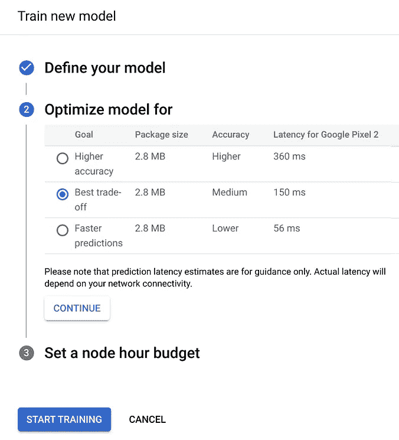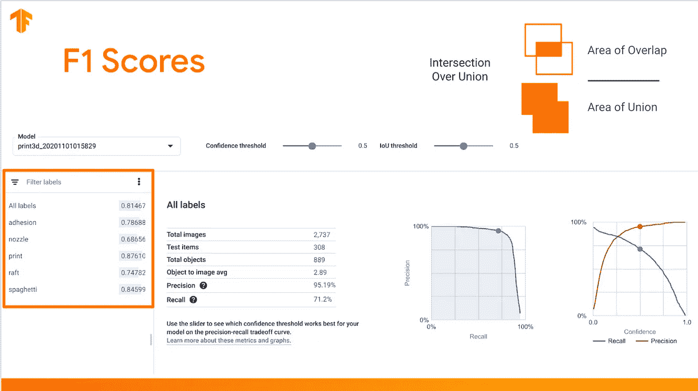

*Google AutoML Vision Edge 在神经网络架构搜索的强化学习策略中加入了速度/精度偏好(左)。评估基线模型(右)。作者图片。*

## 基线模型指标

您可以通过 API 获取 AutoML 模型评估指标，这是一种将候选模型与基线进行比较的简便方法。检查[这个要点](https://gist.github.com/leigh-johnson/ca8e7748b46dc2420369ec5de702d9be)看我的完整例子。

```
from google.cloud import automl
from google.protobuf.json_format import MessageToDict
import pandas as pd

project_id = "your-project-id"
model_id = "your-automl-model-id"

# Initialize AutoMl API Client
client = automl.AutoMlClient()

# Get the full path of the model
model_full_id = client.model_path(project_id, "us-central1", model_id)

# Get all evaluation metrics for model
eval_metrics = client.list_model_evaluations(parent=model_full_id, filter="")

# Deserialize from protobuf to dict
eval_metrics = [MessageToDict(e._pb) for e in eval_metrics ]

# Initialize a Pandas DataFrame
df = pd.DataFrame(eval_metrics)
```

## 设计可改进的结果

你可能还记得，我的**基线模型**在置信度和 IoU 阈值为 0.5 时的召回率为 75%。换句话说，我的模型未能识别测试集中大约 1/4 的对象。真实世界的表现更差！😬

幸运的是，将基线模型训练交给 AutoML 让我有时间深入思考**持续模型改进的**制胜策略。经过最初的头脑风暴，我将我的选择减少到只有两个(非常不同的)策略。

## 选项#1 —二元分类器

第一种选择是训练一个二进制分类器来预测打印机在任何单个时间点是否失败:**预测{失败，不失败}。**

警报决策基于预测的置信度得分。🔔

## 选项#2 —时间序列集合

第二个选项训练一个**多标签物体检测器**检测阳性、阴性和神经标签的混合，如{打印、喷嘴、气泡}。

然后，根据每个检测到的对象的置信度来计算**加权健康分数**。

最后，在健康分数的时间序列视图上拟合一个**多项式(趋势线)**。

警报的决定是基于多项式斜率的**方向和距截距的距离。🔔**

二进制分类被认为是计算机视觉的“hello world”，有大量使用 MNIST 数据集的例子(对手写数字进行分类)。我个人最喜欢的是 [fashion mnist](https://www.tensorflow.org/tutorials/keras/classification) ，你可以[在 Colab 笔记本上探索。](https://colab.research.google.com/github/tensorflow/docs/blob/master/site/en/tutorials/keras/classification.ipynb)

无法抗拒一些好的科学，**我假设大多数数据科学家**和机器学习工程师**会选择首先实现一个二元分类器。**

> 我正在开发一个全新的数据产品。为了克服最初的生产高峰，我想马上部署一个模型，并开始根据真实世界的数据测量/改进性能。
> 
> 如果我正在为快速迭代和改进进行优化，我应该采用哪种方法？

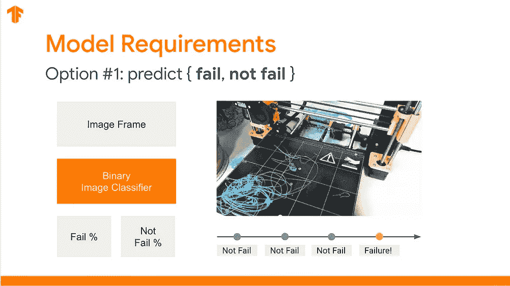

具有复杂结果的二元分类器可能难以解释和说明(左)。决策集合或堆叠模型能够对每个组件的学习/编码信息进行内省。(右)作者图片。

## 大多数**数据科学家和机器学习工程师投票支持选项 1！

** *等待同行评审和决定的研究*🤣


**违背群众的智慧**:为什么我选择实施**选项 2** 作为我获胜的机器学习策略的一部分？

## 选择 1:改变任何事都会改变一切(CACE)

概括地说，二进制分类器预测打印机在任何单个时间点是否失败:预测{失败，不失败}。

该模型学习编码一个复杂的结果，该结果在训练集中有许多决定因素(以及**更多模型**尚未看到的因素)。

为了改进这个模型，**我只能使用几个杠杆**:

*   样品/标签重量
*   优化器超参数，如学习率
*   添加合成和/或增强数据

改变以上**中的任何一个都会改变所有的决策结果！**

## 选项 2 —全面了解数据

第二种选择有更多可移动的部分，但也有更多的机会内省数据和每个建模的结果。

这些组件是:

1.  多标签对象检测器(MnasNet 或 MobileNet +单次检测器)。
2.  健康得分，检测机置信度的加权和。
3.  健康评分时间序列的拟合多项式(趋势线)。

这种方法不是回答**一个复杂的问题**，而是从一系列**简单问题中构建一个算法:**

*   这个图像框中有哪些对象？
*   这些物品放在哪里？
*   与中性或阳性标签相比,“缺陷”标签的可信度如何？该指标是打印健康状况的一个代理。
*   失败的打印工作的不归路点**在哪里？**
*   健康分数保持不变吗？增加？递减？这种变化开始发生的速度(斜率)有多快，什么时候开始的？(y 轴截距)。
*   采样频率如何影响集合的准确性？我可以不通过网络发送更少的图像帧吗？

每个组成部分都可以被独立地解释、研究和改进——这样做有助于我获得对数据的整体理解，并对与我的业务相关的问题得出额外的结论。

这些额外的信息对我的使命是无价的，我的使命是**持续改进**和**建立对我的模型结果的信任**。

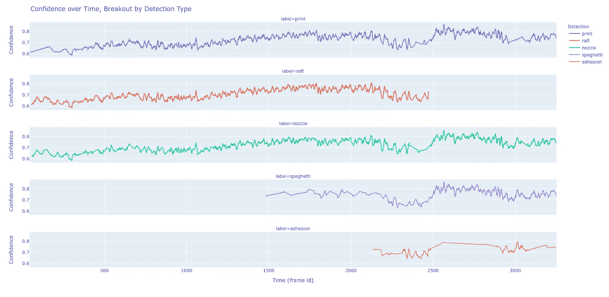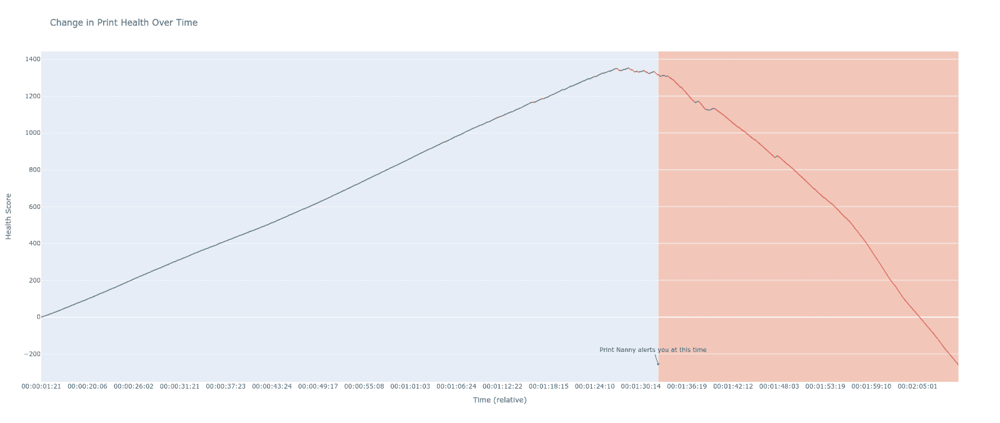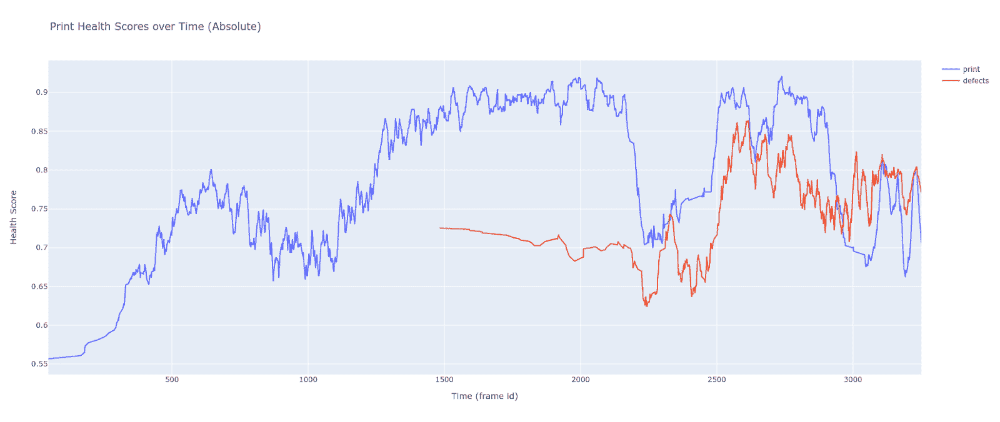

作者图片。检测置信度由标签分解(左)。Heath score 时间序列(中)。累积健康评分系列的多项式拟合(右)。

## 部署原型

经过不到两周的开发，Print Nanny 的第一个原型发布了，并在几天内就在全球范围内被采用。🤯

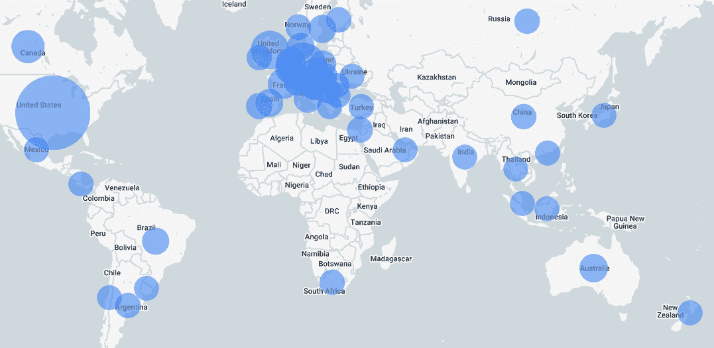

我使用了以下工具、技术堆栈和服务来部署概念验证:

*   [Django](https://www.djangoproject.com/) 、 [Django Rest 框架](https://www.django-rest-framework.org/)和 [Cookiecutter Django](https://github.com/pydanny/cookiecutter-django) 创建一个管理封闭测试版注册和邀请的 web 应用。
*   [超级引导主题](https://themes.getbootstrap.com/product/hyper-responsive-admin-dashboard-template/)用于登录页面和 UI 元素。
*   [谷歌 Kubernetes 引擎](https://cloud.google.com/kubernetes-engine)托管网络应用。
*   [云 SQL](https://cloud.google.com/sql) for PostgreSQL，用于自动备份的数据库。
*   用于 Django 内置缓存的[Google memory store](https://cloud.google.com/memorystore)(Redis)。
*   [Google Cloud AutoML Vision for Edge](https://cloud.google.com/vision/automl/docs/edge-quickstart)训练一个针对移动设备优化的低成本、低工作量的计算机视觉模型。
*   [TensorFlow Lite](https://www.tensorflow.org/lite) 模型部署到[树莓 Pi](https://www.raspberrypi.org/) 上，打包成 [OctoPrint](https://octoprint.org/) 的插件。

提示:学习一个 web 应用程序框架将使你能够在你的目标受众面前测试你的想法。Daniel Feldroy 的两勺 DjangoAudrey fold Roy 是一本关于 Django 框架的实用指南。💜

## 为下一阶段开绿灯

两周后(花了几百美元)，我能够把我的原型放在观众面前，并开始收集反馈。几个虚荣指标:

*   37k 登录页面点击率
*   2k 个已关闭的测试版注册
*   发出 200 份邀请(第一批)
*   平均 100 分。每日活跃用户——哇！

除了核心故障检测系统，我还测试了非常粗糙的模型，以了解更多与我的观众产生共鸣的功能。

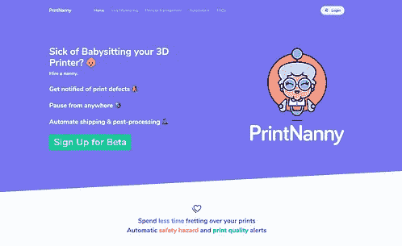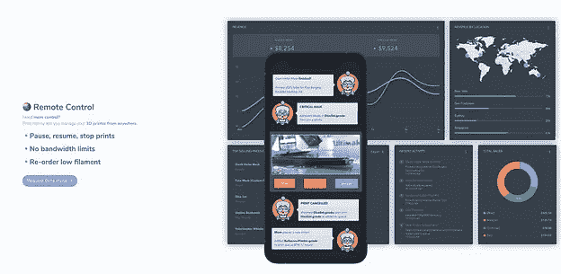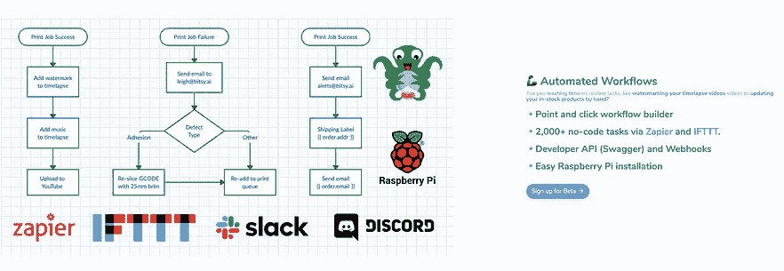

# 优化结果，增加价值

下一部分重点关注**通过提炼模型结果和处理边缘案例，建立对机器学习结果的信任**。

## 为持续改进而构建

两种反馈机制用于标记学习机会:

1.  当检测到故障时:**“打印保姆做了一个好的呼叫吗？”**👍 👎
2.  任何视频都可以**标记，以便进行额外审查**🚩

在这个阶段，我将标记的视频发送到一个队列中，进行手动注释并合并到一个**版本化的训练数据集中。**

我跟踪关于数据集整体的聚合统计数据**和**标记的示例。

*   均值、中值、众数、RGB 通道的标准偏差
*   主观亮度(也称[相对亮度](https://en.wikipedia.org/wiki/Relative_luminance)
*   **平均精度**相对于联合上的**交叉点，每个标签的突破，以及小尺寸盒子(总面积的 1/10)与大盒子(总面积的 1/4)之间的平均精度。
    地图 iou = 0.5，地图 iou = 0.75，地图小/大**

这让我了解我的模型在某些照明条件、灯丝颜色和边界框大小下是否表现不佳——按标签细分。

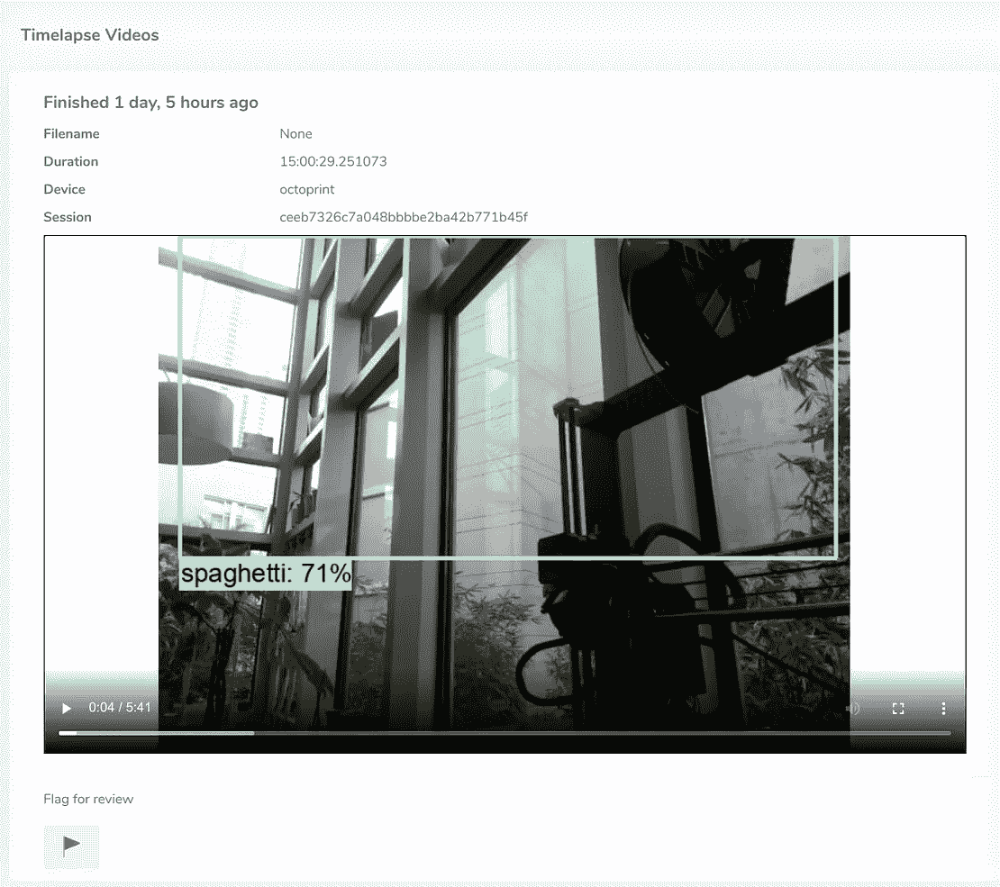

## 限制感兴趣的区域

在我部署了原型后不久，我就从我的故障检测系统的灵活性中认识到了价值。当我开发模型时，我没有考虑到大多数 3D 打印机都是用 3D 打印的组件制造的。🤦‍♀️

我添加了选择感兴趣的**区域**的功能，并从健康分数计算中排除该区域之外的对象。

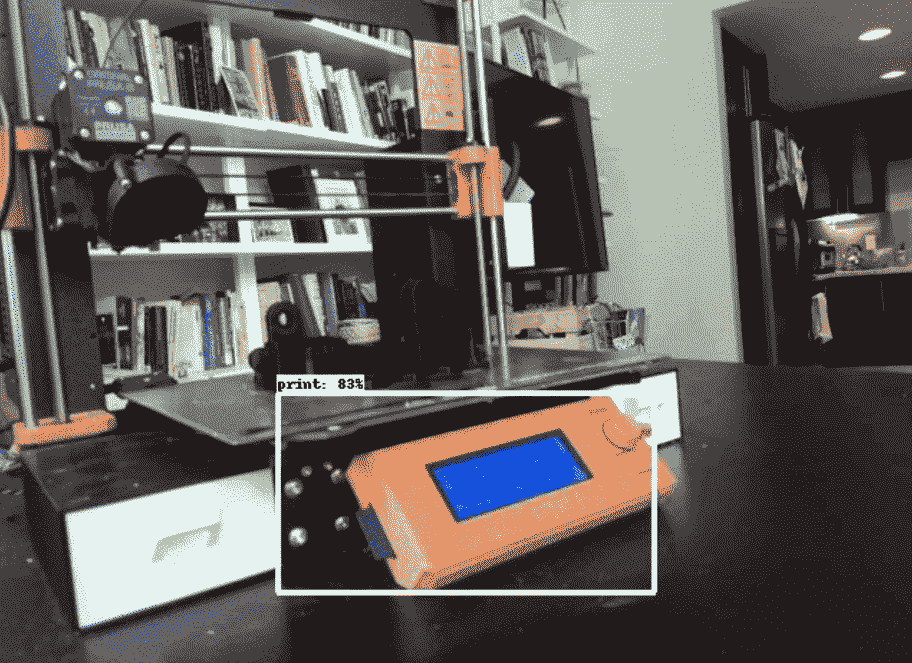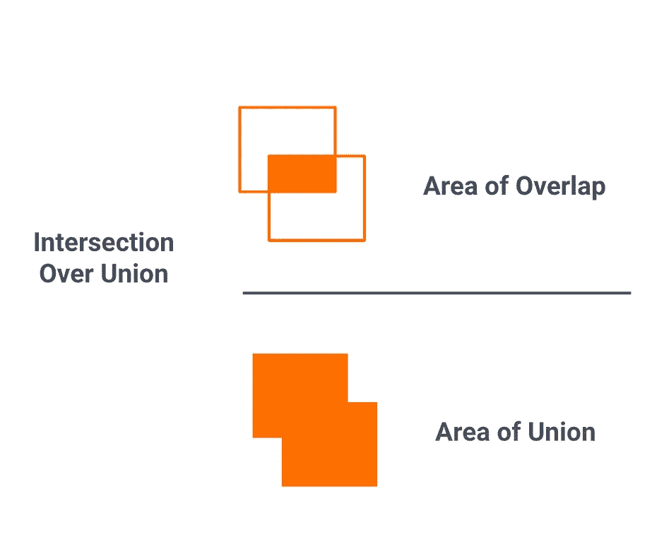

*“你没有错，但你也绝对不对。”图片作者。*

## 摄取遥测数据

我是如何从**的设备上预测**到**的版本化数据集**整齐地组织在**谷歌云存储中的？**

起初，我用 REST API 处理遥测事件。事实证明，对于不可靠连接上的连续事件流，REST 并没有那么好。幸运的是，有一个为物联网用例设计的协议，叫做 MQTT。

我使用[云物联网核心](https://cloud.google.com/iot-core)管理**树莓 Pi 设备身份**并使用 MQTT 消息协议建立**双向** **设备通信**。

MQTT 描述了三种服务质量(QoS)级别:

1.  消息最多传递一次— QoS 0
2.  消息至少传递一次— QoS 1
3.  消息只传送一次— QoS 2

[**注**:云物联网不支持 QoS 2](https://cloud.google.com/iot/docs/how-tos/mqtt-bridge#quality_of_service_qos) ！

除了消除管理 MQTT 基础设施的复杂性(如负载平衡和水平扩展)，云物联网核心还提供了更多价值:

*   设备注册表(设备元数据和指纹的数据库)。
*   使用 HMAC 签名的 JSON Web 令牌(JWT)身份验证。
*   MQTT 消息自动重新发布到发布/订阅主题。

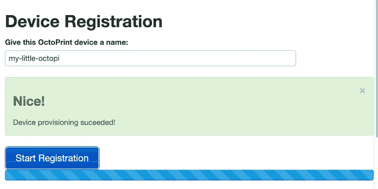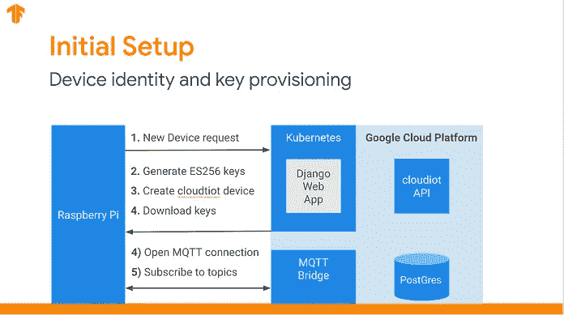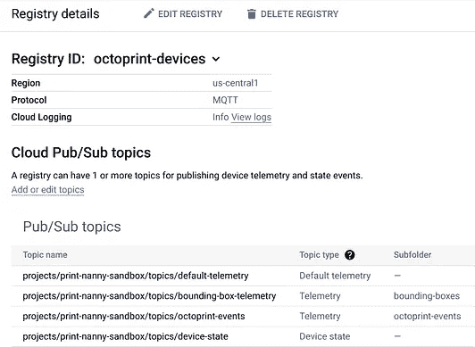

*注册一个运行 OctoPrint 的 Raspberry Pi(左)。创建密钥对和 CloudIoT 设备(中间)。CloudIoT 的设备注册表(右图)。作者图片。*

在设备遥测消息到达云发布/订阅后，集成到许多其他云组件和服务是可能的。

## 数据管道和数据湖

Print Nanny 的数据管道是用 [Apache Beam](https://beam.apache.org/) 编写的，支持编写流和批处理作业。Beam 是高级**编程模型**，用 Java (best)、Python (getting there)、Go (alpha)实现 SDK。Beam API 用于构建并行任务的可移植图。

光束有许多**执行引擎**(称为**转轮**)。云数据流是一个具有自动水平自动扩展功能的托管运行器。我在本地使用 Beam 的捆绑 DirectRunner 开发管道，然后推送一个容器映像用于云数据流。

我可以轻松地写一整篇关于开始使用 Apache Beam 的博客文章(甚至是系列文章)!如果你有兴趣阅读更多关于使用 **TensorFlow Extended (TFX)** 和 **Apache Beam 编写机器学习管道的信息，请在下面发表评论。**

## 管道流入数据湖。

我的第一个管道(左)相当大——没关系！最后，我将根据需要把它分解成更常见的组件。

该管道的主要功能:

*   从发布/订阅中读取设备遥测数据
*   利用设备校准和其他元数据对数据流进行开窗和丰富
*   包装 TF 唱片和拼花桌
*   将原始输入和窗口视图写入 Google 云存储
*   维护数据流的**个窗口视图**的聚合度量。

右边是一个更简单的管道，它呈现。jpg 文件转换成. mp4 视频。

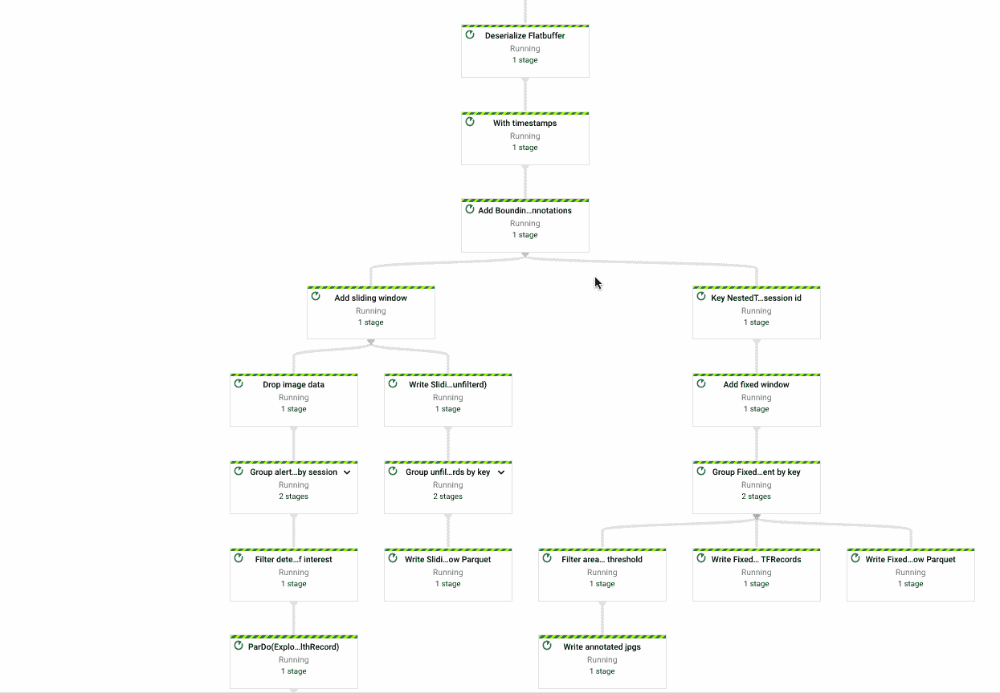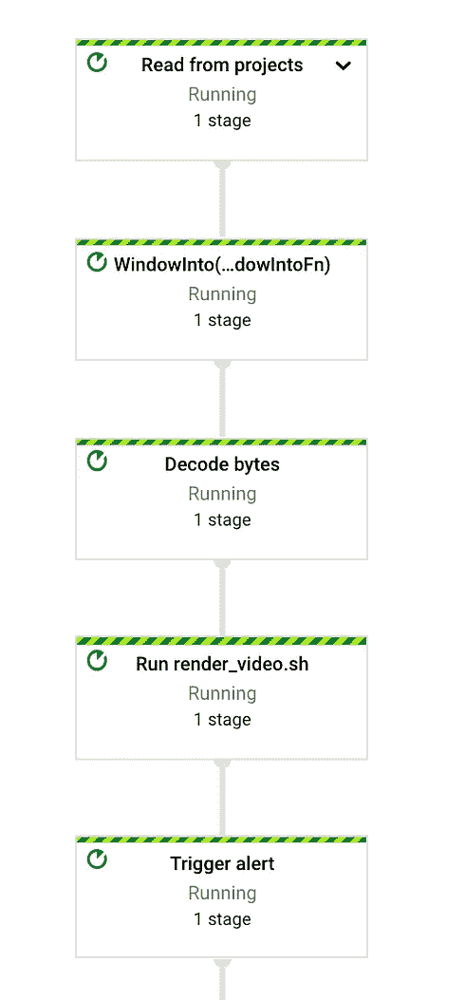

*一个大型 Apache Beam 应用程序将窗口化的数据视图接收到 Google 云存储中，在 Google Cloud DataFlow 的作业图中查看(左)。一个较小的应用程序从 JPEG 帧渲染视频。(对)。作者图片。*

## 附加 AutoML 模型培训

当按比例放大一个原型时，我试图从我的客户的角度了解性能改进的质量影响。**没有这个锚**，很容易陷入**前期优化的陷阱。**

根据我的经验，改进绩效指标是容易的部分，难的是理解:

*   绩效指标/度量标准是实际价值或感知价值的良好代表吗？
*   如果不是…为什么这个指标不能反映真实世界的价值？我能制定和研究一个更有表现力的度量标准吗？
*   我什么时候会看到投入时间的收益递减？

我在这里再次利用了 Cloud AutoML Vision，这一次是在来自 beta cohort 和 YouTube 的混合数据集上进行训练。

在这个阶段，我手动分析了数据的**片段，以了解系统是否在**某些打印机型号**或**材料类型上表现不佳。****

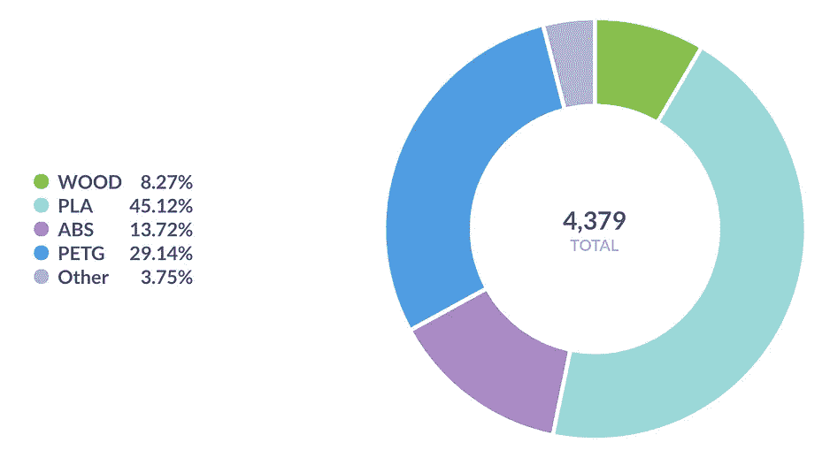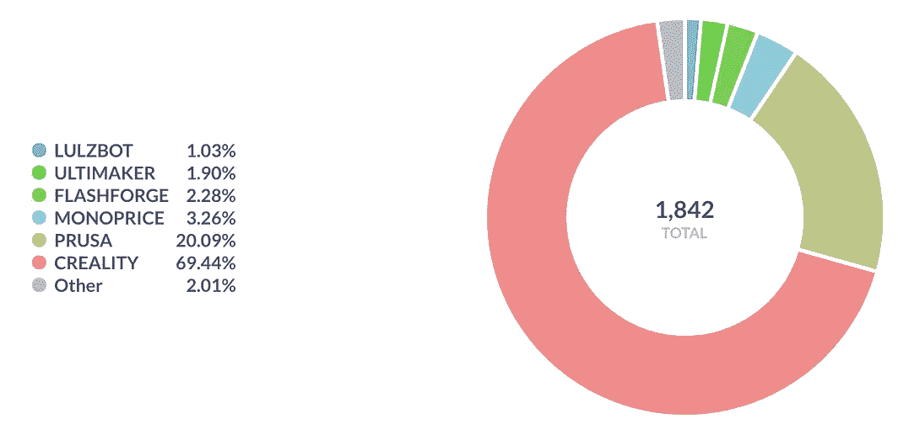

*首选灯丝类型(左)。首选 3D 打印机品牌(右)。图片作者。*

## 训练物体探测器

终于！这是真正的机器学习开始的地方，对吗？

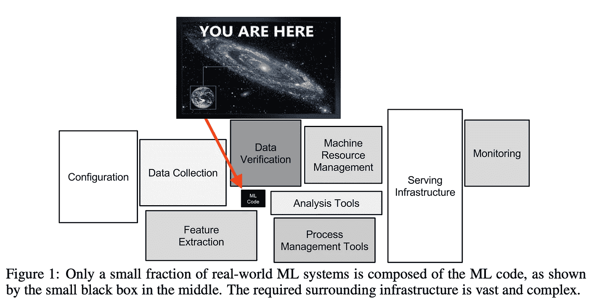

来源:[机器学习系统中隐藏的技术债务](https://papers.nips.cc/paper/2015/file/86df7dcfd896fcaf2674f757a2463eba-Paper.pdf)

## 张量流模型园

我是从 TensorFlow 的[模型园](https://github.com/tensorflow/models)开始的。该报告包含许多最新架构的参考实现，以及运行培训工作的一些最佳实践。

回购根据稳定性和支持程度分为几个集合:

*   [官方。](https://github.com/tensorflow/models/blob/master/official)由 TensorFlow 官方维护、支持并保持最新的 TensorFlow 2 APIs，针对可读性和性能进行了优化
*   [研究](https://github.com/tensorflow/models/blob/master/research)。由研究人员 TensorFlow 1 和 2 实施和支持。
*   [社区](https://github.com/tensorflow/models/blob/master/community)。外部 Github 库的精选列表。

**参考消息:** TensorFlow 的官方**vision 的**框架正在[进行升级！](https://github.com/tensorflow/models/tree/master/official/vision/beta)

下面的例子引用了对象检测 API，它是 **research** 集合中的一个框架。

## 对象检测 API

[**TensorFlow 2 检测模型 Zoo**](https://github.com/tensorflow/models/blob/master/research/object_detection/g3doc/tf2_detection_zoo.md) 是预训练模型的集合(COCO2017 数据集)。权重是一个有用的初始化点，即使您的问题超出了 COCO 的范围

我对于使用**树莓派**的**设备上推断**的首选架构是一个 **MobileNet** 特征提取器/主干，带有一个单发探测头。其中使用的 ops 与 TensorFlow Lite 运行时兼容。

如果你想看实际例子，请查阅[快速入门指南](https://github.com/tensorflow/models/blob/master/research/object_detection/g3doc/tf2.md#quick-start)。

对象检测 API 使用 protobuf 文件来配置训练和评估(如下图)。除了超参数之外，配置还允许您指定数据扩充操作(下面突出显示)。TFRecords 应作为输入。

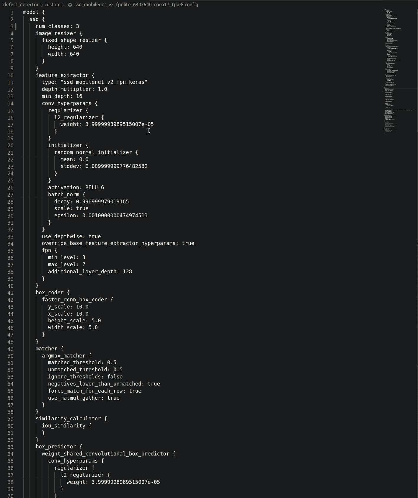

图片作者。对象检测 API 培训管道配置示例

## 使用 MLFlow 记录参数、指标和工件

你的实验和实验笔记看起来像这一堆乱七八糟的笔记本吗？这是我将 AnyNet 从[脸书研究中心的模型动物园](https://github.com/facebookresearch/pycls/tree/master/pycls/models)移植到 [TensorFlow 2 / Keras](https://github.com/leigh-johnson/tf-anynet) 时，我的实验跟踪看起来的样子。

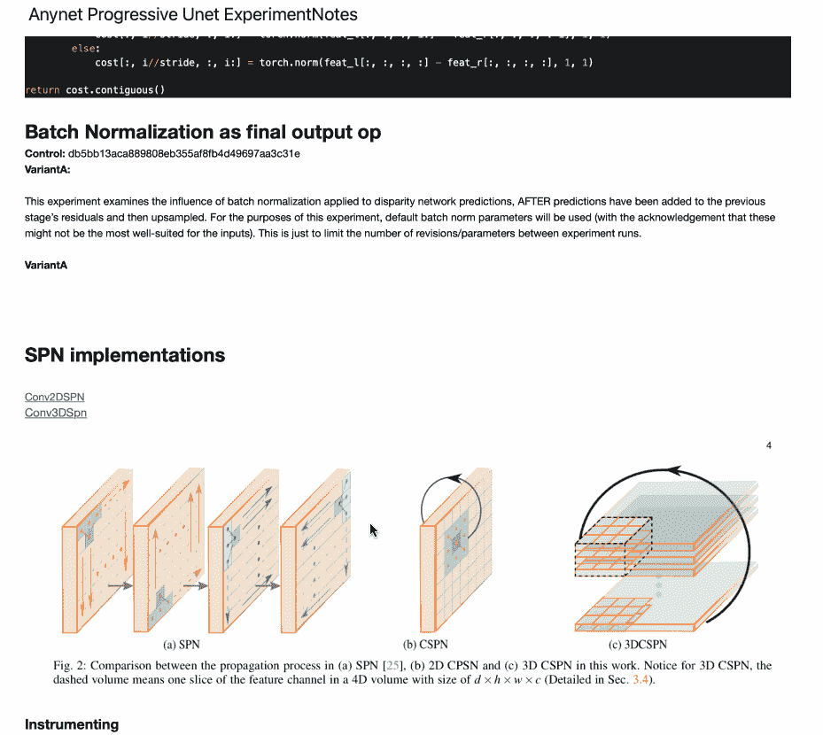

图片作者。笔记本上是一堆乱七八糟的截图、代码片段、指标、手动实验跟踪。

我开始使用 [MLFlow](https://www.mlflow.org/docs/latest/index.html) 来记录模型超参数、代码版本、度量，并在中央存储库中存储训练工件。它改变了我的生活！

如果你想深入了解我的实验跟踪和训练计算机视觉模型的工作流程，请在下面发表评论！

# 感谢您的阅读！🌻

建立一个成功的机器学习系统没有放之四海而皆准的指南——不是所有对我有用的东西都保证对你有用。

我的希望是，通过解释我的决策过程，我展示了这些基本技能在哪里支持一个成功的人工智能/人工智能产品战略。

*   数据架构—与数据的移动、转换、存储和可用性相关的一切
*   软件工程
*   基础设施和云工程
*   统计建模

你对封闭打印保姆测试版感兴趣吗？

## [点击此处申请测试版邀请](https://www.print-nanny.com/request-invite/)

寻找更多针对 Raspberry Pi 和其他小型设备的机器学习实践示例？[注册我的时事通讯](https://www.bitsy.ai/)以接收新的教程并直接深入您的收件箱。

最初发布于[bitsy . ai](https://www.bitsy.ai/launching-machine-learning-ai-startup-solo-founder/)

**谷歌通过提供谷歌云信用来支持这项工作**