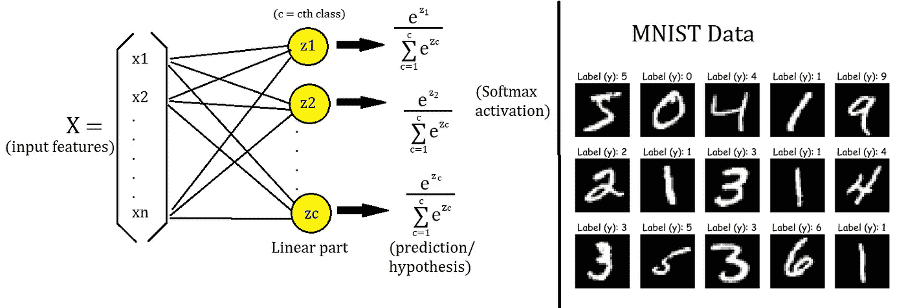
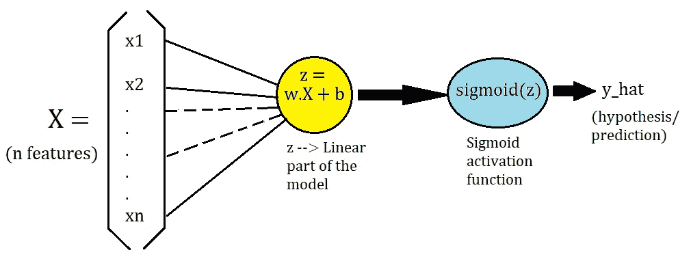
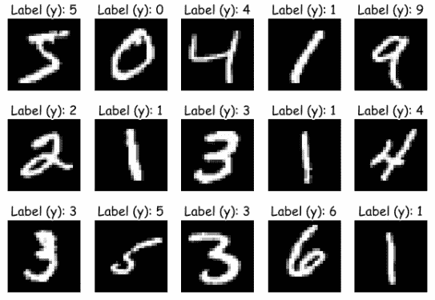
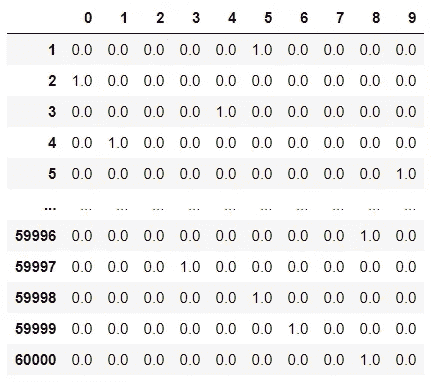
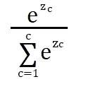
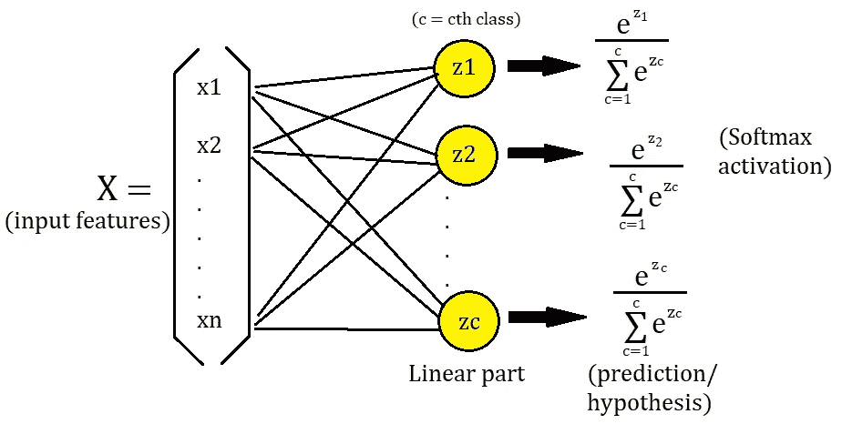
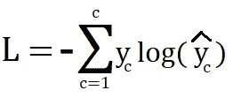
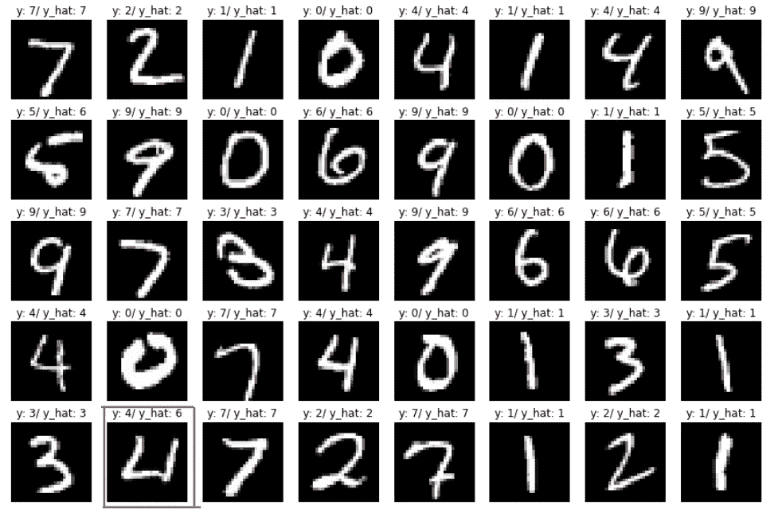

# Python 中的 Softmax 回归:多类分类

> 原文：<https://towardsdatascience.com/softmax-regression-in-python-multi-class-classification-3cb560d90cb2?source=collection_archive---------1----------------------->

## 从零开始的机器学习:第 7 部分



作者图片

在本文中，我们将研究用于多类分类问题的 Softmax 回归，并在 MNIST 手写数字识别数据集上实现它。

首先，我们将基于**逻辑回归**来理解 **Softmax 函数**，然后我们将查看**交叉熵损失**、**一键编码**，并对其进行编码。最后，我们将对**训练**函数(`**fit**`)进行编码，看看我们的**精度**。我们还将**绘制**我们的预测。

我们将使用 Python NumPy 和 Matplotlib 来完成这一切。我们将看到如何在训练集和测试集中获得 91% 的 ***。***

[](/logistic-regression-from-scratch-in-python-ec66603592e2) [## Python 中从头开始的逻辑回归

### 从零开始的机器学习:第 5 部分

towardsdatascience.com](/logistic-regression-from-scratch-in-python-ec66603592e2) 

# 逻辑回归概述



逻辑回归模型；作者图片

正如我们在上面看到的，在逻辑回归模型中，我们取了一个大小为`n`(特征)的向量`x`(它仅代表`m`中的一个例子)，并取了一个与`weights`的点积，然后加上一个`bias`。我们就叫它`z`(线性部分)也就是`w.X + b`。之后，我们应用逻辑回归的 sigmoid 激活函数来计算`y_hat`。

> y_hat = sigmoid(z) = sigmoid(w.X + b)

> 从`X`到直线部分的每条边代表一个`weight`，直线部分的每一圈都有一个`bias`。

逻辑回归用于二进制分类，这意味着有 2 个类别( **0** 或 **1** )，并且由于 sigmoid 函数，我们得到 0 和 1 之间的输出(y_hat)。我们将逻辑模型的这个输出(`y_hat`)解释为`y`为 1 的概率，那么`y`为 0 的概率就变成了`(1-y_hat)`。

问你一个问题——上图中的`w`是什么形状？

# Softmax 回归

现在，我们为自己设定一个目标— **来识别图像中的数字。**

我们将使用 MNIST 手写数据集作为理解 Softmax 回归的激励性示例。它有 **10 个等级**，每个等级代表从 **0** 到 **9** 的一个数字。让我们先看看数据集。

从`keras.datasets`加载 MNIST 数据集并绘图。此外，拆分训练集和测试集。它在训练集中有 60，000 个示例，在测试集中有 10，000 个示例。

```
#Loading
**from keras.datasets import mnist****(train_X, train_y), (test_X, test_y) = mnist.load_data()**#Plotting**fig = plt.figure(figsize=(10,7))****for i in range(15):  
    ax = fig.add_subplot(3, 5, i+1)
    ax.imshow(train_X[i], cmap=plt.get_cmap('gray'))
    ax.set_title('Label (y): {y}'.format(y=train_y[i]))
    plt.axis('off')**
```



MNIST 数据；作者图片

我们的数据有数字图像和代表数字的标签。每幅图像都是**灰度**，大小为 **28x28 像素**。

> 第一个问题— **我们如何将图像作为输入？**

每个图像都可以表示为一个三维矩阵。如果我们有一个尺寸为 **28x28** 的彩色图像，我们就有 **28 x 28 x 3** 个数字来表示该图像(RGB(红绿蓝)通道的 **3** )。

但是我们有灰度图像，这意味着每个图像只有一个通道。所以，每张图片都是 28x28 像素。为了将图像输入到模型中，我们将把这个 **28x28** 展平成一个长度为 **784** (28*28)的向量，这些 **784** 数字只是代表数据集中每个示例(图像)的`**n**` 特征的像素。

```
**X_train = train_X.reshape(60000,28*28)
X_test = test_X.reshape(10000,28*28)**
```

> X_train 是一个具有 60，000 行和 784 列的矩阵。
> 
> m = 6 万；n = 784

# 一键编码

现在，我们的`y`是一个像这样的向量—

```
**train_y**
>> array([5, 0, 4, ..., 5, 6, 8], dtype=uint8)
```

这是一个带有标签的 NumPy 数组。我们不能把它用于我们的模型，我们必须以某种方式把它修改成 0 和 1，这就是我们所说的一键编码。我们希望我们的`y`看起来像这样(一个大小为 60，000 x 10 的矩阵)—



y 的一热表示；作者图片

行代表第 I 个例子，第 I 列告诉我们标签。例如，对于第一个示例，有一个 1，其中列名为 5，其余的为零。因此，第一个示例的标签是 5，其他示例也是如此。对于每个示例，只有一列的值为 1.0，其余的值为零。

让我们编写一个函数来一次性编码我们的标签—

> `**c**` =班级人数

```
**def one_hot(y, c):**

    # y--> label/ground truth.
    # c--> Number of classes.

    # A zero matrix of size (m, c)
    **y_hot = np.zeros((len(y), c))**

    # Putting 1 for column where the label is,
    # Using multidimensional indexing.
    **y_hot[np.arange(len(y)), y] = 1**

  **  return y_hot**
```

> 引用—[NumPy 中的多维索引](https://docs.scipy.org/doc/numpy/user/basics.indexing.html#indexing-multi-dimensional-arrays)

# Softmax 函数

在使用 Softmax 回归进行多类分类时，我们有一个**约束**，即我们的模型将只预测`**c**` 类中的一个类。对于我们的数据，这意味着模型将只预测图像中的一个数字(从 0 到 9)。

我们将逻辑模型的输出解释为概率。类似地，我们希望将多类分类模型的输出解释为**概率分布**。因此，我们希望我们的模型输出一个大小为`**c**` 的向量，向量中的每个值代表每个类的概率。换句话说，向量中的第**个**值代表我们的预测成为第**个**类的概率。由于它们都是概率，所以它们的和等于 1。

为了符合上述假设，我们使用 softmax 函数。

第**级**的 softmax 定义为—



Softmax 函数；作者图片

其中，`**z**` 是直线部分。例如`**z1 = w1.X + b1**`，对其他人也是如此。

> y_hat = softmax(w.X + b)

> 对于我们的数据，`**c**`(类的数量)=10。

## **让我们借助下面的模型图来理解 Softmax 函数和 Softmax 回归。**



Softmax 回归模型；作者图片

1.  首先，我们将我们的 **28x28** 图像展平成一个长度为 **784** 的向量，在上图中用`x`表示。
2.  其次，我们计算每个类的线性部分→ `zc = wc.X + bc`,其中`zc`是第**个**类的线性部分，而`wc`是第**个**类的权重集。`bc`是对第 c 类的偏向。
3.  第三，我们使用上面的公式计算每个类的 soft max`zc`。组合所有的类，我们得到一个大小为`c`的向量，它们的和等于 1。而哪个类的值(概率)最高，就成为我们的预测。

> **请注意，每个类别都有不同的权重集和不同的偏差。**
> 
> **还要注意，上图显示的** `**x**` **只是一个例子。**

每个`zc` 都是一个(1，1)矩阵。但是因为我们有了`m`的例子，我们将把`zc`(第 c 个类的`z`)表示为一个大小为`m`的向量。现在，为了组合所有的`**z**` **的**类，我们将把它们并排放在一起，这将给出一个大小矩阵(`m`，`c`)。

类似地，对于每个类，`weights`的集合是一个大小为`n`的向量。因此，为了组合所有的类，我们将把它们并排放在一起，这将给出一个大小矩阵(`n`，`c`)。此外，我们对每个类都有一个偏差，组合偏差将是一个大小为`c`的向量。

结合 softmax 的所有类给出了一个大小为`c`的向量。并且结合所有的`m`例子给出一个大小的矩阵(`m`，`c`)。

## **形状—**

1.  **X →(m，n)**
2.  **y →(m，c)【一个热编码】**
3.  **w →(n，c)**
4.  **b→大小为 c 的向量**

让我们为 softmax 函数编写代码。请参见注释(#)。

```
**def softmax(z):**

    # z--> linear part.

    # subtracting the max of z for numerical stability.
    **exp = np.exp(z - np.max(z))**

    # Calculating softmax for all examples.
    **for i in range(len(z)):
        exp[i] /= np.sum(exp[i])**

 **return exp**
```

> reference—[数值稳定的 softmax](https://stackoverflow.com/questions/34968722/how-to-implement-the-softmax-function-in-python)
> 
> reference—[soft max](https://deepnotes.io/softmax-crossentropy)的导数

# 交叉熵损失

对于每个参数机器学习算法，我们需要一个损失函数，我们希望最小化该函数(找到其全局最小值)，以确定最佳参数(`w`和`b`)，这将帮助我们做出最佳预测。

对于 softmax 回归，我们使用交叉熵(CE)损失—



CE 损耗；作者图片

> **参考如何计算损失的导数。**
> 
> 参考— [与 Softmax](https://deepnotes.io/softmax-crossentropy) 交叉熵损失的导数
> 
> reference—[soft max 损失函数的导数](https://math.stackexchange.com/questions/945871/derivative-of-softmax-loss-function)

在代码中，损失看起来像这样—

```
**loss = -np.mean(np.log(y_hat[np.arange(len(y)), y]))**
```

再次使用多维索引—[NumPy 中的多维索引](https://docs.scipy.org/doc/numpy/user/basics.indexing.html#indexing-multi-dimensional-arrays)

> 注意`y`在损失函数中不是一键编码的。

# 培养

1.  初始化参数— `w`和`b`。
2.  使用梯度下降法找到最佳的`w`和`b`。
3.  用`softmax(w.X + b)`预测。

```
**def fit(X, y, lr, c, epochs):**

    # X --> Input.
    # y --> true/target value.
    # lr --> Learning rate.
    # c --> Number of classes.
    # epochs --> Number of iterations.

    # m-> number of training examples
    # n-> number of features 
    **m, n = X.shape**

    # Initializing weights and bias randomly.
    **w = np.random.random((n, c))
    b = np.random.random(c)** # Empty list to store losses.
  **  losses = []**

    # Training loop.
    **for epoch in range(epochs):**

        # Calculating hypothesis/prediction.
        **z = X@w + b
        y_hat = softmax(z)**

        # One-hot encoding y.
       **y_hot = one_hot(y, c)** 
        # Calculating the gradient of loss w.r.t w and b.
       ** w_grad = (1/m)*np.dot(X.T, (y_hat - y_hot)) 
        b_grad = (1/m)*np.sum(y_hat - y_hot)**

        # Updating the parameters.
       ** w = w - lr*w_grad
        b = b - lr*b_grad**

        # Calculating loss and appending it in the list.
       ** loss = -np.mean(np.log(y_hat[np.arange(len(y)), y]))
        losses.append(loss)** # Printing out the loss at every 100th iteration.
        **if epoch%100==0:
            print('Epoch {epoch}==> Loss = {loss}'
                  .format(epoch=epoch, loss=loss))** ** return w, b, losses**
```

# 现在让我们训练我们的 MNIST 数据—

请参见注释(#)。

```
# Flattening the image.
**X_train = train_X.reshape(60000,28*28)**# Normalizing. 
**X_train = X_train/255**# Training
**w, b, l = fit(X_train, train_y, lr=0.9, c=10, epochs=1000)
>>** Epoch 0==> Loss = 4.765269749988195
Epoch 100==> Loss = 0.41732772667703605
Epoch 200==> Loss = 0.36146764856576774
Epoch 300==> Loss = 0.3371995534802398
Epoch 400==> Loss = 0.32295154931574305
Epoch 500==> Loss = 0.31331228168677683
Epoch 600==> Loss = 0.3062124554422963
Epoch 700==> Loss = 0.3006810669534496
Epoch 800==> Loss = 0.29619875396394774
Epoch 900==> Loss = 0.29246033264255616
```

> 我们可以看到，每次迭代后损失都在下降，这意味着我们做得很好。

# 预测

请参见注释(#)。

```
**def predict(X, w, b):**

    # X --> Input.
    # w --> weights.
    # b --> bias.

    # Predicting
  **  z = X@w + b
    y_hat = softmax(z)**

    # Returning the class with highest probability.
    **return np.argmax(y_hat, axis=1)**
```

# 计量精度

```
**def accuracy(y, y_hat):
    return np.sum(y==y_hat)/len(y)**
```

让我们在训练和测试集上计算我们的模型的准确性。

```
# Accuracy for training set.
**train_preds = predict(X_train, w, b)
accuracy(train_y, train_preds)
>> 0.9187666**# Accuracy for test set.# Flattening and normalizing.
**X_test = test_X.reshape(10000,28*28)
X_test = X_test/255****test_preds = predict(X_test, w, b)
accuracy(test_y, test_preds)
>> 0.9173**
```

> **我们的模型在训练集上的准确率为 91.8%，在测试集上的准确率为 91.7%。**
> 
> **不错。**

# 绘制预测

```
**fig = plt.figure(figsize=(15,10))****for i in range(40):  
    ax = fig.add_subplot(5, 8, i+1)
    ax.imshow(test_X[i], cmap=plt.get_cmap('gray'))

    ax.set_title('y: {y}/ y_hat: {y_hat}'
                 .format(y=test_y[i], y_hat=test_preds)
    plt.axis('off')**
```



预测；作者图片

上图显示了模型对训练集中 40 个示例的预测。我们可以看到其中有一些是预测错误的，比如上图中用红色圈出的那个。

感谢阅读。对于问题、评论、顾虑，请在回复部分进行讨论。更多的 ML 从零开始即将推出。

**看看从零开始学习的机器系列—**

*   第 1 部分:[**Python 中从零开始的线性回归**](https://medium.com/analytics-vidhya/linear-regression-from-scratch-in-python-b6501f91c82d?source=your_stories_page-------------------------------------)
*   第二部分:[**Python 中的局部加权线性回归**](/locally-weighted-linear-regression-in-python-3d324108efbf?source=your_stories_page-------------------------------------)
*   第三部分: [**使用 Python 的正规方程:线性回归的封闭解**](/normal-equation-in-python-the-closed-form-solution-for-linear-regression-13df33f9ad71?source=your_stories_page-------------------------------------)
*   第四部分:[**Python 中的多项式回归从零开始**](/polynomial-regression-in-python-b69ab7df6105)
*   第五部分:[**Python 中的逻辑回归从零开始**](/logistic-regression-from-scratch-in-python-ec66603592e2)
*   第六部分: [**用 Python 实现感知器算法**](/perceptron-algorithm-in-python-f3ac89d2e537)