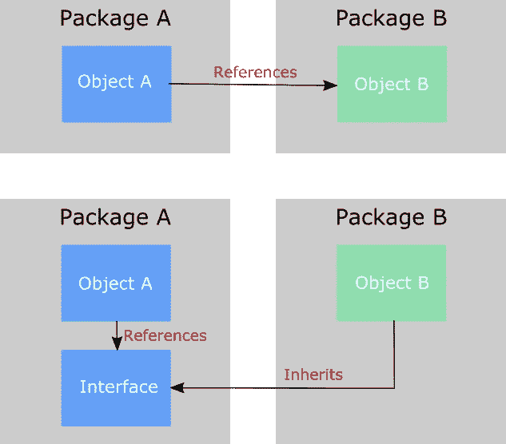

# Python 中的实体编码

> 原文：<https://towardsdatascience.com/solid-coding-in-python-1281392a6a94?source=collection_archive---------0----------------------->

可靠编码的原则是由 Robert C. Martin 发明的首字母缩略词，它代表五种不同的编码惯例。

如果您遵循这些原则，您可以通过处理代码的结构和逻辑一致性来提高代码的可靠性。

在 [Unsplash](https://unsplash.com/photos/64YrPKiguAE?utm_source=unsplash&utm_medium=referral&utm_content=creditCopyText) 上拍摄的 [ThisisEngineering RAEng](https://unsplash.com/@thisisengineering?utm_source=unsplash&utm_medium=referral&utm_content=creditCopyText)

坚实的原则是:

*   单一责任原则
*   开闭原则(OCP)
*   利斯科夫替代原理(LSP)
*   接口隔离原则(ISP)
*   依赖性倒置原则

这五个原则不是一个特定的有序列表(做这个，然后那个，等等)，而是几十年来发展的最佳实践的集合。它们被聚集成一个首字母缩略词，作为记忆的载体，类似于计算机科学中的其他，例如:**干** : *不要重复自己*；**亲亲** : *保持小而简*；作为智慧的积累。附带说明一下，这个缩写词是在这五个原则结合在一起多年后产生的。

一般来说，坚实的原则是每个代码开发人员的基本学习步骤，但通常被那些不认为代码的最高质量是他们绝对优先考虑的人所忽略。

然而，作为一名数据科学家，我认为遵循这些原则是有益的。具体来说，它提高了可测试性，减少了技术债务，以及当客户/股东的新需求出现时实现变更所需的时间。

在下面的文章中，我想探索这五个原则，并提供一些 Python 中的例子。通常，坚实的原则被应用在面向对象设计的上下文中(例如:Python 的类)，但是我相信它们不管什么级别都是有效的，我想把这里的例子和解释保留到“高级初学者”的级别，监督正式定义。

# 1)单一责任原则

> *“一个类应该有且只有一个更改原因”*

换句话说，你的代码的每个组件(通常是一个类，但也是一个函数)都应该有*一个且只有一个职责*。因此，应该只有一个改变它的理由。

你经常会看到一段代码同时处理整个过程。即在返回结果之前加载数据、修改数据并绘制数据的函数。

让我们举一个更简单的例子，我们有一个数 L = [n1，n2，…，nx]的列表，我们对这个列表计算一些数学函数。例如，计算平均值、中间值等。

一个糟糕的方法是让一个函数完成所有的工作:

为了更符合 SRP，我们应该做的第一件事是将函数 math_operations 分成**个原子函数**！因此，当一个功能的职责不能再分成更多的子部分时。

第二步是创建一个单独的函数(或类)，一般命名为“main”。这将在一步一步的过程中一个接一个地调用所有其他函数。

现在，您只有一个理由来更改与“main”相关的每个函数。

这个简单动作的结果是:

1.  更容易定位错误。执行过程中的任何错误都会指出代码的一小部分，从而加速调试阶段。
2.  代码的任何部分都可以在代码的其他部分重用。
3.  此外，经常被忽视的是，为代码的每个功能创建测试更容易。关于测试的补充说明:你应该在实际编写脚本之前编写测试。但是，这经常被忽略，而倾向于创建一些好的结果显示给涉众。

相对于第一个代码示例，这已经是一个很大的改进了。但是，创建一个“main”并调用具有单一职责的函数并没有完全实现 SR 原则。

的确，我们的“主要”有许多理由需要改变。这个类实际上很脆弱，很难维护。

为了解决这个问题，让我们引入下一个原则:

# 2)开闭原则(OCP)

> "*软件实体…应该对扩展开放，但对修改关闭"*

换句话说:你不需要修改你已经写好的代码来适应新的功能，只需要简单地添加你现在需要的。

这并不意味着当代码前提需要修改时，您不能更改您的代码，但是如果您需要添加类似于现有功能的新功能，您不应该要求更改代码的其他部分。

为了澄清这一点，让我们参考前面看到的例子。如果我们想添加新的功能，例如计算中位数，我们应该创建一个新的方法函数，并将其调用添加到“main”中。那将会增加一个*扩展*和*修改*主。

我们可以通过把我们写的所有函数变成一个类的子类来解决这个问题。在这个例子中，我用一个抽象方法“get_operation”创建了一个名为“Operations”的抽象类。(抽象类一般是高级话题。如果不知道什么是抽象类，即使没有也可以运行下面的代码)。

现在，所有旧的函数，Now 类都被 _ _ subclass _ _()方法调用。这将找到从 operations 继承的所有类，并操作所有子类中存在的函数“Operations”。

如果现在我们想要添加一个新的操作，例如:median，我们只需要添加一个继承自类“Operations”的类“Median”。_ _ subclass _ _()将立即选择新形成的子类，并且不需要修改代码的任何其他部分。

结果是一个非常灵活的类，只需要最少的时间来维护。

# 3)利斯科夫替代原理(LSP)

> *“使用指向基类的指针或引用的函数必须能够在不知道的情况下使用派生类的对象”*

或者，这可以表达为“*派生类必须可替换它们的基类*”。

用(也许)更简单的话来说，如果一个子类重新定义了一个父类中也存在的函数，客户端用户应该不会注意到**行为、**的任何差异，它是基类的**替代**。
例如，如果您正在使用一个函数，而您的同事更改了基类，您应该不会注意到您正在使用的函数有任何不同。

在所有坚实的原理中，这是最难理解和解释的。对于这一原则，没有标准的“模板式”解决方案，也很难提供“标准范例”来展示。

用最简单的方式，我可以这样说，这个原则可以总结为:
如果在一个*子类*中，你重定义了一个*函数*，它也存在于*基类*中，那么这两个函数应该具有相同的行为。然而，这并不意味着它们必须*强制*相等，而是用户应该期望在给定相同输入的情况下得到相同的*类型*的结果。
在 ocp.py 示例中,“operation”方法出现在子类和基类中，最终用户应该可以从这两个类中获得相同的行为。

这一原则的结果是，我们将以一致的方式编写代码，最终用户只需要了解我们的代码是如何工作的。

## 附录:

(可以跳到下一个原理)。

LSP 的结果是:子类中新的重新定义的函数应该是有效的，并且可以在父类中使用相同函数的任何地方使用。

这不是典型的情况，事实上我们人类通常是根据集合论来思考的。具有定义一个概念的类和扩展第一个概念的子类，具有异常或不同的行为。

例如，基类“哺乳动物”中的子类“鸭嘴兽”会有例外，即这些哺乳动物产卵。LSP 告诉我们，它将创建一个名为“give_birth”的函数，这个函数将对鸭嘴兽亚纲和狗亚纲有不同的行为。因此，我们应该有一个比哺乳动物更抽象的基类来适应这一点。如果这听起来很混乱，不要担心，LSP 的后一方面的应用很少被完全实现，并且很少离开理论教科书。

# 4)接口隔离原则(ISP)

> "*许多客户端专用接口比一个通用接口更好*"

在类的竞争中，考虑一个接口，*所有的方法和属性***暴露**，因此，用户可以与之交互的一切都属于那个类。

从这个意义上来说，is 原则告诉我们，一个类应该只具有所需的接口(SRP ),并避免那些不起作用或者没有理由成为该类一部分的方法。

这个问题主要出现在子类从基类继承它不需要的方法的时候。

让我们看一个例子:

对于这个例子，我们得到了抽象类“哺乳动物”，它有两个抽象方法:“行走”和“游泳”。这两个元素将属于子类“人类”，而只有“游泳”将属于子类“鲸鱼”。

事实上，如果我们运行这段代码，我们可以:

子类 whale 仍然可以调用方法“walk ”,但是**它不应该调用**,我们必须避免它。

ISP 建议的方式是创建更多的 ***客户端专用接口*** 而不是一个通用接口***。因此，我们的代码示例变成了:***

现在，每个子类只继承它需要的，避免调用脱离上下文的(错误的)子方法。这可能会产生一个难以捕捉的错误。

这个原则与其他原则紧密相连，具体来说，它告诉我们*保持子类的内容没有对该子类无用的元素。这有一个最终目标，那就是保持我们的班级整洁，减少错误。*

# 5)依存倒置原则(DIP)

> 抽象不应该依赖于细节。细节应该取决于抽象。高层模块不应该依赖低层模块。两者都应该依赖于抽象

因此，抽象(例如，如上所述的接口)不应该依赖于低级方法，而应该依赖于第三方接口。

为了更好地解释这个概念，我倾向于认为是一种信息流。

想象一下，你有一个程序，它接收一组特定的信息(文件、格式等)，你写了一个脚本来处理它。如果信息发生变化，会发生什么？你将不得不重写你的剧本并调整新的格式。失去了与旧文件的追溯兼容性。

然而，您可以通过创建第三个抽象来解决这个问题，该抽象将信息作为输入，并将其传递给其他人。
这基本上也是 API 的用途。

(图片由作者提供)

这个原则的有趣设计概念是，它是我们通常会做的相反的方法。

考虑到这一点，我们将从项目的结尾开始，其中我们的代码独立于输入的内容，并且它不容易受到变化的影响，也不受我们的直接控制。

我希望你能在你的编码中找到这些有用的概念，我知道它们适合我。此外，我留下了一些我用来理解这些原则的材料。

*   R.马丁，“面向对象的设计原则”，2013 年。[http://butunclebob.com/ArticleS.UncleBob.PrinciplesOfOod](http://butunclebob.com/ArticleS.UncleBob.PrinciplesOfOod)
*   [https://codingwithjohan.com/blog/solid-python-introduction](https://codingwithjohan.com/blog/solid-python-introduction)
*   Mariano Anaya 的“Python 中的干净代码”