# 使用 Sklearn、XGBoost 和 PySpark 在 Python 中进行回归

> 原文：<https://towardsdatascience.com/solution-of-a-regression-problem-with-machine-learning-in-python-using-sklearn-and-xgboost-and-ea19afdfc067?source=collection_archive---------13----------------------->

机器学习通常用于解决回归问题。更具体地说，将回归算法应用于多维数据框架是**一种常用于测量一个(或多个)自变量(预测值)和多个因变量(响应值)**线性相关程度的方法。

图片来自 unsplash.com

如果你正准备开始建立你的机器学习模型，那么我希望你已经完成了探索性数据分析(EDA ),并且现在你已经熟悉了你的数据集。如果你不知道，我建议你看一下我写的关于 EDA 的故事，这是为了解决我在这里将要介绍的同样的问题。这个故事将带你回到分析数据，然后跳到机器学习部分，我将在这里介绍。

 [## 使用 SQL 和 Seaborn (SNS)在 Python 中进行探索性数据分析(EDA)

### 探索性数据分析(EDA)是一种分析数据集以总结其主要特征的方法，通常…

towardsdatascience.com](/exploratory-data-analysis-eda-in-python-using-sql-and-seaborn-sns-d1f3bfcc78af) 

在上面的故事中，我们使用了一个 [Fitbit 数据集](https://github.com/quaesito/ml-fitbit/tree/main/data)。

基于 EDA，发现所采取的步骤和卡路里在某种程度上是线性相关的，并且它们一起可以指示全因死亡率的较低风险。更有趣的是，在我们的数据中，有一个数据集还没有被使用，那就是重量和身体质量指数测井。

这些数据具有独特的性质，因为它们不一定是机器生成的，此后它们被用作*“标签”*。简而言之，用户正在使用他们的 Fitbit 收集有关他们活动的数据，并且偶尔会记录一些身体信息，如体重、脂肪和身体质量指数。这为监督学习问题创造了一个最佳场景，例如，我们可以使用 Fitbit 活动数据来预测用户的身体质量指数。然后，这种预测可以用于评估用户的健康状况。此外，访问与上述监督学习问题非常相关的一些其他个人信息，如身高、年龄和性别，会更加有用。

然而，出于本练习的目的，*weightLogInfo _ merged*data frame 的数据长度不足以训练一个人工智能模型，并且我们不会处理用户的个人信息。因此，我们将问题简化为卡路里预测，而卡路里被用作评估用户健康状况的主要变量。

我们将实现三种不同的机器学习算法，即:多元线性回归、随机森林和极端梯度助推器。然后，我们将宣布获胜者，并在 PySpark 中实现获胜者算法，以适应潜在的“大数据”问题。

# 预处理

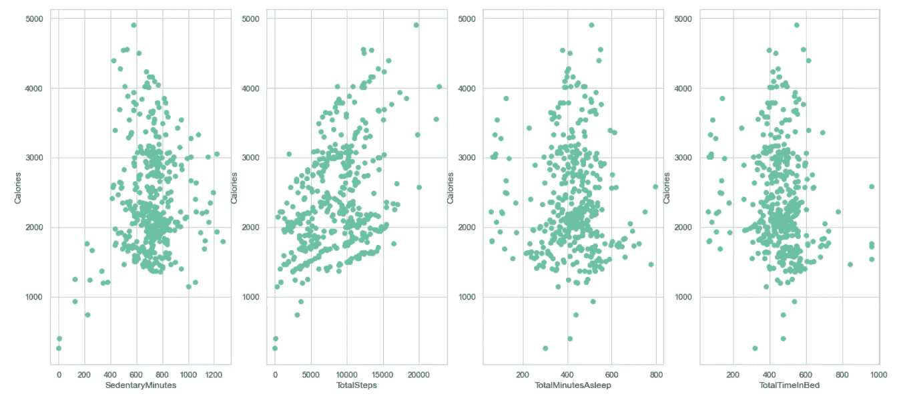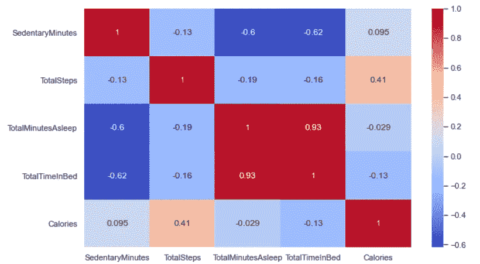

我们希望以这样一种方式分割数据，即训练集占总数据集的 60%，验证集和测试集各占 20%。此后，为了便于学习过程，我们将数据的范围定在 0 到 1 之间。

我们希望根据每次预测平均值的模型的性能来建立基线分数。基线有助于评估我们要训练的模型是否真正从数据中“学习”了什么。

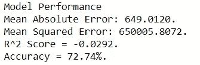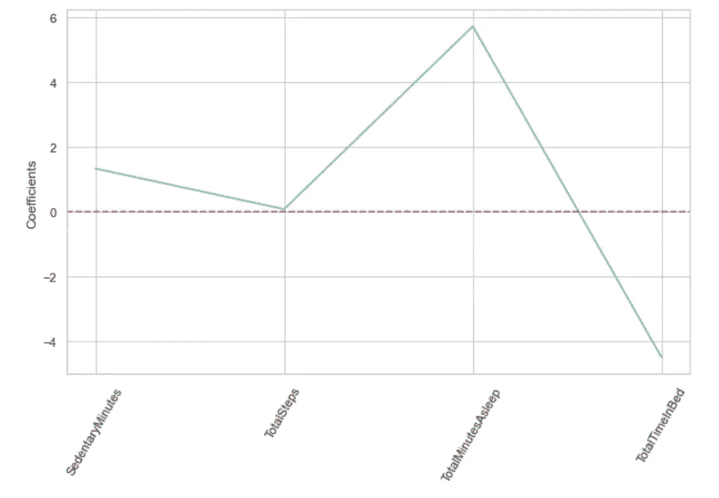

Lasso 回归算法表明，通过在模型中包含所有要素，我们可能不会面临任何重大的多重共线性问题。

# 多元线性回归器

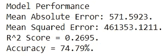

# 随机森林回归量

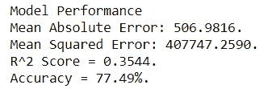

# 极端梯度助推器

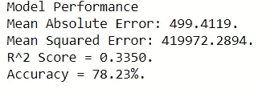

我们使用了三种不同的模型，它们(幸运地)似乎都优于基线，因此结果是有意义的。

# 交叉验证

首先，我们将进行交叉验证比较…

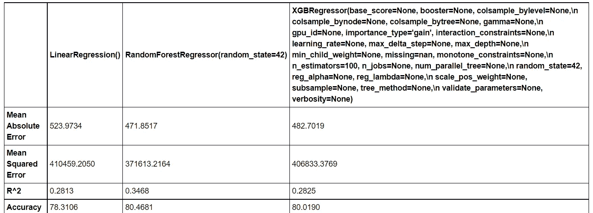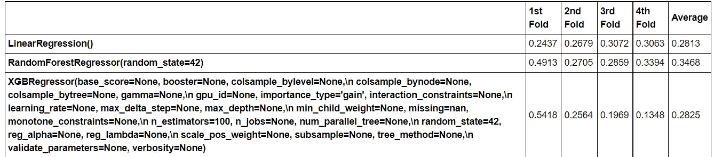

# 超参数调谐

为了提高我们的随机森林模型的准确性，我们将使用 RandomizedSearchCV 调整超参数

首先，我们将设置调整随机森林的范围或可能性…

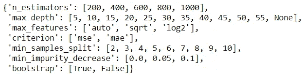

…然后我们调整模型

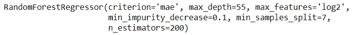

然后，我们将对极端梯度助推器重复同样的过程…

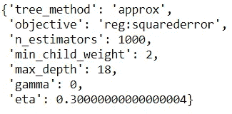

# 最终模型评估

现在，是时候评估模型了…

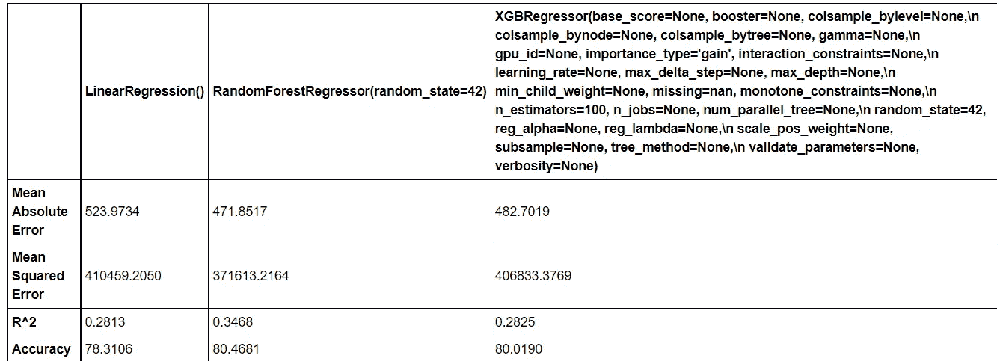

> *aaaaaa 获胜者是…* ***随机森林***

交叉验证和超参数微调有助于提高准确性。

通过在更大的跨度上选择更小的估计量区间，模型的性能可能会得到改善。总的来说，随机森林似乎给出了最好的结果，准确率为 80.5%。

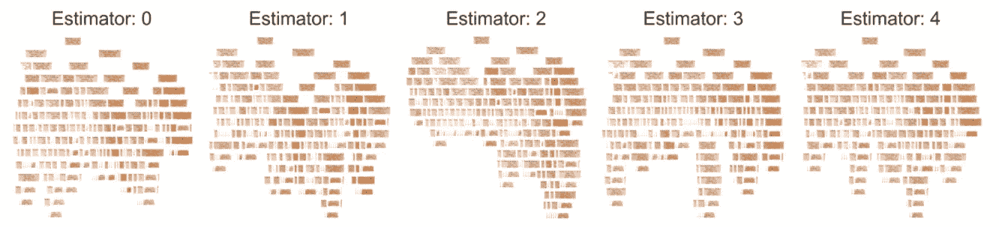

# PySpark 中的随机森林回归器

为了构建前面的模型，我们使用了 Scikit-learn 和 XGBoost。虽然这些库在相对方便的数据集上工作得很好(比如我们正在处理的数据集)，但它们是处理“大数据”的高效计算选择。

假设我们的数据集可能被进一步扩展，我们只为性能最好的模型实现了上述原型的一个更加可扩展的应用程序。为了简单起见，我们将直接使用以前在 Pandas 中创建的数据帧。

数据框需要一些“按摩”才能适合训练…

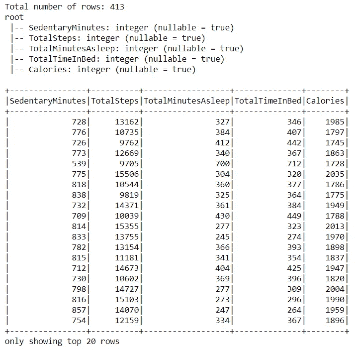

既然 PySpark 数据框架已经准备好了，我们就可以创建特性了…

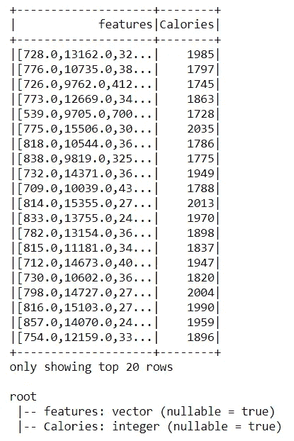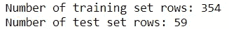

现在数据已经准备好进行训练了…

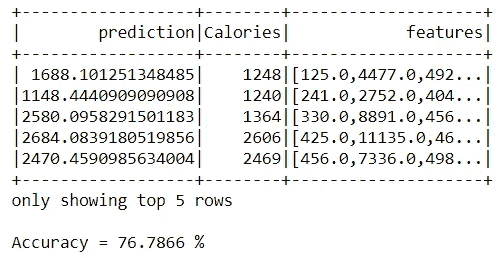

在 Spark 环境中获得了(几乎)相同的结果，而在超参数调整之前，先前的随机森林模型的准确度是 77.3%，现在获得了 77%。

如果你喜欢我的故事，并想跳到有代码和完整数据集的笔记本，我已经在我个人的 [git](https://github.com/quaesito) 上的 [repo](https://github.com/quaesito/ml-fitbit) 中发布了它。

给回购打个星:)

如果你在数据科学和/或人工智能项目上需要任何帮助，请不要犹豫，通过 [Linkedin](https://www.linkedin.com/in/micheledefilippo/) 或 [midasanalytics.ai](http://midasanalytics.ai) 联系我