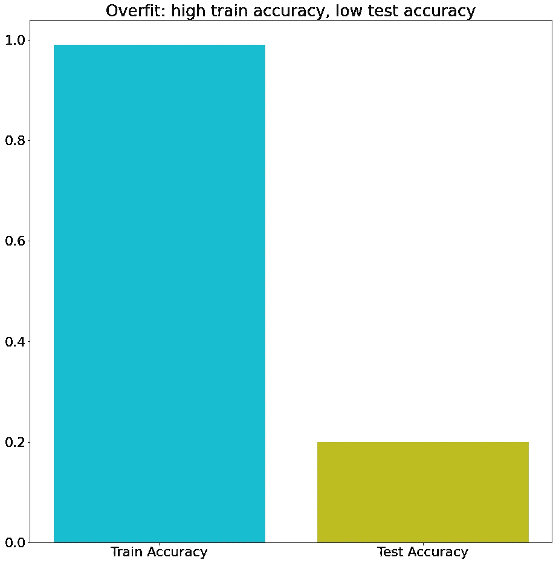
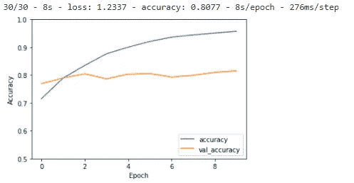
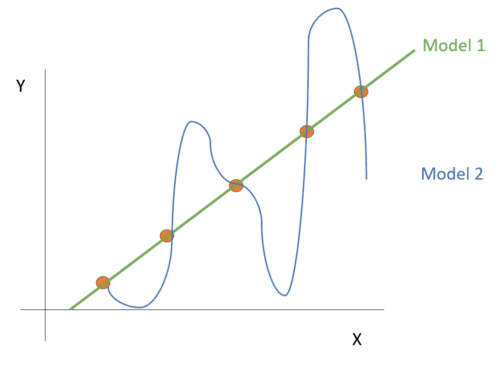

# 表格数据机器学习的过拟合解决方案

> 原文：<https://towardsdatascience.com/solutions-against-overfitting-for-machine-learning-on-tabular-data-857c080651fd?source=collection_archive---------9----------------------->

## 展示 5 个解决方案，你可以用它们来抵消表格数据和经典机器学习中的过度拟合

针对表格数据和经典机器学习的过拟合解决方案。照片由[梅姆](https://unsplash.com/@picoftasty?utm_source=unsplash&utm_medium=referral&utm_content=creditCopyText)在 [Unsplash](https://unsplash.com/?utm_source=unsplash&utm_medium=referral&utm_content=creditCopyText) 上拍摄。

在这篇文章中，我将概述适用于表格数据和经典机器学习的防止过度拟合的解决方案。

当比较经典的机器学习和深度学习时，后者通常被认为更复杂。对于过度拟合的问题，情况正好相反:许多工具和技巧可以很容易地避免深度神经网络的过度拟合，而当涉及到经典的机器学习时，你会发现自己处于黑暗之中。

# 什么是过度拟合？

过拟合是机器学习中常见的问题。让我先用一个关于人类学习的直观例子来说明。

> ***过拟合:模型已经记住了训练数据，但对学习过程没有概括的理解。***

当人们在学校、为考试或只是一般地学习东西时，总有那些学生有很大的背诵能力:他们能记住许多事实并在考试中取得成功。其他学生付出的努力要少得多，因为他们对事情有深刻的理解，因此他们不需要用心去学习。

## 死记硬背是不好的学习

有些考试会要求你简单地记住事实信息。了解事实在生活中也会非常有用。然而，在机器学习中， ***事实学习没有任何价值*** :如果你需要存储事实，你可以简单地为这些数据实现一个数据库。

## 学会“理解”是好的学习

机器学习模型不是学习事实，但它的学习是基于 ***变量*** 之间的学习关系。在更简单的机器学习模型中，这些关系通常是线性的，而在更复杂的模型中，它们可能是非线性的。

死记硬背考试成绩不是真正的学习。照片由 [Nguyen Dang Hoang Nhu](https://unsplash.com/@nguyendhn?utm_source=unsplash&utm_medium=referral&utm_content=creditCopyText) 在 [Unsplash](https://unsplash.com/s/photos/exam?utm_source=unsplash&utm_medium=referral&utm_content=creditCopyText) 上拍摄

## 过度拟合定义

有了这个想法，我们可以定义过度拟合。当模型在训练数据上表现良好时，它就是过度拟合，但在测试数据上表现不佳。

***过拟合:模型已经记住了训练数据，但对学习过程没有概括的理解。***

这与前面的例子有关:一个学生已经记住了过去考试的所有答案，但无法正确回答他以前没有见过的考试问题。

# 如何检测过度拟合？

## 训练测试分割以检测过度拟合

检测过度拟合的最简单方法是查看训练数据和测试数据之间的性能。如果您的模型在训练数据上表现很好，而在测试数据上表现很差，则您的模型可能过度拟合。

高训练性能和低测试性能指向过度拟合。图片作者。

## 可以使用交叉验证来检测过度拟合吗？

交叉验证是训练/测试分割的常用替代方法。这个想法是通过在数据的一部分上多次拟合模型，同时在数据的另一部分上进行测试，来避免创建训练/测试分割。最后，数据的所有部分都用于训练和测试。

交叉验证分数是在整个流程中完成的所有测试评估的平均分数。

交叉验证分数仅基于测试数据，因此这是一种很好的方法，可以用一个指标来代替单独的训练和测试指标。我们可以说交叉验证相当于模型的测试分数。

**使用交叉验证分数不会帮助您检测过度拟合**，因为它不会向您显示培训绩效。所以这不是一种检测过度拟合的方法，但是**交叉验证分数可以告诉你你的测试表现很差(没有原因)**。

# 为什么过拟合在深度神经网络上更容易解决？

如果说过度拟合在任何情况下都很容易解决，那就太过分了。然而，深度学习工具箱有很多工具可用于解决过度拟合。对于经典的机器学习来说，情况就不是这样了。

## 解决神经网络的过拟合问题

原因可能是神经网络是如此强大的学习算法，以至于很可能发生过拟合。建立一个根据训练数据进行学习的神经网络相对容易，但神经网络的真正任务是抵消过度拟合。这可能就是为什么有很多工具存在的原因。

用于检测神经网络中过拟合的著名图形。图片作者。

## 解决经典机器学习的过拟合问题

在经典的机器学习中，算法通常不太强大，但过拟合也可能发生！

你也可以计算经典机器学习的[学习曲线，尽管这是一种不太标准的方法。您可以针对越来越多的数据点重新调整模型，并获得与上述相同类型的图形。然而，这需要多次改装，可能有点乏味。](https://scikit-learn.org/stable/auto_examples/model_selection/plot_learning_curve.html)

# 什么是防止过度拟合的解决方案？

现在让我们继续，发现你可以对机器学习管道进行的一些改进，这些改进将 ***减少你的训练和测试性能*** 之间的差距。

实际上，这甚至意味着降低列车性能以提高测试性能。

如果你最终发现你不能再缩小这个差距，那么在一个训练和测试性能差距很大的模型上工作将是浪费时间。

最好是**先缩小差距**，一旦两者之间的差距缩小，您就可以继续尝试**一起提高训练和测试性能。**

# 应对过度拟合的解决方案

防止过度拟合的解决方案有:

1.  简化模型
2.  正规化
3.  数据扩充
4.  交叉验证的超参数调整
5.  集合模型

让我们更详细地发现它们，并看看它们如何应用于表格数据和经典的机器学习模型。

# 解决方案 1:针对过度拟合简化模型

减少过度拟合的第一个解决方案是降低模型的复杂性。

针对表格数据和经典机器学习的过拟合解决方案。照片由 [Prateek Katyal](https://unsplash.com/@prateekkatyal?utm_source=unsplash&utm_medium=referral&utm_content=creditCopyText) 在 [Unsplash](https://unsplash.com/s/photos/less-is-more?utm_source=unsplash&utm_medium=referral&utm_content=creditCopyText) 上拍摄

一个模型的性能越好，就越有可能过度拟合。毕竟，学习能力差的模型永远无法记住训练数据集。想象一个[线性回归](https://en.wikipedia.org/wiki/Linear_regression)，它学习系数来拟合变量之间的线性关系:它只能学习线性趋势。

> *一个模型越有性能，就越有可能过度拟合。*

如果您观察到过度拟合，让您的模型不那么复杂是个好主意。这可以通过切换到性能较低的模型来实现。一旦您缩小了训练和测试性能之间的差距，您就可以重新迭代并尝试再次提高整体性能。

# 解决方案 2:调整以防止过度拟合

正则化有助于模型在两个精度相同的模型之间进行选择。如果您使用复杂模型获得了与简单模型相同的精度，那么您应该选择更简单的模型。

这个原则通常被称为[奥卡姆剃刀](https://en.wikipedia.org/wiki/Occam's_razor)、[接吻原则](https://en.wikipedia.org/wiki/KISS_principle)等等。

> 正则化的目标是改变成本函数，以便**使模型复杂度成为额外的成本。**

例如，让我们看看下图:

如何在两款性能完美的机型中做出选择？图片作者。

方差较低的模型似乎更可靠，但两个模型都精确地通过了每个数据点:两者都得了满分。

正则化的目标是改变成本函数，以便**使模型复杂性成为额外的成本。**

一些经典的机器学习模型是专门为正则化而开发的:

*   [山脊](https://scikit-learn.org/stable/modules/generated/sklearn.linear_model.Ridge.html)回归
*   [套索](https://scikit-learn.org/stable/modules/generated/sklearn.linear_model.Lasso.html)回归
*   [弹力网](https://scikit-learn.org/stable/modules/generated/sklearn.linear_model.ElasticNet.html)

这些正则化方法各不相同，因为它们使用不同的函数添加到成本函数中。Lasso 使用 L1 规范，Ridge 使用 L2 规范，ElasticNet 同时使用 L1 和 L2 规范。 [***你可以看看这篇文章，深入了解这些规范之间的区别。***](/3-distances-that-every-data-scientist-should-know-59d864e5030a)

> 不同的[距离度量](/3-distances-that-every-data-scientist-should-know-59d864e5030a)用于不同的正则化方法。

将正则化添加到成本函数仅对于某些模型是可能的。不幸的是，对于其他模型来说，这不太容易实现。但是， ***对于没有正则化的模型，可以通过交叉验证*** (方案 4)的超参数调优获得模型蕴涵。

# 解决方案 3:表格数据的数据扩充

数据扩充是一项在图像处理的[机器学习中经常使用的任务](/yolo-v5-object-detection-tutorial-2e607b9013ef)。在影像数据中，通过向训练数据集中添加稍加变换的影像来扩充数据是很容易的。例如:

*   扭转形象
*   拉伸图像
*   更多

对于图像上的数据增强，存在许多功能，例如在 [Tensorflow 的数据增强层](https://www.tensorflow.org/tutorials/images/data_augmentation)中。

在经典机器学习中，数据扩充不太明显。**你不能只是翻转或拉伸一行表格数据。**

[***对表格数据进行数据扩充的一个很棒的方法就是 SMOTE***](/smote-fdce2f605729) ***。***

> [SMOTE](/smote-fdce2f605729) 是一种对表格数据进行数据扩充的算法

SMOTE 是一种通过基于原始数据点创建**合成数据点**来执行数据扩充的算法。因此，这是唯一完全适用于表格数据的方法之一。

如果过度拟合是由于数据中没有足够的样本，这种方法尤其有效。

# 解决方案 4:针对过度拟合进行交叉验证的超参数调整

[超参数调整](/gridsearch-the-ultimate-machine-learning-tool-6cd5fb93d07)是调整模型的超参数以提高模型性能的任务。

最简单的方法是使用网格搜索:测试超参数值的多种组合，并使用交叉验证评估它们的性能。

使用这个，您可以找到产生最佳交叉验证分数的超参数组合。如上所述，交叉验证分数可能代表您在培训/测试环境中的测试分数。

在这种情况下，拆分数据的一个好方法是:

*   输入交叉验证的训练数据集(内部训练/验证分割):**用于超参数调整**
*   在调优和最终模型定义结束之前，不会使用测试数据集。**您将使用这个测试集进行最终的性能评估**:它应该代表您在模型部署之后观察到的性能。

由于这种方法优化了交叉验证分数(与测试分数相当)，因此很可能产生具有较少过度拟合(较高测试分数)的解决方案。

# 解决方案 5:防止过度拟合的集合模型

根据随机森林的发明者，随机森林不会过度适应。在实践中，这是很有争议的(例如见[这里](https://datascience.stackexchange.com/questions/1028/do-random-forest-overfit)或[这里](https://stats.stackexchange.com/search?q=random%20forest%20overfit))。

也许说随机森林永远不会过度适配有点过了。然而，可以肯定地说，合奏可以在避免过度拟合方面提供很大的帮助。

> 一个简单的模型可能是非常错误的。很多简单模型的平均值，大概是误差较小的。

尽管一个模型可能非常错误，但它比大量模型的平均值非常错误的可能性要小得多。这就是集成学习的思想。

集合模型是将多个弱学习者放在一起的艺术。新的预测是所有那些弱学习者的平均预测。随机森林是集成学习的一个很好的例子，但是在这个家族中存在更多的模型。

集成建模就像机器学习的团队工作。照片由 [NeONBRAND](https://unsplash.com/@neonbrand?utm_source=unsplash&utm_medium=referral&utm_content=creditCopyText) 在 [Unsplash](https://unsplash.com/s/photos/team-together-everybody-achieves-more?utm_source=unsplash&utm_medium=referral&utm_content=creditCopyText) 上拍摄。

如果您正在处理一个表现不佳的模型，您甚至可以通过将多个模型分组到一个集合包装器中，将它制作成一个集合。这方面的例子有:

*   [投票分类器](https://scikit-learn.org/stable/modules/generated/sklearn.ensemble.VotingClassifier.html):让多个分类模型进行投票，最常预测的类别将被保留。
*   [投票回归器](https://scikit-learn.org/stable/modules/generated/sklearn.ensemble.VotingRegressor.html#sklearn.ensemble.VotingRegressor):它做同样的事情，但是取所有单个模型的平均预测，并将其转化为数字目标的预测。
*   [堆叠分类器](https://scikit-learn.org/stable/modules/generated/sklearn.ensemble.StackingClassifier.html#sklearn.ensemble.StackingClassifier):建立一个额外的分类模型，使用每个单独模型的预测作为输入，并预测最终目标。
*   [堆叠回归变量](https://scikit-learn.org/stable/modules/generated/sklearn.ensemble.StackingRegressor.html#sklearn.ensemble.StackingRegressor):建立一个额外的回归模型，使用每个单独模型的预测作为最终回归模型的输入，最终回归模型将所有预测组合成一个最终预测。

# 结论

在本文中，您首先看到了如何在表格数据和经典机器学习中检测过度拟合。你已经看到了 5 种应对过度拟合的主要解决方案:

1.  简化模型
2.  正规化
3.  数据扩充
4.  交叉验证的超参数调整
5.  集合模型

我希望这篇文章已经给了你发现过度拟合的知识，以及改进你的模型的资源！

*感谢您的阅读，请不要犹豫，继续关注更多数学、统计和数据科学内容！*