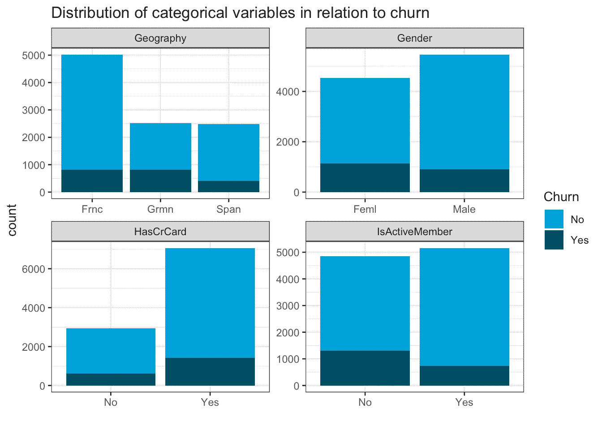
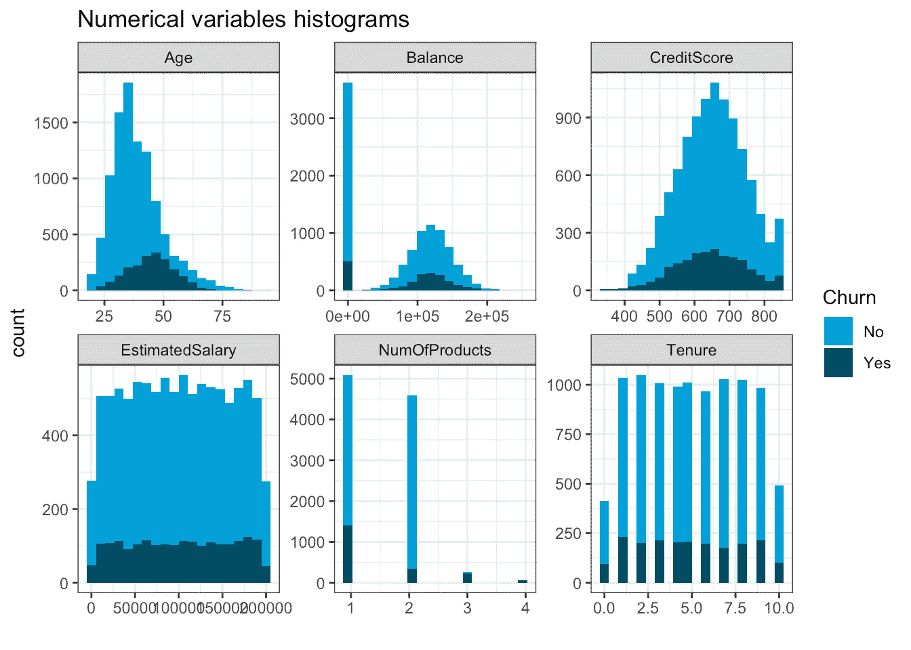
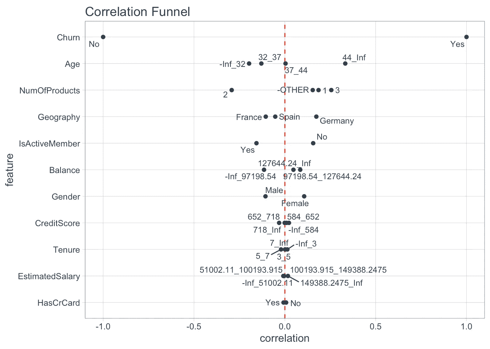
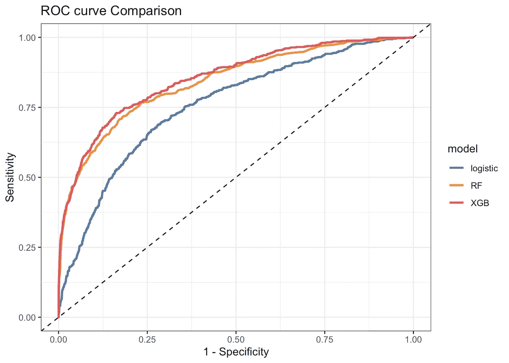
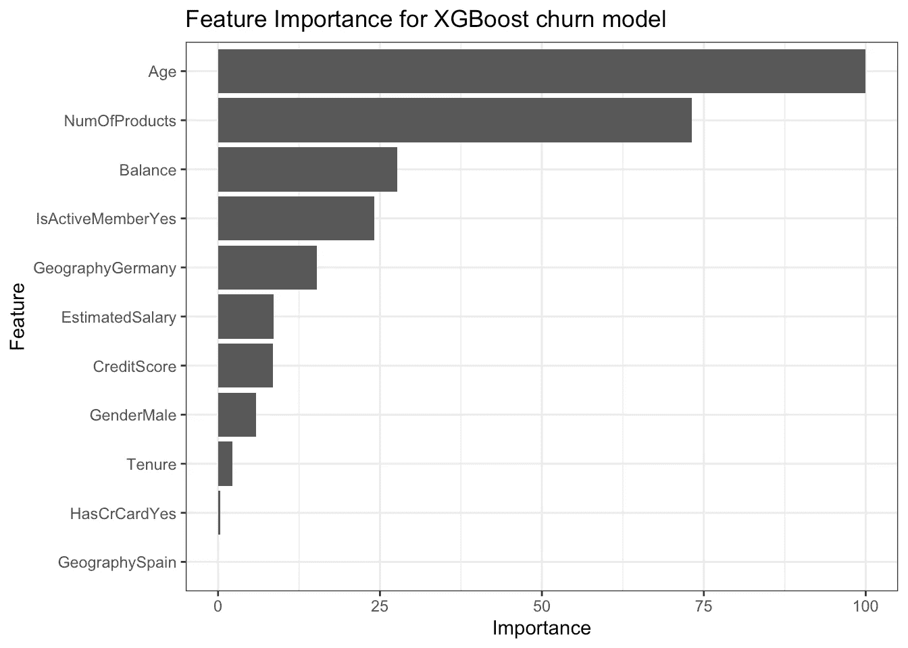
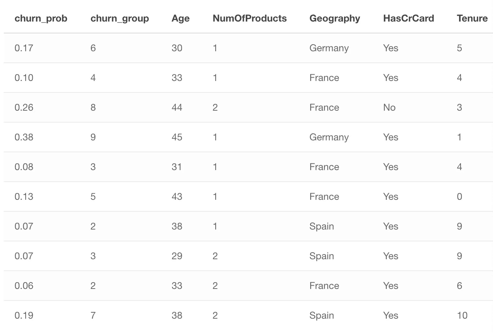

# 用机器学习解决现实世界的客户流失问题(包括详细的案例研究)

> 原文：<https://towardsdatascience.com/solve-a-real-world-churn-problem-with-machine-learning-including-a-detailed-case-study-a41dac0150b9?source=collection_archive---------15----------------------->


照片由[马太·亨利](https://burst.shopify.com/@matthew_henry?utm_campaign=photo_credit&utm_content=Free+Money+Hides+Face+Photo+%E2%80%94+High+Res+Pictures&utm_medium=referral&utm_source=credit)发自[突发](https://burst.shopify.com/bank?utm_campaign=photo_credit&utm_content=Free+Money+Hides+Face+Photo+%E2%80%94+High+Res+Pictures&utm_medium=referral&utm_source=credit)

## 使用 R & Tidyverse

# 流失定义

客户流失是大多数公司面临的主要问题。失去客户需要获得新的客户来替代他们。根据领域的不同，这可能比留住现有客户要贵 10 倍左右。

当客户停止使用你公司的产品或服务时，他/她被认为是流失。这对于合同设置来说很容易定义，因为当客户未能续签合同时，就被认为是流失客户。但在非合同环境中，没有明确的规则来定义客户流失。在大多数情况下，具有扩展领域知识的业务用户与数据科学家/数据分析师一起工作，来定义在特定问题中什么被认为是变动。例如，在一个零售组织中，当一个客户在过去 4 个月中没有购买任何东西时，团队可以将他定义为流失客户。

# 客户流失管理的好处

主要好处是通过获得更高的保留率和客户满意度来增加收入。另一个好处是通过有针对性的营销活动优化营销支出&重新分配营销预算。

# 流失率

您可以通过将我们在特定时期(比如一个季度或一年)失去的客户数量除以该时期开始时我们拥有的客户数量来计算流失率。

例如，如果我们这个季度开始时有 400 个客户，结束时有 380 个，我们的流失率是 5%，因为我们失去了 5%或 20 个客户。

# 我们的流失问题

我们的案例研究是一家银行，该银行希望开发一个客户流失模型来预测客户流失的可能性。银行业已经成为发达国家的主要产业之一。技术进步和银行数量的增加提高了竞争水平。银行依靠多种策略努力在这个竞争激烈的市场中生存。

提出了三个主要战略来增加收入:

*   **获取新客户**
*   向现有客户追加销售(说服客户购买额外的或更贵的东西)
*   **增加客户保持期**

在我们的案例中，我们专注于最后一个策略，即增加客户的保留期。原始数据集是公共的，可以在 [Kaggle](https://www.kaggle.com/shrutimechlearn/churn-modelling) 找到

# 导入库

首先，我们加载所有的库。

```
library(tidyverse) 
library(ggthemes) 
library(correlationfunnel) 
library(knitr) 
library(caret) 
library(recipes) 
library(yardstick)
library(DT) # Set the black & white theme for all plots 
theme_set(theme_bw())
```

# 加载数据集

我们使用 read_csv()函数(来自 readr 库)来读取 r 中的 csv 文件。

```
bank <- read_csv(file = "/Users/manos/OneDrive/Projects/R/All_Projects/Churn/data/Churn_Modelling.csv") bank <- 
bank %>% mutate(Churn = if_else(Exited == 0, "No", "Yes"), 
                HasCrCard = if_else(HasCrCard == 0, "No", "Yes"), 
                IsActiveMember = if_else(IsActiveMember == 0, "No", "Yes")) %>% 
select(- RowNumber, -CustomerId, - Surname, -Exited)
```

# 检查数据集

使用 glimpse()函数检查数据集。

```
bank %>% glimpse()## Rows: 10,000 
## Columns: 11 
## $ CreditScore <dbl> 619, 608, 502, 699, 850, 645, 822, 376, 501, 684, 528... 
## $ Geography <chr> "France", "Spain", "France", "France", "Spain", "Spai... 
## $ Gender <chr> "Female", "Female", "Female", "Female", "Female", "Ma... 
## $ Age <dbl> 42, 41, 42, 39, 43, 44, 50, 29, 44, 27, 31, 24, 34, 2... 
## $ Tenure <dbl> 2, 1, 8, 1, 2, 8, 7, 4, 4, 2, 6, 3, 10, 5, 7, 3, 1, 9... 
## $ Balance <dbl> 0.00, 83807.86, 159660.80, 0.00, 125510.82, 113755.78... 
## $ NumOfProducts <dbl> 1, 1, 3, 2, 1, 2, 2, 4, 2, 1, 2, 2, 2, 2, 2, 2, 1, 2,... 
## $ HasCrCard <chr> "Yes", "No", "Yes", "No", "Yes", "Yes", "Yes", "Yes",... 
## $ IsActiveMember <chr> "Yes", "Yes", "No", "No", "Yes", "No", "Yes", "No", "... 
## $ EstimatedSalary <dbl> 101348.88, 112542.58, 113931.57, 93826.63, 79084.10, ... 
## $ Churn <chr> "Yes", "No", "Yes", "No", "No", "Yes", "No", "Yes", "...
```

下面是数据集所有变量的详细描述

*   **信用评分** |信用评分是一个介于 300-850 之间的数字，用来描述消费者的信誉。分数越高，借款人对潜在的贷款人来说就越好
*   **地理位置** |客户所在国家
*   **性别** |客户性别
*   **年龄** |客户年龄
*   **任期** |客户在银行工作的年数
*   **余额** |客户当前余额
*   **NumOfProducts** |客户正在使用的银行产品数量
*   **HasCrCard** |是否有信用卡
*   **IsActiveMember** |客户是否为活跃会员
*   **预计工资** |客户的预计工资
*   **搅动** |客户是否搅动

# 检查缺少的值

任何数据分析中最常见的问题之一是发现和处理缺失数据。

```
bank %>% 
map_df(~ sum(is.na(.))) %>% 
gather() %>% 
arrange(desc(value))## 
# A tibble: 11 x 2 
## key value 
## <chr> <int> 
## 1 CreditScore 0 
## 2 Geography 0 
## 3 Gender 0 
## 4 Age 0 
## 5 Tenure 0 
## 6 Balance 0 
## 7 NumOfProducts 0 
## 8 HasCrCard 0 
## 9 IsActiveMember 0 
## 10 EstimatedSalary 0 
## 11 Churn 0
```

没有任何丢失的值。

# 检查分类/文本变量的级别

现在我们要检查所有分类变量的级别。

```
bank %>% summarise_if(is.character, n_distinct) %>% t()## [,1] 
## Geography 3 
## Gender 2 
## HasCrCard 2 
## IsActiveMember 2 
## Churn 2
```

看起来所有的字符变量都是具有几个级别(2-3)的分类变量。

# 分类变量分布

现在我们要检查有关流失的分类变量的分布。

```
bank %>% 
select_if(is.character) %>% 
gather(key = key, value = value, - Churn, factor_key = T) %>% ggplot(aes( x = value, fill = Churn)) + geom_bar() + facet_wrap(~key, scales = 'free') + 
scale_x_discrete(labels = abbreviate) + 
labs( title = 'Distribution of categorical variables in relation to churn', x = '') + 
scale_fill_economist()
```



作者图片

主要发现是:

*   来自德国的顾客更有可能流失
*   男性客户流失的可能性略低
*   活跃成员不太可能流失

# 数值变量分布

检查与客户流失相关的数字变量的分布。

```
bank %>% 
select_if(function(col) is.numeric(col) | all(col == .$Churn)) %>%
gather(key = "Variable", value = "Value", -Churn) %>% ggplot(aes(Value, fill = Churn)) + 
geom_histogram(bins = 20) + 
facet_wrap(~ Variable, scales = "free") + 
labs( title = "Numerical variables histograms", x = "" ) + scale_fill_economist()
```



作者图片

年龄越大，流失的可能性就越大

# 相关漏斗

相关性是理解变量之间关系的一个非常重要的度量。软件包[**correlation funnel**](https://business-science.github.io/correlationfunnel/index.html)生成一个图表，帮助我们了解所有变量(分类&数值)与流失的关系。

首先，它创建每个类别变量的二元变量和每个数值变量的 4 个箱(基于分位数)。它从最相关到最不相关的所有变量开始绘制。

```
# Create correlation Funnel 
bank %>% 
drop_na() %>% 
binarize() %>% 
correlate(Churn__Yes) %>% 
plot_correlation_funnel()
```



作者图片

看起来年龄、产品数量、地理位置和会员活动都很重要。平衡和性别不那么重要。信用评分、任期、预计工资和信用卡似乎对客户流失不重要，因为几乎所有类别的相关性都接近于零。

# **建模**

现在，我们可以继续开发一个机器学习模型，预测所有客户的流失概率。

# 分割数据集

首先，我们将数据集分为两部分，训练和测试数据集。我们将使用训练数据集来训练我们的模型&测试数据集来检查模型的性能。

```
# Split the dataset in two parts 
set.seed(1) 
inTrain = createDataPartition(bank$Churn, p = .70)[[1]] # Assign the 70% of observations to training data 
training <- bank[inTrain,] # Assign the remaining 30 % of observations to testing data 
testing <- bank[-inTrain,]
```

# 为建模准备数据配方

这里，我们使用 recipes 包将相同的预处理步骤应用于训练和测试数据。

```
# Create the recipe object 
recipe_obj <- recipe(Churn ~ ., data = training) %>% step_zv(all_predictors()) %>% # check any zero variance features step_center(all_numeric()) %>% 
step_scale(all_numeric()) %>% # scale the numeric features 
prep()
```

# 根据配方处理数据

```
train_data <- bake(recipe_obj, training) 
test_data <- bake(recipe_obj, testing)
```

# 为建模设置列车控制

我们使用 TrainControl()函数在模型训练期间指定一些参数，例如重采样方法、K-Fold 中的折叠数等。

```
train_ctr <- trainControl(method = 'cv', number = 10, classProbs = TRUE, summaryFunction = twoClassSummary)
```

# 开发多种机器学习模型

开发一个**逻辑回归**模型

```
Logistic_model <- train(Churn ~ ., data = train_data, method = 'glm', family = 'binomial', trControl = train_ctr, metric = 'ROC')
```

开发一个**随机森林**模型

```
rf_model <- train(Churn ~ ., data = train_data, method = 'rf', trControl = train_ctr, tuneLength = 5, metric = 'ROC')
```

开发一个 **XGBoost 模型**

```
xgb_model <- train(Churn ~ ., data = train_data, method = 'xgbTree', trControl = train_ctr, tuneLength = 5, metric = 'ROC')
```

# 模型比较

在这一步，我们将比较模型的准确性。

```
model_list <- resamples(list(Logistic = Logistic_model, Random_forest = rf_model, XgBoost = xgb_model)) summary(model_list)## 
## Call: 
## summary.resamples(object = model_list) 
## 
## Models: Logistic, Random_forest, XgBoost 
## Number of resamples: 10 
## 
## ROC 
## Min. 1st Qu. Median Mean 3rd Qu. Max. NA's 
## Logistic 0.7310692 0.7629073 0.7713738 0.7685092 0.7793850 0.7893184 0 
## Random_forest 0.8257989 0.8573118 0.8669290 0.8653269 0.8735644 0.8900139 0 
## XgBoost 0.8445059 0.8651163 0.8716812 0.8717819 0.8818719 0.8984382 0 
## 
## Sens 
## Min. 1st Qu. Median Mean 3rd Qu. Max. NA's 
## Logistic 0.9408602 0.9573794 0.9605027 0.9612578 0.9654857 0.9820789 0 
## Random_forest 0.9425494 0.9546864 0.9631957 0.9608965 0.9681900 0.9802513 0 
## XgBoost 0.9498208 0.9609515 0.9641577 0.9648430 0.9677275 0.9784946 0 
## 
## Spec 
## Min. 1st Qu. Median Mean 3rd Qu. Max. NA's 
## Logistic 0.1818182 0.2126465 0.2245395 0.2307003 0.2376761 0.3076923 0 
## Random_forest 0.3732394 0.4534128 0.4825175 0.4803211 0.5131119 0.5594406 0 
## XgBoost 0.4265734 0.4797843 0.4964789 0.4902098 0.5034965 0.5524476 0
```

基于 ROC (AUC 值)的最佳模型是 **XgBoost** 。最佳模型的 AUC 值(逻辑回归的平均值)为 **0.87** 。一般来说，AUC 值为 0.7 的模型被认为是有用的，当然这取决于问题的背景。

# 模型评估

```
# Predictions on test data 
pred_logistic <- predict(Logistic_model, newdata = test_data, type = 'prob') pred_rf <- predict(rf_model, newdata = test_data, type = 'prob') pred_xgb <- predict(xgb_model, newdata = test_data, type = 'prob') evaluation_tbl <- tibble(true_class = test_data$Churn, logistic_churn = pred_logistic$Yes, rf_churn = pred_rf$Yes, xgb_churn = pred_xgb$Yes) evaluation_tbl## # A tibble: 2,999 x 4 
## true_class logistic_churn rf_churn xgb_churn 
## <fct> <dbl> <dbl> <dbl> 
## 1 Yes 0.125 0.276 0.297 
## 2 No 0.234 0.178 0.0503 
## 3 Yes 0.289 0.758 0.997 
## 4 No 0.112 0.158 0.0631 
## 5 No 0.0600 0.002 0.0139 
## 6 No 0.160 0.006 0.0324 
## 7 No 0.0991 0.002 0.0349 
## 8 No 0.0669 0.042 0.0267 
## 9 No 0.232 0.164 0.246 ## 10 No 0.0311 0.056 0.0181 
## # ... with 2,989 more rows
```

# 受试者工作特征曲线

ROC 曲线或受试者操作特征曲线是说明二元分类器系统在其辨别阈值变化时的诊断能力的图。

即模型在不同阈值下的预测能力

```
# set the second level as the positive class options(yardstick.event_first = FALSE) # creating data for ploting ROC curve 
roc_curve_logistic <- 
roc_curve(evaluation_tbl, true_class, logistic_churn) %>% mutate(model = 'logistic') 
roc_curve_rf <- roc_curve(evaluation_tbl, true_class, rf_churn) %>% mutate(model = 'RF') roc_curve_xgb <- roc_curve(evaluation_tbl, true_class, xgb_churn) %>% mutate(model = 'XGB') # combine all the roc curve data roc_curve_combine_tbl <- Reduce(rbind, list(roc_curve_logistic, roc_curve_rf, roc_curve_xgb)) head(roc_curve_combine_tbl,10)## # A tibble: 10 x 4 ## .threshold specificity sensitivity model ## <dbl> <dbl> <dbl> <chr> ## 1 -Inf 0 1 logistic ## 2 0.0115 0 1 logistic ## 3 0.0118 0.000419 1 logistic ## 4 0.0134 0.000838 1 logistic ## 5 0.0137 0.00126 1 logistic ## 6 0.0141 0.00168 1 logistic ## 7 0.0144 0.00209 1 logistic ## 8 0.0149 0.00251 1 logistic ## 9 0.0152 0.00293 1 logistic ## 10 0.0154 0.00293 0.998 logistic# Plot ROC curves roc_curve_combine_tbl %>% ggplot(aes(x = 1- specificity, y = sensitivity, color = model))+ geom_line(size = 1)+ geom_abline(linetype = 'dashed')+ scale_color_tableau()+ labs(title = 'ROC curve Comparison', x = '1 - Specificity', y = 'Sensitivity')
```



作者图片

AUC 值越大，模型精确度越好。

# 特征重要性

理解模型是如何工作的很重要，尤其是在客户流失模型的情况下。一种常用的度量是全局特征重要性。它衡量每个变量对客户流失预测的贡献。

这种重要性是为数据集中的每个属性显式计算的，允许对属性进行排序和相互比较。对于单个决策树，重要性通过每个属性分割点改进性能度量的量来计算，通过节点负责的观察的数量来加权。然后，对模型中所有决策树的特征重要性进行平均。

```
ggplot(varImp(xgb_model)) + 
labs(title = "Feature Importance for XGBoost churn model")
```



作者图片

看起来前 2 个最重要的特征是:
— **年龄**—
—**产品数量**

# 预测新客户的流失

当我们想要对客户进行预测时，我们可以遵循以下流程。

```
new_data <- read_csv(file = "/Users/manos/OneDrive/Projects/R/All_Projects/Churn/data/new_data_bank.csv") new_data_recipe <- bake(recipe_obj, new_data) new_dat_pred <- predict(Logistic_model, newdata = new_data_recipe, type = 'prob') %>% 
select(Yes) %>% 
rename(churn_prob = Yes) %>% 
bind_cols(new_data) %>% 
mutate(churn_group = ntile(churn_prob, n = 10)) %>% select(churn_prob, churn_group, everything()) %>% 
mutate(churn_prob = round(churn_prob, 2)) new_dat_pred %>% select(churn_prob, churn_group, Age, NumOfProducts, Geography, HasCrCard, Tenure) %>% head(10) %>% 
kable() %>% 
kableExtra::kable_styling()
```



作者图片

# 创建流失风险排名

虽然我们开发了一个模型，可以很好地预测客户是否会流失，但该模型的输出概率在业务环境中并不充分。我们需要一些能够被所有利益相关者理解和容易使用的度量标准，并消除例如向非技术利益相关者解释阈值的复杂性。

因此，一个**流失风险排名**会比一个实际概率更有用。因此，我们将概率变量分解为 10 个流失风险桶。现在客户的流失风险从 **1(最低概率)到 10(最高概率)**。

# 防止流失的策略

最初的策略是为不同的客户流失风险群体开发不同的销售方案(或营销活动)。

例如，属于流失风险组 10 和 9 的客户比示例 1 和 2 具有明显更高的流失风险。因此，向他们提供更多的东西来留住他们是至关重要的。

【https://www.manosantoniou.com】最初发表于[](https://www.manosantoniou.com/post/solve-a-real-world-churn-problem/)**。**