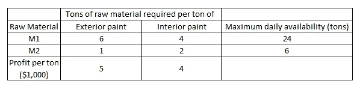
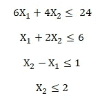

# 用 FICO Xpress 在 Python 中求解线性规划

> 原文：<https://towardsdatascience.com/solve-linear-programming-in-python-with-fico-xpress-599f204fb34a?source=collection_archive---------13----------------------->

## 为什么我们有 LP？因为我们希望利用手头的资源每次都做到最好


安妮·斯普拉特在 [Unsplash](https://unsplash.com/s/photos/resources?utm_source=unsplash&utm_medium=referral&utm_content=creditCopyText) 上的照片

# 介绍

数学优化是应用数学的一个分支。拥有这个分支的最简单的原因是我们需要在标准下找到最优解。在现实生活中，这个最优解往往是利润最大化或成本最小化。标准涉及限制当前情况的有限资源和约束。给定这些标准，我们应该做什么来实现最佳解决方案？我们使用公式和不等式来描述情况，并定义一个函数来衡量结果。这样就建立了一个数学模型。

数学优化的一个特例是线性规划(LP)。“线性”表示数学模型中的所有公式都是线性形式，即没有平方函数、平方根函数等。

# 例子

一家公司使用两种原材料生产两种油漆，一种用于室内，一种用于室外。下表显示了每种原材料中每种油漆的成分，以及每种原材料每天的供应情况。两种油漆的利润也列了出来。



而且因为市场的原因，每天室内涂料的需求量不能超过室外涂料 1 吨以上。该公司还知道，室内涂料的最大需求量是每天 2 吨。

问题是，在所有这些限制下，我们如何能使利润最大化。因此，我们需要知道每天生产多少吨室外涂料和室内涂料。

# LP 中的 4 个常见要求

对于每个 LP 问题，有 4 个共同的要求。下面我将使用上面的例子展示所有 4 个。

1.  如前所述，LP 问题寻求实现最优解，最大化或最小化某个数量，也就是**目标函数。**在示例中，我们希望实现利润最大化。换句话说，我们想知道外部和内部油漆的日产量，以便 5*(外部油漆的日产量，以吨计)+ 4*(内部油漆的日产量，以吨计)最大化。如果我们将 X1 定义为室外油漆的日产量(以吨计),将 X2 定义为室内油漆的日产量(以吨计),那么目标函数就是 5X1+4X2，我们希望最大化这个函数。
2.  必须有一个或多个约束来限制追求目标的程度。我们称之为**约束**。在这个例子中，有四个约束。第一个和第二个是原材料 M1 和 M2 的最大日供应量。第三个是内外墙涂料的市场界限。最后一个是室内涂料的最大需求。我们可以将这些限制转化为不平等。
3.  在 LP 问题中，必须有可供选择的行动方案。这意味着我们可以选择任何可变结果的组合来获得最优解。在这个例子中，没有限制生产室外或室内油漆需要多少吨 M1 或 M2。
4.  目标和约束必须用线性方程或不等式来表示。在上面的例子中，它们都是线性的。



4 个限制因素

在大多数 LP 问题中，也有一个常见的假设，即变量不能是负的。这个假设甚至经常被认为是 LP 问题的第五个要求。在这个例子中，我们还将两个变量限制为非负。

# 用 FICO Xpress 求解线性规划

我们在 python 中需要做的事情和我们刚刚做的事情类似。我们首先定义变量。然后我们定义目标函数和这 4 个约束。最后，我们请求 Xpress 解决 LP 问题并提供解决方案。

```
import xpress as xp
```

FICO Xpress 提供了一个社区许可证，对于这个演示来说已经足够了。

```
# Define the LP problem
model = xp.problem(name='Paints')
```

这一步创建了一个名为 **Paints** 的空问题。

```
# Define variables
x1 = xp.var(name='exterior')
x2 = xp.var(name='interior')
model.addVariable(x1,x2)
```

在帮助文档中，`var`有多个参数，如下所示

```
xpress.var(name='', lb=0, ub=xpress.infinity, threshold=-xpress.infinity, vartype=xpress.continuous)
```

您可以为每个变量指定一个名称，以便清楚地展示。`lb`和`ub`用于设定下限和上限。如前所述，非负性经常需要 Xpress 将缺省值`lb`指定为 0。另一个重要的论点是`vartype`。这可以进一步将变量限制为不同的变量类型，包括二进制、整数等。此[链接](https://www.fico.com/fico-xpress-optimization/docs/latest/solver/optimizer/python/HTML/chModeling_sec_secModelingVar.html)进一步解释了`var` Xpress 类型。

```
# Define constraints 
constr1 = 6*x1+ 4*x2 <= 24
constr2 = x1+x2 <=6 
constr3 = x2-x1 <=1 
constr4 = x2<=2
```

现在我们可以直接构建这 4 个约束。你所需要做的就是像在公式表单中那样键入它们。每个变量的类型都是`xpress.constraint`。

```
xpress.constraint (constraint=None, body=None, lb=-xpress.infinity, ub=xpress.infinity, sense=None, rhs=None, name='')
```

在上面，我们包括了约束的完整形式。另一种方法是把它分解成`body`、`lb`、`ub`。

```
# Same as constr1
xp.constraint(body = 6*x1+ 4*x2,ub = 24)
```

一旦我们定义了所有的约束，我们就可以将所有的变量和约束输入到模型中。您可以逐个添加约束，也可以使用约束列表/元组/数组一起输入它们。

```
problem.addVariable(v1, v2, ...)

Argument:
v1,v2...: 

  Variables or list/tuples/array of variables created with the
  xpress.var constructor or the
  xpress.vars function.bproblem.addConstraint(c1, c2, ...)

Argument:
c1,c2...: 

  Constraints or list/tuples/array of constraints created with the xpress.constraint() call.
```

所以我们现在将它们添加到模型中。

```
# Add variables
model.addVariable([x1,x2])# Add constraints 
model.addConstraint([constr1,constr2,constr3,constr4])
```

最后一部分是目标函数。

```
model.setObjective(5*x1+4*x2,sense=xp.maximize)
```

你可以看到`setObjective`只有两个参数。一个是`expr`，一个是`sense.`

```
problem.setObjective(expr, sense=xpress.minimize)

Arguments:
expr: 
 A linear or quadratic function of the variables
that were added to the problem prior to this call. An error will be
returned if any variable in the linear or quadratic part of the
objective was not added to the problem via
addVariable.
sense: 
 Either xpress.minimize or xpress.maximize.
```

`sense`用来定义我们是否要最大化或最小化目标函数。

最后可以请 Xpress 来求解模型。

```
model.solve()FICO Xpress v8.13.1, Community, solve started 18:15:59, Dec 5, 2021
Heap usage: 331KB (peak 331KB, 285KB system)
Maximizing LP Paints using up to 4 threads, with these control settings:
OUTPUTLOG = 1
Original problem has:
         4 rows            2 cols            7 elements
Presolved problem has:
         3 rows            2 cols            6 elements
Presolve finished in 0 seconds
Heap usage: 332KB (peak 344KB, 287KB system)

Coefficient range                    original                 solved        
  Coefficients   [min,max] : [ 1.00e+00,  6.00e+00] / [ 5.00e-01,  1.50e+00]
  RHS and bounds [min,max] : [ 1.00e+00,  2.40e+01] / [ 1.00e+00,  6.00e+00]
  Objective      [min,max] : [ 4.00e+00,  5.00e+00] / [ 4.00e+00,  5.00e+00]
Autoscaling applied standard scaling

   Its         Obj Value      S   Ninf  Nneg   Sum Dual Inf  Time
     0         28.000053      D      2     0        .000000     0
     2         21.000000      D      0     0        .000000     0
Uncrunching matrix
Optimal solution found
Dual solved problem
  2 simplex iterations in 0.00 seconds at time 0

Final objective                       : 2.100000000000000e+01
  Max primal violation      (abs/rel) :       0.0 /       0.0
  Max dual violation        (abs/rel) :       0.0 /       0.0
  Max complementarity viol. (abs/rel) :       0.0 /       0.0
```

**发现 obj 值= 21 的最优解！**

所以我们可以看到最优解。

```
model.getSolution()
[3.0, 1.5]
```

所以我们每天应该生产 3 吨外部油漆和 1.5 吨内部油漆。

# 结论

线性规划常用于资源分配，求解线性规划的方法很多。在这里我向你展示使用 Python 来解决。希望你喜欢这篇文章，下次再见。