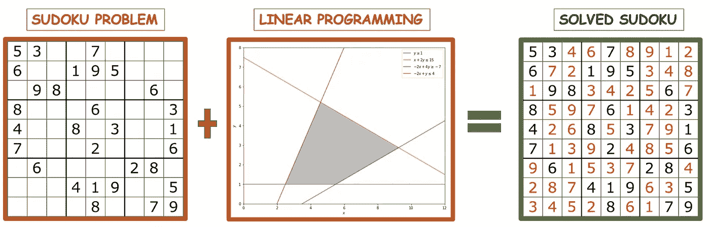
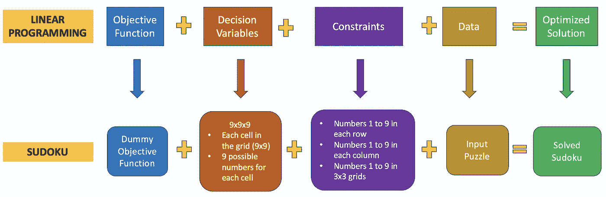
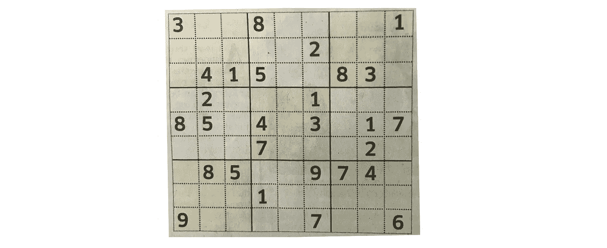
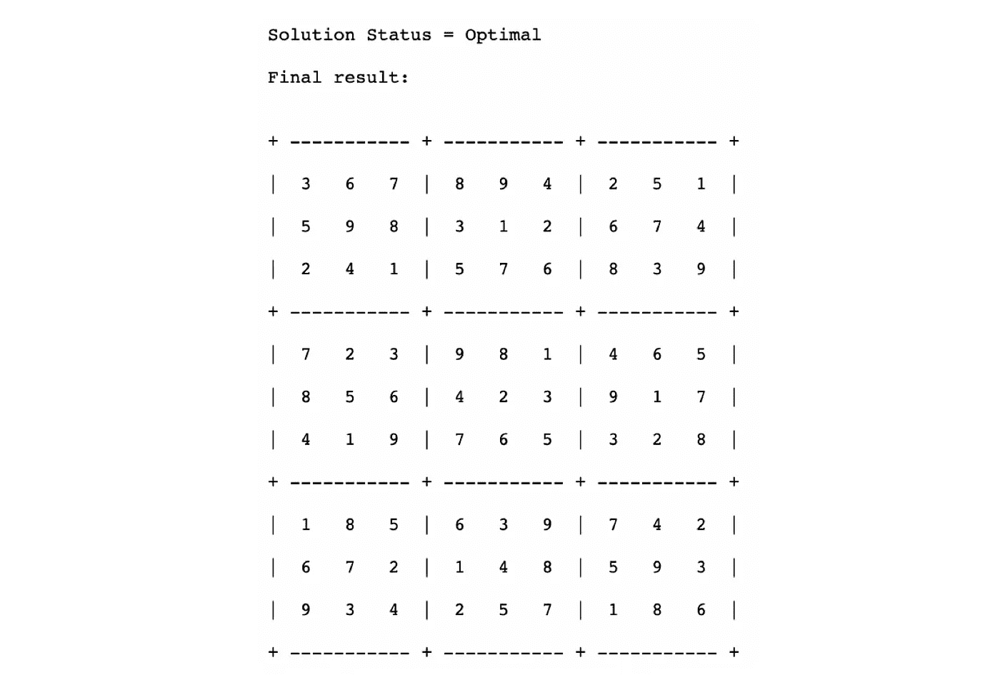
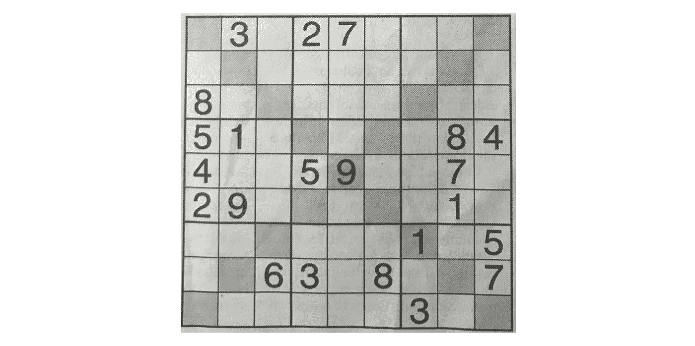
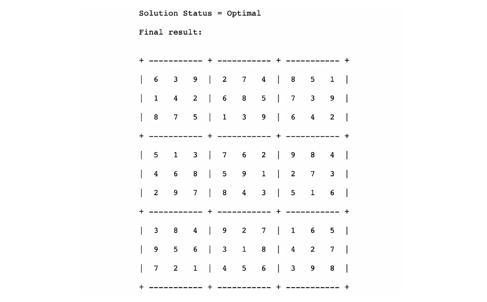

# 使用线性编程解决数独(Python-PuLP)

> 原文：<https://towardsdatascience.com/solve-sudoku-using-linear-programming-python-pulp-b41b29f479f3?source=collection_archive---------2----------------------->

## 利用线性规划的概念解决数独难题

**数独+线性规划**(图片作者编译。数独图片— [维基](https://en.wikipedia.org/wiki/Sudoku)

数独是一种典型的涉及到笔、纸和思维共同作用的游戏。当你想让笔和大脑休息一下时，可以用数独解算器来解决。在这里，我们将尝试创建一个这样的数独求解器。

本文旨在利用线性规划的概念来解决数独难题。我们将从刷新线性编程背后的一些基本理论开始，然后使用 PuLP 包在 Python 中实现相同的内容。

在这里，我们将尝试解决两种类型的数独难题，常规数独和对角线数独，它们在数独网格的对角线上有额外的规则。随着我们的进展会有更多的报道。

# 什么是线性规划？

线性规划是一个约束优化模型，它有 3 个主要部分:目标函数、决策变量和约束。

***目标函数:*** *目标函数是一个线性函数，其值需要根据我们试图解决的问题最小化或最大化。*

***决策变量:*** *这些是决定最终输出的输出或目标变量。*

***约束:*** *约束是对决策变量的约束或限制。*

线性规划的目标是在应用所有约束的情况下，为给定的目标函数找到一组最优的决策变量。该解决方案可以是可行的解决方案或最优的解决方案。

***可行解:*** *满足所有约束的线性规划的解。*

***最优解:*** *解* *以最佳目标函数值(最大化或最小化目标函数)*

# 线性规划和数独

**数独的线性规划**(图片由作者提供)

以数独为例，我们需要确定一个可行的解决方案来解决它。

# 用 Python 中的线性规划求解数独

这里我们将使用 Python 中的 PuLP 包来解决这个线性编程问题。

## 解决数独问题的步骤:

**步骤 1:** 定义线性规划问题
**步骤 2:** 设置目标函数
**步骤 3:** 定义决策变量
**步骤 4:** 设置约束
**步骤 5:** 解决数独难题
**步骤 6:** 检查是否找到最优结果

# 步骤 1:定义线性规划问题

# 第二步:设置目标函数

通常在线性规划中，我们有一个目标函数，我们试图最大化或最小化。但是在这种情况下，我们没有任何目标函数。这更像是一个可行性问题，也就是说，如果满足约束条件，那么数独就解决了。

因此，我们在这里设置一个虚拟目标函数为 0。

# 步骤 3:定义目标变量或决策变量

数独网格由 81 个单元格组成(9x9 网格)。每个单元格可以取 1 到 9 之间的值。如果我们为每个值创建一组布尔决策变量，那么我们总共会得到 729 个变量(9x9x9)。

由于每个单元格只能有一个关联值，因此单元格的 9 个变量中只有一个布尔变量可以设置为 true，其余的应为 false。正如您将在下一节中看到的，这是通过约束来确保的。

# 步骤 4:设置约束

## 数独的一般约束

需要将数独的规则设置为约束来解决这个问题。
鉴于数独是一个 9x9 的格子，游戏规则在这里提一下:

**约束 1:** 每个单元格都应该填充一个介于 1 和 9 之间的值

约束 2: 每一行应该包含一次从 1 到 9 的所有数字

约束 3: 每一列都应该包含一次从 1 到 9 的所有数字

**约束 4:** 从左上角开始，每个 3x3 网格应该包含 1 到 9 的每个数字一次

## 对角数独的附加约束

还有另一个版本的数独，称为对角线数独，除了上面提到的通用规则，还应该满足以下约束。

约束 5: 每条对角线应该包含 1 到 9 中的每个数字一次

注意，这个约束需要应用于两条对角线(左上角到右下角和右上角到左下角)。

## 初始化输入数独难题的约束

既然游戏规则已经通过约束设置好了，下一步就是初始化拼图中的已知值。这是从我们试图解决的数独难题中提取的。填充预先填充的单元格作为 LP 问题的约束。

至此，解决数独游戏所需的所有约束都已设置好，我们已经准备好解决它了。

# 第五步:解决数独难题

一旦设置了目标函数、决策变量和约束，解决难题就像对问题变量调用 solve 方法一样简单。

# 步骤 6:检查是否找到最佳结果

一旦问题得到解决，我们就可以通过检查状态标志来检查算法是否已经确定了最优解。

如果结果是“最优的”,那么线性规划算法已经确定了具有给定约束的解决方案。如果找不到解决方案，它将返回“不可行”状态。

# 时间来解决

将上面的代码包装成一个函数，这样它就可以解决作为输入传递的任何数独。下面给出了几个例子，其中正常数独和对角线数独是用这个求解器求解的。

## 数独 1-普通数独

**输入**

**输入——普通数独**(图片由作者提供)

**输出**

**解出的数独——正常**(图片由作者提供)

## 数独 2 —对角线数独

投入

**输入——对角线数独**(图片由作者提供)

输出

**解出的数独——对角线**(图片由作者提供)

# 源代码

参考 git repo 获得完整的代码: [Sudoku_Solver_LP](https://github.com/Lakshmi-1212/Sudoku_Solver_LP)

# 结论

这是一个非常简单的方法，说明如何使用 Python 中提供的线性编程包(即 PuLP)来解决数独难题。

还有进一步增强的空间，如从图像中读取数独网格或通过网络摄像头读取网格的视频处理。

稍后会有更多，希望你喜欢这篇文章！！