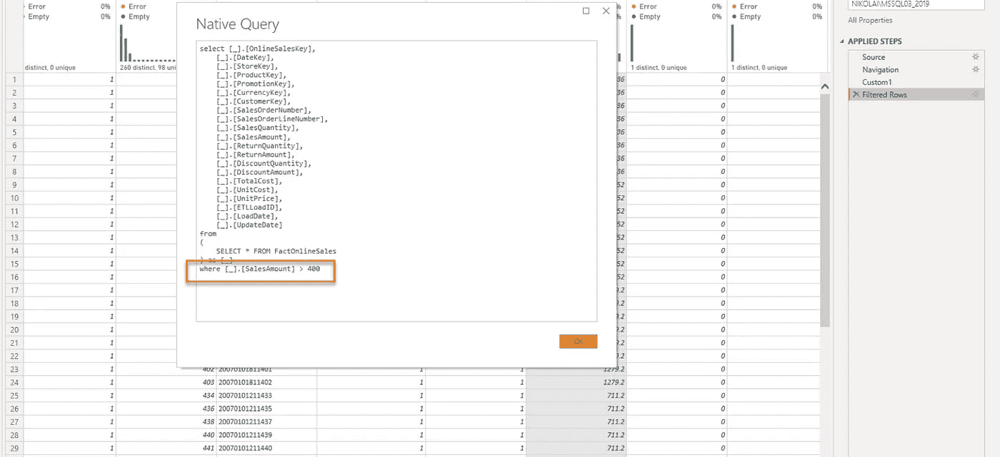
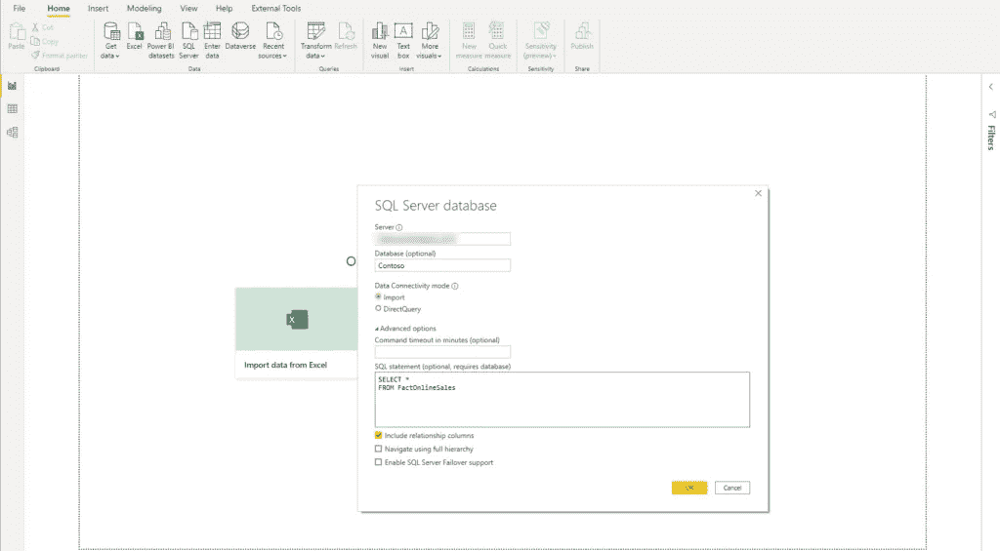
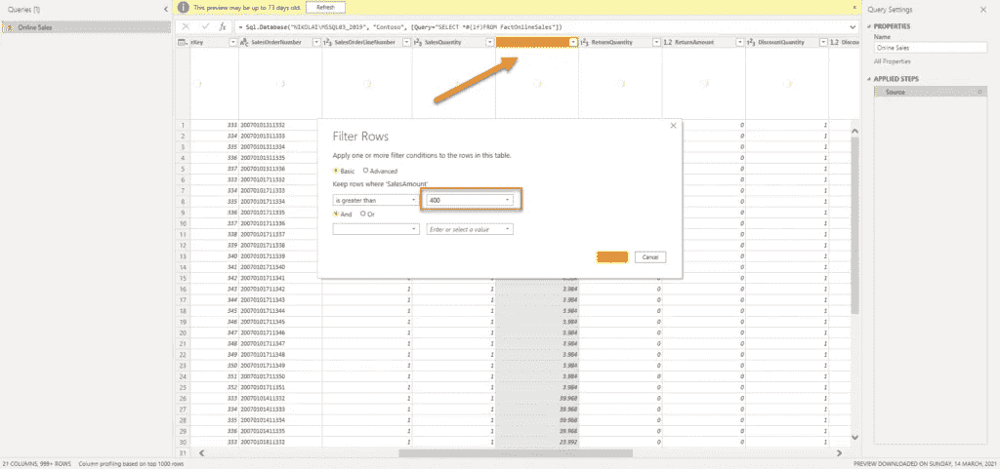
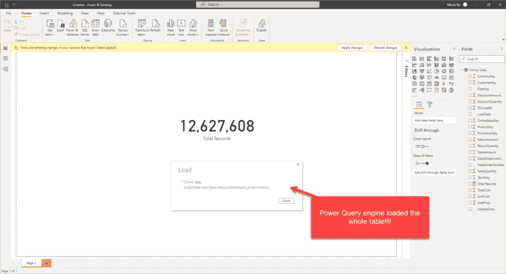
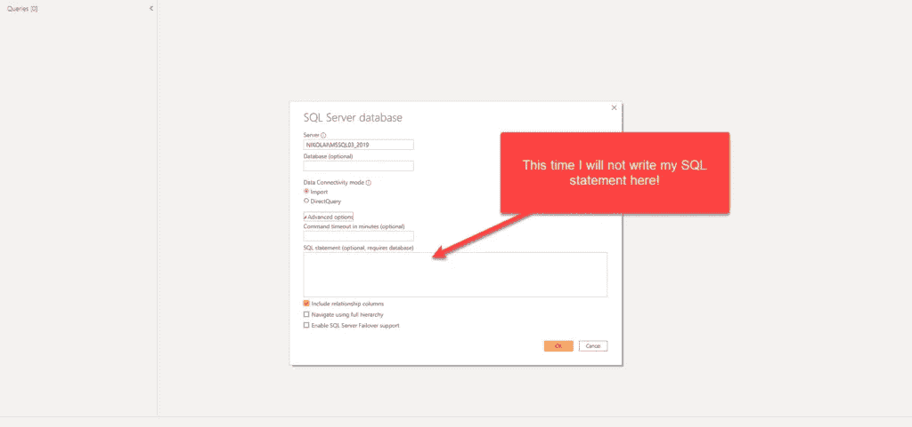
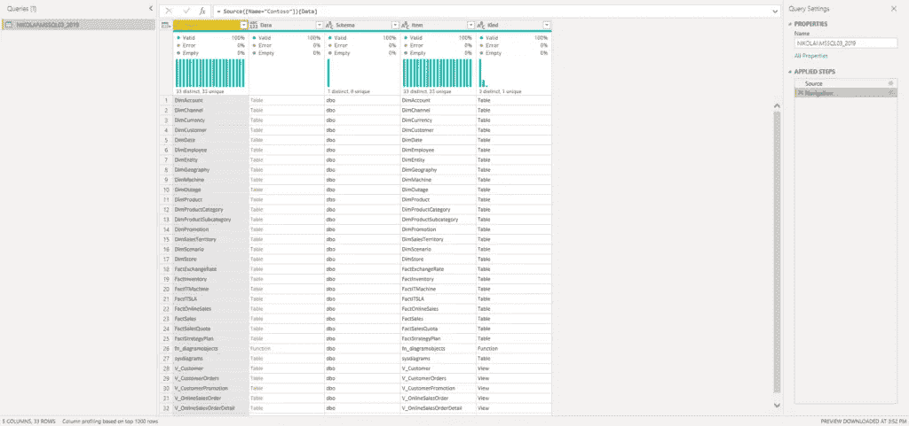
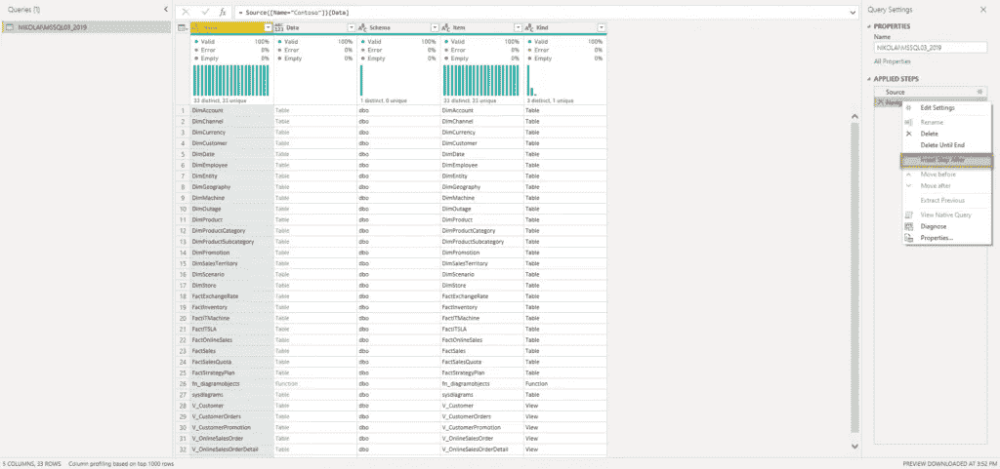
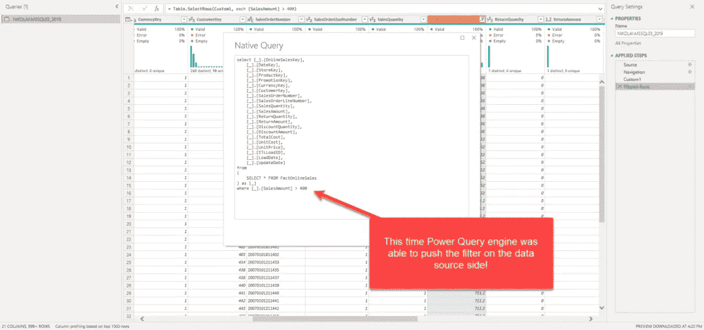
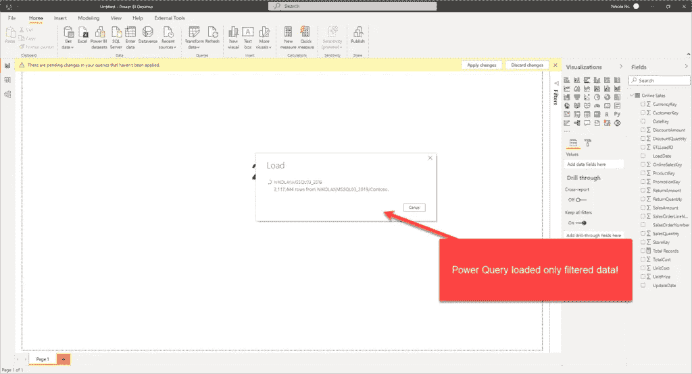
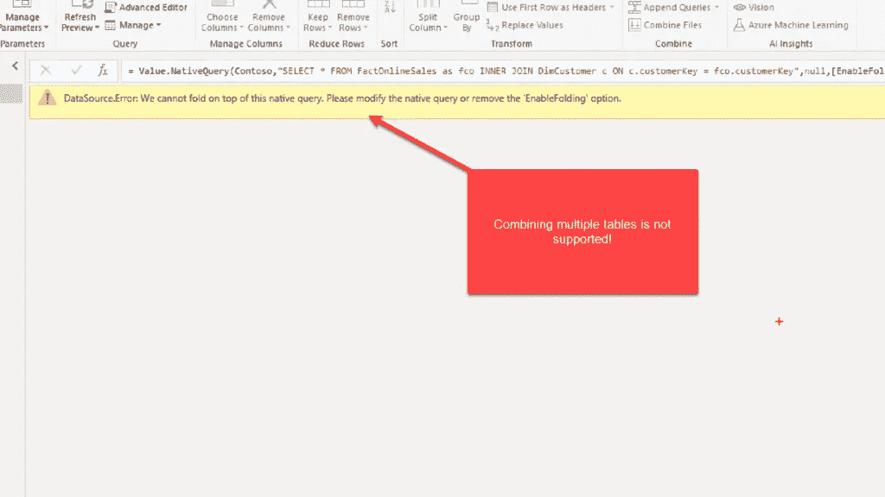

# 解决了！Power BI 中本地 SQL 的查询折叠

> 原文：<https://towardsdatascience.com/solved-query-folding-for-native-sql-in-power-bi-c94ebc604d1d?source=collection_archive---------9----------------------->

## 在 Power BI 中编写原生 SQL 查询会破坏查询折叠，对吗？嗯，不再是了



作者图片

谈到技术(尤其适用于 Power BI ),唯一不变的是——变化！而且，当我说 Power BI 的变化时，我并不仅仅指每个月都会有大量新功能的定期更新。现有的功能也在不断改进和升级，所以很容易发生这样的情况，几个月前不支持的东西，或者您必须执行不同的工作区来找到解决方案，现在默认工作。

其中一个很酷的新功能是可以为手写的 SQL 查询实现查询折叠！正如我之前在这个由三部分组成的系列文章中所写的，经验法则是:一旦您决定编写一个自定义 SQL 来将数据导入 Power BI，您就要对所有后续步骤的查询折叠说“再见”了。

## 首先什么是查询折叠？

在我们直接开始之前，让我先解释一下什么是查询折叠。

用最简单的话来说: ***如果 Power Query 引擎能够收集您的所有转换，并生成一条将在源端(大多数情况下是 SQL 数据库)执行的 SQL 语句，我们称之为查询折叠！***

这样，通过将转换和计算推到数据源端，在大多数情况下，您将获得数据刷新过程的性能优势。我不打算通过不同的场景来重申查询折叠何时可行或不可行——我强烈建议您阅读我已经提到的[文章](/query-folding-in-power-bi-devil-is-in-the-detail-d564ab0cb32)—并参考微软的官方文档。

在本文中，当您决定使用原生 SQL 查询作为 Power BI 数据集的源时，我将重点关注一个特定的场景。

## Power BI 中的原生 SQL 查询是什么？

当您将数据导入 Power BI 时，需要做出的第一个决定是:您是否希望从 SQL 数据库中“按原样”获取数据，然后使用 Power Query editor 应用必要的转换…或者，您是否希望编写自己的 SQL 代码来获取数据。

如果您选择编写自定义 SQL，在 Power Query 编辑器中应用的所有后续转换步骤都不会折叠，即使您正在应用一些基本转换，如过滤或重命名列，这些步骤在“正常”情况下会折叠。

这个说法应该没错吧？嗯，不再是了:)



作者图片

在上图中，我正在从 *Contoso* 示例数据库中的 *FactOnlineSales* 表中导入所有行和列。该表包含大约 1260 万行。

## 打破查询折叠的“传统”方式

其中一列是销售额。现在，假设我只想保留销售额值大于 400 的那些行。我将打开 Power Query 编辑器并添加这个转换步骤:



作者图片

在我应用了这个步骤之后，如果我右键单击它，我可以看到 View Native Query 选项是灰色的，这意味着我的查询可能不会折叠。在这种情况下，这是正确的，所以让我们检查一下这个查询在 Power BI 中加载需要多长时间。

刷新数据花费了大约 **160 秒**，但下图显示了后台发生的情况:



作者图片

基本上，Power Query 引擎必须从底层 SQL Server 数据库的 FactOnlineSales 表中提取**所有数据**，然后应用我们指定的过滤条件！最后，大约有 210 万条记录满足我们的销售额标准。因此，无论我们在第一条语句(编写定制 SQL)之后应用什么转换步骤，查询都不会折叠！

## 神奇的 M 功能来拯救

现在让我们尝试另一种方法。灵感来自[Chris Webb 的这篇很棒的博文](https://blog.crossjoin.co.uk/2021/02/21/query-folding-on-sql-queries-in-power-query-using-value-nativequery-and-enablefoldingtrue/)，我只是在下面的例子中稍微调整了一下:



作者图片

您可能注意到了，我不会在启动窗口中编写 SQL 语句。我将把它留空，并从 Contoso 数据库中导入所有数据库对象(所有表、视图和表值函数):



作者图片

除了使用 300 多种内置的 Power Query 转换之一，您还可以编写自己的 M 代码来应用于数据。因此，如果我右键单击最后一步，我可以选择在后*插入一步:*



作者图片

这个自定义步骤允许我在公式栏中手动输入 M 公式，因此我将输入以下 M 代码:

```
= Value.NativeQuery(Contoso,"SELECT * FROM FactOnlineSales",null,[EnableFolding=true])
```

“神奇”发生在*值内。NativeQuery()* 函数。你可以在这里阅读关于这个函数及其参数[的更多信息。我们可以省略第三和第四个参数，查询仍然可以工作，但是通过提供第四个参数 *EnableFolding* ，并将其标记为 TRUE，我们显式地指示 Power Query 引擎启用查询折叠！](https://docs.microsoft.com/en-us/powerquery-m/value-nativequery)

现在让我们应用与上一个案例完全相同的过滤器—只保留销售额值大于 400 的那些行。如果右键单击最后一步，应该会启用*查看本地查询*选项。当我点击它时，我看到我的查询现在折叠了，因为过滤条件被很好地翻译成 SQL ***where*** 子句！



作者图片

最后，让我们检查一下这种变通方法是否对数据刷新过程有影响:



作者图片

这一次，通过将过滤器推送到 SQL 数据库，Power Query 只检索我们需要的那些行。这显然影响了数据刷新处理时间，因为它花费了大约 **20 秒**！

## 加盟还是不行！

我尝试对此进行扩展，并在原生查询中组合多个表:

```
= Value.NativeQuery(Contoso,"SELECT * FROM FactOnlineSales AS fco INNER JOIN DimCustomer AS c ON c.customerKey = fco.customerKey",null,[EnableFolding=true])
```

但是，我收到了以下错误:



作者图片

## 结论

默认情况下，编写定制的 SQL 代码将数据导入 Power BI 仍然会破坏查询折叠。但是，正如您所看到的，有一种简便的方法可以“强制”Power Query 引擎利用查询折叠，即使在您决定使用原生 SQL 查询选项的情况下也是如此。

老实说，这种技巧的用例数量有限，因为您不能像在开始数据导入窗口中以“传统”方式编写 SQL 代码那样，在一条 SQL 语句中组合多个数据库对象。不过，使用定制 SQL 进行数据转换的首选方式是在源数据库中创建一个视图。视图将包含整个转换逻辑，然后您可以在 Power BI 中“按原样”导入它。数据库视图是可折叠的对象，这意味着如果对视图应用可折叠的转换步骤，您仍然可以从查询折叠中受益！

然而，很高兴看到事情正在向前发展，让我们希望在不久的将来，本地 SQL 查询的查询折叠将默认启用。

感谢阅读！