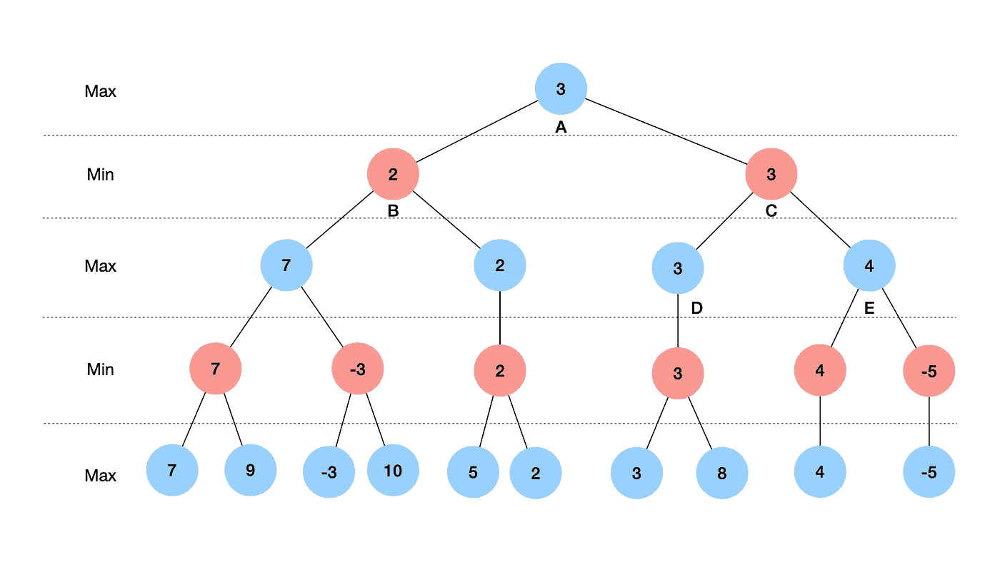
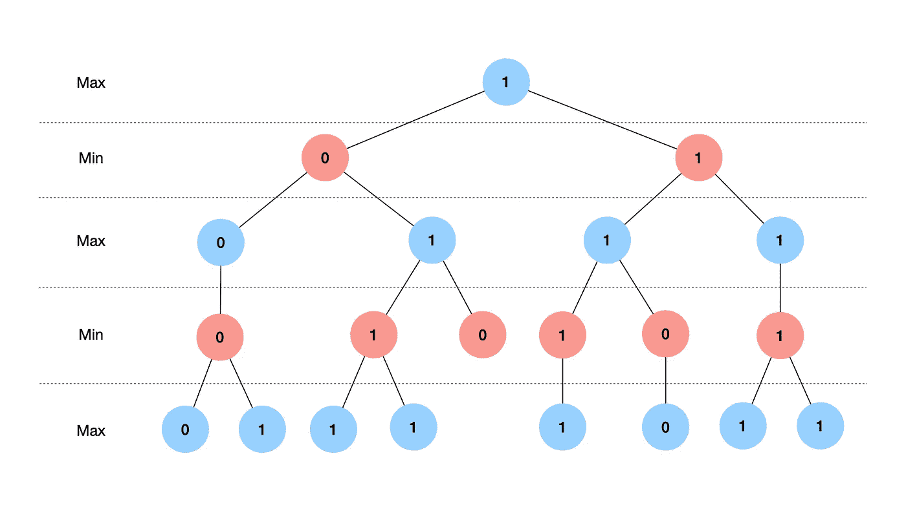
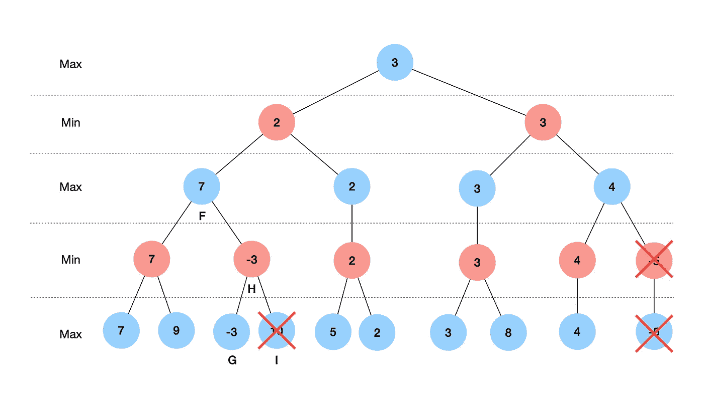
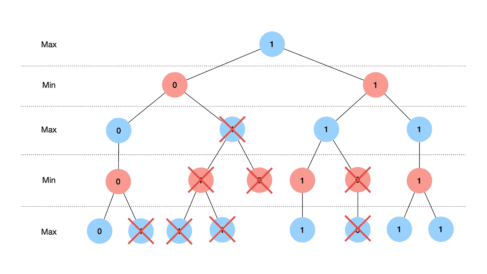

# 用极小极大解一个文字游戏

> 原文：<https://towardsdatascience.com/solving-a-word-game-with-minimax-68695c5e963?source=collection_archive---------10----------------------->

## 有没有一个字母表示参与人 1 总是赢？

# **目录**

```
[The Game](#e96a) [Introducing Minimax](#3275)
[Applying Minimax](#8a50)
[Improvements](#9455)
[Conclusion](#4c6f)
```

# 游戏

一个简单的双人文字游戏可以这样描述:

玩家 1 首先从一个至少 4 个字母长的单词开始，例如“medium”。他弹奏这个单词的第一个字母，即 m。然后，玩家 2 选择下一个字母，这个字母代表他知道的以“m”开头的单词。然后，两位玩家继续轮流选择字母，同时尽量不选择导致单词形成的字母(只计算至少有 4 个字母的单词)。

例如，如果当前的字母串或前缀是“medi ”,玩家 1 不会选择字母“a ”,因为“media”是一个有效的单词，这会导致他输。

唯一的规则是，每个玩家在游戏的任何时候都必须有最后的发言权(如果受到挑战，必须提供)。否则你可以随便玩一个字母，游戏永远不会结束。

一个典型的博弈(参与人 2 输了)可能是这样的:

```
Player 1: m
Player 2: e
Player 1: d
Player 2: i
Player 1: u
Player 2: m
```

这个简单的文字游戏和你的朋友一起玩很有趣。我鼓励你在继续阅读之前先自己尝试一下这个游戏。

# 介绍 Minimax

在玩了几轮游戏后，你可能会开始想，如果我们可以提出一种算法，告诉我们在给定当前前缀的情况下，最佳的下一个字母是什么呢？更好的是，如果它能告诉我们参与人 1 可以选择什么字母，这样他们就能一直赢，那么我们就可以宣布这个游戏解决了！

正如这篇文章的标题所暗示的，事实上有一种算法我们可以使用:minimax。

[Minimax](https://en.wikipedia.org/wiki/Minimax) 是一个简单而强大的算法，旨在帮助人工智能、博弈论和统计学中的决策。它最初用于零和游戏，如国际象棋，但已被推广到帮助决策，即使有不确定性。

解释极小极大的最好方法是使用一个树形图，显示一个游戏可能有的所有可能的游戏状态。



一般极大极小图(图片由作者提供)

从上面的树形图可以看出，作为价值函数实现的极大极小算法的目标是为特定的游戏状态赋值。在这种情况下，所有状态的值都是相对于我们想要赢得的玩家而言的。值较高的州意味着玩家更有可能获胜，而值较低的州意味着对手更有可能获胜。此外，轮到玩家的州标为蓝色，而对手的州标为红色。

为了指定一个特定状态的值(在这种情况下，我们最终想要指定一个值给状态 A)，算法必须递归地考虑所有后续的游戏状态。对于蓝色状态，由于轮到玩家，我们将选择导致具有最高值的状态的移动，这就是为什么它们被标记为“最大”状态。例如，状态 A 将选择右边的移动，因为与值为 2 的状态 B 相比，它将导致值为 3 的状态 C。相反，作为对手的州，红州将选择导致具有最低值的州的移动。因此，它们被称为“最小”状态。例如，状态 C 将选择左边的移动，因为它导致具有较低值 3 的状态 D，而不是具有值 4 的状态 E。

这样，我们经历了一系列最大化和最小化的步骤(这就是为什么这个算法被称为 minimax！)将这些值分配给不同的状态。最终，当算法到达终点状态，即底部的状态时，算法将结束。

那么一旦所有状态的值都被赋值，状态 A 的最优移动就是导致具有最高值的状态(状态 C)的移动，我们就完成了！



文字游戏的极大极小图(图片由作者提供)

对于我们的文字游戏，终端状态只能有两个可能的值——如果玩家赢了，1；如果玩家输了，0，这简化了我们的图表(上面的那个)。本文的剩余部分将研究这个算法的实现，以及我们如何进一步改进这个算法来加速我们的代码。

# 应用最小值最大值

有了极大极小算法如何工作的高级概述，让我们直接进入实际的实现。

## 设置字典

首先，我们需要一本字典作为我们的单词库。我们将使用`nltk`包，你将不得不`pip install`它和 unix 单词表，可以通过代码下载或者从[这里](https://raw.githubusercontent.com/nltk/nltk_data/gh-pages/packages/corpora/words.zip)下载。

请注意，字典中包含了一些与我们无关的单词，例如代词和少于 4 个字母的单词。因此，我们将使用 python 方便的`filter`函数对字典进行快速处理，去掉这些单词。

此外，我们将把我们的字典存储在一个 [trie](https://en.wikipedia.org/wiki/Trie) 数据结构中，因为这将允许我们比简单的列表更快地搜索单词。具体来说，我们将使用谷歌实现的开源`pygtrie`模块，你也将不得不`pip install`。

本文不会深入研究 trie 如何工作或者具体实现的细节，但是你可以在这里找到模块[的文档。我们需要知道的是，为了在`CharTrie`对象中存储一个单词，我们](https://pygtrie.readthedocs.io/en/latest/)

完美！

## 助手功能

我们还需要两个在以后会有用的辅助函数。

`search`接受一个前缀，并在返回以该前缀开头的所有可能单词的列表以及下一个可能字母的列表之前搜索我们拥有的字典。

当玩家(玩家 1 或 2)获胜时，`get_score`返回`1`，否则返回`0` 。这很容易通过`xor (^)`函数比较字长和玩家号的奇偶来计算。

## 价值函数

接下来，我们将实现上面提到的价值函数。尽管我们可以使用一些技巧来加速代码，但它实际上实现起来非常简单。

这是一个递归函数，它的基本情况是当游戏状态是终端时，即当前缀是一个我们可以通过检查是否有任何下一个可能的字母来测试的单词时。然后，根据是否轮到玩家，我们或者找到所有可能的下一个状态的最大值或最小值，即前缀+每个可能的下一个字母。

## 把它放在一起

最后，我们实现了一个`main`函数，该函数将要求用户输入起始前缀，然后计算接下来可以玩的所有可能字母的值，并在可以保证获胜的地方打印这些字母(如果有的话)。

在这个过程中，我们还实现了一些输入检查，比如确保我们可以用提供的前缀组成一个单词，以及检查前缀是否已经是一个单词，或者是否只有一个可能的单词可以用这个前缀组成。

我们做到了！现在你知道如何打败你的朋友了。

# 丰富

如果你真的试着运行这段代码，你会注意到它并不是特别快，只需要 9.2 秒。

在下一节中，我们将下面探讨不同的方法来加速这个过程到不到一秒钟:

*   阿尔法-贝塔剪枝
*   删除不必要的单词
*   评估启发式

## 阿尔法-贝塔剪枝

Alpha-beta 修剪是一种技术，我们可以通过不评估不可能影响游戏状态的最终值的移动来减少评估的游戏状态的数量。



阿尔法-贝塔剪枝图(图片由作者提供)

例如，参考上图，一旦我们评估了状态 G，我们知道状态 H 的最大值是-3，因此它永远不会被值至少为 7 的状态 F 选择。因此，没有必要进一步评估状态 I。这将减少我们必须做的计算的数量，因为我们不必评估所有划掉的状态。



文字游戏的 Alpha-beta 剪枝图(图片由作者提供)

在我们的文字游戏算法中实现 alpha-beta 剪枝相当简单(我们只需添加 4 行！)因为只要“最大”游戏状态已经找到一个可以保证获胜的移动，该游戏状态将肯定具有值 1，并且没有必要考虑任何其他移动或状态。

要做到这一点，我们所要做的就是检查最大状态的当前值是否为 1(或者最小状态的当前值为 0)，在这种情况下，我们将返回 1 并停止检查剩余的游戏状态。

从上面可以看出，这实际上允许我们减少了相当多的评估游戏状态的数量，这相当于将我们的运行时间减少了 75%到 2.3s！

## 删除不必要的单词

我们可以做的另一个改进是减少我们必须搜索的单词数量。字典中有相当多的单词是不可能通过游戏得到的，因为它们包含另一个单词作为前缀。

例如，我们永远不会达到“媒介”，因为“媒介”这个词将首先结束游戏。

最初，我尝试了一个简单的算法，遍历字典中的每个单词，搜索包含它作为前缀的所有其他单词，但我很快意识到，如果有超过 20 万个单词，这个算法将永远不会完成运行。

因此，我想到了一个更好的方法，利用递归来过滤掉我们不需要的单词。本质上，我们正在做的是通过逐个考虑字母的组合来建立我们的字典，直到我们找到一个单词，这时我们将停止向字符串添加字母。

我们可以看到，该算法(运行时间为 18 秒)将我们字典中的单词量减少了 60%，相当于运行时间减少了 52%，仅为 1.1 秒！

## **评估启发式**

最后，我们可以通过使用启发式算法来加速价值函数，以快速评估游戏状态的价值，而不必考虑后续状态。

关键的观察是，如果剩余的可能单词都以同一个人结束，即单词长度的奇偶性都相同，那么对于该游戏状态只有一个可能的分数。

例如，如果当前前缀是“medi ”,唯一可能的单词是“media”和“medical ”,那么我们知道玩家 2 将会赢，这实际上是一个终端游戏状态。

实现也相当简单——除了检查是否只剩下一个可能的单词，我们还检查剩余单词的单词长度的奇偶性是否相同。

这给了我们 0.9s 的最终运行时间，比原始算法提高了 90%！

# 结论

我希望使用一个简单的文字游戏(与更复杂的游戏如国际象棋相比)能帮助你更好地理解 minimax 是如何工作的。我们还展示了只需几行额外的代码就能显著提高性能。

您可以在这里使用代码[来更好地感受实现。](https://github.com/Xavilien/word-game)

## 一些最后的想法

这篇文章假设的一件事是两个玩家都是最优的。然而，虽然你可能有小字典的大脑容量(多亏了这种算法)，但你的人类对手可能没有。

虽然这实际上不会影响你是否会赢得这个特定的文字游戏(你可以想想为什么)，但对于更复杂的游戏，或者那些有随机因素的游戏，这可能是一个需要考虑的重要因素。在这种情况下，你可能会把 [expectimax](https://en.wikipedia.org/wiki/Expectiminimax) 看作是我们当前 minimax 算法的扩展。

最后，你们中的一些人可能会意识到，解决这个文字游戏基本上就是解决一个图形问题。虽然本文的主要焦点是用一个简单的文字游戏来说明极大极小算法，但是我邀请任何人提出一个更好的算法来解决这个游戏！