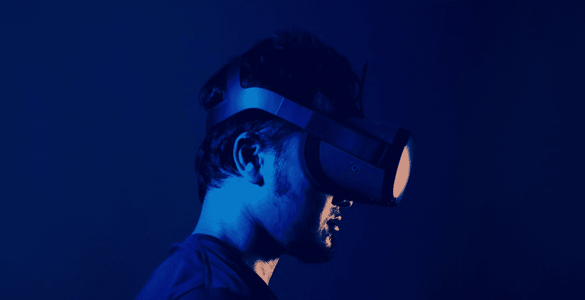

# 用人工智能解决网络疾病

> 原文：<https://towardsdatascience.com/solving-cybersickness-with-ai-d5d7bb711467?source=collection_archive---------30----------------------->

## 几何人工智能技术如何被用来减轻网瘾

360 VR 体验可以把你运送到世界上的任何地方。[图片由 [Minh Pham](https://unsplash.com/@minhphamdesign?utm_source=medium&utm_medium=referral) 在 [Unsplash](https://unsplash.com?utm_source=medium&utm_medium=referral) 上拍摄]

今天的 360°虚拟现实(VR)体验具有巨大的潜力，可以让你被运送到世界上的任何地方。它们具有照片般的真实感，而且相对容易和便宜——只需要一个现成的 360°相机——但它们缺乏沉浸感和交互性。至关重要的是，这种交互性的缺乏也会导致许多用户产生网瘾。

# 3 自由度与 6 自由度

虽然 360 度虚拟现实体验可以让你环顾四周，但在当前的技术下，你无法在虚拟环境中四处移动。例如，你不能走来走去或向前探身去仔细观察某样东西。

由于 360°内容是从给定位置的摄像机捕捉的，因此在 VR 中观看体验时只有一个视点可用，因此不可能自由移动以享受不同的视图。*无论你在真实的物理世界中如何移动，你在虚拟世界中仍然是冻结的。*

在当前的 360 度虚拟现实体验中，你被冻结了，无法在虚拟世界中移动。[图片由[马特·福斯特](https://unsplash.com/@forstermatth?utm_source=medium&utm_medium=referral)在 [Unsplash](https://unsplash.com?utm_source=medium&utm_medium=referral) 上拍摄]

换句话说，目前的 360 VR 体验支持所谓的 3 自由度(3 DOF)旋转运动，在这种运动中，你可以环顾四周(即旋转你的头部)，但你不能移动。为了让你在虚拟环境中四处移动，必须支持 6 自由度运动。6 自由度运动包括来自旋转运动(环视)的 3 自由度和来自位置运动(走动)的 3 自由度。

最新的独立虚拟现实头戴设备，如 [Oculus Quest 2](https://www.oculus.com/quest-2/) ，现在正在打开虚拟现实市场，使消费者和企业用户更容易获得虚拟现实，不再需要高端计算机来为有线虚拟现实设备供电。这些独立设备现在也在硬件层面支持 6 DOF。然而，内容仍然是 3 自由度的，这导致了最新硬件(6 自由度支持)和内容(仅 3 自由度支持)的能力之间的脱节。这意味着今天无法向用户提供 6 DOF 360 VR 体验。

# 视觉-前庭冲突

虽然今天的 360 VR 体验缺乏对 6 自由度运动的支持，限制了沉浸感和真实感，但这也引发了一个更大的问题:网络运动病。

在日常生活中，我们身体的感觉系统协调运作。当身体的不同感觉系统发生冲突时，就会产生网络晕动病。

视觉-前庭冲突是网瘾最常见的原因。在虚拟现实中，没有人会保持头部完全僵硬，因此一些身体运动是不可避免的。当你在身体上移动你的平衡感时，你的*前庭系统*会经历那个动作。但是如果你在虚拟环境中看不到自己在场景中移动，你的视觉系统就不会经历同样的运动。视觉和前庭系统的断开导致感觉冲突，这种感觉冲突被体验为恶心。

要了解更多关于网络病的信息，请听听虚拟现实播客的【T4 之声】，肯特·拜采访了杜克大学的兼职教授杰森·杰拉德。杰森解释了网瘾的各种原因，强调视觉-前庭冲突是最重要的。

当你移动时，你的平衡感(前庭系统)与你在 VR 中看到的(视觉系统)不匹配，在 360 VR 中就会产生视觉-前庭冲突。[图片由 [Deniz Altindas](https://unsplash.com/@omeganova?utm_source=medium&utm_medium=referral) 在 [Unsplash](https://unsplash.com?utm_source=medium&utm_medium=referral) 上拍摄]

# 用人工智能合成虚拟现实中的运动

为了消除虚拟现实中的视觉-前庭冲突，有必要恢复身体的视觉和前庭系统之间的和谐。如果你的视觉系统在 VR 中体验运动，以匹配前庭系统体验的身体运动，这是可以实现的。问题是，当拍摄 360°镜头时，相机在每个时刻只捕捉到场景的一个视点。

使用人工智能(AI)可以通过合成拍摄 360°镜头时从未捕捉到的场景的新视点来解决这个问题。当你四处走动时，通过动态渲染这些新颖的观点，你会获得在虚拟世界中移动的感觉。从技术上来说，使用人工智能在 360 VR 环境中合成运动通过提供 6 自由度运动来增强体验——从某种意义上来说，是对 3 自由度 360°内容进行 6 自由度支持。

我们在为 360°照片和视频内容开发[几何人工智能技术](https://www.kagenova.com/products/fourpiAI/)的初创公司 [Kagenova](https://www.kagenova.com/) 开发了这样一个系统。我们的 [copernic360](https://www.kagenova.com/products/copernic360/) 系统通过两个子系统协同工作来实现这一效果:一个基于后端 AI 的云处理系统；和前端查看器系统。

基于人工智能的云系统处理 360 VR 视频或照片内容，以恢复表示场景的 3D 几何形状的估计。查看器系统使用由 AI 系统计算的几何图形以及原始的 360°视频或照片内容来渲染场景的 3D 纹理表示。然后，用户能够以完整的 6 DOF 运动在重建的场景中四处移动，其中，根据场景中的新的合成视点的位置，渲染这些视点并提供给用户。

# 科学研究

虽然直觉上很清楚，消除视觉-前庭冲突将减轻网瘾，但科学地测试这一点仍然很重要。最近，伦敦皇家霍洛威大学的一组前庭神经科学专家对这一假设进行了测试。

他们设计了一个实验，以高度可控的方式对许多用户进行 A-B 测试。用户体验了使用标准 360 VR 技术的 3 自由度 360 VR 场景，以及 Kagenova 的 copernic360 提供的 6 自由度场景。在这两种情况下，都测量了一些网瘾指标，包括定性指标(如用户的口头反馈)和定量指标(如心率)。

科学研究表明，人工智能技术大大减少了虚拟现实中的网瘾。[图片由 [Bermix 工作室](https://unsplash.com/@bermixstudio?utm_source=medium&utm_medium=referral)在 [Unsplash](https://unsplash.com?utm_source=medium&utm_medium=referral) 上拍摄]

这项研究的结果刚刚发表在一篇提交给多感官研究的学术文章中(预印本在此[提供](https://arxiv.org/abs/2103.03898)),并刊登在[新科学家](https://www.newscientist.com/article/2271020-ai-can-stop-the-cybersickness-some-people-get-when-using-vr-headsets/#ixzz6onYARkim)上。该研究表明，使用 Kagenova 的 copernic360 6 DOF 技术时，恶心等网络疾病的症状明显减少。

> "结果证实，使用哥白尼 360 能非常有效地减少晕机."Elisa Ferré博士，科学研究的领导者

# 外卖食品

虽然 360 VR 可以将你带到世界上的任何地方，享受虚拟娱乐、旅游、文化或教育体验，但今天的技术仅支持 3 自由度运动，你无法在虚拟世界中四处移动。这限制了现实主义，并可能导致网络病。幸运的是，最近开发的[几何人工智能技术](https://www.kagenova.com/products/fourpiAI/)专门为 360 张照片和视频量身定制，在卡格诺娃的[哥白尼 360](https://www.kagenova.com/products/copernic360/) 技术中实现，可以合成 6 个自由度，让你在虚拟世界中四处移动，减轻网络病，大大增强真实感。

# 参考

[1] Iqra Arshad，Paulo De Mello，Martin Ender，Jason D. McEwen，Elisa R. Ferré，*在 360 度虚拟现实中减少网络疾病* (2021)， [arXiv:2103.03898](https://arxiv.org/abs/2103.03898)

[2] Oliver J. Cobb，Christopher G. R. Wallis，Augustine N. Mavor-Parker，Augustin Marignier，Matthew A. Price，Mayeul d'Avezac，Jason D. McEwen *，高效广义球形 CNN*(2021)，ICLR， [arXiv:2010.11661](https://arxiv.org/abs/2010.11661)

[3] Jason D. McEwen，Christopher G. R. Wallis，Augustine N. Mavor-Parker，*可缩放和旋转等变球形 CNN 的球上散射网络* (2021)， [arXiv:2102.02828](https://arxiv.org/abs/2102.02828)

[4] Matthew Sparkes， *AI 可以阻止一些人在使用 VR 头戴设备时产生的网瘾*，《新科学家》，[https://www . New Scientist . com/article/2271020-AI-can-stop-the-cyber disease-some-people-get-when-use-VR-headsets/# ixzz 6 onyarkim](https://www.newscientist.com/article/2271020-ai-can-stop-the-cybersickness-some-people-get-when-using-vr-headsets/#ixzz6onYARkim)

[5]哥白尼 360，*走进 360 VR 内容【https://www.kagenova.com/products/copernic360/】，*

[6] fourpiAI，*几何 AI 为球面数据*，[https://www.kagenova.com/products/fourpiAI/](https://www.kagenova.com/products/fourpiAI/)