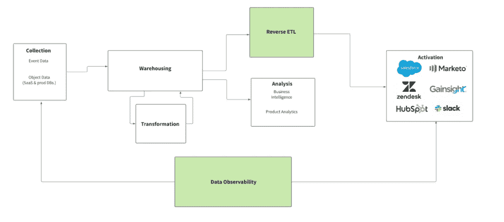
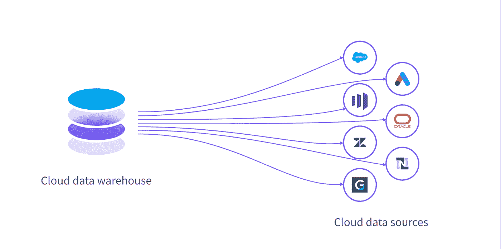
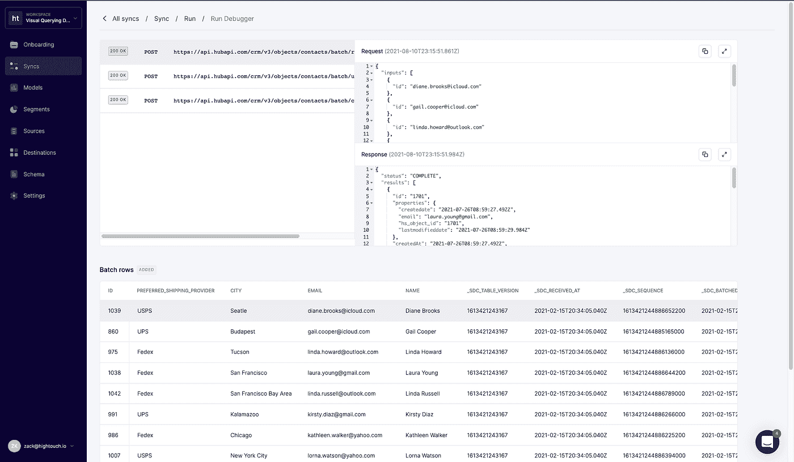
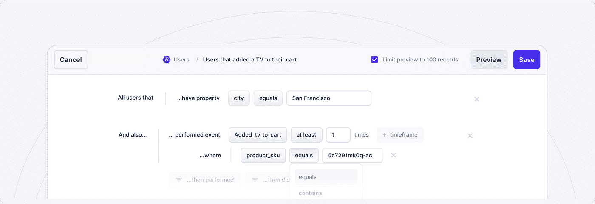
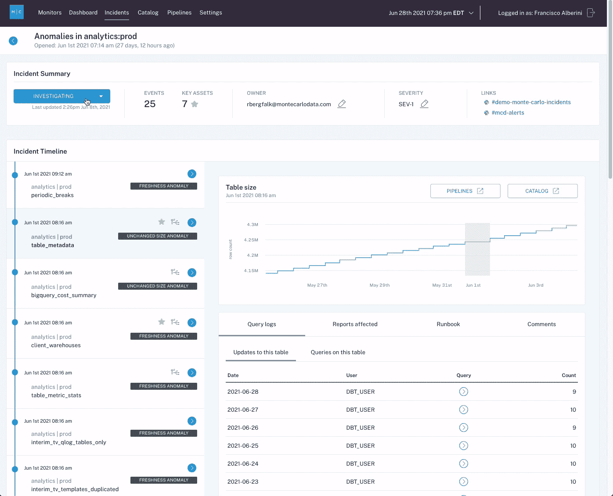
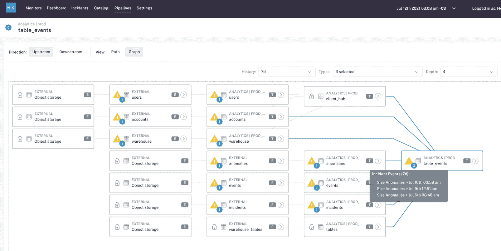

# 解决数据的“最后一英里”问题

> 原文：<https://towardsdatascience.com/solving-datas-last-mile-problem-dbde5ce3825?source=collection_archive---------24----------------------->

## 行业秘诀

## 什么是反向 ETL？好奇的人想知道

图片由[爱丽丝·多诺万·劳斯](https://unsplash.com/photos/pZ61ZA8QgcY)在 [Unsplash](http://www.unsplash.com) 上提供。

*现代数据团队拥有所有合适的解决方案来确保数据被接收、存储、转换和加载到他们的数据仓库中，但是在* ***“最后一英里”会发生什么呢？*** *“换句话说，数据分析师和工程师如何确保转换后的可操作数据确实可供访问和使用？*

[*Tejas Mano har*](https://www.linkedin.com/in/tejasmanohar/)*,*[*high touch*](https://www.hightouch.io/)*的联合创始人，也是* [*部门*](https://segment.com/) *的前技术负责人，我解释了反向 ETL 和数据可观察性可以帮助团队在信任您的数据产品方面走得更远。*

现在是上午 9 点——你已经喝了第二杯咖啡，你最喜欢的 Spotify 播放列表在背景中大声播放，你刚刚在今天早上第三次刷新了团队的“营销分析”仪表盘，只是为了确保数据在你的 CMO 每周 All Hands 之前得到验证。世界上一切(似乎)都是对的。

然后，就在您进入最佳状态时，您听到了世界各地传来的懈怠声:“为什么 Salesforce 没有更新最新数据？”

如果这种情况听起来很熟悉，你并不孤单。在 2021 年，公司在数据上押下重注，以推动决策并为其数字产品提供支持，然而高达[**68%的数据**](https://www.seagate.com/our-story/rethink-data/) 经常由于数据在仓库中转换后发生的问题而未被使用。

很多时候，你的 Looker 或 Tableau 仪表盘上的数字与你的运营系统(例如，你的 CMO 的 Salesforce 报告)中所代表的数字之间存在脱节，这降低了你的利益相关者的速度，并侵蚀了他们对数据的信任。我们称这种数据为“最后一英里问题”，这是现代企业普遍存在的现实。

图片由作者提供。

好在有更好的办法: [**反向 ETL**](https://hightouch.io/blog/reverse-etl) 。通过与 [**数据可观察性**](https://www.montecarlodata.com/what-is-data-observability/) 合作，这套新的数据工具可以帮助数据团队在最重要的时候释放可访问、可靠数据的潜力。

# 什么是反向 ETL？

如果像 Fivetran 和 Stitch 这样的传统 ETL 和 ELT 解决方案使公司能够将数据接收到他们的数据仓库中进行转换和建模，那么反向 ETL 则正好相反:它使公司能够将转换后的数据从他们的云数据仓库转移到运营业务工具中。这是一种新的方法，通过让业务团队能够在他们每天都在使用的 SaaS 工具中直接访问和处理转换后的数据，使数据变得可操作，并解决分析中的“最后一英里”问题。

反向 ETL 管道可以定制，但是像许多数据工程挑战一样，它们需要大量的资源来设计、构建和维护。反向 ETL 工具使得拥有较少数据工程资源的团队可以只使用 SQL 来设计和构建管道。

同时，反向 ETL 加强了数据仓库作为事实来源的作用，同时通过将数据从仪表板和报告中取出，放入销售、营销和客户成功团队已经在使用的工具中，使数据访问民主化。

图片由 Tejas Manohar 提供。

# 反向 ETL 支持运营分析

通过使数据访问民主化并使数据更容易访问，反向 ETL 正在推动一种被称为[运营分析](https://hightouch.io/blog/what-is-operational-analytics/)的新范式，即在业务团队的日常工作流程中，将数据团队的见解反馈给业务团队，以便他们可以做出更多基于数据的决策。反向 ETL 通过确保数据在下游 SaaS 工具中是可访问和可操作的，来“操作化”BI 工具中支持报告的相同数据。

运营和分析团队越来越多地利用这种新方法将转换后的数据从他们的云数据仓库传输到他们的 CRM(如 Salesforce)、营销自动化工具、广告平台、客户支持和票务系统，当然还有 Slack。这使得分析师和商业智能团队更容易访问正在收集和存储在仓库中的大量客户数据，同时确保数据工程师在向其利益相关者提供可访问、可操作的数据时覆盖他们的基础。

当然，随着越来越多的数据被生成(并变得可操作)，这就引出了一个关键问题:公司能信任他们的数据吗？

# 数据停机的风险

每当公司增加对数据的收集和使用，数据停机<https://www.montecarlodata.com/the-rise-of-data-downtime/>**——数据丢失、不准确或其他错误的情况——的风险也会增加。当直接的客户体验受到威胁时，管道破裂、延迟进口和下游影响都变得更加紧迫。考虑可能的情况:**

*   **如果过时的数据是客户支持通信的动力，团队就有在客户生命周期的敏感时刻发送无关信息的风险。**
*   **如果推动您的销售序列的数据(如免费试用的完成)丢失或延迟，则不会及时发送消息，机会可能会错过**
*   **如果将客户数据发送到广告平台的渠道中断，广告支出可能会很快偏离轨道——导致收入损失或更高的客户获取成本**

**除了数据质量差的具体业务影响之外，如果停机经常发生，内部团队可能会失去对数据的信任。对于致力于建立数据驱动文化的公司来说，这种信任是一种珍贵但不稳定的商品。**

**这就是为什么投资反向 ETL 的公司不应该跳过 [**现代数据栈**](https://www.montecarlodata.com/the-quick-and-dirty-guide-to-building-your-data-platform/) 的最后一层:数据可观察性。**

# **什么是数据可观测性？**

**[数据可观察性](/what-is-data-observability-40b337971e3e)将 DevOps 和应用程序可观察性的原则应用于数据，使用监控和警报来检测以下支柱的数据质量问题:**

****

**图片由巴尔·摩西提供。**

*   ****新鲜度:**数据是最近的吗？最后一次生成是什么时候？包含/省略了哪些上游数据？**
*   ****分布:**数据是否在可接受的范围内？它的格式是否正确和完整？**
*   ****卷:**所有预期的数据都到了吗？**
*   ****模式:**什么是模式，它是如何变化的？谁做了这些改变，原因是什么？**
*   ****沿袭:**给定资产影响的上游来源和下游资产是什么？谁是生成这些数据的人，谁是决策的依据？**

**简而言之，数据可观察性有助于数据团队确保他们的管道和资产是准确和可信的。通过 [**数据可观察性平台**](https://www.montecarlodata.com/ebook-the-ultimate-data-observability-checklist/) 进行监控和警报有助于确保当事件发生时，负责的数据团队将第一个知道，并可以与业务团队进行干预，以防止不可靠数据的下游影响。**

## **提供值得信赖的数据，并保护数据工程资源**

**对于超负荷工作的数据工程团队来说，反向 ETL 和数据可观察性通过民主化数据访问节省了宝贵的时间和资源，同时确保了可靠性，并提供了对如何以及何时使用数据的可见性。**

**[反向 ETL](https://hightouch.io/blog/reverse-etl) 为开发人员提供变更日志和实时调试器，以增强对运营数据流的可见性。除了数据可观察性的自动化沿袭和在整个数据生命周期中对数据资产和管道的端到端监控，这两种工具还提高了对整个组织中数据访问和交互方式的可见性和理解。**

****

**一个实时调试器，突出显示与同步的每行数据相关联的 API 调用。图片由 Tejas Manohar 提供。**

**您的数据工具不应该是一个黑盒，这就是为什么领先的反向 ETL 工具提供了一个实时调试器，用于理解它们代表您所做的更改和 API 调用。借助逆向 ETL，业务团队可以直接使用他们喜欢的工具访问数据，快速处理客户洞察和事件，并设计自动化数据驱动流程的工作流。反向 ETL 工具充当数据和业务团队之间的粘合剂:数据团队拥有数据模型，然后业务团队可以像点击式受众生成器一样使用 ui 来定义他们工具中需要的数据，而无需了解 SQL。这将数据工程师从一次性任务中解放出来，同时使业务团队能够自助服务他们的数据。**

****

**反向 ETL 解决方案允许营销人员在没有 SQL 的情况下直观地过滤数据模型。图片由 Tejas Manohar 提供。**

**有了数据可观察性，这些团队可以相信驱动他们客户体验的数据是可靠、准确和最新的。通过自动、端到端地覆盖您的整个堆栈，数据可观察性通过跨数据健康的五个关键支柱(新鲜度、分布、卷、模式和沿袭)在管道的每个阶段监控和警告您的数据问题，补充了传统测试。**

**现代数据可观察性工具甚至可以通过将关键数据资产的所有上下文信息、历史信息和统计信息集中在一个统一的平台上，帮助您实时解决根本原因数据问题，以免它们影响到 BI 仪表盘和 SaaS 解决方案中的业务用户。**

****

**数据可观察性为数据团队提供了一个完整的、端到端的数据管道健康和可靠性视图。图片由巴尔·摩西提供。**

**例如，数据停机的一个常见原因是数据的新鲜度，即数据异常过时。这种事件可能是由多种原因造成的，包括作业卡在队列中、超时、合作伙伴没有及时提供数据集、错误或意外的计划更改从 DAG 中删除了作业。**

**通过获取数据资产的历史快照，数据可观察性为您提供了确定“为什么”的必要方法在破损的数据管道背后，即使问题本身与数据本身无关。此外，许多数据可观测性解决方案所提供的谱系赋予了跨职能团队(即，数据工程师、数据分析师、分析工程师、数据科学家等)。)协作解决数据问题的能力，以免它们成为更大的业务问题。**

****

**字段级沿袭提供了对数据管道如何、为什么以及在哪里中断的洞察。图片由巴尔·摩西提供。**

**虽然反向 ETL 和数据可观察性都不能将您从利益相关者向您发出的所有清晨 pings 中拯救出来，但采取主动的端到端数据访问和信任方法肯定可以帮助您导航数据之旅的“最后一英里”——不管有没有完美的播放列表。**

*****对学习更感兴趣？伸出手去*** [***巴尔***](https://www.linkedin.com/in/barrmoses/) ***或者*** [***特哈斯***](https://www.linkedin.com/in/tejasmanohar/) ***！*****