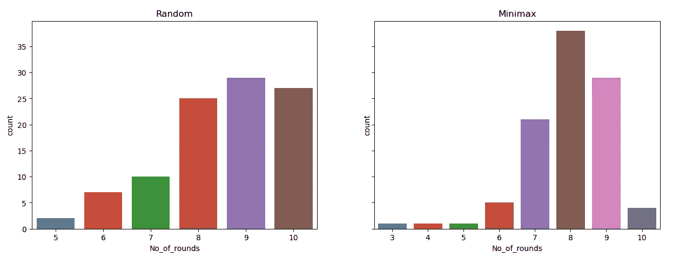
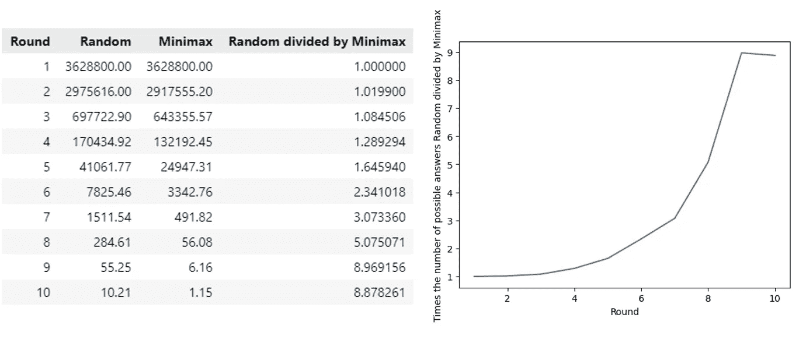
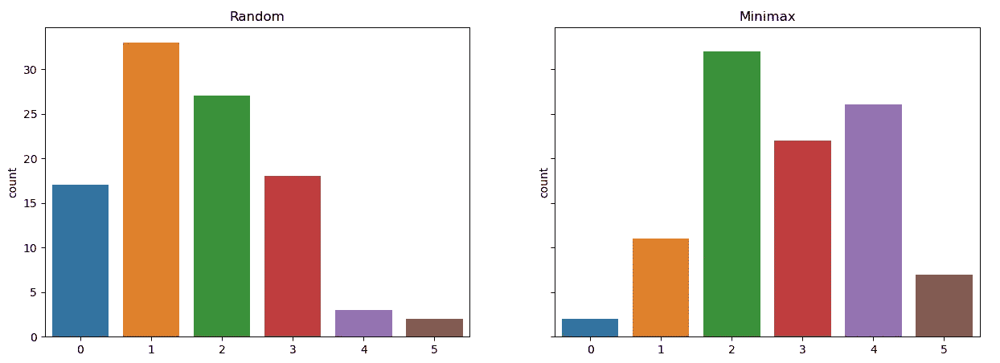

# 解决 MTV 的《非诚勿扰》:有可能永远不输吗？

> 原文：<https://towardsdatascience.com/solving-mtvs-are-you-the-one-is-it-possible-to-never-lose-992488277099?source=collection_archive---------9----------------------->

照片由[奥泽尔·戈麦斯](https://unsplash.com/@ozgomz?utm_source=medium&utm_medium=referral)在 [Unsplash](https://unsplash.com?utm_source=medium&utm_medium=referral) 上拍摄

## 爱情的游戏还是逻辑的游戏？

**有时看一个有很多戏剧性的电视真人秀节目是非常放松的。“你就是那个人吗，”是其中一个节目。这个节目有一个有趣的额外部分:它引发我找到解决这个游戏的完美方法！找到解决方案有多难？平均需要多少回合？如果你玩很多游戏，你多久输一次？让我们把戏剧抛在脑后，试着只用逻辑和逻辑来解决这个游戏！**

# **游戏解说**

当然你们都知道这个电视节目或者已经解决了这个游戏！但如果你没有，这里有一个游戏解释。

“你就是那个人吗，”是一场 10 个男人和 10 个女人试图找到他们的完美伴侣的表演。这 10 对完美的情侣是由配对算法决定的。只有一个解决方案是正确的。在一起生活时，参与者试图在最多 10 轮中找到解决方案。如果参与者在出局前找到所有的完美匹配，他们将赢得一大笔钱。

每一轮，参与者可以送一对情侣到真相亭。在真相亭，这对夫妇发现他们是否是一个完美的匹配。随后，举行配对仪式，由男人或女人选择他们的伴侣。他们用光束找出多少匹配是正确的。每一束代表一个完美的匹配。如果他们有 10 场完美的比赛，他们就赢了这场比赛。如果他们没有找到一个完美的配对(除了他们在真理亭发现的那个)，就会停电。然后他们会失去一半的奖金。

> 在一个有 10 只雄性和 10 只雌性的游戏中，配对的可能方式总共有 10 种！= = 10 * 9 * 8 * 7 * 6 * 5 * 4 * 3 * 2 * 1 = = 362.88 万
> 听起来没那么容易吧？！

照片由 [Kimson Doan](https://unsplash.com/@kimsondoan?utm_source=medium&utm_medium=referral) 在 [Unsplash](https://unsplash.com?utm_source=medium&utm_medium=referral) 上拍摄

# 游戏模拟

现在问题清楚了，剩下唯一要做的就是编程，让计算机给我们的问题答案。我们将尝试两种方法来解决这个问题。第一种方法是从仍有可能配对的夫妇中随机选择配对。这有点类似于大多数参与者的玩法，这就是这种方法的有趣之处。这个方法给了我们一个基线分数。第二个使用了一种叫做 minimax 的算法。

首先，我们导入一些包。然后我们创建两个函数:一个在开始时给出所有可能的匹配(或可能的答案),另一个我们可以用来从可能的答案中提取可能的配对(为真理亭选择一对)。在开始的时候，可能的情侣数量等于一男一女所有可能的组合，所以有 10*10 = 100 对可能的情侣。如前所述，可能的匹配数等于 3，628，800。

在这个实验中，情侣的数量等于 10 对，就像大多数“非诚勿扰”中一样季节。如果您想试验不同数量的情侣，您可以在这里选择不同的值。

一个函数创建所有可能的配对，另一个函数从所有可能的答案中提取可能的配对。我们只需要创建一次可能的答案，就可以在每场比赛中重复使用。

在玩游戏时，我们将从可能的答案中删除我们从真相展台获得的信息以及配对过程中正确配对的数量。

在真相亭，一对夫妇可以是完美的一对。如果是这样的话，我们只保留这一对的答案。如果这对夫妇不是完美的匹配，我们删除这对夫妇的所有答案。

对于比赛仪式，我们选择一个可能的答案。这个答案包含十对情侣。仪式的回应是一个 0 到 10 之间的数字。这个数字对应于完全匹配的数目。如果我们找到 3 个完美匹配，我们只保留与我们选择的答案有 3 对相同的答案。

## 方法 1:随机选择

下一个要点显示了玩“非诚勿扰”游戏的代码。首先从所有可能的答案中随机选择一个；这个目标代表了我们需要找出的完美匹配。出于分析的目的，我们保存一些数据，比如真理摊位的结果和匹配仪式期间完美匹配的数量。当然，最后的结果是:电脑赢了还是输了？

计算机得到 10 个回合来计算出目标。首先从可能的情侣中随机挑选一对送到真相亭。它将真相亭的结果与可能的答案进行比较，并删除所有与真相亭结果不匹配的可能答案。然后，它从可能的答案中选择一个随机匹配，并使用完美匹配的数量来删除所有不满足该条件的可能答案。可能性的数量以这种方式迅速减少！

运行一个游戏的代码。

然后我们需要一小段代码来运行这些函数。让我们玩 1000 季的《非诚勿扰》。你的猜测是什么？电脑会赢几个？

玩“非诚勿扰”的代码 100 次。

游戏玩了 100 次，胜负数看起来是这样的:

在 100 场游戏中，当我们为真相展台随机猜对一对情侣，为配对仪式随机猜对一个答案时，我们赢了 83 次，输了 17 次。这是大部分选手选择的战术，也没那么差！图片由 autor 提供。

好吧，83%的机会赢得 100 万美元，比任何彩票都高，太好了！是否有可能进一步提高这一基线分数？在游戏过程中，我们随机选择了一对夫妇作为真相展台，随机选择了一个配对仪式的队列。完全没有优化。让我们继续方法 2。

> 剧透警告:是的，我们当然可以提高这个分数！

## 方法 2:最小最大乘以 2

在第一种方法中，我们随机(从可能的配对中)挑选我们的真理亭夫妇和我们的配对。我们没有考虑一个重要的事情，那就是在选择一对夫妇或配对后剩下的可能答案的数量。如果我们选择一对给我们留下最低数量的剩余可能答案，我们可以改善可能答案的减少。同样的原理也适用于比赛。

我们如何计算还剩下多少个可能的答案？与配对相比，这对夫妇来说是一个不同的过程。让我们开始吧。

**用极小极大法** 为真相展台挑选情侣对于情侣，我们可以统计每对情侣在所有可能答案中出现的次数。有两种可能:这对夫妇是完美的一对，或者这对夫妇不是完美的一对。如果这对夫妇是完美的匹配，我们只保留这对夫妇存在的可能答案。如果这对夫妇不是完美的匹配，我们就剩下可能的答案减去这对夫妇可能的答案。

举个例子:我们还有 50 个可能的答案。一对夫妇在可能的答案中出现 10 次。另一对在可能的答案中出现了 27 次。对于第一对夫妇，我们将保留 10 个(如果这对夫妇完全匹配)或 40 个(不匹配，50 减去 10)可能的答案，这两个值的最大值是 40。对于第二对夫妇，我们将保留 27 或 23(50-27)个可能的答案，最多 27 个。在这种情况下，第二对夫妇是更好的选择，因为 27 和 40 的最小值是 27。

每轮我们选择剩余答案中最大值最低的一对。这就解释了 minimax 这个名字。

完全匹配，是还是不是？照片由[萨蒂亚万·纳林哈特](https://unsplash.com/@truth?utm_source=medium&utm_medium=referral)在 [Unsplash](https://unsplash.com?utm_source=medium&utm_medium=referral) 拍摄

用最小最大值选择最佳匹配
选择留给我们最少可能答案的匹配有点复杂。当真相亭给我们一个是或否的答案时，配对仪式的回答在 0 到 10 之间。因此，在这种情况下，我们从一个可能的答案开始，然后计算所有可能答案的剩余数量(从 0 到 10)。然后我们选择最大值(就像对夫妇一样)。对所有可能的答案重复这些步骤，并选择具有最低值的可能答案。

举个例子，如果我们和 5 对情侣一起玩这个游戏:我们选择一个可能的答案。有 10 个其他答案有 0 个(响应)共同配对，20 个答案有 1 个共同配对，25 个答案有 2 个共同配对，23 个答案有 3 个共同配对，8 个答案有 4 个共同配对。剩余答案的最大可能数量是 25，因此对于这个答案，我们选择 25。对所有其他可能的答案重复这些计算，并选择最大值最低的一个。

当你有大量可能的答案时，计算最佳匹配是相当昂贵的。记住我们从 3.628.800 个可能的答案开始！正因为如此，我在开始时取 100 场比赛的样本，并取该样本的最小值。当可能答案的数量减少时，我抽取 1000 个匹配的样本，或者我计算它们(如果可能答案的数量小于 1000)。

用代码实现:

它需要更多的时间来运行。同样，我们模拟了 100 个游戏。等了…又等…这是赢和输的图表:

使用 minimax 时的结果。是的，你的眼睛没有说谎，我们总能赢！图片作者。

哇！满分 100 分！这是一个逻辑的游戏，不涉及感情！

## 额外收获:比较这两种方法

胜负已经很清楚了，我们肯定应该采用方法 2，并根据极大极小算法选择情侣和配对。但是其他统计数据呢？

**平均回合数方法使用** 随机法平均耗时 8.53 回合，而极小极大法仅需 7.94 回合。分布图看起来像这样:

用了多少圈？Minimax 使用较少的回合，它在 6 回合中完成的次数比 10 回合多！图片作者。

**可能答案和配对的平均减少** 还有关于每一轮之后剩下的可能答案数量的数据。让我们通过取每轮 100 场比赛的平均值来比较这两种方法。用随机方法剩下的平均可能答案除以极大极小方法剩下的平均可能答案，我们得到以下数字。表格和图表告诉我们，在最后几轮中，minimax 的剩余可能答案的数量比随机猜测的剩余可能答案的数量少 5 倍以上！在最后两轮比赛中，这个数字甚至更高:几乎是 9 倍！

随机方法和极大极小方法每轮的平均剩余可能答案数。图片作者。

**完美的真相展台匹配的数量** 根据极大极小法，我们把情侣送到真相展台会得到更多的完美匹配吗？我们的目标不是得到一个完美的匹配，我们只想尽可能快地减少可能答案的数量。

这些图再次向我们展示了极大极小者获胜。平均有 2.8 个完美匹配。随机法只有 1.63。这是合理的。Minimax 将总是选择出现在最接近 50%的可能答案中的一对。如果是这样的话，你有 50%的几率，这对夫妻确实是天造地设的一对。凭随机猜测，情况并非如此。

真理亭中完美匹配的数量(每场游戏最多 10 个)。图片作者。

**停电次数** 还记得停电也有可能吗？当你在配对仪式中没有完美的配对时，就会发生这种情况。参与者损失一部分奖金，所以想避免这个！

停电次数:再一次，minimax 赢了！图片作者。

# 结论

戏剧和数学在这个电视节目中是完美的搭配！这部剧很棒，因为如果你玩得聪明，它总能有一个美好的结局🤓。这个帖子证明了只有两种可能的结果:找到爱情*和*赢钱或者只是赢钱。万一没找到爱情，可以拿着奖金继续狂欢！

干杯！🥂

[菠萝供应公司](https://unsplash.com/@pineapple?utm_source=medium&utm_medium=referral)在 [Unsplash](https://unsplash.com?utm_source=medium&utm_medium=referral) 上拍摄的照片

> 如果你有任何关于改进这段代码的建议，让它变得更快或者用不同的方式解决它，我很乐意听到你的意见。感谢阅读！

## 有关系的

</how-i-learned-my-computer-to-play-spot-it-using-opencv-and-deep-learning-ad1f017a3ec3>  </snake-played-by-a-deep-reinforcement-learning-agent-53f2c4331d36>  </solving-nonograms-with-120-lines-of-code-a7c6e0f627e4>  

*别忘了* [*订阅*](https://hennie-de-harder.medium.com/subscribe) *如果你想在我发表新文章时收到电子邮件。* ❤