# 用有限差分法数值求解非线性微分方程

> 原文：<https://towardsdatascience.com/solving-non-linear-differential-equations-numerically-using-the-finite-difference-method-1532d0863755?source=collection_archive---------21----------------------->

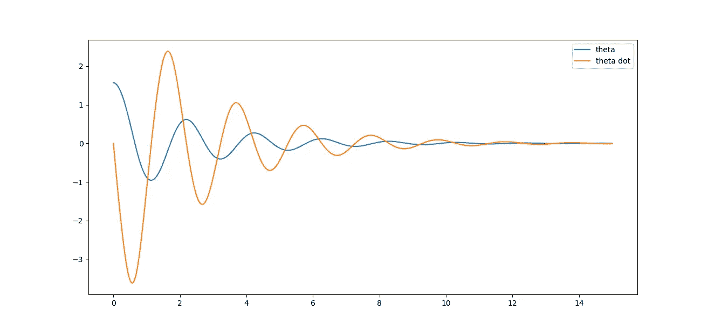

在这篇文章中，我们将看到如何使用有限差分法来解决非线性微分方程数值。我们将在考虑空气阻力的情况下练习摆方程，并用 Python 求解。

我们会从零开始找到摆的微分方程，然后求解。在我们开始之前，我们需要一些关于极坐标的背景知识。

# 极坐标

你已经知道著名的笛卡尔坐标，这可能是日常生活中使用最多的坐标。然而，在某些情况下，用笛卡尔坐标描述一个物体的位置是不实际的。例如，当一个物体在**圆周运动**时，正弦和余弦函数会到处出现，所以通常用我们称之为**极坐标**来描述物体的位置是一个更好的主意。

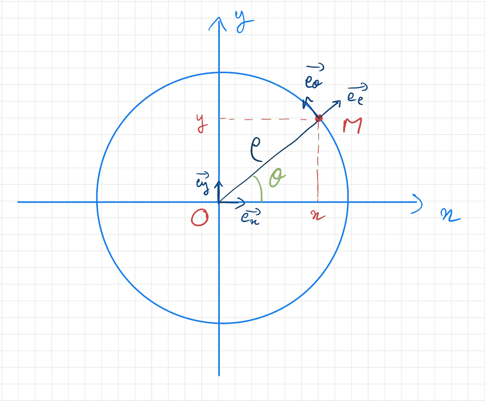

极坐标由两个变量描述，半径 ***ρ*** 和角度 ***θ*** 。我们将单位向量附加到每个变量上:

*   ***eρ*** 是一个单位矢量，始终指向与矢量 OM 相同的方向。
*   ***eθ*** 是垂直于 ***eρ*** 的单位矢量。

我们现在的目标是在极坐标中表达一个物体的 ***位置******速度******加速度*** 。为此，我们需要表达极坐标单位向量和笛卡尔单位向量之间的关系。

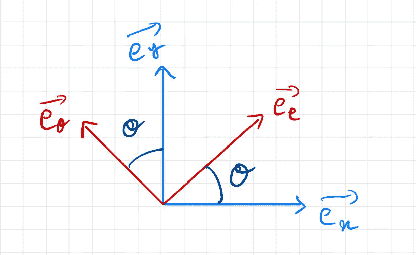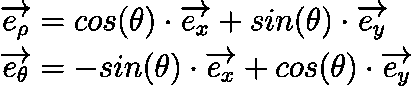

笛卡尔坐标到极坐标

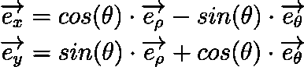

极坐标到笛卡尔坐标

好吧！让我们用极坐标来表示 ***位置*** 、 ***速度*** 、 ***加速度*** 。

## 位置

这个很简单。这就是使用极坐标的全部意义！

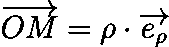

极坐标中的位置

## ***速度***

我们只是简单的区分了位置和时间的关系。我们将假设 ***ρ*** 为常数，只有 ***θ*** 随时间变化。

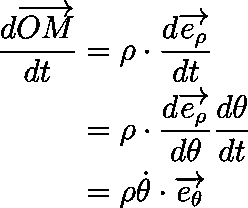

极坐标中的速度

## 加速

我们对速度对时间求导。

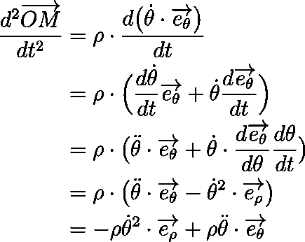

极坐标中的加速度

好吧！我们现在可以解决我们的问题:钟摆。

# 钟摆方程

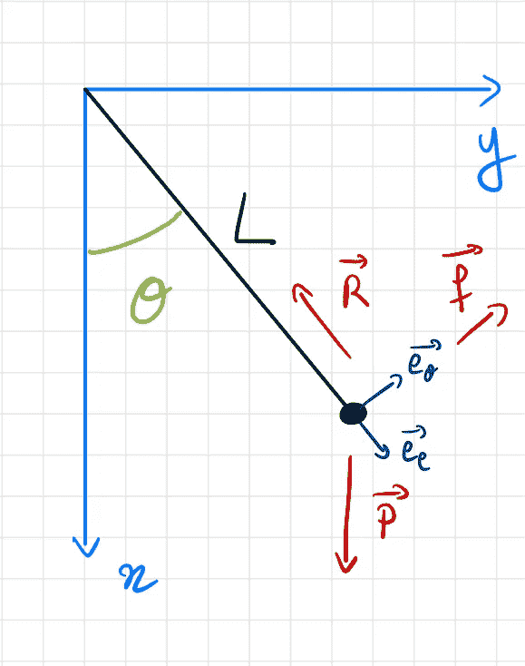

为了找到角度 ***θ*** 所满足的方程，我们会用到牛顿第二运动定律，或者用法语叫*动力学的根本原理*。

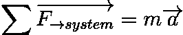

牛顿第二运动定律

施加在一个系统上的所有力的总和等于它的质量乘以它的加速度。我们来列举一下摆所受的所有力 ***用极坐标*** 表示。

## 重量

重力引起的物体重量是施加在物体上的力的一种。它的公式是众所周知的，并将在我们的坐标系中表示为:

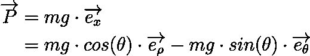

重量

其中 ***m (kg)*** 是物体的质量， ***g (m/s )*** 是重力加速度的值——在地球上大约是 9.81。

## 绳索张力

绳子施加一个张力，沿着绳子的方向拉着钟摆。

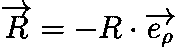

绳索张力

其中 ***R (N)*** 为绳索拉力，单位为牛顿。

## 空气阻力

当然，空气对钟摆施加了一个摩擦力，这个摩擦力会使钟摆在某一点停止摆动。小空气阻力通常被建模为与速度矢量相反且与速度矢量的范数成比例的力。

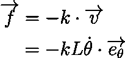

空气阻力

其中 ***k (kg/s)*** 为运动中物体特有的摩擦系数， ***L (m)*** 为摆绳的长度。

## 牛顿第二运动定律

我们现在可以应用牛顿第二运动定律:

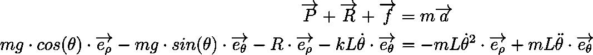

牛顿第二运动定律应用于单摆

然后将结果投影到两个轴上:

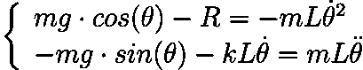

推断

重新排列第二个等式的各项，我们得到:

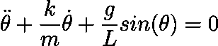

钟摆方程

求解这个二阶非线性微分方程是 ***非常复杂的*** 。这就是有限差分法非常方便的地方。归结起来就是两行 Python！让我们看看怎么做。

# 差分法

该方法包括使用变化率以非常小的步长数值逼近导数。

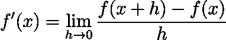

导数——变化率

这就是衍生品的定义。在数值上，如果我们知道 ***f*** ，我们可以取一个小数字*—例如 0.0001 —并计算给定*x 的上述公式，这将给我们一个***f’(x)***的近似值。**

**有限差分法就是利用这一事实将微分方程转化为普通方程。**

**在我们的例子中，我们首先用变化率来表示相对于*的***θ】***。***

**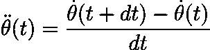**

**我去掉了极限，写下 ***dt*** 让我们知道这应该是一个无穷小的值——实际上，只是一个很小的数。我们现在将把这个方程代入摆方程。**

**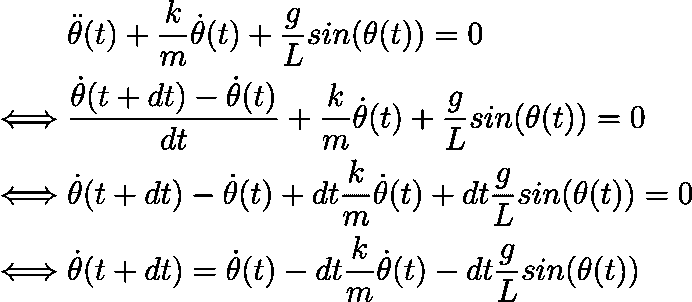**

**好吧！我们设法将时间 ***t+dt*** 的角速度表示为相对于时间 ***t*** 的角度和角速度。换句话说，如果例如 ***dt=0.001*** 并且如果你知道***【θ(0)***和***【θ’(0)***(这些都是系统的初始条件)，那么你就可以计算出***θ’(0.001)***！如果我们还可以计算 ***θ(0.001)*** ，那么递归就完成了，我们可以从已知的初始条件开始计算任意***【t】***的***【θ(t)，θ'(t)】***。**

**好在有一个计算 ***θ(t+dt)*** 的方法:**

**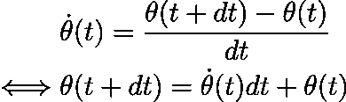**

**好吧！有了这个方程，我们还可以计算出在时间 ***t+dt*** 的角度，给定在时间 ***t*** 的角速度。**

**利用这两个方程，我们现在可以计算任意时间步长的角度θ！**

**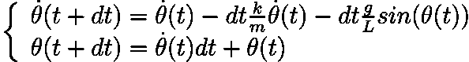**

**的确，给定***【θ(0)，θ'(0)】***就可以计算出***【θ(dt)，θ'(dt)]。*** 给定***【θ(dt)，θ'(dt)】***可以计算***【θ(2dt)，θ'(2dt)】***，以此类推。**

**让我们在 Python 程序中使用所有这些！**

# **Python 代码**

**我们使用找到的公式迭代计算*和***【θ’(t)***，并将结果放在两个单独的列表中。希望代码是可以理解的，但是如果你有任何问题，请随意发表评论。***

**运行该代码将产生以下图形。**

**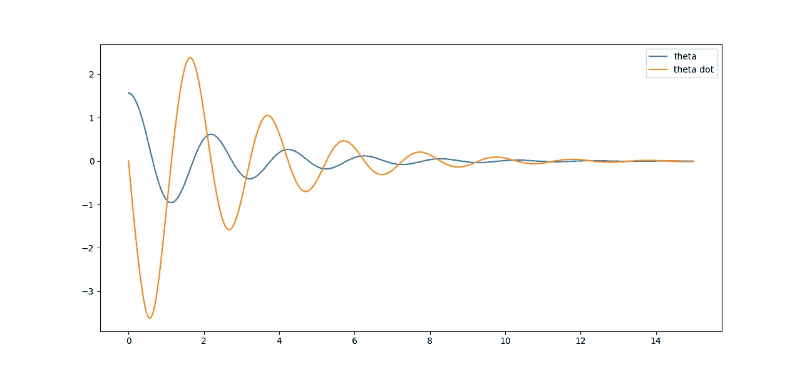**

**两个快乐的观察:**

*   **当角度为 0 时，角速度似乎达到了极值，这很合理，因为这是钟摆积累了所有惯性的地方，因为它在上升，所以速度要慢下来。**
*   **当角度达到极值时，角速度似乎达到零，这是有道理的，因为这是钟摆减速并准备向另一个方向运动的时候。**

**稍微摆弄一下代码，比如你可能想把初速度设置为 ***2π*** 。**

**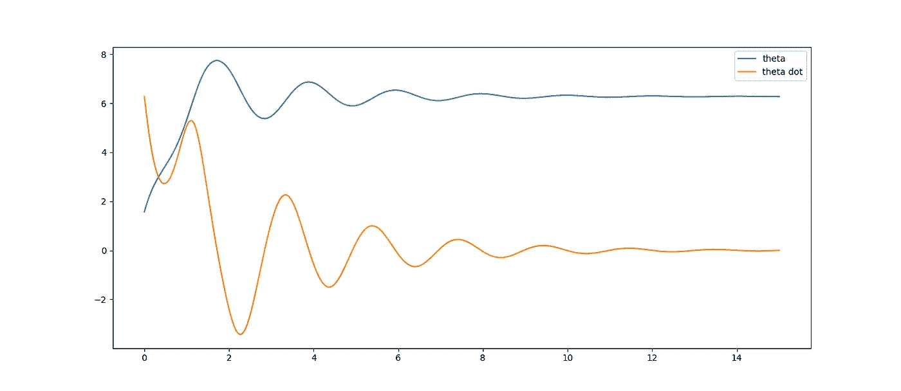**

**注意角度在下降前是如何不断增加的。发生的情况是，初速度足够高，使得钟摆在进入通常的振荡之前旋转了一整圈！**

**最后一件事…你可以尝试增加*dt，看看这对模拟有什么影响。希望你已经明白，更小的 ***dt*** 意味着更精确的结果。让我们看看对于 ***N=3，2，1*** 会发生什么。***

**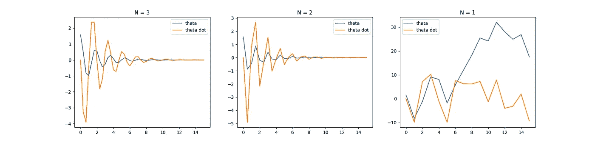**

**实际上，我很惊讶地看到，对于每秒 3 个点(甚至 2 个点)，我们仍然能够得到解的大致形状。N=1 是另一个故事…**

# **结论**

**在这篇文章中，我们已经看到了如何使用有限差分方法来解决微分方程(即使是非线性的),我们把它应用到一个实际的例子:摆。这种技术也适用于偏微分方程，一个众所周知的例子是热方程。**