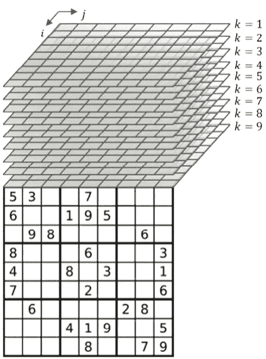
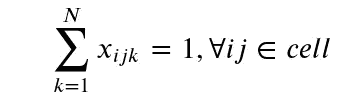
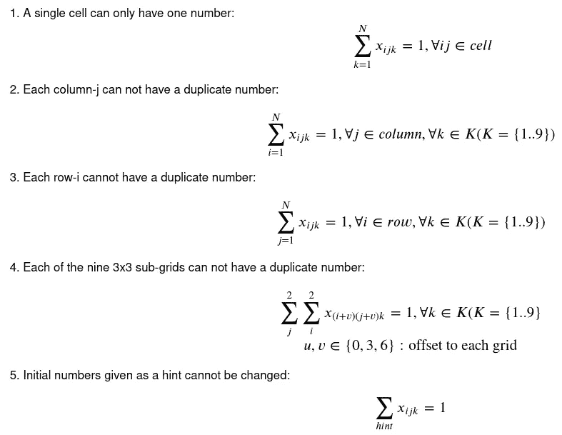
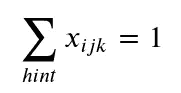
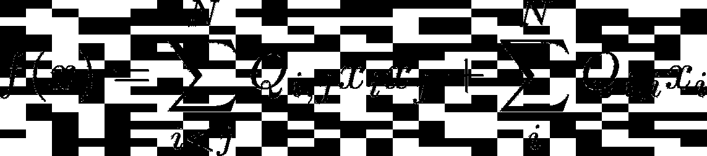
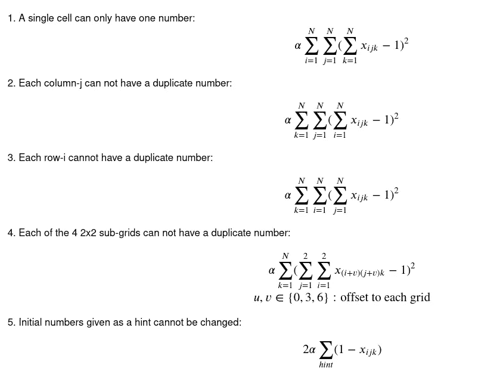
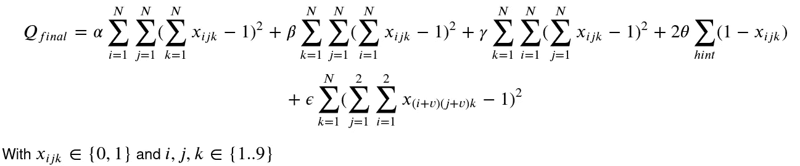
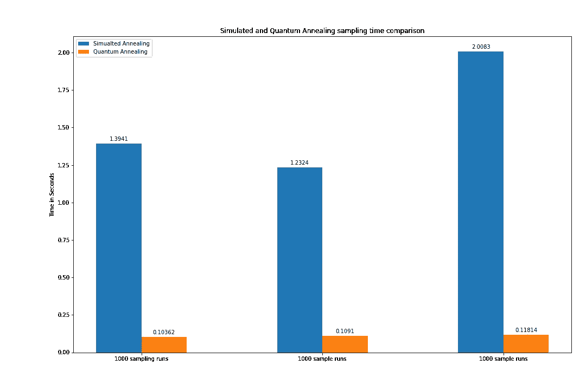
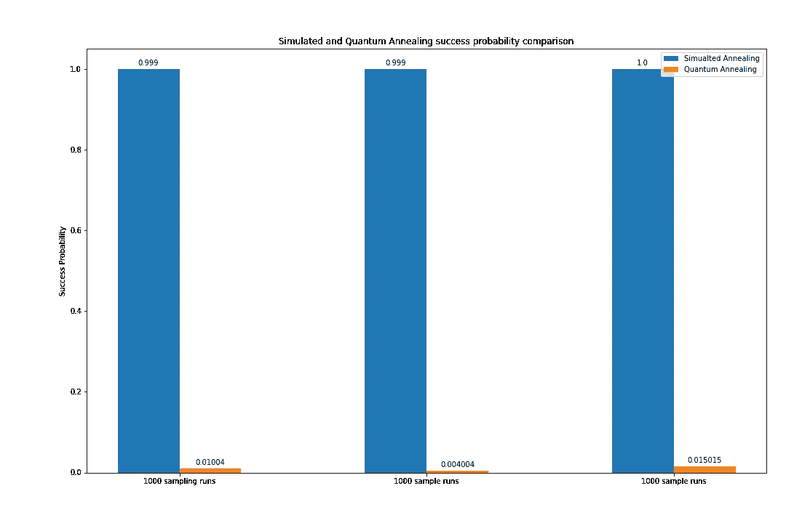

# 用量子能量解决数独

> 原文：<https://towardsdatascience.com/solving-sudoku-with-a-quantum-power-up-5bb4f64f3944?source=collection_archive---------30----------------------->

## 神秘的量子计算机承诺比经典计算机更快。

今天我们将使用量子 Annealer 来解决周日休息时间的数独问题。

9x9 数独游戏本来源:[https://pix abay . com/photos/optics-glass-glass-Sudoku-pencil-4691414/](https://pixabay.com/photos/optics-glasses-glass-sudoku-pencil-4691414/)

更好的是:我们将使用数独游戏来测试[最新公开的](https://www.dwavesys.com/d-wave-two%E2%84%A2-system)量子 Annealer 架构。这样，我们就会知道投资这项新技术的时机到了。

B **但是什么是量子退火机呢？**

我不想解释几个人已经做了什么，并且可以做得更好。因此，我将在底部为您提供一些精彩解释的链接，现在只需陈述我们需要的基线假设:

*   量子退火器可以用来解决离散的组合优化问题(数独是其中的一个子集)
*   通过使用量子力学的魔力，量子退火机理论上可以比经典计算机快(很多)
*   Quantum Annealer 制造商 D-Wave 提供了文档和一个公开可用的 API ( [D-Wave Leap](https://cloud.dwavesys.com/leap/) )，我们可以用它来解决我们的问题。

**如何制定解决一个数独竞猜的目标？**

数独游戏可以简单地表述为包含数字和一组简单规则的矩阵。

假设我们有一个 9x9 的数独游戏，将棋盘表示为一个矩阵，将矩阵限制为 9 行 9 列，并且只包含从 1 到 9 的数字。

那么我们可以将数独规则定义为:

*   每一行都需要包含从 1 到 9 的所有数字
*   每一列都需要包含从 1 到 9 的所有数字
*   每个方块需要包含从 1 到 9 的所有数字

这些基本上是我们需要的所有规则。很简单，是吧？如果我们现在确保所有这些规则都成立，在输入数字时，我们将得到一个有效的数独解决方案！

**有哪些(数学)约束？**

在[顶级编码器挑战系列](https://tc3-japan.github.io/DA_tutorial/tutorial-1-sudoku.html)中，已经针对非量子优化硬件(称为数字退火机)解决了制定约束的问题，因此我们已经处理了耗时的*冷启动问题*。

在我展示约束之前，我想介绍一下我们通常如何看待电路板的一个小变化。因为量子退火器可以解决的数学公式是二进制的，所以我们需要限制代表我们的板的矩阵也是二进制的。我们可以通过为一个单元格中的每个数字引入一个维度来实现这一点(在我们的例子中是 9)。看看下面的图片，以便更好地理解。

摘自[https://tc3-Japan . github . io/DA _ tutorial/tutorial-1-sudoku . html](https://tc3-japan.github.io/DA_tutorial/tutorial-1-sudoku.html)**TC3 K . K([www.tc3.co.jp](http://www.tc3.co.jp/))**

**现在让我们快速看一下我们需要的约束:**

****

**1.一个单元格只能有一个数字。**

**第一个约束是我们之前介绍的每个可能数字的维度的结果。“单元”是包含所有行、列组合的元组的集合。约束 2–4 只是我们在一开始定义的数独规则。**

****

**数独游戏的约束**

**第五个约束是确保算法不会开始改变已经给定的数字。当然，这对人类来说是显而易见的，但是计算机需要更明确地知道什么该做，什么不该做。以下等式的和在一个称为“提示”的集合上迭代，该集合包含所有初始给定的单元格。**

****

**5.作为“提示”给出的初始数字不能更改**

**然而，这些约束不具有量子退火器可以解决的格式。还没有。我们需要将约束重新表述为一个[曲波](https://en.wikipedia.org/wiki/Quadratic_unconstrained_binary_optimization)(二次无约束二元优化问题)，以便量子退火器解决它。曲波基本上期望一组线性和二次项来表示问题。**

****

**二次无约束二元优化(请参见[https://docs.dwavesys.com/docs/latest/c_qpu_0.html?曲波)highlight =曲波](https://docs.dwavesys.com/docs/latest/c_qpu_0.html?highlight=qubo)对曲波进行更深入的解释。**

**将我们的约束重新表述为曲波的一个方法是引入一个所谓的惩罚项。通过一个惩罚项，我们惩罚“错误”的行为，所以我们强制执行算法，给我们最好的解决方案。**

**让我们先看看这些公式是怎样的，然后再谈一点。**

****

**数独游戏的 QUBOs**

**上面的大多数等式使用的是 1 的平方距离，因为我们必须确保每个数字在每行和每列只能选择一次。这样，当总和之下的相加数字等于 1 时，达到最佳解，即最小值，在我们的情况下为 0(因为平方)。将约束重新表述为罚函数的逻辑适用于所有项，其中最优解是最低的可能值。**

**如果我们将所有的量子集合在一起，以获得量子退火器的最终目标函数，我们最终得到这个方程:**

****

**数独(曲波)**目标函数**。**

**这个目标函数导致了一个最终矩阵，该矩阵具有一个正确的数独游戏作为最优解。最终，Quantum Annealer 所做的一切都是离散优化:在未知的离散问题空间中找到一组最优值(解)。**

**在这一点上，我们可以使用我们的曲波和 [D-Wave Leap，](https://www.dwavesys.com/take-leap)来解决数独板，这提供了对量子退火器的免费访问:具有新 [Pegasus 架构](https://support.dwavesys.com/hc/en-us/articles/360054564874-What-Is-the-Pegasus-Topology-)的 [D-Wave Advantage](https://www.dwavesys.com/d-wave-two%E2%84%A2-system) 。**

****量子退火炉的局限性****

**事实证明，量子退火机的硬件对于解决整个 9x9 数独曲波来说还太小。我不可能找到将曲波的[嵌入到 D-Wave 硬件图中的](https://docs.ocean.dwavesys.com/projects/system/en/stable/reference/embedding.html)，这是采样发生前的必要步骤。**

**然而，对于一个简化版的 **4x4 数独游戏**，我可以找到一个有效的嵌入，因此我将使用这个更小尺寸的电路板进行以下性能测量。**

****Quantum Annealer 性能指标评测****

**除了*时间*，即*进行计算所需的*，另一个广泛使用的度量标准被称为*成功概率*。
由于 Quantum Annealer 以启发式方式工作，因此无法保证有效的结果。成功概率就是所有计算中正确解的比率。
根据问题的复杂程度，成功概率可能会很快降低，这意味着量子退火器偶尔会找到最佳解决方案，而在其他时候会以(稍微)更差的解决方案告终。为了进行比较，我们在经典计算机上使用了一个模拟退火算法。模拟退火与量子退火器有许多共同的属性。**

****

**量子退火和模拟退火的采样时间比较**

**即使有了这个实验，经典算法和量子算法之间的最大差异已经很明显了。虽然量子退火器需要大致恒定的时间(每次**采样 20 秒)来达成解决方案，但经典算法所需的时间可能会有所不同。此外，量子退火器似乎无论如何都比我家用电脑的 CPU 快。****

****

**量子退火和模拟退火成功概率的比较**

**成功概率描绘了一幅不同的画面。虽然模拟退火几乎总能找到精确的解决方案，但量子退火机仅在大约 1%的采样运行中找到精确的解决方案。这正是我们在计算解决方案时需要*采样*的原因——尤其是对于量子硬件。
尽管 1%听起来是一个非常糟糕的比率，但如果一次采样(比如说 1000 次运行)需要持续几秒钟的时间，这就足够了，而且我们通常只需要一个有效的解决方案。**

****后记****

**对**Advantage**Quantum Annealer 的分析表明，D-Wave 使向其系统提交问题变得非常简单。尽管硬件还不足以解决大问题，但已经有很多有趣的应用，当问题的规模减小时，可以对它们进行研究。此外，可能有可能使用一种 [*混合方法*](https://www.dwavesys.com/press-releases/d-wave-announces-quantum-hybrid-strategy-and-general-availability-d-wave-hybrid) *—* 即:将问题分解成容易计算的经典计算部分，只将较难的计算部分外包给量子退火程序。**

**我希望我的小实验能够向你展示花一点时间投入到计算机科学、数学和物理这个非常有趣的交叉领域的乐趣。**

**Y **ou 可以在** [**GitHub**](https://github.com/ju2ez/quantum_annealing_sudoku) 上找到所有创建的代码**

**有用资源:
【1】[https://research.aimultiple.com/quantum-annealing/](https://research.aimultiple.com/quantum-annealing/)
【2】[http://www . cs . CMU . edu/AFS/cs . CMU . edu/project/learn-43/lib/photoz/。g/web/glossary/comb . html](http://www.cs.cmu.edu/afs/cs.cmu.edu/project/learn-43/lib/photoz/.g/web/glossary/comb.html)
【3】[https://en.wikipedia.org/wiki/Quantum_annealing](https://en.wikipedia.org/wiki/Quantum_annealing)
【4】[https://docs.ocean.dwavesys.com/en/stable/](https://docs.ocean.dwavesys.com/en/stable/)
【5】[https://cloud.dwavesys.com/leap/](https://cloud.dwavesys.com/leap/)
【6】[https://www.youtube.com/watch?v=zvfkXjzzYOo](https://www.youtube.com/watch?v=zvfkXjzzYOo)**