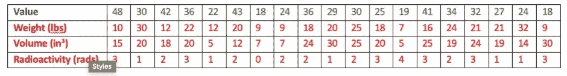
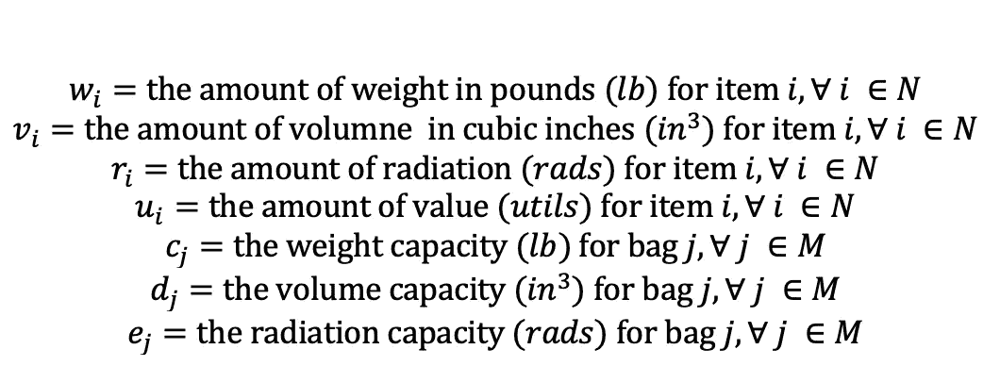
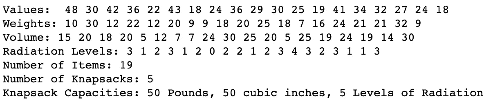
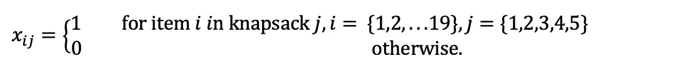
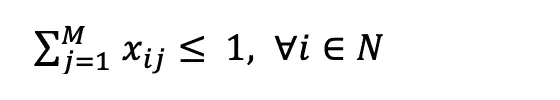
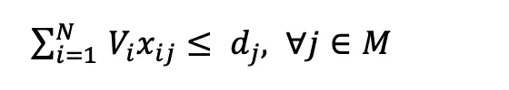
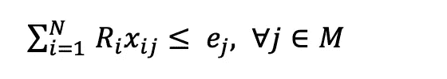
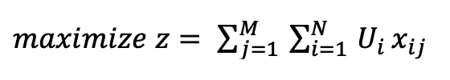
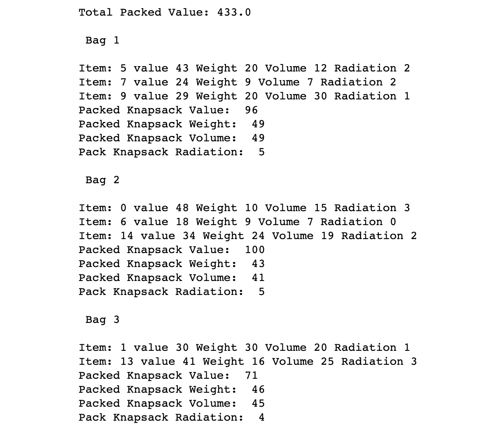

# 用 Google 或 tools 解决多背包问题

> 原文：<https://towardsdatascience.com/solving-the-multiple-knapsack-problem-with-google-or-tools-e961dfc8288e?source=collection_archive---------14----------------------->

## 使用 Python 中的线性编程解决多约束多背包问题的分步演练。


照片由 [S & B 冯兰森](https://unsplash.com/@blavon?utm_source=medium&utm_medium=referral)在 [Unsplash](https://unsplash.com?utm_source=medium&utm_medium=referral) 上拍摄

# 介绍

[背包问题](https://en.wikipedia.org/wiki/Knapsack_problem#:~:text=The%20knapsack%20problem%20is%20a,is%20as%20large%20as%20possible.)是一个在[线性规划](https://en.wikipedia.org/wiki/Linear_programming)中使用的玩具问题，供用户学习如何制定一个等式，将各种重量的物品最佳地打包到背包中。每个项目通常也有一个相关的值。目标是优化背包的价值，同时不超过包的重量限制。今天的问题从基本的背包问题扩展到具有多种约束的多背包问题。提供的代码和演练与在 [Goole 或工具](https://developers.google.com/optimization/bin/multiple_knapsack)上找到的类似，然而，今天解决的问题有更多的限制。

# 问题

*你和* ***4*** *科学家们正在研究不同元素组合的放射性，为地球寻找一种新的清洁能源。虽然元素和混合物中的放射性水平很低，但你决定要徒步走到一个偏远的实验室，以确保平民的安全。你们每个人都有* ***1*** *个元素包装袋，能够装下* ***50 磅*******【lbs】****的重量和* ***50 立方英寸*** *。另外，您和您的团队只能接触到最大放射性为* ***25 拉德*** *的物品，因此，* ***每个包最多只能有 5 个*** ***拉德*** *以确保任何人的包都不会有过多的辐射而伤害携带者。每个元素都有一定的价值水平* ***【实用工具】*** *，团队的目标是挑选最佳的物品组合，最大限度地发挥团队的效用，同时仍然安全地包装 5 个袋子。这 5 个袋子应该如何与给定的物品包装在一起？* ***(“包”和“背包”这两个词可以互换)****

**

*作者图片:每个项目的参数。*

***设置问题***

*首先，导入工具(可能需要进行 pip 安装！)*

```
*import ortools
from ortools.linear_solver import pywraplp*
```

*我们正在解一个线性程序，因此需要从 **ortools.linear_solver 导入 **pywraplp** 。**接下来，创建求解器。*

```
*solver = solver = pywraplp.Solver.CreateSolver('SCIP')*
```

## *集合/参数*

*现在将为该问题定义集合和参数。*

***设定***

*项目数量= *N = {1，2…19}**

*行李数量= *M = {1，2，3，4，5}**

***参数(数据)***

**

*作者图片*

*将上表中的值代入 python，得到以下参数:*

```
*data = {}
values = [48, 30, 42, 36, 22, 43, 18, 24, 36, 29, 30, 25, 19, 41, 34, 32, 27, 24, 18]
weights = [10, 30, 12, 22, 12, 20, 9, 9, 18, 20, 25, 18, 7, 16, 24, 21, 21, 32, 9]
volume = [15, 20, 18, 20, 5, 12, 7, 7, 24, 30, 25, 20, 5, 25, 19, 24, 19, 14, 30]
rad = [3, 1, 2, 3, 1, 2, 0, 2, 2, 1, 2, 3, 4, 3, 2, 3, 1, 1, 3]assert len(values) == len(weights) == len(volume) == len(rad)
data['values'] = values
data['weights'] = weights
data['volume'] = volume
data['rad'] = rad
data['items'] = list(range(len(weights)))
data['num_items'] = len(values)
number_bags = 5 #All have the same capacity of 50 pounds
data['bag_capacities'] = [50, 50, 50, 50, 50] #pounds
data['bag_volume'] = [50,50,50,50,50] #while this equals bag_capacities, I made it its own variable in case
data['rad_capacities'] = [5,5,5,5,5]
#I wanted to change the values at a later data
data['bags'] = list(range(number_bags))assert len(data['bag_capacities']) == number_bags
assert len(data['bag_capacities']) == len(data['bag_volume']) == len(data['rad_capacities'])
print("Values: ",*data['values'])
print('Weights:',*data['weights'])
print('Volume:',*data['volume'])
print('Radiation Levels:', *data['rad'])
print("Number of Items:", data['num_items'])
print("Number of Knapsacks:" , number_bags)
print('Knapsack Capacities: 50 Pounds, 50 cubic inches, 5 Levels of Radiation')*
```

*这里的断言是作为一种健全性检查，确保您没有遗漏任何输入值。运行此命令将输出以下内容:*

**

*作者图片*

## *决策变量*

*一般来说，决策值首先被概述，然而，它们必须在数据被输入和变量被设置之后被编码。对于这个问题，我们的决策变量是选择一个项目(1)还是不选择(0)。*

**

*作者图片*

*在 python 中:*

```
*x = {}
for i in data['items']:
    for j in data['bags']:
        x[(i,j)] = solver.IntVar(0,1,'x_%i_%i' % (i, j))*
```

## *假设*

*当建立一个线性规划时，包含你所做的主要假设总是很重要的。对于这个问题，主要假设是一个人不能携带超过 1 个背包。此外，一件物品不能移动到另一个包中，也不能放在多个包中。*

## *限制*

*对于这个问题，每个包的重量、体积和辐射量是我们的约束条件。此外，一件物品只能放在 5 个袋子中的一个。*

***项目约束***

**

*作者图片*

*纵观所有包，一件物品只能放在一个包里。*

***重量约束***

**

*作者图片*

*请记住，每个袋子的重量不能超过 **50 磅。***

***音量限制***

**

*作者图片*

*记住，每个袋子的体积不能超过 **50 立方英寸**。*

***辐射约束***

**

*作者图片*

*请记住，每个袋子中的辐射不能超过 **5 拉德**。*

```
*#Constraint for an item being placed in 1 knapsack
for i in data['items']:
    solver.Add(sum(x[i,j] for j in data['bags'])<=1)#Knapsack Capacity Constraint
for j in data['bags']:
    solver.Add(sum(x[(i,j)]*data['weights'][i] 
                  for i in data['items']) <= data['bag_capacities'][j])#Volume Constraint
for j in data['bags']:
    solver.Add(sum(x[(i,j)]*data['volume'][i]
                  for i in data['items']) <= data['bag_volume'][j])
#Radiation Constraint
for j in data['bags']:
    solver.Add(sum(x[(i,j)]*data['rad'][i]
                  for i in data['items']) <= data['rad_capacities'[j])*
```

## *目标函数*

*这个问题表明我们想要找到最好的方法来最大化我们团队的效用。如下面的目标函数所示，这相当于将放入袋子中的所有物品值相加。*

**

*作者图片*

```
*#objective function
objective = solver.Objective()
for i in data['items']:
    for j in data['bags']:
        objective.SetCoefficient(x[(i,j)], data['values'][i])
objective.SetMaximization()*
```

## *求解！*

```
*solv = solver.Solve()
if solv == pywraplp.Solver.OPTIMAL:
    print('Total Packed Value:', objective.Value())
    total_weight = 0
    for j in data['bags']:
        bag_value = 0
        bag_weight = 0
        bag_volume= 0
        bag_rad = 0
        print('\n','Bag', j+1 , '\n')
        for i in data['items']:
            if x[i,j].solution_value()>0:
                print('Item:', i , 
                      'value',data['values'][i],
                      'Weight', data['weights'][i], 
                      'Volume',data['volume'][i],
                      'Radiation', data['rad'][i]
                     )
                bag_value += data['values'][i]
                bag_weight += data['weights'][i]
                bag_volume += data['volume'][i]
                bag_rad += data['rad'][i]
        print('Packed Knapsack Value: ', bag_value)
        print('Packed Knapsack Weight: ', bag_weight)
        print('Packed Knapsack Volume: ', bag_volume)
        print('Pack Knapsack Radiation: ', bag_rad)
else:
    print("There is no optimal solution")*
```

*最终输出:*

**

*作者图片*

**

*作者图片*

*如您所见，所有的约束都已满足，我们的最终效用值为 **433.0 utils** ！*

# ***结论***

*今天我们学习了如何解决有多个约束的多重背包问题。当处理可以线性框架化的问题时，google.ortools 是一个极好的资源，它提供了各种不同的解决方案。你可以在你的日常生活中为你的下一次大旅行做些调整，确保你以最适合你需求的方式打包行李！*

***请在**[**LinkedIn**](https://www.linkedin.com/in/benjamin-mccloskey-169975a8/)**上加我或者随时联系！这个代码的仓库可以在** **这里找到** [**。感谢阅读！**](https://github.com/benmccloskey/Linear_programming/blob/main/Multi_Constrained_Multi_Knapsack.ipynb)*