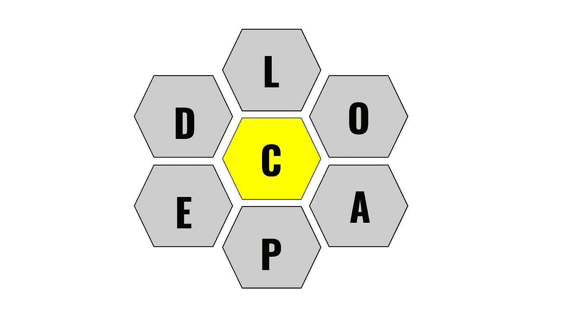

# 用 Python 解决纽约时报拼字比赛难题

> 原文：<https://towardsdatascience.com/solving-the-new-york-times-spelling-bee-puzzle-in-python-511bcb5ea65e?source=collection_archive---------22----------------------->

## 使用内置函数和数据类型

德米特里·格里戈列夫在 [Unsplash](https://unsplash.com/s/photos/bee?utm_source=unsplash&utm_medium=referral&utm_content=creditCopyText) 上拍摄的照片

## 介绍

我对谜题很着迷，我现在痴迷于纽约时报[拼字比赛](https://www.nytimes.com/puzzles/spelling-bee)。在这个日常谜题中，玩家会得到一个由七个字母组成的“蜂巢”。他们的任务是创造单词，这些单词可能**只有**包含这些字母，而**必须**包含蜂巢中心的字母(称为“中心字母”)。有效单词也必须至少有四个字母长。例如，在下面的模仿游戏中，“accolade”是一个有效的单词，但是“load”(没有中间字母)和“cap”(太短)不是。

作者的图像，旨在模仿拼字游戏的结构。不是 NYT 出版的。

我们的目标是想出尽可能多的有效单词:随着你的字数增加，你的表现排名也会上升，排名范围从“初学者”到“天才”。为了追求那种珍贵的天才身份，我几个晚上都失眠了。

今天，我决定依靠 Python 而不是英语来解决这个难题，本文将解释我是如何做到的。

## 这不是作弊吗？

这项任务将一个字谜转化成了一个逻辑谜题，从某种意义上说，仍然有一些“解决”要做，我不认为这是作弊。考虑到这个逻辑难题只需要解决一次就可以应用到任何未来的字谜中，然而，如果我只是在明天的拼字比赛挑战中运行这个程序，我无疑是在作弊。

那会剥夺解决拼字比赛的所有乐趣，所以如果我将来使用这个程序，只有在我穷尽了我的词汇中的每个有效单词，并且仍然在凌晨 2 点起床追逐天才排名之后。本着良好的体育精神，我想请我的读者仅将本文中的信息用于教育目的。

## 创建英语单词列表

解决拼字比赛的程序需要有某种方法来识别一个单词是否存在于英语中。为此，我从这个 [GitHub 库](https://github.com/dwyl/english-words)下载了“words.txt”文件。然后，我在文件中创建了一个单词列表，代码结构如下:

' word_file '中的单词在结尾包含不必要的字符，'/n '，表示新的一行。这些字符通过字符串索引被删除，为了保持一致，单词在被附加到“单词列表”之前被改为小写该列表总共包含大约 25.5k 个单词，这远非详尽，但大概包括了足够我们使用的单词。

## 定义求解函数

下面的函数返回一个潜在有效单词的列表，给定一个谜题的约束条件，不导入任何依赖关系:

该函数将不可接受的字母定义为字母表中的所有字母，这些字母在它作为参数的字母列表中是**而不是**。可接受单词的列表通过迭代“单词列表”并识别满足以下条件的单词来填充:

*   作为参数提供的中心字母必须在单词中。
*   该单词必须不在可接受单词列表中(以避免在最终列表中出现重复)。
*   单词字符串的长度必须大于 3。
*   该单词不得包含不可接受字母列表中的任何字母。

如果满足所有这些条件，该单词将被追加到可接受单词列表中。该函数在遍历“单词列表”后将列表作为输出返回

## 测试功能

现在让我们在一组实际的拼写比赛难题约束上测试这个函数。下面，我们将谜题的有效字母定义为单个字符串的列表，中间的字母定义为独立的单个字符串。

给定此输入，函数返回以下单词列表:

> ['alai '，' alan '，' alfa '，' alia '，' alicia '，' allan '，' annal '，' annual '，' calculi '，' calculi '，' call '，' call '，' calla '，' canal '，' cilia '，' clan '，' cliff '，' clanic '，' clin '，' cull '，' face '，' fail '，' fall '，' fanatic '，' faunal '，' fanal '，' subsidy '，' fill '，' final '，' final '，' finial '，' flail '，' flail '，' flail '，'

应该注意的是，并非所有上述单词都是拼字游戏难题的有效条目。大部分谜题只接受相对常见的单词，包含标点符号的单词无效。晦涩难懂的词和那些可能是专有名词的词，包括“艾丽西娅”、“加州大学洛杉矶分校”和“乌兰”，都不被接受。尽管如此，这个列表还是让我今天的谜题得分超过了“天才”的门槛。

## 你自己试试！

想在另一组约束上测试函数吗？这个求解器的完整代码，以及包含英文单词的文本文件，可以在这个 [GitHub 库中找到。](https://github.com/AvonleaFisher/NYT-Spelling-Bee-Solver-Function)只要记住:*蜜蜂*一种好的运动，试着先自己解决这个难题。