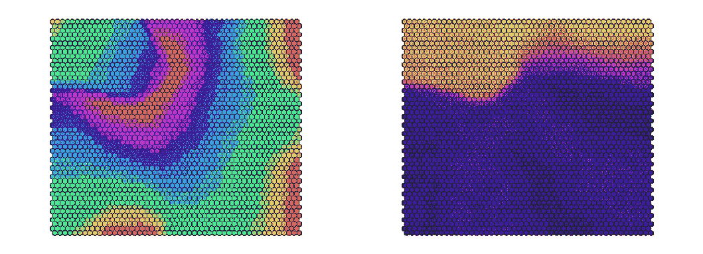
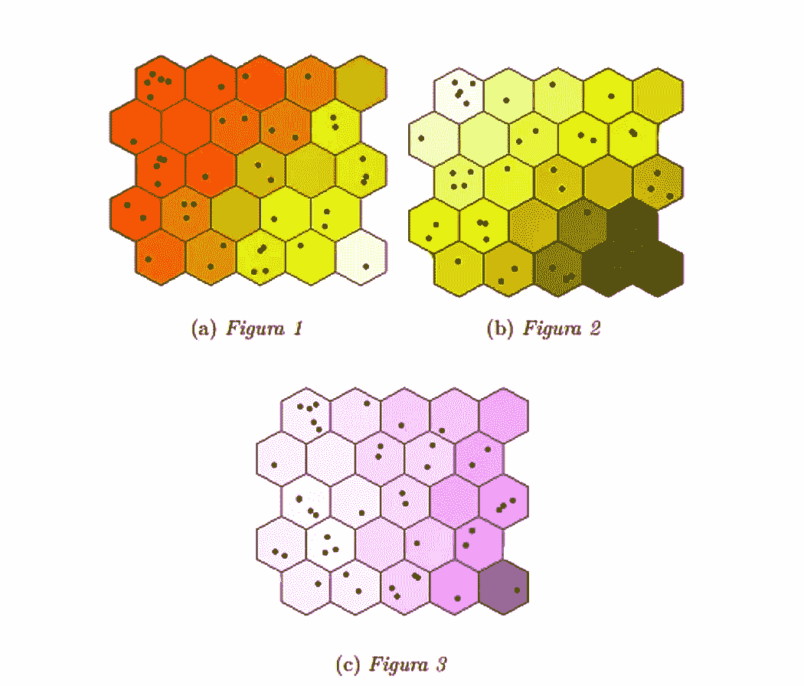

# SOM:你不知道你需要的数据科学工具

> 原文：<https://towardsdatascience.com/som-the-data-science-tool-you-didnt-know-you-need-98e7e1460112?source=collection_archive---------25----------------------->

## Som 是一种产生输入空间的低维表示的人工神经网络。

由[蒂姆·斯卡佐](https://unsplash.com/@tjscalzo?utm_source=unsplash&utm_medium=referral&utm_content=creditCopyText)在 [Unsplash](https://unsplash.com/s/photos/voronoi-taxelation?utm_source=unsplash&utm_medium=referral&utm_content=creditCopyText) 上拍摄的照片

1982 年，芬兰教授 Teuvo Kohonen 在题为“拓扑正确特征图的自组织形成”的出版物中描述了一种新算法，该算法旨在提供训练数据集样本在较小空间(通常为二维)中的表示，目的是保留初始拓扑并便于其解释。

在很短的时间内，这种被朋友们称为 SOM 的方法变得越来越成熟，这也归功于后来的研究提供了更先进和更强大的算法。

这种类型的算法属于人工神经网络类，对于现代数据科学家来说无疑是一种不可或缺的工具，因为它提供了降维、聚类和数据可视化的强大组合。

用 R 生成的图像，带有彩虹和等离子体调色板

# 它是如何工作的

在 SOM 中，训练数据集的统计单元由称为码本的 k 维向量来近似，我们将在后面看到，码本的功能与 k-means 方法中的质心的功能非常相似，不同之处在于它们被排列在平面上，以便产生规则的模式。

每个码本与矩形网格的一个单元相关联，以便允许输入空间的二维表示。

地图的构建有四个明确定义的阶段:

*   建立
*   初始化
*   培养
*   地图评估

# 建立

在设置阶段，为构建地图固定了一些基本特征，如下所列:

*   大小:地图的大小主要根据要绘制的统计单元的数量和要获得的分辨率来选择。简而言之，你必须靠自己的努力，不断尝试，直到达到满意的结果。
*   细胞形状:细胞可以是正方形或六边形。虽然这看起来无关紧要，但这个选择可以改变地图的拓扑结构，这是因为从 4 边到 6 边，或者相反，周围的环境会增加或减少。
*   地图形状:地图可以是平面的，也可以是环形的。第一种类型可以使地图在边上不规则，同时仍然保持容易解释，而第二种类型不存在结构异常，但可能更难以解释。

# 初始化

在初始化阶段，一个 k 维向量(初始码本)被分配给网格的每个单元，它可以通过两种不同的方式选择:

*   随机生成向量。
*   从数据集中随机抽取。

这两个标准是等价的，因为它们几乎总是导致相同的结果。

# 培养

在跨时代进行的训练阶段，地图越来越精确地自我组织，直到它找到自己的清晰和定义良好的拓扑结构。

在每个时期中，表示统计单元的向量被呈现给算法，其通过欧几里德距离与最相似的码本相关联。获胜的码本通过一个函数来更新，该函数考虑了与该单元的距离，对于与时期和距离本身成反比的函数进行加权，该函数被称为邻域函数。

以这种方式，最接近统计单元的码本被更新为更类似于它。而那些更远的人经历难以察觉的变化，还考虑到随着年龄的增加，更新将变得不那么显著，因此地图越来越稳定。

当码本的更新将是零或者在任何情况下都是察觉不到的时，训练被终止。

以下是细胞在训练过程中如何更新的一个非常基本的例子:

展示其工作原理的短片

# 地图质量指标

两个指标主要用于评估我们的 SOM 是否是一个好地图:

*   量化误差:它是统计单元和与之相关的码本之间距离的平均值。评估地图与初始数据的吻合程度非常有用。
*   地形误差:它是每个小区的码本和相邻小区的码本之间距离的平均值。它是平滑度的度量，用于评估地图的规则性。

# 解释

SOM 的解释是通过按照预先定义的色度标度给地图着色来进行的。

一旦变量被固定，每个单元格就根据固定组件的值进行着色。单元格越暗，变量的值越高，反之亦然。

可以对所有的 k 个变量进行这种操作，因此可以对图谱进行详尽的解释，只要想想可以识别的聚类就知道了。

# 使用示例

为了清楚起见，我提供了一个如何使用 Kohonen 地图的例子。

这些地图参考了去年一次大学考试的试卷。在这项工作中，利用联合国提供的发展和性别指标对亚洲国家进行了分析。

在本文中，我使用 SOM 来查找彼此相似的国家，并给出比其他聚类算法(如 k-means)更详细的表示。

下面我将总结一个非常简短的论文节选，我用颜色标出了性别不平等指数(GII)、人类发展指数(HDI)和性别发展指数(GDI)。

用 R 生成的图像

但要强调高级官员会议的直接作用。事实上，乍看之下，它们已经给了我们三条信息:

*   相关性:从色差中，我们立即观察到图 2 和图 3 中描述的变量之间的良好相关性，而这两者与图 1 中的变量呈负相关。
*   集群:概述了一些重要的集群，例如在左上角的单元格中可以看到由五个国家组成的集群。
*   可变性:如果色差有许多阴影，这意味着感兴趣的变量有相当大的可变性。

这个例子只是一个小小的尝试，展示了一个制作精良的地图能做些什么，尤其是当统计单位的数量呈指数级增长时。

# 最后

从给出的关于它们如何工作的简要描述中，很明显 SOM 不仅是一个非常丰富多彩和令人愉快的工具，在其他稍微无菌的统计方法中也是一个非常强大的工具，用于阅读和理解我们的数据。

在我们的分析工具中使用它当然是一个优势，因为它不经常使用，它可以提供不同的观点，并使非专家(他们可能正在阅读我们的报告)因其易于解释和迷人的美学而充满热情。

我强烈建议您深化之前所描述的内容，因为 SOM 的世界并没有就此结束，相反，它已经并将会产生越来越有趣的影响！