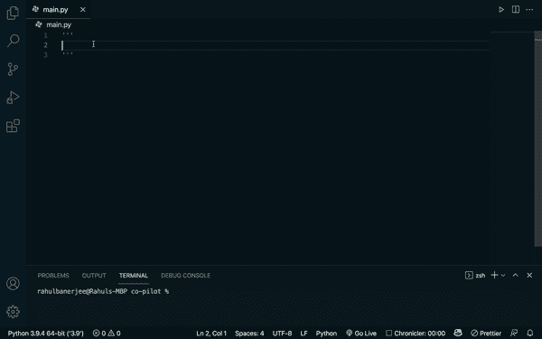
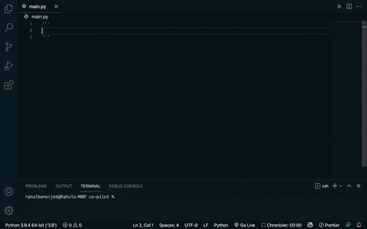
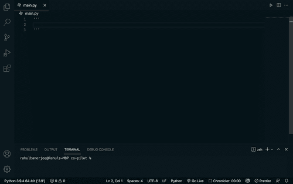

# 使用 GitHub Copilot 和 Python 的一些实验

> 原文：<https://towardsdatascience.com/some-experiments-using-github-copilot-with-python-90f8065fb72e?source=collection_archive---------3----------------------->

## 我最近拿到了 VS 代码的 GitHub Copilot 扩展，这太棒了(有点吓人)

[https://unsplash.com/photos/UT8LMo-wlyk](https://unsplash.com/photos/UT8LMo-wlyk)

查看我最近关于用 GitHub Copilot 编写测试的文章

 [## 用 AI 和 GitHub Copilot 编写更好的测试

### 生产力。Copilot 可以省去你写重复代码的麻烦，并且可以通过节省你的…

www.realpythonproject.com](https://www.realpythonproject.com/writing-better-tests-with-ai-and-github-copilot/) 

# 获取口袋妖怪数据的函数

作者 GIF

*   也能够自动完成我的评论。最初，我从未打算将它保存到 json 文件中。
*   添加了一些行内代码注释
*   使用外部库(请求)发出请求。使用 Json 保存数据。
*   自己选择了一个合适的文件名
*   能够找到数据来源，令人惊讶的是有人的 GitHub repo

# 压缩和解压缩文件的函数

作者 GIF

*   能够导入所有必要的库。虽然它确实进口了 shutil，也没用过。
*   使用 zipfile 库来解压缩/zip
*   对于第二个函数，它没有导入 zipfile 库。
*   能够使用正确的参数

# 构建 tictactoe 游戏

作者 GIF

*   生成了 64 行代码
*   能够为各种目的编写函数
*   知道 tictactoe 板的获胜组合
*   增加了错误处理
*   增加了打印语句和接受用户输入的能力
*   检查游戏结果的逻辑

尽管它编写了所有的子功能，但它从未调用它们来实际构建一个可玩的游戏

# 秘密价格

作者 GIF

*   添加了一个参数
*   使用加密 api 来获取数据
*   能够返回正确的价格列

# 构建一个 streamlit 应用程序来显示 Github Repos

作者 GIF

为此，我不得不写多条评论，这实际上就像是我在和副驾驶配对编程。然而，大部分代码是由 Copilot 生成的。

*   能够从 github api 获取数据
*   由于我提到了流行，它根据“明星”对回购进行了排序。令人难以置信的是，它是如何将“明星”与流行联系起来的。
*   它能够使用外部库 streamlit (streamlit 用于构建 web 应用程序)
*   它还添加了要在 web 应用程序中显示的标题和文本
*   它重用了以前创建的函数
*   对于大多数部分，它也是自动完成我的评论

# 一般观察

*   变量名和函数名非常容易理解
*   添加了相关的内联代码注释
*   能够使用外部库
*   能够从各种数据源获取数据
*   代码的格式很简洁，有适当的缩进和换行符
*   我花了相当多的时间(尝试不同的评论)让它实际使用 streamlit 并构建一个简单的应用程序。最后，我导入了这个库，它开始使用这个库生成代码。然而，有时它也能够自己生成代码
*   当试图获得口袋妖怪/加密数据时，它经常提出使用美丽的汤来刮数据的建议。网络抓取并不总是最好的选择，在某些情况下，你甚至可能会违反一些法律。

# 有些奇怪

*   有时候表现得很奇怪。例如，有时生成的代码包含一些其他用户的本地文件路径，例如“用户/项目/……”
*   我试图获得一个名为 api_key 的变量的建议，它实际上建议了一个带有随机键的字符串。当然，这实际上可能是随机的，但的确很奇怪。
*   有时它会产生可接受的代码。当我试图为 streamlit 生成代码时，它一遍又一遍地生成同样的两行代码
*   它有时会暗示一些不必要的进口
*   出于某种原因，它继续生成使用 Dash 的代码，尽管我特别提到了 streamlit

# 我的观点和几个问题

> 我的观点是我自己的

它肯定会提高软件开发人员的生产力。然而，我没有看到它取代一个软件开发人员。Copilot 经常生成无意义且重复的代码。它有时也没有导入必要的库。它基本上就像类固醇上的风筝或泰宁。

我能想到的一个很好的类比是谷歌翻译。它已经存在很多年了，但它并没有取代对真正翻译的需求。你可以在几秒钟内把一篇文章从英语翻译成日语。然而，你仍然需要一个精通两种语言的人来确保译文语法正确，传达与原文相同的信息。

我能想到的另一个问题是——谁将对代码负责？如果我用 GitHub 生成了一些代码，后来因为某种原因被人起诉了。我能把责任推到 GitHub 身上吗？GitHub 很可能会让用户同意一些条款和条件，以防止他们被起诉。所以我们实际上需要有经验的人来确保生成的代码可以安全使用。

虽然 GitHub Copilot 对新项目很好，但我不确定它在处理现有代码库时是否同样有用。在现有的代码库中，它必须遵循现有的编码风格，并且能够重用已经编写的代码。我没有尝试过与 Copilot 合作一个已经存在的项目，所以我不能发表太多意见

假设随着越来越多的用户使用它，它会不断地学习，它将如何区分“好”代码与“坏”或“意大利面条代码”。

# 结论

> GitHub copilot 可以保证的一件事是，它将使编码和软件在总体上更容易获得💯

你对副驾驶有什么看法？你尝试过什么酷的东西吗？你认为它将如何影响软件/数据科学行业？让我在评论中知道发布保存草稿恢复新的更改

# 资源

更多关于 GitHub Copilot 的文章

由 [Alberto Romero](https://medium.com/u/7ba6be8a3022?source=post_page-----90f8065fb72e--------------------------------) 撰写的这篇文章更深入地探讨了 GitHub Copilot

 [## GitHub Copilot——新一代人工智能程序员

### GitHub、微软、OpenAI 都达到了一个新的里程碑。

towardsdatascience.com](/github-copilot-a-new-generation-of-ai-programmers-327e3c7ef3ae) 

由 [Bex T.](https://medium.com/u/39db050c2ac2?source=post_page-----90f8065fb72e--------------------------------) 撰写的这篇文章也很值得一读

 [## OpenAI 推出 GitHub Copilot:专注于代码生成的 AI。我们现在应该担心吗？

towardsdatascience.com](/should-we-be-worried-now-that-github-copilot-is-out-12f59551cd95) 

*原载于 2021 年 7 月 5 日 https://www.realpythonproject.com***。**