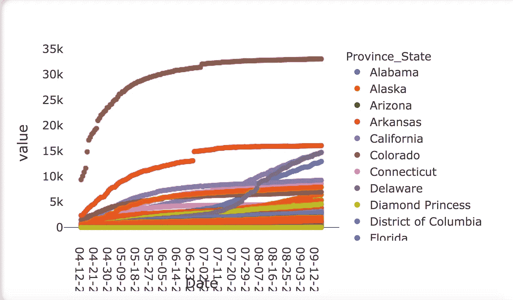

# 我在六月份发现的一些关于数据可视化的有趣文章和资源

> 原文：<https://towardsdatascience.com/some-interesting-articles-and-resources-on-data-visualisation-that-i-discovered-in-june-c00b58d15946?source=collection_archive---------29----------------------->

## 数据科学讨论

## 从网上收集的一些关于数据可视化的最新有趣文章和资源的摘要。

图片由[克里斯·马汀](https://pixabay.com/users/cmart29-3708955/?utm_source=link-attribution&utm_medium=referral&utm_campaign=image&utm_content=1885352)发自 [Pixabay](https://pixabay.com/?utm_source=link-attribution&utm_medium=referral&utm_campaign=image&utm_content=1885352)

数据科学家的工作是**很刺激**，但同时又是**很累**，因为它要求与时俱进。

**始终掌握最新技术。**因此，数据科学家必须阅读并通知自己。

在本文中，我指出了一些关于数据可视化的文章和资源，我发现它们非常有趣，您可以从中获得灵感。

# 1.探索性数据分析

EDA 是数据分析前的第一步。它允许理解数据和发现一些初步的见解。

## 1.1 自动绘图仪

Autoplotter 是一个用于探索性数据分析(EDA)的 Python 包。可以通过`pip`包管理器安装。一旦安装，你可以运行它作为一个独立的应用程序。Autplotter 允许加载数据集，并通过最常见的 Python 库(如`seaborn`)绘制数据集。

运行后，主应用程序如下图所示:

作者图片

左侧有一个菜单，您可以从中选择图。您可以在多种类型的图表和多种类型的 Python 库之间进行选择:

作者图片

所选图形显得相当幼稚，如下图:

作者图片

此外，Python 源代码无法下载。无论如何，这个库的目的是提供一个初步的 EDA，这可能是非常有用的。

要了解更多细节，您可以查看完整的库文档:

 [## 自动绘图仪

### autoplotter 是一个 python 包，用于基于 GUI 的探索性数据分析。它建立在仪表板的顶部。使用…

pypi.org](https://pypi.org/project/autoplotter/) 

## 1.2 可观察汇总表

如果你想快速浏览你的数据集，Observable 的工作人员提出了新的实验性的`SummaryTable`函数，它可以对类似 CSV 的数据进行操作。

给定一个 CSV 数据集，该函数允许快速可视化每个列的分布和一些统计数据，例如**缺失值的百分比**、**平均值**、**中值**和**标准偏差**。通过一行代码，您可以构建以下可视化:

作者图片

有关更多信息，您可以通过以下链接阅读实验性`SummaryTable`功能的官方文档:

 [## 一览表

### 编辑描述

observablehq.com](https://observablehq.com/@observablehq/summary-table) 

## 1.3 学到的第一课

> **不要花时间构建 EDA 图。您可以利用预构建的工具，这可能会加快您对数据的理解。**

# 2.数据显示

数据呈现涉及如何将数据呈现给最终受众。我发现了一些有趣的文章，可能有助于数据呈现。

## 2.1 Excel 中有趣的图表库

该资源包含许多有趣的模型，包含 Excel 中的不同图表。每个模型都有评论，可以免费下载。该图库中包含的图表展示了良好的编码知识并不是构建良好图表的必要条件。

例如，一个非常有趣的图表是美国政府的[收入和支出。该图显示了带有一些注释的时间序列。作者还解释了如何建立这样一个图表。](https://simplexct.com/how-to-create-a-bivariate-area-chart-in-excel)

对我来说，非常令人惊讶的是 Excel 允许构建非常强大的可视化，其中还包括注释和许多细节。

以下链接提供了 Excel 图表的完整图库:

 [## 我们在 simplexCT 的想法

### 了解我们对 Excel 图表主题的最新见解。

simplexct.com](https://simplexct.com/charts-in-excel) 

## 2.2 一些数据讲述(红色)图表

数据科学家初学者的主要困难之一是以正确的方式可视化数据。图表应该把观众的注意力集中在某件事情上。

Cole Nussbaumer Knaflic 是一位非常受欢迎的数据讲述影响者，他提出了一些有趣的图表，从中你可以获得绘制演示图表的想法。所有展示的图表都是用红色绘制的，在她的文章中，科尔解释了她为什么在图表中使用这种颜色。

图表做得非常好，并带有丰富的注释。其中最有趣的一张图表是[系列的第六张](https://community.storytellingwithdata.com/challenges/june-2021-reading-into-red/only-six-red-graphs)。该图包含一些注释和预测，如虚线所示。

全文可通过以下链接获得:

 [## 用数据讲故事

### 加入社会福利署社区，在您更好地讲述数据的过程中进行实践并获得支持。你对…感兴趣吗？

community.storytellingwithdata.com](https://community.storytellingwithdata.com/challenges/june-2021-reading-into-red/only-six-red-graphs) 

## 2.3 R 中的条形图动画

当你展示一个图表时，一个令人印象深刻的方面是动画。例如，**一个动画可以展示数据如何随着时间的推移而演变。** [阿比纳夫·马拉斯](https://medium.com/u/583851a34fd4?source=post_page-----c00b58d15946--------------------------------)提出了一个关于如何通过`ggplot`包用 R 语言制作条形图的教程。

作者提出了两种制作动画的策略:

*   *保持轴不变，让条形随着时间增长*
*   *带值的轴随着时间的推移自动调整。*

有关更多详细信息，您可以通过以下链接阅读全文:

 [## 条形图动画制作完全指南

### 制作两种不同风格的条形图动画的分步指南

towardsdatascience.com](/hands-on-tutorial-f2ee5dc4d0a8) 

## 2.4 在 DataWrapper 条形图中显示置信区间

当您基于已经执行的一些预测构建数据演示时，显示预测的置信区间非常重要。

DataWrapper 可以帮助你。数据包装器是一个非常流行的在线工具，它允许创建图表。该项目已经扩展到包括条形图中的置信区间。

例如，您可以构建如下所示的条形图:

作者图片

有关如何在 DataWrapper 上显示置信区间的更多详细信息，您可以阅读完整的文章:

 [## 在 Datawrapper 条形图中显示置信区间和值标记— Datawrapper 博客

### 我们希望让您能够更好地交流数据，对我们来说，“更好”也意味着“更细致入微”。使用一个…

blog.datawrapper.de](https://blog.datawrapper.de/confidence-intervals-value-markers-bar-charts/) 

## 2.5 第二个教训

> 请在你的观想中使用注释和动画！此外，如果你的观想包含一个预测，你应该增加置信区间。注释、动画和置信区间有助于观众理解图表的内容，并将注意力集中到你想要传达的内容上！

# 3.旗帜

当你建立一个可视化，选择正确的调色板是非常重要的。

## 3.1 从图像中构建调色板

Google Art & Culture 提出了一个非常有趣的在线工具[来从图像中构建调色板。首先，你必须上传一个图像，然后你选择适合你的调色板。](https://artsexperiments.withgoogle.com/artpalette/colors/bbb6b4-3362bf-6b6260-a93c3e-243c7e)

例如，我可以在工具中上传以下图像:

图片由[克里斯·马汀](https://pixabay.com/users/cmart29-3708955/?utm_source=link-attribution&utm_medium=referral&utm_campaign=image&utm_content=1885352)来自 [Pixabay](https://pixabay.com/?utm_source=link-attribution&utm_medium=referral&utm_campaign=image&utm_content=1885352)

该工具建议使用以下调色板:

作者图片

除了调色板之外，在线工具还提供一些相似的图像，即具有相同调色板的图像。

您可以通过以下链接亲自试用该工具:

 [## 谷歌艺术与文化实验——艺术调色板

### 当你用这个功能拍照时，你照片中的调色板会被发送到谷歌，以找到…

artsexperiments.withgoogle.com](https://artsexperiments.withgoogle.com/artpalette/colors/bbb6b4-3362bf-6b6260-a93c3e-243c7e) 

## 3.2 如何选择最佳的调色板

[Elena V Kazakova](https://medium.com/u/7181f38cc9e5?source=post_page-----c00b58d15946--------------------------------) 提出了一篇关于**如何选择最佳调色板**来吸引观众的有趣文章。我不想破坏这篇文章，但有些亮点可以做:

*   通过颜色，你可以**影响观众的情绪**
*   你应该选择和谐的颜色。

文章还调查了**色彩心理学研究的其他方面。**我建议您通过以下链接阅读全文:

 [## 色彩的力量

towardsdatascience.com](/the-power-of-color-be3bbe9f6bc1) 

## 3.3 第三个教训

> 当你建立观想时，不要忘记处理颜色。请不要为你的图表使用默认颜色，而是为你的观众选择正确的调色板。

# 4.另一个有趣的阅读

在这一部分，我将继续我在六月份发现的其他有趣的文章。

## 4.1 Javascript 中的甘特图

甘特图是说明项目进度的条形图。有许多工具可以用来制作甘特图。无论如何，如果你想从头开始构建图表， [Alfrick Opidi](https://medium.com/u/30d1f98a705e?source=post_page-----c00b58d15946--------------------------------) 解释了如何使用`anychart` Javascript 库构建甘特图。

对于现有的工具，您必须手动构建图表，而`anychart`库允许自动加载您的数据。因此，在开始设置图表之后，就可以加载数据了。

您可以通过以下链接阅读全文:

 [## 如何使用 JavaScript 创建简单的甘特图

### 将项目任务可视化为级联的水平条形图，甘特图在管理项目和监控方面非常有用

towardsdatascience.com](/create-javascript-gantt-chart-55ff8ec08886) 

# 摘要

在这篇文章中，我推荐了一些关于数据可视化的有趣文章和资源，这些都是我在 6 月份发现的。

总的来说，在六月份，我学到了以下关于数据可视化的东西:

*   有许多数据可视化工具:其中一些需要编码知识，另一些则不需要。你应该选择你最熟悉的工具；
*   **不要花时间去构建一个令人印象深刻的初步图表**，因为你的最终图表会改变。相反，利用一个预建的工具，它可以帮助你理解你的数据；
*   当你构建数据表示时，**使用注释、动画和置信区间**，如果你的图包含一个预测。此外，你应该**注意颜色**。

# 相关文章

 [## 数据可视化原理第 1 部分:空白、文本和颜色

### 基本图形设计原则入门。

towardsdatascience.com](/data-visualisation-principles-part-1-white-space-text-and-colour-13f520f90ce9)  [## 数据可视化原理第 1 部分 Altair 中的一个实际例子

### 关于如何在 Python Altair 中构建、定制和添加注释到简单条形图的实用教程

towardsdatascience.com](/data-visualisation-principles-part-1-a-practical-example-in-altair-b6e16f665fc6)  [## 数据可视化原理第 2 部分:布局和重点

### 基本图形设计原则入门。

towardsdatascience.com](/data-visualisation-principles-part-2-layout-and-emphasis-d682bbc38217)