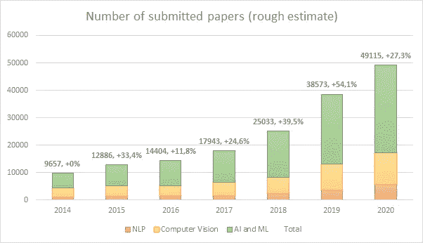
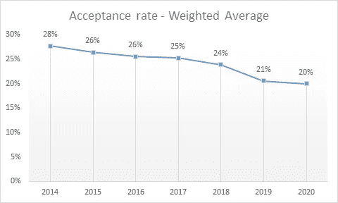
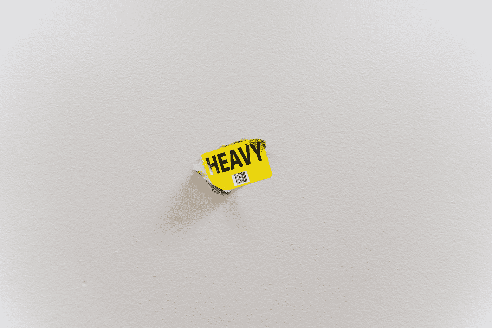

# 机器学习会议综述过程中的若干问题

> 原文：<https://towardsdatascience.com/some-issues-in-the-review-process-of-machine-learning-conferences-2c19c1eef42f?source=collection_archive---------19----------------------->

## [意见](https://towardsdatascience.com/tagged/opinion)

## 以及我们能做些什么来解决它们

由[乔舒亚·沃罗尼耶基](https://unsplash.com/@joshua_j_woroniecki?utm_source=medium&utm_medium=referral)在 [Unsplash](https://unsplash.com?utm_source=medium&utm_medium=referral) 上拍摄的照片

# 这是怎么回事？

# T 今天，我想谈谈机器学习会议 的 ***同行评议过程，我想强调一些可能破坏新知识创造的*问题。****

机器学习社区最近的成功导致提交给会议的论文数量急剧增加。这种增加使得影响这些会议目前审查进程的一些问题更加突出。审查过程有几个问题可能会破坏科学研究的本质，即完全客观、非政治化、无偏见和无不当行为(如抄袭、欺骗、不当影响和其他不当行为)。

在最近的一份预印本中，我强调了([https://arxiv.org/abs/2106.00810](https://arxiv.org/abs/2106.00810))审稿人招募、违反双盲流程、欺诈行为、数字评分偏差和附录现象(即在论文附录部分发布结果变得越来越普遍的事实)的问题。对于这些问题中的每一个，我都提供了简短的描述和可能的解决方案，目的是提高机器学习社区对这些问题的认识。

# 介绍

**由于深度学习(DL)[1]** 的成功，机器学习(ML)在过去十年中受到了极大的关注。这种兴趣导致提交给 NeurIPS、ICML、ICLR 等会议的论文数量急剧增加。相比之下，2014 年至 2020 年期间**，NeurIPS 提交的论文数量平均每年增加 34%【2，3】。**

每年在主要机器学习会议上提交的论文数量(i *作者图片，d* 此处下载数据:[https://we.tl/t-UvCS7dfIs4](https://we.tl/t-UvCS7dfIs4))。

**然而，尽管有大量的工作，这些会议的接受率多年来大致保持不变，或略有下降[2，3]** 。这一点似乎表明，这些会议与提交的数量成比例。然而，审查过程中有几个问题可能会破坏科学研究的性质，即完全客观、非政治化、无偏见和无不当行为。

部分主要机器学习会议的录取率加权平均值:EMNLP、CVPR、NeurIPS、ICML、IJCAI、AAAI(我是作者的*法师，在这里找数据*、https://we.tl/t-UvCS7dfIs4)。

# 那么，有什么问题呢？

基于这些年来接受率大致保持不变的数字，人们可能会认为 ML 会议已经很好地适应了 ML 社区所做的越来越多的工作。然而，如果这些会议多年来未能保持相同的质量标准，则之前的陈述是错误的。

**关于质量标准，我们指的是一个审查过程，该过程可以通过符合科学研究价值观**(我们在引言中提到的价值观)的合格能力来创造科学知识。然而，正如我们将在接下来的段落中指出的，有些问题并不是由于提交的论文数量较多而引起的。由于大量的工作，其中一些变得更加明显。事实上，许多研究人员最近提出了对当前审核流程的担忧，其中一些人主张对审核系统进行深刻的变革[4–10]。

现在，我提出了审查过程中的一些主要道德问题，没有任何优先顺序。这些问题是:

*   *评审人员招聘和评审经验不足*
*   *违反双盲法*
*   *投标系统中的欺诈行为*
*   *数值评定中的偏差*
*   *阑尾现象*

# **招聘审查人员，缺乏审查经验**

[Clem Onojeghuo](https://unsplash.com/@clemono?utm_source=medium&utm_medium=referral) 在 [Unsplash](https://unsplash.com?utm_source=medium&utm_medium=referral) 上拍摄的照片

能够招募到评审员在扩大会议规模方面起着很大的作用。会议，还有期刊，依靠社区来繁荣。

**然而，会议不雇佣也不支付审稿人**(即使相同的审稿人可能需要付费才能发表论文/参加会议)。因此，应该限制每位评审者要评审的论文数量。

**如果提交的论文数量增加，而审查过程的时间长度保持不变，那么很自然地，提交的论文数量增加后，审查人员也必须相应增加。**此外，我们还需要考虑一些评审员可能退休(即不想再评审)的情况:这加剧了每年需要额外评审员的影响。因此，正如我们刚刚看到的，提交论文数量的增加需要新审稿人数量的相应增加。

**然而，正如[6–8]中所指出的，合格评审员的数量增长速度要慢得多。**在[8]中，ICML 董事会主席约翰·兰福德说

> 有重要证据表明，在数年的指数增长下，机器学习中的论文审阅过程正在崩溃。

应对这种急剧增长的会议减轻了成为评论者的一些要求。在 NeurIPS 2016 中，通过要求作者提名至少一名愿意成为审稿人的作者来招募 36%的审稿人【6，9】。然而，**很大一部分(10 个中有 7 个)新评审者由博士生组成，即初级研究人员，他们可能不具备客观评估新科学研究的知识或经验**【6，9】。有时候，新来的审稿人甚至可能是硕士生。最近，ICML 2020 向公众征集自我提名的评审员[6]。

**总的来说，我们可以得出这样的结论:这种行为增加了低质量评审的可能性，其结果是在评审过程中产生了一种随意感【10】。**

不幸的是，为缺乏合格的审查人员想出一个补救办法并不容易。**一项长期行动是在学者课程中纳入一门关于审核流程的必修课。许多大学都要求学生互相评估，部分做到了这一点，但不幸的是，博士生并不总是这样。[4]中最近提出了一个类似的建议，其中建议在复习中包括导师。事实上，**最近在 NeurIPS 2020 上举办的研讨会似乎表明了指导学者产生高质量评论的有效性。****

# **违反双盲法**

大多数会议，如果不是全部的话，允许作者在 arXiv 等公共网站上发布预印本。有时作者甚至会在公共存储库(例如 GitHub)上发布他们算法的代码。因此，这些行动打破了双盲审查过程。

安特·汉默斯米特在 [Unsplash](https://unsplash.com?utm_source=medium&utm_medium=referral) 上的照片

> **打破双盲性质导致审查过程中的偏倚。在[12]中，他们发现了录取率和 arXiv 上发表的高声誉论文之间正相关的统计证据，**上的声誉是基于谷歌学术引用的数量。

此外，总是在[12]中，他们指出**不太自信的评论者可能倾向于给知名作者高分，给不太知名的作者低分。虽然他们的分析没有显示出因果关系，但这表明确实存在正相关。**如果像 arXiv 这样的网站允许作者匿名发表他们的作品，这个问题可以得到部分解决，正如[12]** 中所提议的。在极端的情况下，人们也可以禁止预印本的出版。这项禁令可能会降低新知识的传播速度。然而，这将导致一个纯粹的双盲审查过程，有助于减少偏见。**

# **投标系统中的欺诈行为**

杰弗逊·桑托斯在 [Unsplash](https://unsplash.com?utm_source=medium&utm_medium=referral) 上拍摄的照片

如今，大规模的 ML 会议采用竞价系统，让评论者选择他们想要评论的论文。

> 然而，**竞价系统可能会导致评审员之间达成协议**(交换安排)，目的是提供正面或负面的评审。**同样，审稿人也可能为了自己的利益，试图故意拒绝自己不喜欢的论文。**

不幸的是，这种行为在学术界并不罕见。2019 年 6 月 13 日，其论文即将在凤凰城 ISCA 2019 发表的博士生陈在佛罗里达大学的校园大楼内上吊自杀[13，14]。这名学生留下了一张纸条，说他拒绝继续从事学术欺诈行为，并指责他的导师李涛博士[14]。

ACM-IEEE 联合调查委员会已经启动了一项调查，确定“没有证据表明论文审查过程中存在不当行为。”[14].然而，正如在[13]中指出的，向辉的笔记本电脑包含了不止一个会议的大部分提交内容，以及去匿名的评论和讨论，这一事实令人不安和麻烦。在[13]中，他们总是指出“另一个 ACM SIG 社区存在串通问题，其中调查人员发现一组 PC 成员和作者串通投标和推送彼此的论文，违反了通常的利益冲突规则”[13]。

**在【15】中，Langford 提出了鱼雷审查的问题，即**

> 如果一个研究方向是有争议的，几百个评论者中只有 2-3 个人反对，这 2-3 个人可以竞标论文，给它糟糕的评论，并阻止发表。无限期地重复下去，这就给了一个群体中 2 或 3 个最保守的成员扼杀新的研究方向的权力，潜在地大大阻碍了整个群体的进步。

**总是在[15]兰福德指出，鱼雷检阅可能不是幻想。有时人们倾向于对他们想要拒绝的论文进行投标，“理论上拒绝比可能接受更容易”。**

> **另一个问题是理性欺骗【17】，审稿人倾向于拒绝与他们自己的作品竞争的论文**。

在[16]中，他们分析了人们在竞争性同行评审中的策略行为，认为“*竞争激励评审者采取策略行为，这降低了评价的公平性和裁判之间的共识*。”

所有这些行为似乎都是人类本性的一部分。作为人类，我们倾向于优先考虑我们的生存机会。因此，有人可能会争辩说，人类天生倾向于个人利益而不是集体利益，这导致了有组织的个人小团体中恶意模式的产生。为了解决这些问题，会议可能在审查过程中采用随机化。

**随机选择审稿人将有助于减少恶意审稿人获得他/她想要审阅的论文的可能性。**然而，随机化可能会导致审查过程的质量下降，因为作者将无法对他们有能力的论文进行投标。该解决方案在[11]中进行了进一步的研究，作者提出了一种随机化审查过程的算法。

# **数值评定中的偏差**

约书亚·戈尔德在 [Unsplash](https://unsplash.com?utm_source=medium&utm_medium=referral) 上拍摄的照片

审查者在他们的审查中必须为他们审查的每篇论文提供一个数字评级，以及一个置信度得分。

> **众所周知，人们很难将观点映射到一个数字上**【18】。

此外，正如【20】**中指出的，数字评级的另一个问题是选择偏差**【19】。

> **选择偏差(Selection bias)是指导致平均评分有正向倾斜趋势的现象。**

这个想法是“用户可能会选择已经排名靠前的实体来表达意见和评级”[20]。这与之前讨论的观察结果一致，即接受率和高声誉的预印本之间存在正相关[12]。

**在评审过程中，评审者在反驳期间可能会受到其他评审的态度/评论的影响。这也被称为从众偏差，**这是一种遵从群体意见的愿望[21–23]，即使存在压倒性的相反证据[23]，这种愿望也会持续存在。因此，不太自信的评审者可能被诱导去遵从更自信的评审者的意见。

**如【18】中所建议的，评审者可能会被要求进行比较或排名**，而不是提供数字评级。为了解决从众偏差的问题，可以使用让多组评审员评审同一篇论文的想法，其中每组评审员彼此不了解。**然后，评审可能会被随机化，区域主席将根据这些随机化的评审做出决定。**

# **阑尾现象**

照片由 [Keagan Henman](https://unsplash.com/@henmankk?utm_source=medium&utm_medium=referral) 在 [Unsplash](https://unsplash.com?utm_source=medium&utm_medium=referral) 拍摄

> 最后，但同样重要的是，ML 会议中的一个关键问题是结果的主要部分出现在附录中。

**这就是我所说的阑尾现象。**

会议通常是快速传播研究成果的场所，但论文数量的急剧增加导致了一场军备竞赛，作者倾向于以滥用附录为代价撰写更全面的论文。

这可能会导致评审者要求更多的工作，因为全面性的标准不断提高。此外，众所周知，大多数审查者倾向于不审查补充材料。**事实上，大多数结果没有得到审查，这对知识的传播和 ML 社区的发展构成了巨大的威胁。**

**一个快速有效的解决办法是限制提交给会议的页数或者限制附录的页数。作者应该能够在有限的页数内陈述他们的结果。如果这是不可能的，那么作者应该考虑将论文提交给期刊。**

也许曼梯·里社区对诉讼给予了太多的信任。

# 结论

不幸的是，ML 社区是高度分散的，由几个具有不同背景、使用不同方法的子社区组成。这可能是研究人员经常不能互相理解的原因。正如[24]中所指出的，由于背景的差异，论文经常被分配给彼此不理解的人，增加了审查过程是随机的这种感觉。然而，我们必须联合起来解决这个问题。

显然，所有这些问题都应该得到比这里更多的篇幅。这篇文章的目标是强调 ML 社区目前面临的一些问题，并提高研究者对这些问题的认识。

感谢您的阅读！

## 参考

1.  印第安纳州古德费勒、纽约州本吉奥、库维尔和纽约州本吉奥，2016 年。深度学习(第 1 卷№2)。剑桥:麻省理工学院出版社。
2.  Charrez D，2019。NeurIPS 2019 年统计。网址:[https://medium . com/@ dcharrezt/neur IPS-2019-stats-c 91346d 31 c8 f](https://medium.com/@dcharrezt/neurips-2019-stats-c91346d31c8f)(2021 年 3 月 29 日访问)。
3.  主要 AI 会议接受率统计，Lixin4ever。Github，2021。网址:[https://github.com/lixin4ever/Conference-Acceptance-Rate](https://github.com/lixin4ever/Conference-Acceptance-Rate)(2021 年 3 月 29 日访问)。
4.  2021 年在大型 ML 会议(如 ICML、NeurIPS)上改进审查流程的想法。[https://docs . Google . com/document/d/1j 7 Mn 2 zkquszwj _ ezxdxbp 3 z _ JQtrSeUa-CQ 0 gotauyw/edit](https://docs.google.com/document/d/1j7Mn2ZkquSzWJ_EzxdXBP3z_JQtrSeUa-CQ0gotAuYw/edit)(2021 年 3 月 29 日访问)。
5.  麦库克，2006 年。同行评议坏了吗？投稿数量增加，审稿人负担过重，作者对顶级期刊的流程提出了一个又一个的投诉。同行评议怎么了？。《科学家》,第 20 卷第 2 期，第 26-35 页。
6.  Stelmakh，I .，Shah，N.B .，Singh，a .和 Daumé III，h .，2020 年。新手审稿人实验，解决大型会议中合格审稿人不足的问题。arXiv 预印本 arXiv:2011.15050
7.  d .斯卡利，Snoek，j .和 a .威尔特施科，2018。避免同行评审过程中的公地悲剧。arXiv 预印本 arXiv:1901.06246
8.  j . Langford(2018 年)。当泡沫破裂时…[https://hunch.net/?p=9604328](https://hunch.net/?p=9604328)(2021 年 3 月 30 日访问)。
9.  n . b . shah，b . tabi bian，b . Muandet，k . Guyon，I .和 Von Luxburg，u .，2018。NIPS 2016 审核流程的设计和分析。机器学习研究杂志。
10.  Tran，d .，Valtchanov，a .，Ganapathy，k .，Feng，r .，Slud，e .，Goldblum，m .和 Goldstein，t .，2020 年。Open Review 的公开评论:机器学习会议评论过程的批判性分析。arXiv 预印本 arXiv:2010.05137。
11.  Jecmen，s .，Zhang，h .，Liu，r .，Shah，N.B .，Conitzer，v .和 Fang，f .，2020。通过随机分配评审员来减少同行评审中的操纵。arXiv 预印本 arXiv:2006.16437
12.  巴拉德瓦赫、图尔平、加尔格和安德森，2020 年。在双盲审查期间通过 arXiv 提交对作者进行去匿名化。arXiv 预印本 arXiv:2007.00177
13.  T.维贾伊库马尔。ACM/IEEE 计算机体系结构会议中潜在的有组织欺诈。[https://medium . com/@ tnvijayk/potential-organized-fraud-in-acmieee-computer-architecture conferences-CCD 61169370d](https://medium.com/@tnvijayk/potential-organized-fraud-in-acmieee-computer-architectureconferences-ccd61169370d)，2020 年(2021 年 3 月 30 日访问)。
14.  向辉五世，2020。证据对 IEEE/ACM 的调查提出了质疑。[https://huixiang voice . medium . com/evidence-put-questions-on-the-IEEE-acms investigation-991 a6 d 50802 a](https://huixiangvoice.medium.com/evidence-put-doubts-on-the-ieee-acmsinvestigation-991a6d50802a)(2021 年 3 月 30 日访问)。
15.  约翰·兰福德。投标问题，2008 年。[https://hunch.net/?p=407](https://hunch.net/?p=407)(2021 年 3 月 30 日访问)。
16.  Balietti，s .，Goldstone，R.L .和 Helbing，d .，2016 年。艺术展览游戏中的同行评议与竞争。美国国家科学院学报，113(30)，第 8414-8419 页。
17.  巴罗加基金会，2014 年。通过抑制同行评议中的“理性欺骗”维护科学交流的完整性。韩国医学杂志，29(11)，第 1450 页
18.  Sparling，e . I . & Sen，S. (2011 年)。评分:难度如何？。第五届 acm 推荐系统会议录。RecSys '11，(第 149-156 页)。纽约:ACM。
19.  n .达尔维、r .库马尔、b .庞(2013 年)。准“正常”活动:关于平均评级的分布。第七届网络日志和社交媒体国际 AAAI 会议论文集，(第 110-119 页)。
20.  Centeno，r .，Hermoso，r .和 Fasli，m .，2015 年。数字评分的不准确性:处理社会网络中的偏见意见。信息系统前沿，17(4)，第 809-825 页。
21.  高、埃格尔、库兹涅佐夫、古列维奇和姚蜜，2019 年。我的反驳重要吗？来自一个重要的 NLP 会议的见解。arXiv 预印本 arXiv:1903.11367
22.  Buechel，b .，Hellmann，t .和 Kl ner，s .，2015 年。整合下的意见动力与智慧。经济动态与控制杂志，第 52 期，第 240-257 页。
23.  所罗门·E·阿希。1951.群体压力对修改和扭曲判断的影响。团体、领导和男人，第 177-190 页。
24.  Sagun，Levent 等人，“深度学习中的科学与工程的研讨会后报告，NeurIPS 2019，温哥华。”arXiv 预印本 arXiv:2007.13483 (2020)。