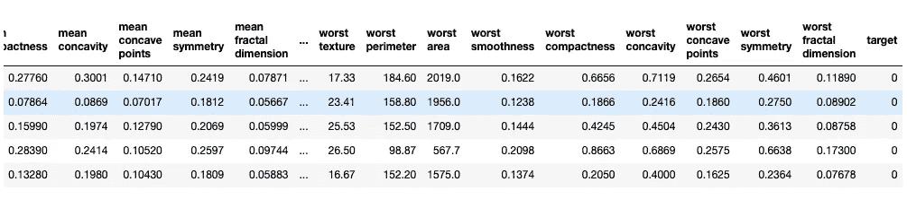
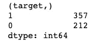
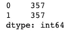
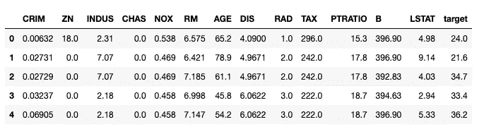
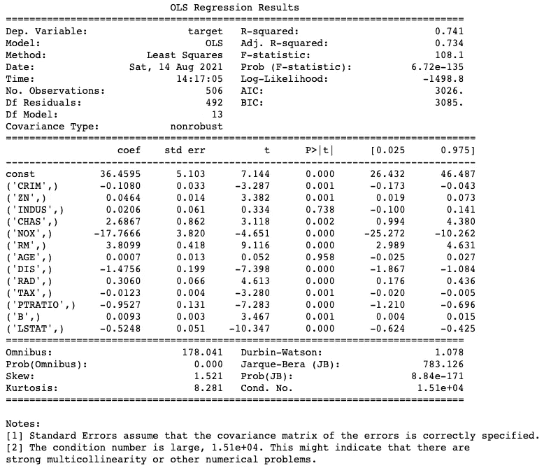
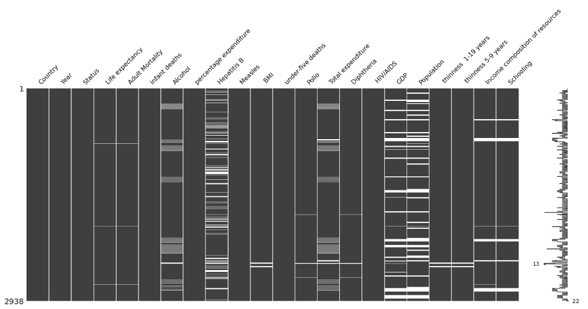

# 一些鲜为人知的数据科学库

> 原文：<https://towardsdatascience.com/some-lesser-known-data-science-libraries-18314b1ea43d?source=collection_archive---------23----------------------->

## 以及如何在 python 代码中使用它们…


图片由[皮沙贝](https://pixabay.com/?utm_source=link-attribution&utm_medium=referral&utm_campaign=image&utm_content=3198500)的[格哈特 G.](https://pixabay.com/users/blende12-201217/?utm_source=link-attribution&utm_medium=referral&utm_campaign=image&utm_content=3198500) 拍摄

**简介**

你从事数据科学已经有一段时间了吗？现阶段你一定很了解熊猫、scikit-learn seaborn、matplotlib。

如果你想扩展你的视野，学习一些不太出名但同样有用的库，你就在一个好地方。在本文中，我将向您展示一些鲜为人知的 python 中的数据科学家库。

让我们开始吧。

**不平衡学习**

如果你过去一直在构建一些有监督的机器学习模型，你会知道目标变量中的类别不平衡可能是一个大问题。这是因为在少数类中没有足够的样本供算法学习模式。

一种解决方案是创建一些合成样本，通过使用例如 SMOTE(合成少数过采样技术)来扩充用于学习的少数类。

幸运的是*不平衡学习*库将帮助你在任何不平衡数据集上实现这一技术。

您可以通过在终端中运行以下命令来安装*不平衡学习*库。

```
pip install imbalanced-learn
```

为了演示平衡数据集，我们将从 sci-kit 学习库中下载一个乳腺癌数据集。

```
from sklearn.datasets import load_breast_cancer
import pandas as pddata = load_breast_cancer()
df = pd.DataFrame(data.data, columns=[data.feature_names])
df[‘target’] = data[‘target’]
df.head()
```



现在让我们看看目标变量的分布。

```
df.target.value_counts()
```



该数据集确实是均匀分布的，尽管它并没有严重失衡:我们有 357 名乳腺癌患者和 212 名健康患者。

让我们看看我们是否能使它更平衡一点。我们将使用 SMOTE 对 0 类进行过采样。

```
from imblearn.over_sampling import SMOTEoversample = SMOTE()
X_oversample, y_oversample = oversample.fit_resample(data.data, data.target)
pd.Series(y_oversample).value_counts()
```



如你所见，数据集现在完全平衡了。每个类有 357 个实例。由于我们的操作，创建了 145 个人工实例。

**统计模型**

这是另一个特别为构建统计模型而设计的伟大的库。我通常用它来拟合线性回归

它真的很容易使用，你马上就可以得到许多关于模型的信息，如 R2 BIC，AIC，系数，以及它们相应的 p 值。当使用 scikit-learn 中的线性回归时，此信息更难获取。

让我们看看如何使用这个库来拟合线性回归模型。让我们先下载一个波士顿房价数据集。

```
from sklearn.datasets import load_boston
import pandas as pddata = load_boston()
df = pd.DataFrame(data.data, columns=[data.feature_names])
df[‘target’] = data[‘target’]
df.head()
```



上面是我们数据集的前五行。有十三个特征，我们可以看到目标变量是一个连续的数字。这是一个完美的回归数据集。

现在让我们使用 pip 安装统计模型库

```
pip install statsmodels
```

现在，我们可以使用下面的代码尝试将线性回归模型拟合到我们的数据中。

```
import statsmodels.api as sm
X = sm.add_constant(df.drop(columns=[‘target’])) # adding a constantmodel = sm.OLS(df.target, X).fit()
predictions = model.predict(X)print_model = model.summary()
print(print_model)
```



如您所见，我们刚刚将线性回归模型拟合到该数据集，并打印了该模型的详细摘要。您可以非常轻松地阅读所有重要信息，必要时重新调整您的功能，然后重新运行模型。

我发现与 scikit-learn 版本相比，使用 stats 模型进行回归更容易，因为我需要的所有信息都在这个简短的报告中提供了。

**缺失编号**

另一个有用的库是 missingno。它帮助您可视化缺失值的分布。

您可能习惯于使用 isnull()函数检查 pandas 中缺失的值。这有助于您获得每一列中缺失值的数量，但不能帮助您确定它们在哪里。这正是 missingo 变得有用的时候。

您可以使用以下命令安装该库:

```
pip install missingno
```

现在让我们演示如何使用 missingo 来可视化丢失的数据。为了做到这一点，我们将从 Kaggle 下载[预期寿命数据集](https://www.kaggle.com/kumarajarshi/life-expectancy-who)。

然后可以使用 read_csv()函数加载数据集，然后从 missingno 库中调用 matrix()函数。

```
import pandas as pd
import missingno as msnodf = pd.read_csv(‘Life Expectancy Data.csv’)
msno.matrix(df)
```



因此，您可以看到丢失值的位置。如果您怀疑丢失的值在某个特定的位置或遵循某个特定的模式，这将非常有用。

**总结**

在本教程中，您已经学习了如何使用一些鲜为人知的数据科学库。具体来说，您学到了:

*   如何使用 SMOTE 技术和*不平衡学习库*平衡数据集
*   如何使用*统计模型、*进行线性回归
*   以及如何使用 missingno 可视化缺失值。

我希望你能在实践中运用你在实践中所学到的东西。编码快乐！

*最初发表于 aboutdatablog.com:* [一些鲜为人知的数据科学库以及如何用 python 代码使用](https://www.aboutdatablog.com/post/some-lesser-known-data-science-libraries-and-how-to-use-them-with-python-code)*2020 年 8 月 15 日。*

*PS:我正在 Medium 和*[](https://www.aboutdatablog.com/)**上撰写深入浅出地解释基本数据科学概念的文章。你可以订阅我的* [***邮件列表***](https://medium.com/subscribe/@konkiewicz.m) *每次我写新文章都会收到通知。如果你还不是中等会员，你可以在这里加入**[***。***](https://medium.com/@konkiewicz.m/membership)**

**下面还有一些你可能喜欢的帖子**

**[](/top-8-magic-commands-in-jupyter-notebook-c1582e813560) [## Jupyter 笔记本中的 8 大魔法命令

### 通过学习最有用的命令来提高您的生产力

towardsdatascience.com](/top-8-magic-commands-in-jupyter-notebook-c1582e813560) [](/9-things-you-did-not-know-about-jupyter-notebook-d0d995a8efb3) [## 关于 jupyter 笔记本你不知道的 9 件事

### 用这些建议提高你的工作效率

towardsdatascience.com](/9-things-you-did-not-know-about-jupyter-notebook-d0d995a8efb3) [](/top-9-jupyter-notebook-extensions-7a5d30269bc8) [## 9 大 Jupyter 笔记本扩展

### 改进笔记本电脑功能，提高您的工作效率

towardsdatascience.com](/top-9-jupyter-notebook-extensions-7a5d30269bc8)**