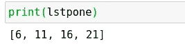
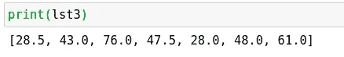

# Python 3.9 中的一些重要函数

> 原文：<https://towardsdatascience.com/some-magnificent-functions-in-python-3-9-705c2970795b?source=collection_archive---------8----------------------->

## Python 编程语言中我最喜欢的一些函数。


(src =[https://pixabay.com/images/id-3597101/](https://pixabay.com/images/id-3597101/)

# 介绍

Python 编程语言本身就包含了许多奇妙的函数和工具，以及标准库中一些令人敬畏的功能。这使得 Python 本身成为一种非常通用的语言，而不需要像其他语言那样依赖于依赖关系。在过去，我已经讨论了一些我最喜欢的 Python 模块，它们包含在标准库中，如果您想阅读我这样做的一些文章，您可以在这里查看我关于这个主题的上一篇文章:

[](/15-more-surprisingly-useful-python-base-modules-6ff1ee89b018) [## 15 个非常有用的 Python 基础模块

### 忘记依赖性，使用标准库！

towardsdatascience.com](/15-more-surprisingly-useful-python-base-modules-6ff1ee89b018) 

然而，尽管这些工具很有用，实际的语言本身仍然有更多的乐趣。Python 编程语言中包含了许多非常有用的函数，这些函数在许多不同的场景中都非常有用。对于数据科学家来说尤其如此，因为许多这些操作在迭代观察列表上工作得非常好。

> [笔记本](https://github.com/emmettgb/Emmetts-DS-NoteBooks/blob/master/Python3/Cool%20Python%20Functions.ipynb)

# №1:地图()

map 函数将给定的函数应用于 iterable 的每个元素。这对于快速有效地处理列表非常有用，甚至不需要编写 for 循环。我们将在下面的列表中使用 map()。

```
lst = [5, 10, 15, 20]
```

接下来，我们必须创建一个函数，我们希望每个元素都通过它。需要记住的一件重要事情是，我们将只能接受一个没有默认值的位置参数，否则映射将不起作用！

```
def addone(x):
    return(x + 1)
```

在我的例子中，我只是简单地给列表中的每个元素添加一个，但是如果你愿意的话，这些函数肯定会变得非常复杂。这里最大的障碍肯定是无法添加参数。但是，您总是可以从映射函数内部调用提取的方法来获取您可能需要的数据。除此之外，您将依赖于函数中设置的默认值。现在，我们将使用以下内容创建新地图:

```
lstpone = map(addone, lst)
```

您会注意到这个新对象的类型很可能是 map 类。为了改变这一点，我们可以简单地将一个相应的类型投射到我们的地图上，比如 list:

```
lstpone = list(map(addone, lst))
print(lstpone)
```



(图片由作者提供)

很容易看出，在 Python 中处理数据时，这样的东西可能会派上用场。同样，编写一个提取的 map()函数比用一些嵌套的 for 循环来执行算术要干净和简洁得多。我写了一篇关于抽取的整洁的文章，以及为什么作为程序员它是如此伟大的实践，如果你对这样一个概念感兴趣，它当然值得一读，如果你愿意，你可以在这里查看这个主题的更详细的内容:

[](/more-methods-means-better-code-1d3b237f6cf2) [## 更多的方法意味着更好的代码

towardsdatascience.com](/more-methods-means-better-code-1d3b237f6cf2) 

# №2:zip()函数

Python 附带的另一个非常酷的函数是 zip()函数。大多数 Python 程序员可能都有过使用这个函数的经历，但是对于那些以前没有使用过这个强大函数的人来说，它确实值得一提。zip 函数从多个可迭代对象中创建一个新的迭代器，并允许在同一个循环中同时迭代不同列表中的多个元素。不用说，这对于比较两个组或者对特征执行某种程度的算术运算是非常有用的。

我们将在本例中使用以下列表:

```
lst1 = [23, 28, 43, 23, 23, 94, 32]lst2 = [34, 58, 109, 72, 33, 2, 90]lst3 = []
```

我们将得到每个匹配元素之间的平均值列表，方法是将这两个元素压缩在一起，然后在将新的平均值添加到空列表 lst3 之前计算每个周期的平均值。然而，首先我们需要写一个函数来计算我们的平均值:

```
def mu(x): return(sum(x) / len(x))
```

现在我们将使用 zip()函数编写一个简单的 for 循环，如下所示:

```
for one, two in zip(lst1, lst2): lst3.append(mu([one, two]))
print(lst3)
```



(图片由作者提供)

很容易理解为什么这样的东西对处理数据很有价值。跨多个特性进行迭代是一种您很容易发现自己所处的场景，所以这个解决方案肯定是一个很好的想法。我正好有一篇关于 Python 的 zip()函数的更深入的文章，当然值得一读。如果你以前从未看过，你可以在这里查看:

[](/everything-you-need-to-know-about-zip-in-python-5da1416f3626) [## 关于 Python 中的 Zip，您需要了解的一切

towardsdatascience.com](/everything-you-need-to-know-about-zip-in-python-5da1416f3626) 

# №3:超级()

super()函数是 Python 编程语言基础中另一个非常有用的特性。这个函数比其他两个函数更加 Pythonic 化，并且允许子类引用它们的父类作为“super”这很有用的第一个原因是，我们可以避免显式使用基类，换句话说，我们可以控制是引用父类还是子类。另一个派上用场的地方是当我们处理多个子类和大量继承时。让我们考虑下面的类:

```
class Noodle(object): def __init__(self, name): print(name)
```

这个类继承自 object，Python 中的所有其他类也是如此。现在让我们为这种新的面条类型创建一个子类:

```
class Spaghetti(Noodle): def __init__(self): pass
```

在第一个例子中，我们只在这个类的初始化函数中使用 pass。因为这个类是意大利面条，我们不想把它标记为意大利面条，但是我们仍然希望它在初始化时打印出意大利面条。为了在这种情况下不做任何工作就打印出它的名字，我们可以在初始化函数中调用超级函数，同时调用父函数的初始化。

```
super().__init__("Spaghetti")
```

注意，现在两个类都将在初始化时打印它们的名字，如果没有这个调用就不会这样。当然，这并不是唯一的单继承情况，在这种情况下需要注意这个有用的函数。这个功能在很多不同的场景下肯定能派上用场，所以绝对值得熟悉一下！

# №4:哈希()

在 Python 中，hash()函数用于返回对象的哈希值。哇，这是一个相对容易使用的方法，我认为它值得包括在内，因为有时看起来很有趣。哈希是一个有符号的整数，用于表示给定值。该函数将一个对象作为参数，例如字符串“Hello”:

```
print(hash(“ Hello”))-7944160827638463773
```

# №5:格式()

format 方法可用于返回由格式说明符控制的对象的格式化表示形式。这些方法调用对象的内部 __format__()函数。这个方法有两个参数，第一个是我们想要格式化的值，第二个是格式规范。有关说明符的完整列表，您可以查看此页面:

 [## PyFormat 使用%和。格式()为大好事！

### Python 有很棒的字符串格式化器已经很多年了，但是关于它们的文档太理论化了…

pyformat.info](https://pyformat.info/) 

总之，在这个例子中，我将把一个有符号的整数转换成二进制数:

```
print(format(1392391237, "b"))
1010010111111100011010001000101
```

我知道我之前说过有符号整数，但是这个整数要么没有符号，要么没有符号。我们可以通过将它转换为一个列表，然后将长度除以 8 来判断这一点:

```
print(len(list(format(1392391237, "b"))) / 8)3.875
```

当然，如果这是数字的真正二进制数，它将被 4 整除，所以我认为 Python 的格式只是省略了二进制数的符号部分，这是值得注意的—这很奇怪。

# №6:枚举()

对于 Python 中的循环来说，一个非常有用的工具是 enumerate()函数。这个函数可用于在一个简单的调用中轻松地向循环添加计数器。这对于标注字典，调用索引，各种各样的事情都很有用！并允许您这样做，而无需在循环之外创建计数器并添加计数器。我们可以用它来完成与 zip 循环基本相同的事情，例如:

```
for i, w in enumerate(lst1): lst2[i] += w
```

这将修改我们正在枚举的索引，并添加到我们的 lst1 列表中的当前迭代中。

```
print(lst2)[57, 86, 152, 95, 56, 96, 122]
```

# №7:内存视图()

你有没有好奇过计算机实际上是如何存储数据的？您可以通过查看 Python 中的 memoryview()函数来了解更多信息！这将允许我们查看代表 Python 对象中字符的字节缓冲区。考虑以下字符串:

```
lstmem = memoryview(bytearray(lst2, "utf-8"))print(list(lstmem))[104, 101, 108, 108, 111, 33]
```

这些是放入列表中的字符串中字符的单独表示。这听起来可能没什么用，但它可以用来制作浮点编码器。然而，你总是可以转换成 float 类型。不管怎样，我认为这是一个非常有趣和酷的方法！

# 结论

在过去几年中，Python 已经成为数据科学工作的重要资产，这是有充分理由的。虽然 Python 确实有它的缺点，但它有一个强大的生态系统，一个古老的代码库，甚至还有一个奇妙的标准库。这些是一些非常简单和众所周知的 Python 函数，但是我认为特别是对于初学者，或者那些想要更多地了解这些函数的人，这篇文章肯定会派上用场。非常感谢您阅读我的文章！