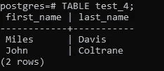
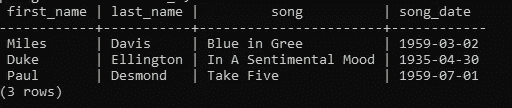

# 关于 SQL DDL、SQL DML、一致性和性能指数的一些提示

> 原文：<https://towardsdatascience.com/some-tips-on-sql-ddl-sql-dml-costintency-and-performance-index-1364230b8a70?source=collection_archive---------36----------------------->

## 开始掌握 SQL 并构建自己的数据模型


吉列尔莫·费拉在 [Unsplash](https://unsplash.com/s/photos/universe?utm_source=unsplash&utm_medium=referral&utm_content=creditCopyText) 上拍摄的照片

当有人想进入数据分析领域时，最大的错误之一是低估了 SQL 的能力，以及在您的数据专业职业生涯中掌握这一技能的重要性。在本文中，我将重点介绍一些能够真正帮助您提高对 SQL 的理解的技巧。这篇文章将分为以下几个主题:

*   SQL 数据定义语言
*   SQL 数据操作语言
*   约束的一致性和索引的性能

如果你是 SQL 新手，建议你先从基础做起，再看这篇文章。在网上，有许多关于 SQL 基础知识的资源，但是如果你愿意，你可以通过阅读以下三篇文章来跟随我的 SQL 教程:

*   [开始使用 PostgreSQL 的一些重要概念](/some-important-key-concepts-to-start-using-postgresql-c6de63ab683f)
*   [借助 SQL 和 ERD 处理多个表](/working-with-multiple-tables-thanks-to-sql-and-erd-9cb5dcb99228)
*   [窗口函数和 SQL 的其他概念](/window-functions-and-other-concepts-of-sql-d53ca756e254)

所以，如果你准备好了，让我们开始吧！

## 第一部分:SQL 数据定义语言

对于数据定义语言，我指的是当您想要创建、更改、删除或截断一个表时所必需的所有方面。换句话说，创建和修改表结构所需的一切。

首先，需要识别数字、整数、小数、文本、日期/时间等不同的数据类型。我将在本文中考虑的数据库管理系统是 Postgres，所以如果你想安装它，请查看本文。

关于 Postgres 中的数字数据类型，我们有一堆不同的数字类型，比如 SMALLINT、INTEGER、BIGINT、DECIMAL、Numeric、REAL、DOUBLE PRECISION、SMALLSERIAL、SERIAL 和 BIGSERIAL。现在你可能会问自己它们之间的区别是什么，以及如何才能理解最适合你的情况。

不要担心，这些数据类型很多都是相似的，现在我将向您展示。

SMALLINT、INTEGER、BIGINT 之间的唯一区别是可以存储的数字的给定范围。低于您可以为每种类型存储的数量的维度。

SMALLINT:-32768 到+32767

整数:-2147483648 到+2147483647

BIGINT:-9223372036854775808 到+9223372036854775807

因此，如果我需要存储一个大于 32K 或小于-32K 的数，我会更喜欢使用 INTEGER 或 BIGINT。

另一个有趣的类型是以下三种类型:

小型串行:1 到 32，767

序列号:1 至 2，147，483，647

大序列:1 到 9，223，372，036，854，775，807

正如你所注意到的，它们都没有负值，它们从 1 开始。关于序列类型的另一个重要考虑是，每次在表中添加一个新行时，Postgres 默认会通过递增上一个序列来自动添加下一个序列。

假设您有这三个表 test_1、test_2 和 test_3。

```
CREATE TABLE **test_1** (
"id" SMALLINT,
"Test_Number" SMALLINT,
"First_Name" VARCHAR(30),
"Last_Name" VARCHAR(30));CREATE TABLE **test_2** (
"id" INT,
"Test_Number" INT,
First_Name" VARCHAR(30),
"Last_Name" VARCHAR(30));CREATE TABLE **test_3** (
"id" SERIAL,
"Test_Number" INT,
"First_Name" VARCHAR(30),
"Last_Name" VARCHAR(30));
```

现在我想插入这些值:60000，'英里'，'戴维斯'。我们将逐步看到每个表的不同输出。对于第一个表:

```
INSERT INTO test_1 VALUES (1, 60000, ‘Miles’, ‘Davis’); 
```

出局:

```
ERROR: smallint out of range
```

正如您注意到的，我们收到了一个错误，因为我将 SMALLINT 设置为表 test_1 的数据类型。

相反，如果我们再次尝试，对于第二个表 test_2，输出将是正确的，因为列“Test_Number”的数据类型现在是 INT，其范围比以前更大。

```
INSERT INTO test_2 VALUES (1, 60000, ‘Miles’, ‘Davis’);
```

假设我们已经在表中插入了值(6000，' Miles '和' Davis ')，然后我们想插入第二行的值(70000，' John '和' Coltrane ')，并在默认情况下获得等于 1 和 2 的“id”。为了获得这个结果，我需要使用表 test_3，其中列“id”的数据类型是 SERIAL。

```
INSERT INTO test_3 (“test_number”,”first_name”,”last_name”) 
VALUES (60000, ‘Miles’, ‘Davis’), (70000, 'John', 'Coltrane');
```

输出:


作者图片

对于 VARCHAR 和 TEXT，您需要知道 VARCHAR 通常在您想要像前面的示例那样设置长度时使用，在前面的示例中，我将 first_name 和 last_name 的长度固定为等于 **30** ，但是我也可以使用不对插入到列中的值设置特定长度的 TEXT 类型。无论如何，请记住，TEXT 相当于没有特定长度的 VARCHAR。

另一个有趣的数据类型是日期。在 Postgres 中，您应该知道有一些技术可以帮助您检查 Postgres 服务器的时区，以及更改时区。下面的两个命令可以帮助你做到这一点:

```
SHOW TIMEZONE;
SET TIMEZONE = "Europe/Rome"
```

要显示当前时间戳、日期或时间，您可以使用以下命令:

```
SELECT CURRENT_TIMESTAMP;SELECT CURRENT_DATE;SELECT CURRENT_TIME;
```

有时我们不想删除一个表，但我们只需要将值删除到表中，以便添加不同的值。因此，TRUNCATE 命令可以帮助我们。

```
TRUNCATE TABLE test_3 RESTART IDENTITY
```

您可以注意到，我添加了 RESTART IDENTITY，因为我希望表 test_3 的列“id”从 1 而不是从 3 重新开始。

在描述中添加一些注释可以帮助其他人更好地理解特定列的含义。所以:

```
COMMENT ON COLUMN test_3.”test_number” 
IS ‘describe the number of tests in one year’;
```

要查看注释，请使用以下命令:

```
**\d+ test_3**
```

出局:


作者图片

在上面的输出中，你可以在左边看到我的评论。

## 第二部分:SQL 数据操作语言

在这一部分中，我们将看到一些关于数据操作的提示，以便添加、修改和删除数据。

有时从另一个表中插入数据很有用，因此可以将数据从一个表迁移到另一个表。在前面的例子中，我创建了一个包含一些值的表 test_3。现在，我想将表 test_3 中“名字”和“姓氏”列的值转移到名为 test_4 的新表中。

```
CREATE TABLE test_4 (
first_name VARCHAR(30),
last_name VARCHAR(30));
```

所以这个表 test_4 是空的，我想插入 test_3 中的值。过程很简单:

```
INSERT INTO test_4 ("first_name", "last_name) 
SELECT “first_name”, ”last_name” FROM test_3;
```

出局:



作者图片

我想在这个新表中添加一列。所以:

```
ALTER TABLE test_4 ADD COLUMN “song” VARCHAR;
```

另一个有用的技能是能够随时更新您的表。为此，我可以使用更新。

```
UPDATE test_4 SET “song”=’Blue in Gree’ WHERE “last_name”=’Davis’;UPDATE test_4 SET “song”=’In A Sentimental Mood’ 
WHERE “last_name”=’Coltrane’;TABLE test_4;
```

出局:


作者图片

我想删除第二行，添加不同的值，并改变表格。所以:

```
DELETE FROM test_4 WHERE “last_name”=’Coltrane’;INSERT INTO test_4 VALUES (‘Duke', 'Ellington’, ‘In A Sentimental Mood’);ALTER TABLE test_4 ADD COLUMN "song_date" DATE;UPDATE test_4 SET "song_date"='1959-03-02' 
WHERE "last_name"='Davis';UPDATE test_4 SET "song_date"='1935-04-30' 
WHERE "last_name"='Ellington';INSERT INTO test_4 
VALUES ('Paul', 'Desmond','Take Five', '1959-07-01');
```

出局:



作者图片

现在我比较一个音程和另一个音程。比如我想知道哪首歌有 70 多年。但在此之前，最好检查一下当前日期和歌曲日期之间的差异是否给了我们一个时间间隔。所以:

```
SELECT **pg_typeof**(CURRENT_TIMESTAMP — “song_date”) FROM test_4;
```

出局:


作者图片

```
SELECT “song”,”song_date”, 
(CURRENT_TIMESTAMP — “song_date”) > INTERVAL ’70 years’ FROM test_4;
```

出局:


作者图片

你可以看到第二首歌是 70 多年前的。

## 第三部分:约束一致性和指标性能

一致性在关系数据库中非常重要，您需要知道一些约束条件，比如在一列中只添加正数，在一列中只包含唯一值，或者构建一个引用特定外键的主键。

第一个约束是独特的。这个约束允许我们在一列或一组列中固定唯一的值。

下面我将向你展示使用 UNIQUE 的不同方法。

```
--FIRST example--
CREATE TABLE table_name (
"id" SERIAL,
"full_name" VARCHAR(30) UNIQUE);--SECOND example---
CREATE TABLE table_name ( 
“id” SERIAL,
"full_name" VARCHAR(30),
UNIQUE ("full_name"));--THIRD example--
ALTER TABLE table_name ADD UNIQUE ("full_name")
```

在第三个示例中，您必须记住，如果表中没有重复的值或者表是空的，则可以以唯一的形式更改列。

一种特殊类型的唯一约束是主键。使用主键，我们可以确保特定的列将只获得唯一的值，而不是空值。

```
--FIRST example--
CREATE TABLE table_name_1 (
"id" SERIAL PRIMARY KEY,
"full_name" VARCHAR(30) UNIQUE);--SECOND example--
CREATE TABLE table_name_1 (
"id" SERIAL, 
"full_name" VARCHAR(30),
PRIMARY KEY ("id"),
UNIQUE ("full_name"));--THIRD example--
ALTER TABLE table_name_1 ADD PRIMARY KEY ("id")
```

另一个键是外键，它将一列中的值限制为出现在另一列中的值。下面是一些例子。

```
--FIRST example--
CREATE TABLE table_name_2 (
"id_2" INTEGER REFERENCES teble_name_1 ("id"),
"full_name" VARCHAR(30) UNIQUE);--SECOND example--
CREATE TABLE table_name_2 (
"id_2" INTEGER,
"full_name" VARCHAR(30),
FOREIGN KEY ("id_2") REFERENCES table_name_1 ("id"),
UNIQUE ("full_name"));--THIRD EXAMPLE--
ALTER TABLE table_name_2 ADD FOREIGN KEY ("id_2") 
REFERENCES table_name_1 ("id"); 
```

最后，我们可以看看 INDEX，了解它在某些情况下如何帮助我们减少查询的处理时间。

因此，要知道我们的查询需要多长时间才能产生输出，我们需要使用以下命令:

```
\timing on
```

下面列出了创建索引的不同方式:

```
CREATE INDEX ON table_name (“col_1”);
CREATE INDEX ON table_name (“col_1”, “col_2);
CREATE UNIQUE INDEX ON table_name ("col_1");
```

但是，您应该知道，有时 Postgres 更喜欢使用序列扫描，即使您已经设置了索引。发生这种情况是因为 Postgres 搜索最佳处理时间，在某些情况下，例如当记录的数量不是很大时，Postgres 可以选择顺序扫描，而不是您设置的索引。

## 结论

通过这篇文章，我认为您已经很好地了解了数据操作、数据定义、与约束的一致性以及如何使用索引。现在轮到您创建自己的数据模型，并尝试应用我们已经看到的步骤。祝你好运！

感谢你阅读这篇文章。您还可以通过其他方式与我保持联系并关注我的工作:

*   订阅我的时事通讯。
*   也可以通过我的电报群 [*初学数据科学*](https://t.me/DataScienceForBeginners) 联系。