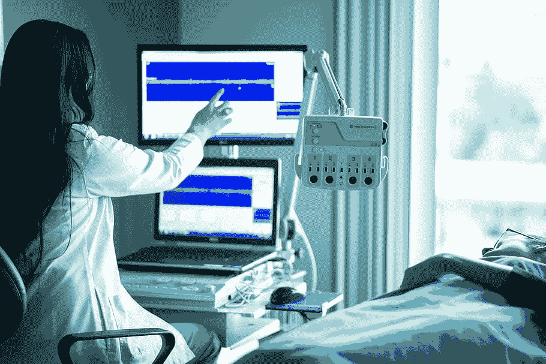

# 有人将是医学院的最后一名:人工智能在医疗保健中的案例

> 原文：<https://towardsdatascience.com/somebody-will-be-last-at-medical-school-the-case-for-ai-in-healthcare-fe49f5ce6f8f?source=collection_archive---------31----------------------->

## 说到护理，人情味是不可替代的。在人工智能的帮助下，这可能会更频繁地发生。

图片由 [Piqsels](https://www.piqsels.com/en/public-domain-photo-jsyzy) 提供

2017 年，疾病预防控制中心[估计](https://www.cdc.gov/nchs/data/nhamcs/web_tables/2017_ed_web_tables-508.pdf)美国急诊室的平均等待时间约为 40 分钟，超过 2200 万次就诊需要患者等待一个多小时。虽然去急诊室从来都不好玩——长时间的等待、沮丧和疲惫成为常态——但问题的一部分源于这样一个事实，即并非所有情况都是真正的紧急情况。撇开全球疫情不谈，医疗保健只是需要大量的时间和资源。它还与相关人员的数量、质量和速度成比例。

2018 年，FDA 批准了首个[人工智能增强的](https://eyewire.news/articles/fda-permits-marketing-of-ai-based-device-to-detect-certain-diabetes-related-eye-problems/)糖尿病视网膜病变诊断系统，这一举动可能是未来更大变化的前奏。由于机器软件中内置的智能和能力，该系统可以由任何操作员操作，无需专门且难以找到的专家。

将更多的人工智能嵌入机器对设备制造商来说非常有意义。将更多人工智能集成到他们的产品中所增强的分析能力和商业优势，使他们对寻求提高吞吐量、收入和改善患者体验的医疗保健行业具有巨大的吸引力。但这对我们所有患者也是有意义的，他们可以从更快、更便宜、更容易获得的诊断中受益。毫不奇怪，根据许多估计，人工智能将越来越多地被医疗保健所采用，特别是在诊断、治疗、患者家庭护理以及消耗资源和让医疗保健从业者从事单调乏味任务的管理活动方面。

例如,《国家癌症研究所杂志》的一项研究已经证明，人工智能驱动的乳腺癌检测可以与人类放射科医生竞争。这为扩大人工智能在更多疾病中的部署打开了大门，以实现更快、更准确的患者结果。

但这种人工智能驱动的效率提升不需要局限于医院。在疫情肆虐的世界，AI 克服了传统机器视觉的低效，还帮助压力下的制药商检测疫苗小瓶，确保小瓶中没有外来污染物(例如，箔片颗粒、灰尘)，并且过程符合严格的监管标准。

类似地，深度学习(人工智能的一个分支，目前广泛用于取代工厂中的传统机器视觉应用)软件可以用于检查试管支架，以确保存在正确数量的试管，每个插槽都被填满，并最终防止人类操作员进行代价高昂的返工。最后，密封和瓶盖对齐可以通过人工智能软件自动检查，以确保产品保护，避免污染和浪费。

我的一个好朋友，一位医学博士，在我们波士顿大学攻读人工智能博士学位期间，我和他一起度过了许多不眠之夜，他曾经对我说，“听着，在医学院里，总会有人需要排在最后！”除了令人担忧的讽刺之外，这种说法为人工智能提供了一个强有力的理由。当涉及到我们的健康时，从药物的研究和制造到检查和治疗的管理，人们希望最好的机器、过程和产品到位。这与汽车等其他行业的情况没有什么不同，这些行业已经为自动驾驶汽车实施了非常强大和智能的人工智能。当我们的安全受到威胁时，我们希望使用最好的技术来完成任务。

在过去的几年里，人工智能取代医疗工作者的潜力不仅被夸大了，而且被误报了。无论是帮助制造质量最好、最安全的药物，还是减少我们在急诊室的等待时间，当我们需要所有可以获得的帮助时，人工智能都在这里推动我们的医疗保健工作。

当进入急诊室时，没有人能取代人类的智慧、热情和同情心。在人工智能的帮助下，人类可能最终有时间做到这一点。

*本文原载* [*此处*](https://www.healthcarebusinesstoday.com/how-ai-is-revolutionizing-pharma-manufacturing/) *。*