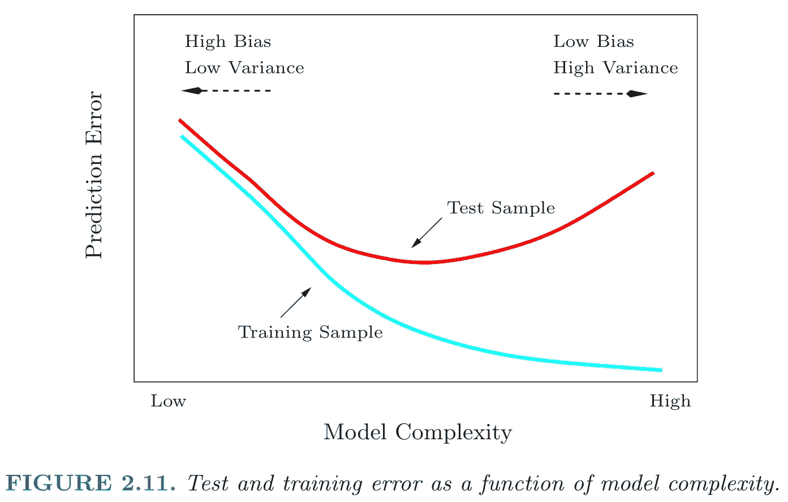
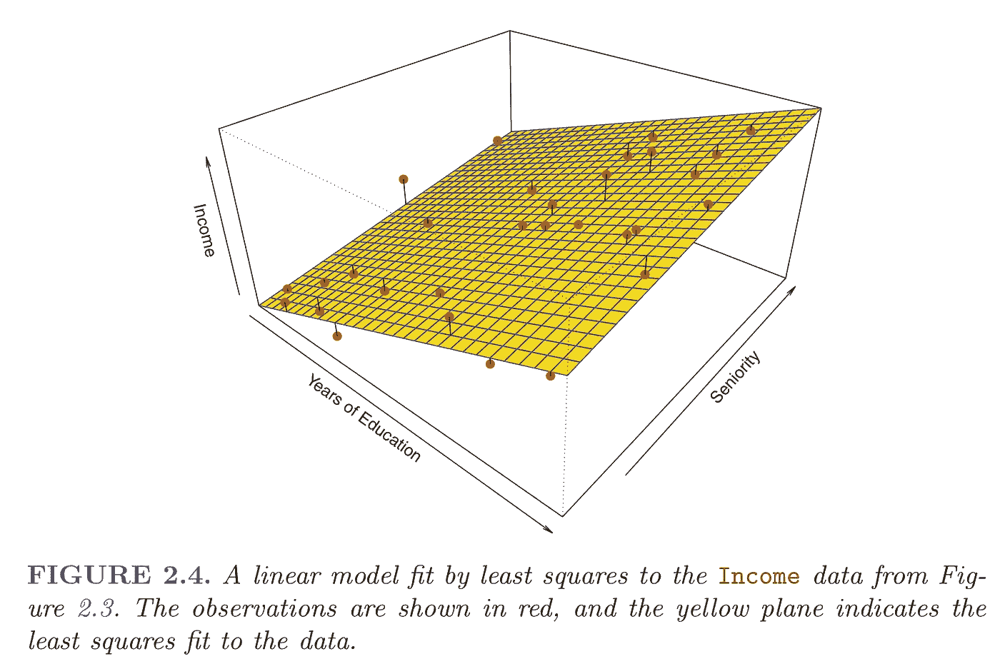
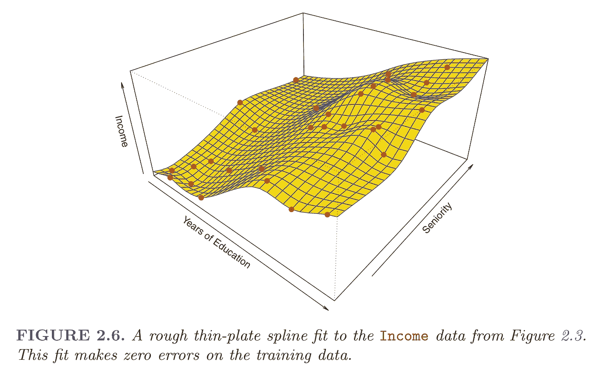
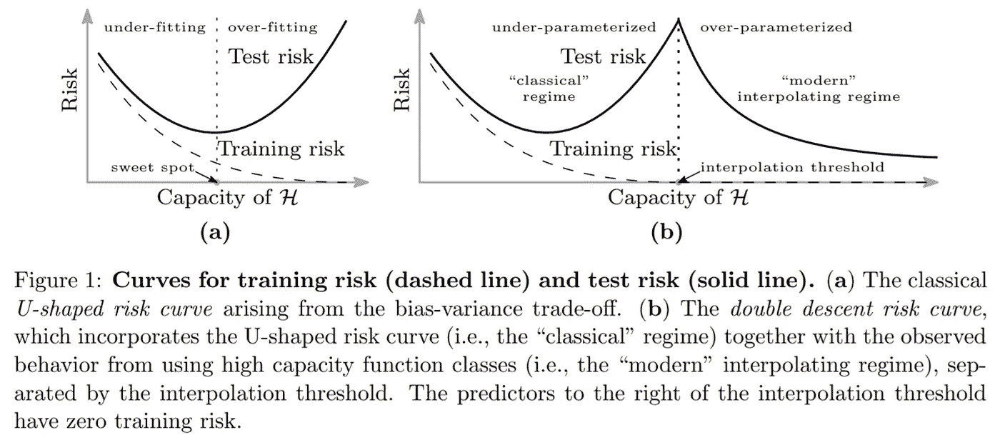
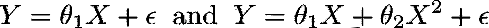
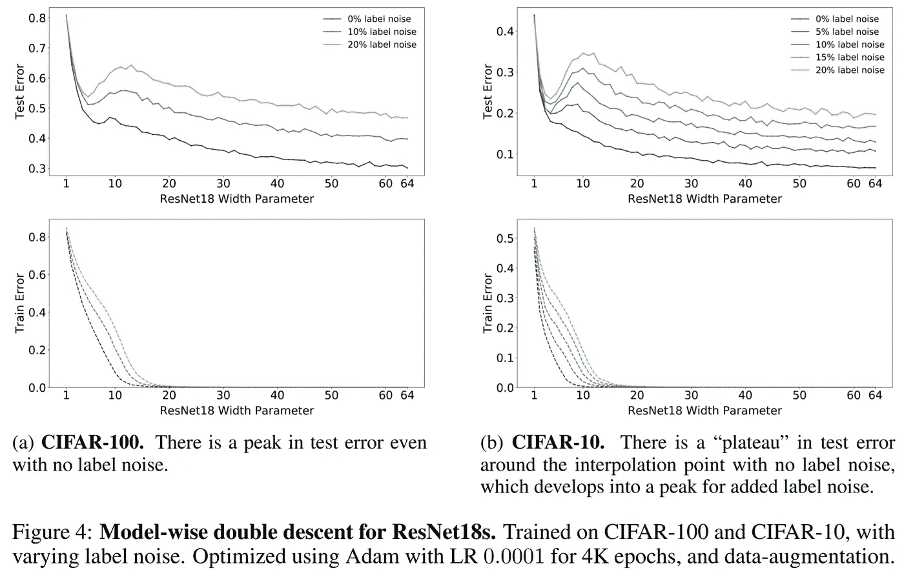
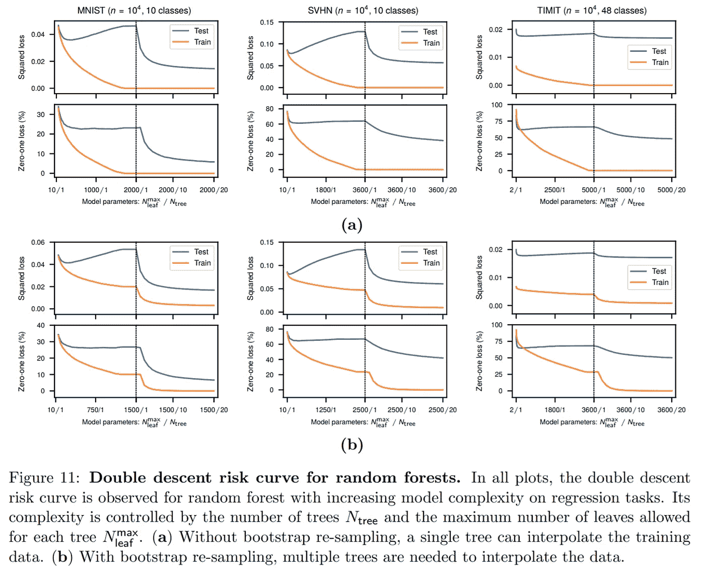
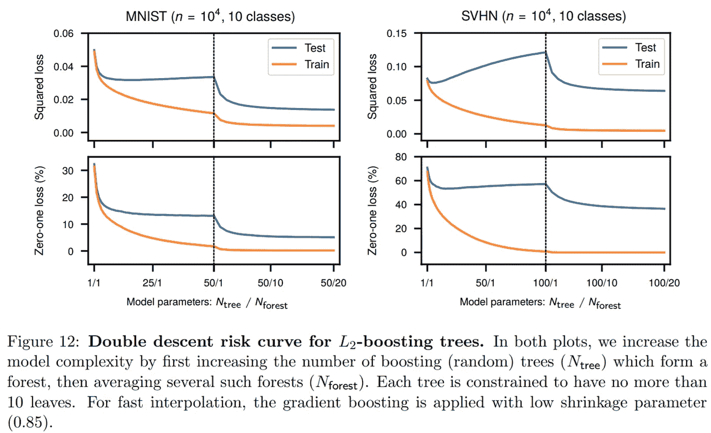
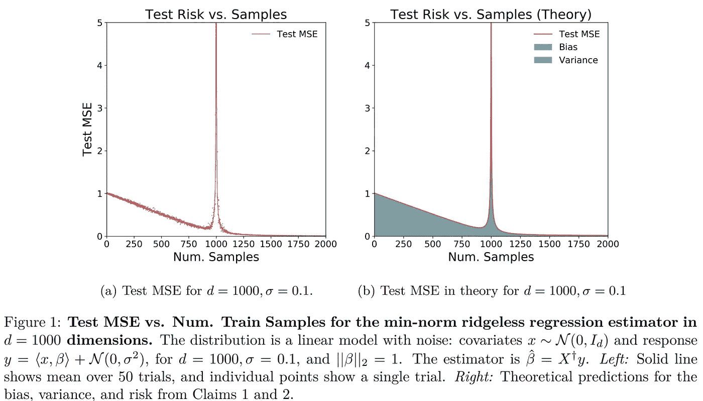

# 每个数据科学家都应该知道:偏差-方差权衡推广是错误的

> 原文：<https://towardsdatascience.com/something-every-data-scientist-should-know-but-probably-doesnt-the-bias-variance-trade-off-25d97a17329d?source=collection_archive---------15----------------------->

## 高级数据科学家的基础知识

*一项突破性的相对较新的发现颠覆了传统统计学，并对数据科学从业者和统计顾问产生了相关影响*

由[丹尼尔·瓦格斯](https://unsplash.com/@danielvargas?utm_source=unsplash&utm_medium=referral&utm_content=creditCopyText)在 [Unsplash](https://unsplash.com/s/photos/curves?utm_source=unsplash&utm_medium=referral&utm_content=creditCopyText) 上拍摄

# 介绍

数据科学是一个迷人的领域。首席执行官们对其承诺的对收入的影响很着迷，而从业者对创新的快速步伐很感兴趣。已经有太多的东西要知道了，而且似乎每年都有更多的东西要学。

这篇文章将注意力吸引到一个相对新颖的想法，这个想法可能对大多数数据科学家和少数统计学家来说是有争议的: ***偏差-方差权衡一般化并不一般化，只适用于非常具体的场景*** 。**事实上，在撰写本文时，对于几乎所有已知模型的具体现实场景，包括线性回归，偏差-方差权衡已经被经验证明是错误的！**

> 显然，这对于有经验的深度学习实践者或那些热衷于跟踪相关文献扩展体的几千人来说并不奇怪。本文总结了十几篇最突出和“最近”(从 2018 年到 2020 年 12 月)的关于~70+ [2]的双重下降的研究论文。**根据什么是总结，鉴于数百页的研究被总结，这篇文章掩盖了许多细节，并解释了足够多的主要观点，以便有一个高层次的理解。**

这一突破性发现的术语是“**双下降”**现象，这个想法有几个名字:双下降、深度双下降、双下降现象/曲线/风险曲线。至少有两种类型的双重下降:**基于模型的**和**基于样本的**。本文对前者的讨论比后者更深入，尽管后者在我对线性模型双重下降的讨论中有所涉及。

我写这篇文章是为了让更多的读者能够理解。为此，我将使用不同的术语重述相同的观点，以帮助我的听众熟悉术语。对于有相关背景的读者，跳过背景部分:)

# 背景

统计学家、数据科学家和深度学习实践者都知道偏倚-方差权衡的经典统计学概念:

斯坦福大学的 Trevor Hastie、Robert Tibshirani 和 Jerome Friedman 的基础教材《统计学习的要素》(Elements of Statistical Learning，简称“ESL”)中的偏差-方差图截图。

**偏差-方差权衡**意味着模型(即方程)“应该平衡欠拟合和过拟合:足够丰富以表达数据中的潜在结构，足够简单以避免拟合虚假模式”[1]。左图 2.11 是一个典型的偏差-方差图，说明了模型复杂度的增加对训练数据和测试数据预测误差的不同影响。

线性模型由黄色平面表示，显示了给定两个输入变量“受教育年限”和“资历”的“收入”预测。我们看到预测并不完美，正如红点和黄色平面之间的距离所证明的。来源:文中截图，《统计学习入门》(ISL)。

更复杂的模型预测的值更接近实际值，或者显示的错误分类情况更少。换句话说，该模型显示出较少的**偏差**。左图 2.4 是一个众所周知的可视化图，展示了一个基于两个变量预测收入的线性模型:受教育年限和资历。

模型的拟合度或预测数据集因变量的能力会随着模型复杂性的增加而增加。增加模型复杂性的示例包括添加更多项、非线性/多项式项(例如，x、x 等。)或用于多元线性回归的逐步/分段常数，增加神经网络的训练时期/训练时间的数量，或增加决策节点(“深度”)的数量，并增加决策树的每个决策节点处的叶子数量，以及在随机森林的情况下增加树的数量。

很容易看到这个线性模型完全适合一个数据集，即零偏差，这是一个不同红点集的收入的较差估计值。来源:文中截图，《统计学习入门》(ISL)。

**方差**是在函数的近似值(即模型或方程)中观察到多少变化的度量。当使用不同的训练数据集进行函数近似时，更灵活的模型通常会看到更大的可变性，因为它们更容易改变以适应不同的数据集。换句话说，方差是指当使用一个或多个不同的训练数据集[3，5]构建时，函数(将一组输入与一组输出相关联的方程)的变化量。

# 2018 年末:双下降现象

偏差-方差权衡是关于插值和概化之间关系的陈述。传统的统计知识表明，将模型复杂性增加到超过**插值**或**消失训练误差**的程度，是过度拟合的一个方法，并且是一个泛化能力差的模型；这意味着它在不同的、不可见的数据集上表现不佳[3，4]。然而，机器学习社区的子集定期训练模型，以完美地拟合训练数据集，从而零训练错误，并且这些模型继续在看不见的测试数据上表现良好。这种经验上的矛盾激发了对神经网络“神秘”属性的狂热兴奋，并激发了对解释的需求[1a]。

从 2018 年 2 月开始，伯克林、米哈伊尔等人写了一系列文章寻求做到这一点[1a、1b、1c、1d]。2018 年 12 月[1a]，贝尔金等人。艾尔。形式化了一个经验观察:偏差-方差权衡只在不同的情况下成立，并创造了术语“**双重下降**”来描述偏差-方差权衡不成立的现象。该主题系列论文中第一篇论文的图 1 有助于建立直觉:

Belkin 等人的图 1。艾尔。[1a]

这些贝尔金等人的作品。艾尔。刺激了几十个后续出版物，这些出版物在多个数据集和多个模型类型中正式证实了双重下降现象。

基础文本“ESL”(统计学习的要素)可能是向当今大多数从业者教授偏差-方差概念的最主要负责人，其作者之一特雷弗·哈斯蒂(Trevor Hastie)在 2019 年 3 月与他和他的合作者的结果证实了双重下降现象[4]，最近几周(2020 年 12 月 7 日)进行了多次修订。重点是，这是令人兴奋的东西，有很多人关注新的发展。

# 它是如何工作的？

没有人知道。

**完全理解深度神经网络中模型式双重下降背后的机制仍然是一个重要的开放性问题**。然而，即使对于线性模型，也会出现模拟的模型式双重下降。最近的一系列理论著作分析了这一背景(Bartlett et al .(2019)；Muthukumar 等人(2019 年)；贝尔金等人(2019)；梅&蒙塔纳里(2019)；Hastie 等人(2019 年))。我们认为类似的机制可能在深度神经网络中起作用" *(Nakkiran，Preetum，et al .，*[*arxiv*](https://arxiv.org/pdf/1912.02292.pdf)*，2019 年 12 月，[8a])。*

纳克兰等人。艾尔。[8a]假设双重下降的潜在解释。

1.  被训练到内插阈值的模型，即具有与观测值 n 大约相同数量的参数 p 的模型，只产生一个完全符合训练数据的模型。这种插值模型对训练集中的噪声非常敏感，并且易受模型规格错误(即差的函数逼近)的影响。
2.  过度参数化模型确保了许多插值模型。回顾一下，内插模型是实现接近零训练误差的模型。一个过度参数化的模型是:给定一个真实的模型给定一个真实的模型 Y=X+ϵ，我们可以尝试以下两个模型来使用`x`解释/预测`y`:

第二个模型参数化过度。在这个玩具示例中，过参数化模型的θ1 和θ2 可以有多个值，这可以产生多个精确预测 y 的插值模型。随机梯度下降能够找到最能“记忆”或“吸收”数据中噪声的模型，使其对新数据集具有鲁棒性。换句话说，具有比观察值更多的模型参数意味着存在多个特征子集，这将允许将过参数化模型拟合到训练数据和随机梯度下降。用统计学的说法，一个过参数化的模型，`p>n` 没有唯一的最小二乘目标也没有唯一的极小值

那么为什么会出现双下降呢？有一些假设，我在上面描述了两个，但是**还没有人知道。**

# 结论

双重下降是一种稳健的现象，它在广泛的神经网络体系结构、随机森林、集成方法甚至流行数据集和合成数据集的线性回归中得到了证明。

双下降可以简单地描述为观察两次下降的测试误差曲线。模型式双下降是一种测试误差曲线，它观察到随着模型容量/复杂性/灵活性的增加而出现的两次下降。样本双下降是一种测试误差曲线，随着训练数据集中观察次数的增加，观察到两次下降。

## 双重下降的情况可能发生在:

1.  **第一层固定权重的两层神经网络****【1a】。也称为非线性参数模型，称为随机傅立叶特征(RFF)。*演示用 0-1&平方损失函数用黑色&白色/彩色图像分类数据集:* [*MNIST*](http://yann.lecun.com/exdb/mnist/) *，*[*CIFAR-10*](https://www.cs.toronto.edu/~kriz/cifar.html)*，*[*SVHN*](http://ufldl.stanford.edu/housenumbers/)*，用 bootstrap 重采样，以及英文语音识别数据集，* [*TIMIT*](https://catalog.ldc.upenn.edu/LDC93S1)
    使用和不使用正则化进行演示:SVHN 实验使用岭正则化实现插值附近的数值稳定性，MNIST 实验没有正则化【1a，9】。**
2.  ****具有 RReLU 激活和 SGD 的全连接神经网络，用于 ERM 优化**【1a】**。** *RReLU =随机化修正线性单元[9]，SGD =随机梯度下降，ERM =经验风险优化。***
3.  ****ResNet** - **18** (在 100 万+图片 ImageNet 数据集上训练的 18 层深度的卷积神经网络，有 1K+对象类别)[8a]。**

****

**图片来源:Nakkiran et。艾尔。[8a]**

****4。随机森林** [1a]。*图 11 来自贝尔金等人。艾尔。演示了随着“模型容量”的增加而增加的双下降，在这种情况下，这意味着增加单个林中的最大树数和林中每棵树的最大叶子数。***

****

**资料来源:贝尔金、米哈伊尔等人**

**5.**由多个随机森林模型组成的集合模型**【1a】。*下图 12 来自贝尔金等人。艾尔。[1a]显示了增加的“模型容量”，即增加集合中的森林数量和每个森林中的树木数量。***

****

**资料来源:贝尔金、米哈伊尔等人**

**以上 4 点是“模型式双重下降”的例子，基本上，增加模型容量/复杂性/灵活性可以证明传统的偏差-方差权衡，然后测试误差第二次下降。事实证明，这是另一个启示，更多的数据可能会损害模型的性能！这导致了**样本双下降**的以下情况:**

**6.**线性模型**。纳克兰等人。艾尔。显示[8b]对于过度参数化的模型，可能出现样本双下降。下面的图 1 来自 Nakkiran 等人。艾尔。[8b]显示了在[0，2000]个样本上训练了 1，000 个特征的多元线性模型的测试均方误差(MSE)。对于“Num ”,该模型参数化过度。样品”不到 1000 个。随着训练数据集**的规模从 0 增加到 900 个观察值**，我们看到**测试 MSE 下降，**正如预期的那样，因为“数据越多越好”然而，当训练集中的样本数量从大约 900 个观察值增加到 1000 个观察值时，测试 MSE ***增加。什么？更多的数据导致更严重的样本外测试误差？！*** *然后，当训练数据集从 1，000 个观察值增加到约 1，100 个观察值时，测试误差再次急剧减小***，然后恢复测试 MSE 的先前改进速度。两点:1。在过度参数化的模型中，更多的数据是有害的，2。当改变训练数据集大小时，观察到测试误差的双重下降。****

> ***这是一个很好的结果，因为这是一个非常简单的实验，使用的是大多数人都熟悉的模型，而且应该很容易复制(如果获得 1K 的掌声，我会尝试分享我的代码:)。***

******

***这个情节有两个重要的启示。(1)随着训练集中样本数量的增加，测试 MSE 实际上会变得更差，如[~900，1，000]所示。这非常令人惊讶。(2)随着数据的增加，测试误差表现出预期的下降，在某一点达到峰值，然后又惊人地下降，提供了双重下降现象的另一个例子，具体地说是“样本双重下降”图片来源:Nakkiran et。艾尔。[8b]***

***是的，我的头也疼。但是相当令人兴奋和兴奋的东西，对不对？***

# ***关于作者***

***安德鲁·杨是 Neustar 的 R&D 数据科学家经理。例如，Neustar 是一家信息服务公司，从航空、银行、政府、营销、社交媒体和电信等领域的数百家公司获取结构化和非结构化的文本和图片数据。Neustar 将这些数据成分结合起来，然后向企业客户出售具有附加值的成品“菜肴”，用于咨询、网络安全、欺诈检测和营销等目的。在这种情况下，Young 先生是 R&D 一个小型数据科学团队的实践首席架构师，负责构建、优化和维护一个为所有产品和服务提供信息的系统，该系统为 Neustar 带来了超过 10 亿美元的年收入(在 LinkedIn 上关注他，了解数据科学的最新趋势！)***

# ***更多热门文章:***

*   ***[隔离森林是目前大数据的最佳异常检测算法](/isolation-forest-is-the-best-anomaly-detection-algorithm-for-big-data-right-now-e1a18ec0f94f)***
*   ***[高效数据科学家必备的演示工具](/must-know-presentation-tools-for-the-effective-data-scientist-93e618ffc8c2)***

# ***参考***

***[1a] Belkin，Mikhail 等人，“调和现代机器学习实践和偏差-方差权衡” *arXiv 预印本 arXiv:1812.11118* (2018)。[https://arxiv.org/abs/1812.11118](https://arxiv.org/abs/1812.11118)***

***[1b]贝尔金、米哈伊尔、马思远和苏米克·曼达尔。"为了理解深度学习，我们需要理解核心学习." *arXiv 预印本 arXiv:1802.01396* (2018)。[https://arxiv.org/abs/1802.01396](https://arxiv.org/abs/1802.01396)***

***[1c]贝尔金、米哈伊尔、亚历山大·拉赫林和亚历山大·b·齐巴科夫。“数据插值与统计最优性相矛盾吗？."*第 22 届人工智能与统计国际会议*。PMLR，2019。[https://arxiv.org/abs/1806.09471](https://arxiv.org/abs/1806.09471)***

***[1d]贝尔金、米哈伊尔、丹尼尔·许和许骥。"弱特征的两种双重下降模型." *SIAM 数据科学数学杂志*2.4(2020):1167–1180。[https://arxiv.org/abs/1903.07571](https://arxiv.org/abs/1903.07571)***

***[2]邓、泽玉、阿布拉·卡姆蒙和克里斯特斯·索兰普利迪斯。“高维二元线性分类的双下降模型。” *arXiv 预印本 arXiv:1911.05822* (2019)。[https://arxiv.org/abs/1911.05822](https://arxiv.org/abs/1911.05822)***

***[3]哈斯蒂、特雷弗、罗伯特·蒂布拉尼和 J. H .弗里德曼。统计学习的要素:数据挖掘、推理和预测。第二版。纽约:斯普林格，2009 年。打印。[https://web.stanford.edu/~hastie/ElemStatLearn/](https://web.stanford.edu/~hastie/ElemStatLearn/)***

***[4] Hastie，Trevor 等，“高维无脊最小二乘插值中的惊喜” *arXiv 预印本 arXiv:1903.08560* (2019)。[https://arxiv.org/abs/1903.08560](https://arxiv.org/abs/1903.08560)***

***[5]詹姆斯、加雷思、丹妮拉·威滕、特雷弗·哈斯蒂和罗伯特·蒂布拉尼。统计学习介绍:在 R 中的应用。, 2017.打印。https://statlearning.com/***

***[6]汤姆·米切尔。卡内基梅隆大学。机器学习讲义。[https://www . cs . CMU . edu/~ guest rin/Class/10701-S05/slides/NNet-cross validation-2-2-2005 . pdf](https://www.cs.cmu.edu/~guestrin/Class/10701-S05/slides/NNet-CrossValidation-2-2-2005.pdf)***

***[7] Muthukumar，Vidya 等，“回归中噪声数据的无害插值”信息理论选定领域 IEEE 期刊 (2020)。[https://arxiv.org/abs/1903.09139](https://arxiv.org/abs/1903.09139)***

***[8a] Nakkiran，Preetum 等人，“深度双重下降:更大的模型和更多的数据带来的伤害” *arXiv 预印本 arXiv:1912.02292* (2019)。[https://arxiv.org/abs/1912.02292](https://arxiv.org/abs/1912.02292)***

***[8b] Nakkiran，Preetum。"更多的数据会损害线性回归:样本双下降." *arXiv 预印本 arXiv:1912.07242* (2019)。[https://arxiv.org/abs/1912.07242](https://arxiv.org/abs/1912.07242)***

***[9]徐，冰，等.“卷积网络中校正激活的经验评估” *arXiv 预印本 arXiv:1505.00853* (2015)。[https://arxiv.org/pdf/1505.00853.pdf](https://arxiv.org/pdf/1505.00853.pdf)***

# ***进一步阅读***

***其他人对此现象感到震惊(我只是浏览了他们的帖子，但阅读其他观点可能会有所帮助)***

***[https://news.ycombinator.com/item?id=21730020](https://news.ycombinator.com/item?id=21730020)***

***[11][https://www . less wrong . com/posts/frv 7 ryoqtvsuqbxut/understanding-deep-double-descent](https://www.lesswrong.com/posts/FRv7ryoqtvSuqBxuT/understanding-deep-double-descent)***

***[12][https://medium . com/@ lighton io/beyond-over fitting-and-beyond-silicon-the-double-descent-curve-18b6d 9810 e 1b](https://medium.com/@LightOnIO/beyond-overfitting-and-beyond-silicon-the-double-descent-curve-18b6d9810e1b)***

***[13][https://medium . com/@ LightOnIO/recover-the-double-descent-curve-with-an-opu-21df 319142 aa](https://medium.com/@LightOnIO/recover-the-double-descent-curve-with-an-opu-21df319142aa)***

# ***密码***

***[14][https://github.com/lightonai/double-descent-curve](https://github.com/lightonai/double-descent-curve)***