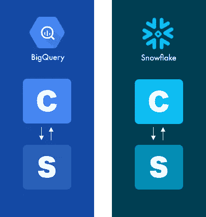
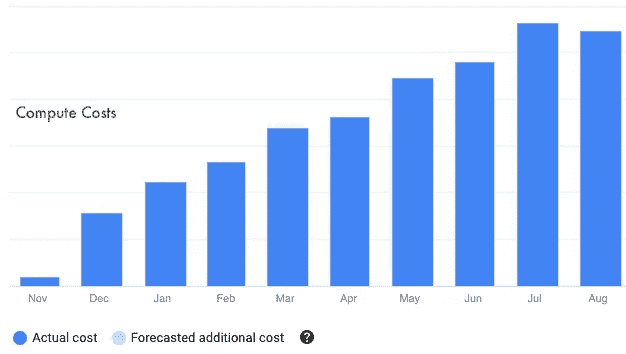

# 抱歉，数据湖不是“遗产”

> 原文：<https://towardsdatascience.com/sorry-data-lakes-are-not-legacy-625bc70b4090?source=collection_archive---------19----------------------->

图片作者:托马斯·斯派塞

## **为什么“数据湖已死”的说法对现代数据架构对话没有什么帮助**

去年在一篇关于[数据湖](https://blog.openbridge.com/8-myths-about-data-lakes-c0f1fc712406)的帖子中，我们讨论了围绕湖架构、策略和分析的各种 [FUD](https://en.wikipedia.org/wiki/Fear,_uncertainty,_and_doubt) 。快进一年；数据湖现在似乎被明确地认为是一种“遗留”数据架构。

在 2020 年现代数据堆栈会议期间，他们表示数据湖在现代数据架构中没有一席之地:

> “在我看来，数据湖不是现代数据堆栈的一部分。弗雷泽说:“数据湖是遗产。“人们采用数据湖有组织[和]准政治原因。但采用数据湖不再有技术上的原因。”

事实上，这是有争议的，可能是一种挑衅的企图。然而，这并不是[第一次](https://fivetran.com/blog/when-to-adopt-a-data-lake)将数据湖视为过时的数据架构模型。

公平地说，像“数据湖是遗产”这样的豪言壮语在行业中使用得太频繁了。例如，您是否知道 Dremio 数据湖正处于使数据仓库过时的边缘，至少根据文章“[dre mio 刚刚使数据仓库过时了吗？](https://www.datanami.com/2020/10/27/did-dremio-just-make-data-warehouses-obsolete/)”。

如果您正试图用现代数据架构绘制一条前进的道路，这些类型的语句会造成不必要的混淆。作为一个寻求为你的团队和公司开发解决方案的人，过滤噪音可能是一个挑战。

在这篇文章中，我们将从另一个角度来看待数据湖不是遗留问题。我们将把数据仓库过时的话题留到以后再说。

# 为什么供应商声称数据湖是“遗留物”

声称数据湖不应该是现代数据堆栈的一部分的理由是什么？有几个主题；

1.  **计算和存储:**数据湖在架构上和技术上都存在缺陷，因为数据仓库产品的进步提供了一个独立的“计算和存储”解决方案
2.  技术债务:团队继承了数据湖，或者出于政治原因而非技术原因创建了数据湖。它们是由“组织高层的某个人”创造的，他们拥抱了[市场体系](https://en.wikipedia.org/wiki/Marchitecture)，发明了一个带有数据湖的图表，并宣布胜利
3.  **成本:**从历史上看，数据湖因成本较低而被采用，但这种成本效益已不复存在

我们将反驳每一个错误的主题。

# 1.计算和存储

在 2020 年数据堆栈大会上，有人提出现代数据架构应该利用*“通过独立的计算和存储解决方案实现大规模并行处理和列存储技术。”*这个没什么争议。计算和存储的分离带来了多种运营、技术和财务优势。

不幸的是，计算和存储被框定为失败的数据湖，这是不准确的。

为了说明这一点，我们需要深入了解计算和存储概念。一些重要的区别，特别是考虑到像计算和存储这样的技术概念，通常表现为定价策略。

## 计算

按需计算活动(如查询引擎)允许数据计算能力在需求增加时扩大，在需求减少时缩小。计算服务类似于按需查询引擎，并为数据湖提供主要的 SQL 查询功能。

与传统的数据仓库系统不同，计算资源可以独立扩展。例如，对人 X 的查询不会对人 y 的查询产生实质性影响。

按需计算显著减少了闲置的系统资源。大多数供应商的定价模型都将计算成本与使用紧密联系在一起。这意味着您只需为活跃的计算操作付费，在高效使用时可带来有利的成本经济性。为什么高效？不幸的是，计算成本往往变化很大，这使得预测预算极具挑战性。

您的成本将取决于用户执行的操作的类型、数量、频率和复杂性。在编写 SQL 查询时，人 X 的效率可能比人 Y 低得多，这意味着对于类似的结果，成本可能要高得多。

## 储存；储备

存储是数据以特定格式组织(或不组织)、持久、持久、可访问和驻留的地方。

存储成本通常是固定的倍数，具有高度可预测性，并且可以根据需要进行扩展。例如，AWS 和谷歌云存储标准定价为每月每 GB 0.023 美元。

1 TB 的成本约为 23 美元。对于 10 TB，成本约为 230 美元。一些其他因素会影响存储成本，但这里的想法是，成本允许团队轻松预测一段时间内的成本。

最重要的一点是，独立的计算和存储不是 lake 的缺陷，而是其主要的架构和战略优势之一。

## **数据湖技术栈**中的紧耦合与松耦合

有人在会议上说，计算和存储的分离是数据仓库优于数据湖的一个关键优势。

> “将计算与存储分离的数据仓库具有数据湖的所有优势，甚至更多”

从技术角度来看，计算和存储是松散耦合的体系结构。因此，这对于仓库来说是一个好处。然而，受益的不仅仅是仓库。

从设计上来说，任何现代数据架构都依赖于松散耦合的计算和存储分离来提供高效、可扩展和灵活的解决方案。与数据湖相比，数据仓库供应商正在引入独立的计算和存储这一事实并不算创新；它正在实现与数据湖的对等。

仓库中独立计算和存储的发展使它们符合生产性数据湖通过按需 SQL 查询服务所采用的架构。

在一篇名为*的文章中——何时采用数据湖——何时不采用*,对数据湖的挖苦是它们不能轻松或按需扩展计算；

> 一些解决方案架构师提出了数据湖，以在传统数据仓库中“将计算与存储分离”。但是他们忽略了一点:您希望能够轻松地按需扩展计算。数据湖不会给你这个；您需要的是一个数据仓库，它可以在您需要时随时提供和暂停容量。

数据湖不会扩展计算资源，因为没有可扩展的计算资源。作为对数据湖的批评，这是一个失误。那么，如何查询数据湖呢？数据湖依赖于良好抽象的计算(即查询服务)，像亚马逊红移光谱、亚马逊雅典娜、脸书普雷斯托、阿哈纳等。

根据设计，这些查询服务按需扩展计算资源，以查询数据湖的内容。因此，lake 不需要计算服务，因为它在一个松散耦合的联邦模型中运行，其中计算(查询)服务附属于 lake。

那么，紧密耦合和松散耦合的计算和存储之间有什么区别呢？

## 松耦合和紧耦合—技术对产品对定价

BigQuery 和 Snowflake 是会议期间提到的两个产品，它们被强调为数据仓库领域的领导者，以分离计算和存储。

当您将数据推送到 BigQuery 时，数据驻留在 BigQuery 存储系统中。当数据驻留在雪花存储系统中时，该数据被绑定到雪花。因此，BigQuery 和 Snowflake 中的静态数据(通常)绑定到各自的存储系统。在这些情况下，计算和存储范式在产品环境中紧密耦合。

虽然在每个产品中，计算和存储内部在技术上是分离的，但实际的最终状态在产品上下文中是相互绑定的。这与 Oracle 或 MySQL 没有什么不同，在 Oracle 或 MySQL 中，计算和存储在每个供应商的产品中都有内在的联系。由于计算和存储在每个供应商的产品中都有内在的联系，因此雪花不能直接查询 BigQuery 本机存储内容，就像 BigQuery 不能查询本机雪花存储一样。

图片作者:托马斯·斯派塞

虽然产品可能在产品级别紧密耦合，但 BigQuery 和 Snowflake 体现了独立计算和存储作为定价创新的优势。

因此，紧密耦合的计算和存储产品模型反映在松散耦合的定价模型中。

现代数据湖体系结构期望计算资源由外部 SQL 查询服务提供。下图强调了良好抽象的数据湖如何独立地服务于不同的产品计算服务。Presto、Athena、Snowflake 和 BigQuery 都可以作为数据湖的计算层:

图片作者:托马斯·斯派塞

很容易想象不同的品牌、部门或合作伙伴组织如何在更复杂的组织中利用核心数据湖基础设施上的首选查询服务。

当我们提到 [Google BigQuery](https://cloud.google.com/bigquery/external-data-sources) 和 [Snowflake](https://docs.snowflake.com/en/user-guide/tables-external-intro.html) 通常在本地存储系统上工作时，它们提供独立于那些内部存储系统的计算服务。

例如，雪花允许你通过[外部表](https://docs.snowflake.com/en/user-guide/tables-external-intro.html)查询你的数据湖。Google 也支持同样的概念[查询外部数据源](https://cloud.google.com/bigquery/external-data-sources)。

Google 通过对 BigQuery Omni 的大量投资进一步扩展了这种良好抽象的查询模型。AWS 通过频谱按需计算查询服务类似地扩展了红移。

这些混合模式反映了对灵活性的需求。扩展查询服务不是支持“遗留”数据湖的功能，但供应商认识到他们在复杂的生态系统中运营，面临着来自数据科学、分析、运营和报告领域快速创新和转型的持续压力。

# 2.技术债务:架构

团队继承大量技术债务并不罕见，尽管口头(或未言明的)目标是尽可能少地承担债务。

根据一般经验，您越是选择特定于供应商的技术和解决方案，您招致额外技术债务的风险就越大。这可能是一个可以接受的妥协。

团队经常用短期速度换取长期成本。假设管理层随机地强迫一个数据湖“市场体系结构”，招致债务的风险增加。然而，管理也可以这样说，“嘿，你必须使用雪花，因为我的朋友杰德说它很棒”或“我在 BigQuery 上看到一篇博客帖子是有史以来最好的东西，我们正在使用它。”我们都知道发生这种事情的案例。

尽管有相反的说法，数据湖本质上并不比仓库承载更多的技术债务。做得好的数据湖可以通过用同类最佳的解决方案恰当地抽象数据架构的各个方面，帮助降低招致技术债务的风险。例如，数据湖可以提供采用不同计算服务的速度和灵活性，最大限度地降低供应商锁定风险，并降低转换成本。

例如，在 2020 年现代数据栈会议上，有人指出，人们不应该担心数据仓库空间中的供应商锁定。为什么？如果你依赖像 Fivetran 这样的供应商，它将降低仓库锁定的风险。奇怪的是，这种对供应商锁定的回答实际上是在促进供应商锁定。如果您需要从使用 Fivetran 转向使用其他产品，该怎么办？

显然，供应商在让你在操作上和技术上被锁定在一个产品上有既得利益。作为一种商业策略，这是可以的，但对于任何试图创建松散耦合、良好抽象的现代数据架构的公司来说，这肯定不是一个强有力的反驳。

在某些情况下，供应商锁定和由此产生的技术债务可能是一种可行的折衷方案。然而，考虑到行业的变化速度，这种妥协的好处可能是短暂的，很快就会消失。

例如，Athena 和 Presto 提供了[联邦查询](https://blog.openbridge.com/aws-data-lake-and-amazon-athena-federated-queries-b7fc16fe3b2b)，为跨关系、非关系、对象和定制数据源中存储的数据运行 SQL 查询提供了按需计算服务。联邦查询反映了一种分布式、松散耦合的方法，这种方法在加速数据消耗的同时最大限度地减少了技术负担。

如果可以通过 Presto、Athena 或 Redshift 直接就地查询数据，为什么要将数据从 MySQL 移动到 Snowflake？当然，Fivetran 将数据从 MySQL 转移到 Snowflake 的服务需求已经消除或显著减少。

下面是 PrestoDB 如何描述联邦查询允许用户做什么:

> Presto 允许查询数据所在的位置，包括 Hive、Cassandra、关系数据库甚至专有数据存储。一个 Presto 查询可以组合来自多个来源的数据，允许跨整个组织进行分析。

Ahana 的首席执行官史蒂夫·米回应了这种观点，*“Presto 是开放分析栈的一部分——开源、开放格式、开放接口、开放云。”*

使用联邦查询服务最小化 ELT 和 ETL 的想法反映了一个良好抽象的计算服务层。AWS、Google、Microsoft 和许多其他公司正在迅速地在他们的产品中采用分布式查询引擎模型。这是每个人的正确方法吗，可能不是。

鉴于数据仓库、查询引擎和数据分析市场不断加速的变化，最小化风险、锁定和技术债务应该是严肃的数据架构策略的核心部分。

# 3.成本:技术架构还是定价模型？

成本这个话题可能很棘手。通常，会围绕总拥有成本进行分析。例如，与产品相关的成本是什么？运营？人？培训？

为了简单起见，我们将围绕计算和存储缩小供应商产品和服务的成本。

每个供应商都有不同的计算资源定价策略。Google、AWS、Snowflake 的主要卖点之一是承诺按需服务、无前期成本和低运营费用。

虽然这是典型的情况，但计算定价的另一面是很难预测。您现在知道您当前和未来的状态用例将如何影响 6 个月、12 个月或 24 个月之后的成本吗？因此，计算机定价的可变性会导致意外的成本。这些成本常常成为与首席财务官进行重大运营和财务对话的目标。

计算成本随时间增长。图片作者:托马斯·斯派塞

## 大查询和雪花

在会议期间，雪花和谷歌 BigQuery 都被认为是这种新的可变定价模式的领导者。这两种服务都提供了将计算和存储分开的定价模式。例如，典型的 Google BigQuery 的存储成本约为每 GB 0.020 美元，查询中扫描的每 TB 数据成本为 5.00 美元。

在计算方面，雪花成本比 BigQuery 稍微复杂一些；随着雪花仓库规模的增加(计算资源的规模越大)，成本的增加就越多。下面我们来看看雪花和亚马逊雅典娜的用例。

## 成本:雪花示例

以下是雪花的计算和存储定价方案。在我们的假设场景中，我们将从雪花的最小仓库大小开始:X-Small。随着规模的扩大，仓库的成本也会增加。我们将在雪花中拥有大约 1 TB 的数据。

假设我们每周七天，每小时运行 ETL 过程 10 分钟。从周一到周五，您还可以让分析师每天 3 小时从 Tableau 连接到 Snowflake。计算成本大约为每月 620 美元，而存储成本不到 100 美元。如果您的用例将 ETL 时间从 10 分钟变为 20 分钟，那么您的计算成本是 862 美元，而您的存储成本通常保持不变。

现在，假设您的处理工作负载发生了变化，并且您注意到了 X-Small 的性能瓶颈。考虑到工作负载，您决定从 X-Small 扩展到 Medium。每月 10 分钟 ETL 过程的计算成本从 620 美元到 1496 美元不等，20 分钟 ETL 过程的计算成本从 862 美元到 2470 美元不等。

在本例中，计算成本增加了，而存储成本保持不变。到目前为止，一切顺利。这无疑是定价上的创新。按需购买资源，无需添加或更改存储容量，这提供了灵活性并降低了操作复杂性。

那么有什么问题呢？由于计算和存储紧密结合，您的体系结构会受到供应商定价模式的限制。如果 Snowflake 增加了额外服务的成本，那么被不断上涨的成本“套牢”的可能性是一个真正的头等财务考虑因素。

在某个时候，比如说几年后，雪花决定它必须专注于扩展产品以满足股东对实现盈利的期望。不是不合理的期望。然而，这种新的盈利动力将如何影响定价？

让我们说，在推动盈利能力之前，你的每月雪花运行率是 2000 美元。雪花改变了你用例的成本基础，增加了 20%。因此，在一年的时间里，雪花将因计算服务获得额外的 5000 美元收入。

这里的要点是，从长远来看，定价创新并不总是有利于客户。易于实施和前期简单性必然会对总拥有成本产生影响。

## 成本:亚马逊雅典娜示例

Amazon Athena 为数据湖提供按需查询服务。雅典娜的定价？扫描每 TB 数据的费用为 5.00 美元。

如果平均每天运行 100 个查询，每个查询扫描 25 GB 的数据将花费大约 370.00 美元。*(每月 3，042 次查询 x 0.0244140625 TB x 5.00 美元= 371.34 美元)。*

在一些案例中，我们看到 Athena 与 Tableau Hyper 等工具结合使用，提供了极具吸引力的性价比价值主张。Tableau Hyper 使用一种*内存数据引擎技术支持来自湖泊的数据，该技术旨在对大型或复杂数据集进行快速数据摄取和分析查询处理*

使用 Hyper 可以确保 Athena Tableau 的查询数量显著减少。因此，减少了 Athena 收取的相关 Tableau 查询的成本。

Athena/Tableau 配对中详述的相同好处也适用于雪花或 BigQuery。

这里的要点是，现代数据体系结构应该从探索模式、试验、定义优先级和基于合理标准做出客观决策开始。

# 拥抱现代数据湖设计模式

麦肯锡对数据湖做了如下描述:

> “…lakes 不仅确保了技术堆栈的灵活性，还确保了业务能力的灵活性。”

“数据”市场的加速变化并没有减弱。技术、运营和定价方面的快速创新需要合理的数据架构。因此，对现代数据架构 ***的任何合理评估都必须*** 考虑每个选择的影响(积极或消极)，包括使用或不使用数据湖。

数据湖并不是所有用例的正确解决方案。对于某种类型的团队来说，缺少紧密耦合的计算资源可能是一个真实、实际的考虑因素。像 BigQuery 或 Snowflake 这样的解决方案提供了操作和技术上的简单性。幸运的是，这些产品还支持松耦合的查询服务。如果团队发现自己将来需要利用数据湖，这种折衷可能是有用的。

现代数据架构中 lake 的目的是提供一个重视灵活性、开放标准、最小化供应商锁定和服务联合的解决方案。不管您喜欢的架构或平台是什么，花时间定义一个架构来权衡每个选择的利弊是值得的。