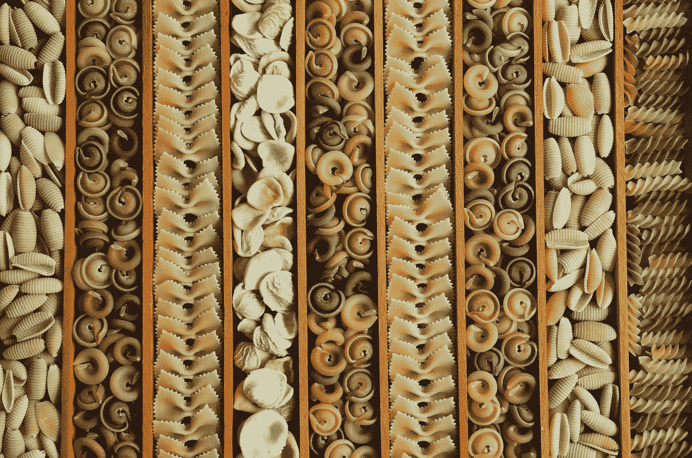

# 每个数据科学家都应该知道的排序算法

> 原文：<https://towardsdatascience.com/sorting-algorithms-every-data-scientist-should-know-9c4ff592f28c?source=collection_archive---------44----------------------->

## 使用这些聪明的排序方法更好地排序您的数据！

(src =[https://pixabay.com/images/id-1312384/](https://pixabay.com/images/id-1312384/)

# 介绍

数据很难保持有序。数据科学家有几种技术可以帮助他们组织数据，其中最流行的一种技术是排序。排序是一种基于某些设定参数对观察值进行重新排序的技术。该参数可以是连续值、分类的，或者甚至是特征或工程特征的组合。此外，时间也常用于对观察值进行排序。

不用说，这使得排序成为数据分析领域中非常重要的一项工作。在某些情况下，很难处理没有排序的数据，并且有许多算法可能需要归入排序类别，例如搜索栏。此外，排序在机器学习和分析中非常常用。将排序算法应用于统计分析的一个很好的例子是 Wilcox 秩和检验。该测试根据观察值在数据集中的连续排名对其进行重新排序。在重申了排序算法的重要性之后，我想谈谈一些不同的排序算法、它们的性能以及它们在不同类型数据上的应用。

# №1:冒泡排序

一种相当基本的排序方法是冒泡排序法。这种技术是通过比较前两个值来实现的，如果一个值应该在另一个值之前，那么它将与前一个值进行交换。接下来，我们比较接下来的两个值，做同样的事情，如果前一个值是错的，我们继续切换。这肯定会首先获得最高值，但在我们到达切换的第一次迭代结束后，我们需要返回并重新开始，直到最终没有切换，这意味着我们的数据都已排序。

很容易理解为什么这是低效的。我们可能会在每个值上循环移动一个值。这个事件可能会发生几次。在许多情况下，它需要为每个单独的观察传递一次我们的值。一千次观察意味着一千次操作执行一千次，以此类推。该算法将要执行的运算次数随着观察次数(n)的平方而增加。衡量该算法性能的一个很好的方法是使用大 O 符号。正如我所说的，这个算法有一个指数增长，所以它的计算时间随着 n 的增加而增加，这意味着这个算法的大 O 符号是 O(n)。不用说，当观测值很多时，你可能不想使用这种算法，因为它会让你的计算机计算起来困难得多。在整篇文章中，我将使用大 O 符号来衡量这些排序算法的性能，因此，如果您想进一步了解它，我确实写了一篇文章，您可以在这里阅读:

</why-your-loops-are-so-slow-166ec67db47d> [## 为什么你的循环这么慢

towardsdatascience.com](/why-your-loops-are-so-slow-166ec67db47d) 

# №2:插入排序

我想看的下一种排序算法是插入排序。这种算法以与冒泡排序非常相似的方式开始，首先交换前两个观察值，然后交换第二个观察值。然而，当插入排序跳回到前两个并进行比较时，区别就来了。这些项继续向起始项移动，一边移动一边检查，直到您最终到达列表的起始处，并且您知道它已经被排序了。如果你有一手按顺序排列的牌，这可能是你会使用的算法，甚至没有意识到这一点。

正如您可能想象的那样，这种排序方法通常比冒泡排序更快。这是因为我们不需要每次遍历列表时都用一个操作对其进行整体排序。也就是说，该算法的大 O 符号仍然是 O(n)，这意味着该算法仍然具有与冒泡排序相同的性能损失，只是在不同的时间段内。也就是说，虽然它对于处理较小的数据集肯定是有用的，但在对大量值进行排序时，这很可能不是最佳选择。

# №3:快速排序

快速排序因一个非常重要的原因而得名，与列表中的其他方法相比，它的速度相当快。这项技术包括选择一个中心点，通常是数据的中间点，然后比较该中心点两侧的观察值。小一点的会去一端，大一点的会去另一端。在那之后，你在两边的中心选择一个新的支点，以同样的方式排序，直到最后，数据被排序。

在我介绍的所有其他排序算法中，这种排序算法的初始计算成本总是最小的。然而，这个算法的大 O 符号仍然可以归入 O(n)类，尽管这不是一个保证。当然，一个算法的效率总是依赖于它的输入，所以在这方面肯定会有增强或损害算法的变化。然而，该算法的平均性能是 O(n log n)。这意味着它通常是具有陡峭斜率的线性，然而，当涉及到处理更多的观测值时，它可能会陷入困境。

# №4:桶排序

桶排序是一种算法，它首先将部分观察值放入“桶”中。然后每个存储桶被单独排序，通常使用快速排序方法，然后这些存储桶被递归排序。这确实将快速排序的“分而治之”方法提升到了一个全新的水平，但是进行多层划分使得处理单个组件变得非常容易，从而可以轻松地对所有组件进行排序。这也提供了巨大的性能优势，最差的性能可能是 O(k)。通常，这个算法更多地落入 O(n+k ),这是好得多的，并使这个算法当然脱颖而出。

# №5:基数排序

我想谈的最后一个排序算法是基数排序。这种算法建立在典型的桶排序的基础上，但是有一个关键的区别。基数排序是一种非比较排序算法。这意味着列表中的观察值从不直接比较。相反，这些元素使用它们的基数分布到桶中。基数是基于唯一位数的数字位置系统。正如人们可能想象的那样，这种算法与桶排序具有相似的性能，但是去掉了快速排序功能。因此，该算法更加一致，并且通常落入 O(nk)中，这是相当快的。

# 结论

在计算机科学中，有许多不同的排序算法服务于许多不同的目的。当然，在处理数据观察时，排序尤其关键，因此数据科学家肯定可以从了解不同的排序方法并利用其应用优势中受益。算法的选择几乎肯定会随着应用的不同而改变，因此了解不同的算法及其应用对于更有效地对数据进行排序至关重要。非常感谢你看我的文章！