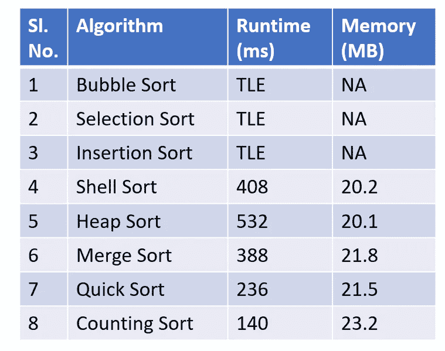
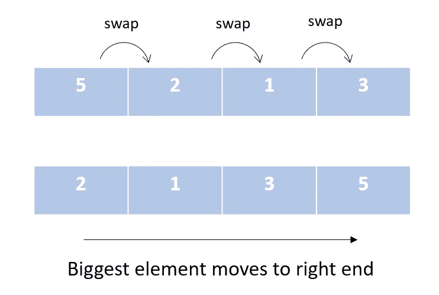
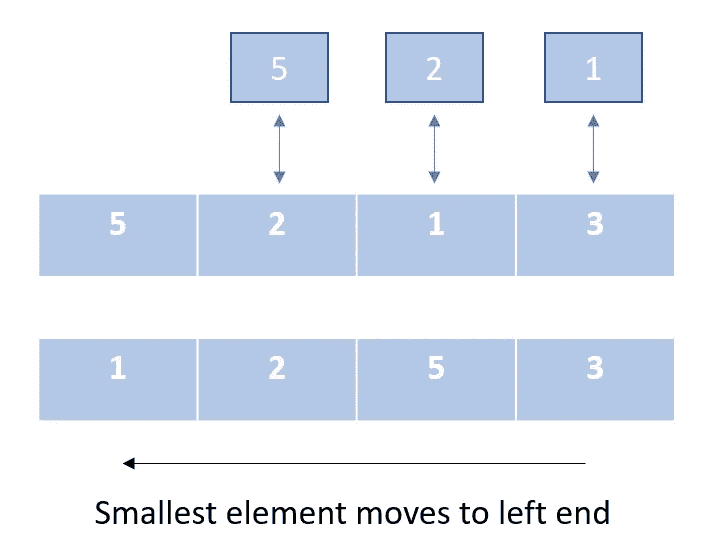
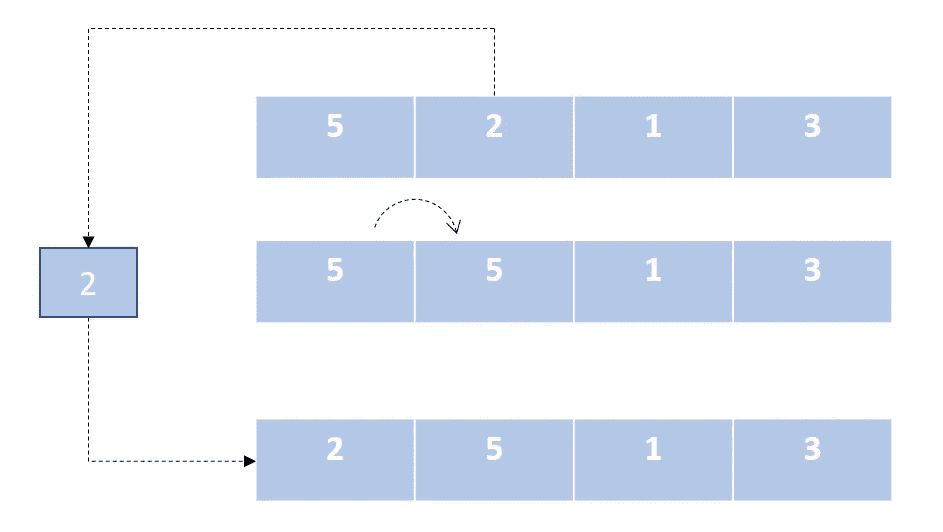
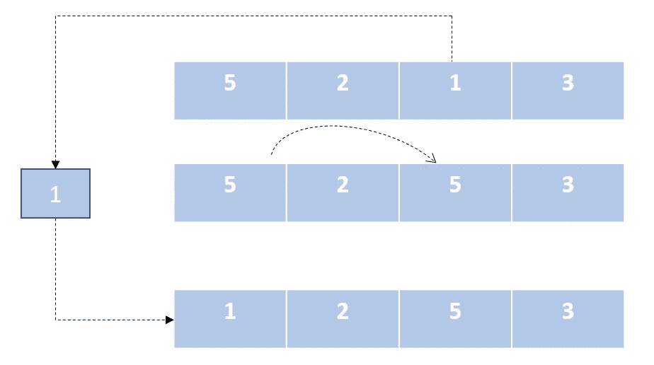
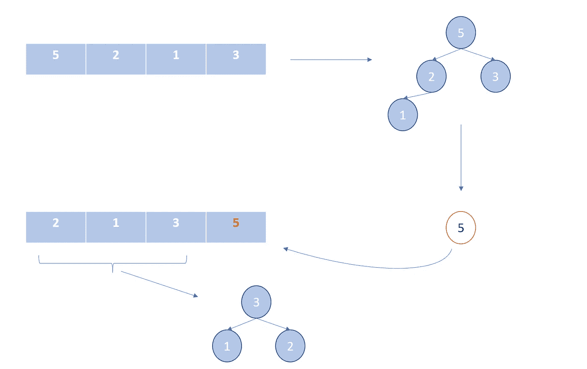
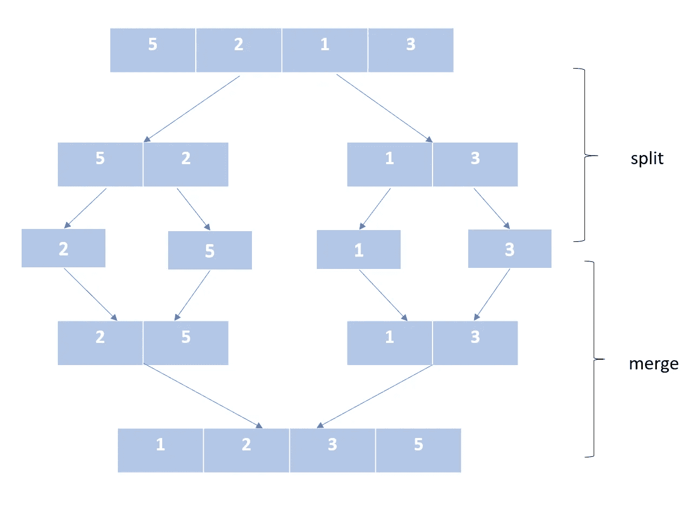
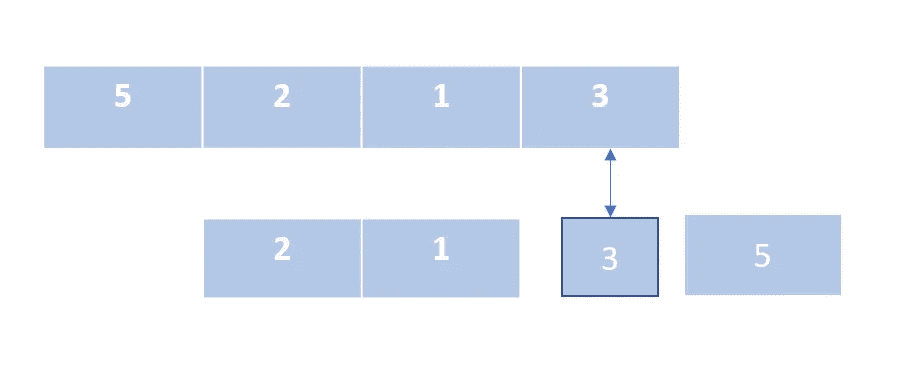
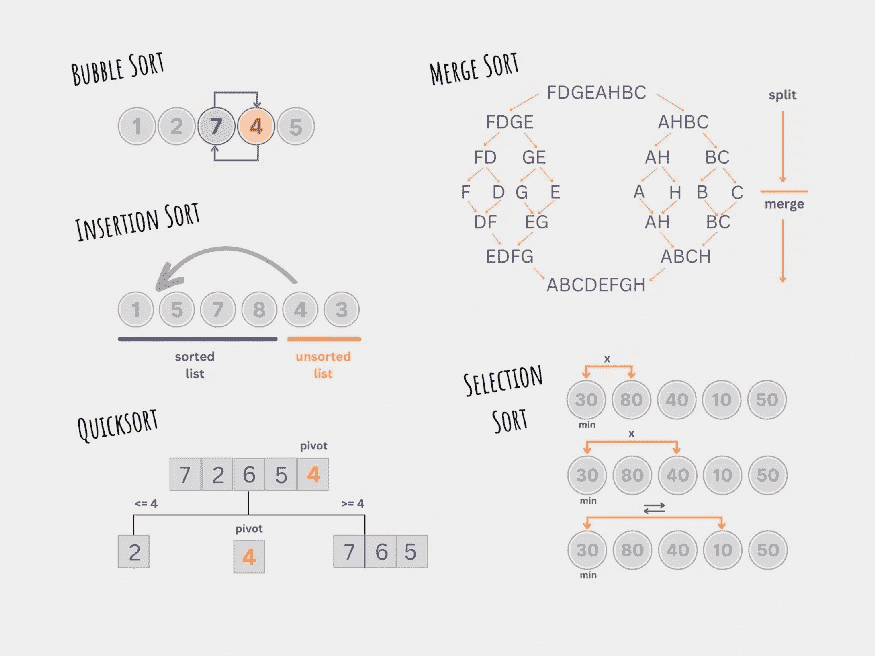
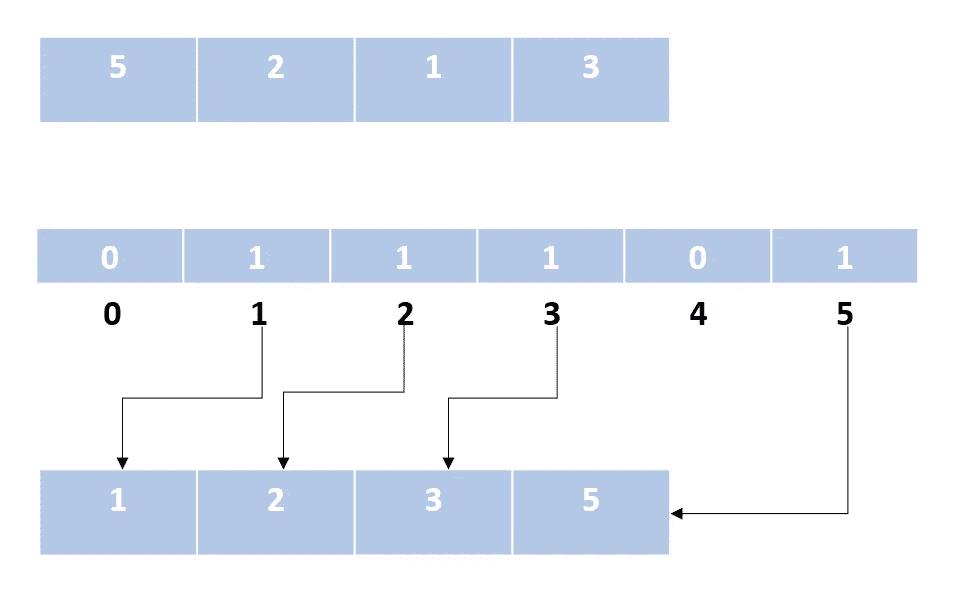

# 排序算法—使用 Python

> 原文：<https://towardsdatascience.com/sorting-algorithms-with-python-4ec7081d78a1?source=collection_archive---------4----------------------->

## 实验复习为什么什么和如何排序算法


由 [Unsplash](https://unsplash.com/s/photos/sorting?utm_source=unsplash&utm_medium=referral&utm_content=creditCopyText) 上的 [Max Panamá](https://unsplash.com/@imaxpanama?utm_source=unsplash&utm_medium=referral&utm_content=creditCopyText) 拍摄的照片

# 带来秩序的艺术

排序意味着将项目按特定的顺序排列。该特定顺序由元素的比较属性决定。在整数的情况下，我们说较小的数字先出现，较大的数字后出现。以特定顺序排列项目可以改进元素的搜索。因此，排序在计算机科学中有大量的应用。

在这篇博客中，我们将介绍常见的排序算法。我们将看到每一个在 python 中的实现。为了比较它们的运行时间，我在排序数组上使用了 Leetcode 问题。该问题的约束条件如下。

**约束:**

```
1 <= nums.length <= 50000
-50000 <= nums[i] <= 50000
```

我用所有常见的排序算法解决了这个问题。下面是执行结果。



作者图片

*注:* TLE *超过时限。*

基于比较

> 冒泡排序
> 选择排序
> 插入排序
> 快速排序
> 壳/山排序
> 堆排序
> 合并排序

不基于比较

> 计数排序
> 桶排序
> 基数排序

## 冒泡排序

最简单的排序算法。对列表进行迭代，在每次迭代中，它成对地比较元素，并不断交换它们，以使较大的元素移向列表的末尾。



> 非递归
> 稳定
> 到位
> O(n)

```
def bubbleSort(array):
    swapped = False
    for i in range(len(array)-1,0,-1):
        for j in range(i):
            if array[j]>array[j+1]:
                array[j], array[j+1] = array[j+1], array[j]
                swapped= True
        if swapped:
            swapped=False
        else:
            break
    return array
```

## 选择排序

在这个算法中，我们创建了两个列表段，一个已排序，另一个未排序。我们不断地从未排序的列表段中删除最小的元素，并将其附加到排序的列表段中。我们不交换中间元素。因此，该算法以最少的交换次数对数组进行排序。



> 非递归
> 不稳定
> 到位
> O(n)

```
def selectionSort(array):
    for i in range(len(array)-1):
        min_idx = i
        for idx in range(i + 1, len(array)):
            if array[idx] < array[min_idx]:
                min_idx = idx
        array[i], array[min_idx] = array[min_idx], array[i]
    return array
```

## 插入排序

像选择排序一样，在这个算法中，我们将列表分为排序和未排序部分。然后，我们遍历未排序的段，并将该段中的元素插入到排序列表中的正确位置。



> 非递归
> 稳定
> 到位
> O(n)

```
def insertionSort(array):
    for i in range(1, len(array)):
        key = array[i]
        j = i-1
        while array[j] > key and j >= 0:
            array[j+1] = array[j]
            j -= 1
        array[j+1] = key
    return array
```

## 外壳排序

外壳排序是对插入排序的优化。这是通过以固定的递减间隔对所有元素重复执行插入排序来实现的。最后一次迭代的间隔是 1。这里它变成了一个常规的插入排序，它保证了数组将被排序。但要注意的一点是，当我们这样做的时候，数组几乎已经排序了，因此迭代非常快。



> 非递归
> 稳定
> 到位
> 0(n)也取决于区间选择

```
def shellSort(array):
    n = len(array)
    k = int(math.log2(n))
    interval = 2**k -1
    while interval > 0:
        for i in range(interval, n):
            temp = array[i]
            j = i
            while j >= interval and array[j - interval] > temp:
                array[j] = array[j - interval]
                j -= interval
            array[j] = temp
        k -= 1
        interval = 2**k -1
    return array
```

## 堆排序

像前面两个算法一样，我们创建了两个列表段，一个是已排序的，一个是未排序的。在这里，我们使用堆数据结构来有效地从列表的未排序段中获取 max 元素。heapify 方法使用递归来获取顶部的 max 元素。



> 非递归
> 不稳定
> 在位
> O(nlogn)

```
def heapify(array, n, i):
    largest = i
    l = 2 * i + 1
    r = 2 * i + 2

    if l < n and array[i] < array[l]:
        largest = l
    if r < n and array[largest] < array[r]:
        largest = r

    if largest != i:
        array[i], array[largest] = array[largest], array[i]
        heapify(array, n, largest)

def heapSort(array):
    n = len(array)
    for i in range(n//2, -1, -1):
        heapify(array, n, i)
    for i in range(n-1, 0, -1):
        array[i], array[0] = array[0], array[i]
        heapify(array, i, 0)
    return array
```

## 合并排序

这是一个分治算法。在这个算法中，我们将一个列表分成两半，并继续将列表分成两半，直到它只有一个元素。然后我们合并排序后的列表。我们一直这样做，直到得到一个包含未排序输入列表中所有元素的排序列表。



> 递归
> 稳定
> 需要额外空间
> O(nlogn)

```
def mergeSort(nums):
    if len(nums)==1:
        return nums
    mid = (len(nums)-1) // 2
    lst1 = mergeSort(nums[:mid+1])
    lst2 = mergeSort(nums[mid+1:])
    result = merge(lst1, lst2)
    return resultdef merge(lst1, lst2):
    lst = []
    i = 0
    j = 0
    while(i<=len(lst1)-1 and j<=len(lst2)-1):
        if lst1[i]<lst2[j]:
            lst.append(lst1[i])
            i+=1
        else:
            lst.append(lst2[j])
            j+=1
    if i>len(lst1)-1:
        while(j<=len(lst2)-1):
            lst.append(lst2[j])
            j+=1
    else:
        while(i<=len(lst1)-1):
            lst.append(lst1[i])
            i+=1
    return lst
```

## 快速排序

在这个算法中，我们围绕一个 pivot 元素对列表进行分区，围绕 pivot 对值进行排序。在我的解决方案中，我使用列表中的最后一个元素作为 pivot 值。当 pivot 值将列表分成几乎相等的两半时，可以获得最佳性能。



> 递归
> 到位
> 不稳定
> O(nlogn)

```
def quickSort(array):
    if len(array)> 1:
        pivot=array.pop()
        grtr_lst, equal_lst, smlr_lst = [], [pivot], []
        for item in array:
            if item == pivot:
                equal_lst.append(item)
            elif item > pivot:
                grtr_lst.append(item)
            else:
                smlr_lst.append(item)
        return (quickSort(smlr_lst) + equal_lst + quickSort(grtr_lst))
    else:
        return array
```



## 计数排序

该算法不在元素之间进行比较。我们使用整数的数学属性来排序。我们计算一个数字出现的次数，并将计数存储在数组中，数组中的索引映射到键值。



> 非递归
> 到位，但需要额外的空间
> 稳定
> O(n)

```
def sortArray(self, nums: List[int]) -> List[int]:
    i_lower_bound , upper_bound = min(nums), max(nums)
    lower_bound = i_lower_bound
    if i_lower_bound < 0:
        lb = abs(i_lower_bound)
        nums = [item + lb for item in nums]
        lower_bound , upper_bound = min(nums), max(nums)

    counter_nums = [0]*(upper_bound-lower_bound+1)
    for item in nums:
        counter_nums[item-lower_bound] += 1
    pos = 0
    for idx, item in enumerate(counter_nums):
        num = idx + lower_bound
        for i in range(item):
            nums[pos] = num
            pos += 1
    if i_lower_bound < 0:
        lb = abs(i_lower_bound)
        nums = [item - lb for item in nums]
    return nums
```

我还想提一下基数排序，它可以用计数排序/桶排序作为子例程来实现。请参见下面的参考链接。

[](https://medium.com/nerd-for-tech/counting-sort-radix-sort-ccd9f77a00a2) [## 计数排序和基数排序

### 在这篇博客中，我们将介绍两种常见的基于非比较的排序算法。但在此之前，我们为什么…

medium.com](https://medium.com/nerd-for-tech/counting-sort-radix-sort-ccd9f77a00a2) 

## 将所有这些放在一起:

在尝试了所有这些不同的算法之后，出于好奇，我用默认的[排序](https://realpython.com/python-sort/)方法提交了我的解决方案。它的运行时间是 152 毫秒，非常快。Python 的默认排序使用 **Tim 排序，**这是合并排序和插入排序的组合。实现将在另一篇文章中讨论。

发现了一个惊人的播放列表，其中用舞蹈演示了排序算法。你可能想看。值得花时间。

礼貌:[https://www.youtube.com/channel/UCIqiLefbVHsOAXDAxQJH7Xw](https://www.youtube.com/channel/UCIqiLefbVHsOAXDAxQJH7Xw)

通过我们的小实验，我们了解了不同的算法、它们的运行时间和内存消耗。我们现在知道了内存、CPU 时间和算法稳定性等参数。我们需要根据给定的问题来评估这些参数，以确定算法。我们还可以将这些基本排序算法组合成更强大的算法，如 Tim Sort。

分类愉快！！